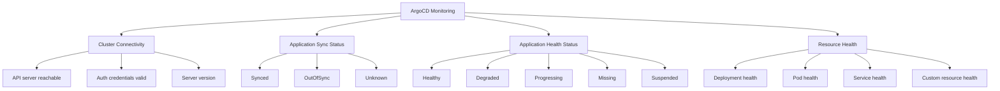

# How to Monitor ArgoCD Health as Part of Cluster Health

Author: [nawazdhandala](https://github.com/nawazdhandala)

Tags: ArgoCD, GitOps, Kubernetes, Monitoring, Prometheus

Description: Learn how to integrate ArgoCD health monitoring into your overall Kubernetes cluster health observability strategy using Prometheus metrics and alerting.

---

ArgoCD does not just deploy applications to clusters - it also continuously monitors their health. Every registered cluster is periodically checked for connectivity, and every application is assessed for both sync status and health status. This makes ArgoCD a valuable source of cluster health information, even beyond its primary GitOps function.

In this guide, I will show you how to leverage ArgoCD's built-in monitoring capabilities and extend them with custom health checks, Prometheus alerting, and dashboards.

## What ArgoCD Monitors

ArgoCD tracks several dimensions of cluster health:



## Checking Cluster Health via CLI

```bash
# List all clusters with their status
argocd cluster list

# Output:
# SERVER                                   NAME             VERSION  STATUS      MESSAGE
# https://kubernetes.default.svc           in-cluster       1.28     Successful
# https://staging.k8s.example.com          staging          1.28     Successful
# https://production.k8s.example.com       production       1.28     Successful
# https://dead-cluster.k8s.example.com     old-cluster              Unknown     connection refused

# Get detailed cluster info
argocd cluster get https://production.k8s.example.com -o json | jq '{
  name: .name,
  server: .server,
  serverVersion: .serverVersion,
  connectionState: .connectionState
}'

# List applications with health status
argocd app list -o wide

# Get apps in specific health states
argocd app list --health-status Degraded
argocd app list --health-status Progressing
argocd app list --sync-status OutOfSync
```

## ArgoCD Metrics for Prometheus

ArgoCD exposes Prometheus metrics out of the box. Enable the metrics endpoint:

```yaml
# argocd-metrics service (usually created automatically)
apiVersion: v1
kind: Service
metadata:
  name: argocd-metrics
  namespace: argocd
  labels:
    app.kubernetes.io/name: argocd-metrics
spec:
  ports:
    - name: metrics
      port: 8082
      targetPort: 8082
  selector:
    app.kubernetes.io/name: argocd-application-controller
```

### Key Metrics

```promql
# Cluster connection status
argocd_cluster_info{server!=""}

# Application health by cluster
argocd_app_info{health_status="Healthy", dest_server!=""}
argocd_app_info{health_status="Degraded", dest_server!=""}

# Sync status by cluster
argocd_app_info{sync_status="Synced", dest_server!=""}
argocd_app_info{sync_status="OutOfSync", dest_server!=""}

# Application reconciliation duration
histogram_quantile(0.95, rate(argocd_app_reconcile_bucket[5m]))

# Sync operation duration
histogram_quantile(0.95, rate(argocd_app_sync_total[5m]))

# API server request rate
rate(argocd_app_k8s_request_total[5m])

# Cluster API errors
rate(argocd_cluster_api_resource_actions_total{action="error"}[5m])
```

### ServiceMonitor for Prometheus Operator

```yaml
apiVersion: monitoring.coreos.com/v1
kind: ServiceMonitor
metadata:
  name: argocd-metrics
  namespace: monitoring
  labels:
    release: prometheus
spec:
  selector:
    matchLabels:
      app.kubernetes.io/name: argocd-metrics
  namespaceSelector:
    matchNames:
      - argocd
  endpoints:
    - port: metrics
      interval: 30s

---
apiVersion: monitoring.coreos.com/v1
kind: ServiceMonitor
metadata:
  name: argocd-server-metrics
  namespace: monitoring
spec:
  selector:
    matchLabels:
      app.kubernetes.io/name: argocd-server-metrics
  namespaceSelector:
    matchNames:
      - argocd
  endpoints:
    - port: metrics
      interval: 30s

---
apiVersion: monitoring.coreos.com/v1
kind: ServiceMonitor
metadata:
  name: argocd-repo-server-metrics
  namespace: monitoring
spec:
  selector:
    matchLabels:
      app.kubernetes.io/name: argocd-repo-server
  namespaceSelector:
    matchNames:
      - argocd
  endpoints:
    - port: metrics
      interval: 30s
```

## Alerting Rules

### Critical Alerts

```yaml
apiVersion: monitoring.coreos.com/v1
kind: PrometheusRule
metadata:
  name: argocd-cluster-health
  namespace: monitoring
spec:
  groups:
    - name: argocd-cluster-connectivity
      rules:
        - alert: ArgoCD_ClusterUnreachable
          expr: |
            argocd_cluster_info{server!="https://kubernetes.default.svc"} == 0
          for: 5m
          labels:
            severity: critical
          annotations:
            summary: "ArgoCD cannot reach cluster {{ $labels.name }}"
            description: "Cluster {{ $labels.name }} ({{ $labels.server }}) has been unreachable for 5 minutes."
            runbook: "https://wiki.example.com/runbooks/argocd-cluster-unreachable"

        - alert: ArgoCD_AllAppsDegraded
          expr: |
            count by (dest_server) (argocd_app_info{health_status="Degraded"})
            /
            count by (dest_server) (argocd_app_info)
            > 0.5
          for: 10m
          labels:
            severity: critical
          annotations:
            summary: "More than 50% of apps degraded on {{ $labels.dest_server }}"

    - name: argocd-application-health
      rules:
        - alert: ArgoCD_AppDegraded
          expr: |
            argocd_app_info{health_status="Degraded"} == 1
          for: 15m
          labels:
            severity: warning
          annotations:
            summary: "ArgoCD app {{ $labels.name }} is degraded"

        - alert: ArgoCD_AppOutOfSync
          expr: |
            argocd_app_info{sync_status="OutOfSync"} == 1
          for: 30m
          labels:
            severity: warning
          annotations:
            summary: "ArgoCD app {{ $labels.name }} has been OutOfSync for 30 minutes"

        - alert: ArgoCD_SyncFailed
          expr: |
            increase(argocd_app_sync_total{phase="Error"}[10m]) > 0
          labels:
            severity: warning
          annotations:
            summary: "Sync failed for {{ $labels.name }}"

    - name: argocd-performance
      rules:
        - alert: ArgoCD_ReconciliationSlow
          expr: |
            histogram_quantile(0.95, rate(argocd_app_reconcile_bucket[10m])) > 300
          for: 15m
          labels:
            severity: warning
          annotations:
            summary: "ArgoCD reconciliation taking over 5 minutes (p95)"

        - alert: ArgoCD_HighAPIErrorRate
          expr: |
            rate(argocd_app_k8s_request_total{response_code=~"5.."}[5m])
            /
            rate(argocd_app_k8s_request_total[5m])
            > 0.05
          for: 5m
          labels:
            severity: warning
          annotations:
            summary: "High API error rate on cluster {{ $labels.server }}"
```

## Custom Health Checks

Extend ArgoCD's health assessment with custom Lua scripts:

```yaml
apiVersion: v1
kind: ConfigMap
metadata:
  name: argocd-cm
  namespace: argocd
data:
  # Custom health check for CertificateRequest
  resource.customizations.health.cert-manager.io_CertificateRequest: |
    hs = {}
    if obj.status ~= nil then
      for i, condition in ipairs(obj.status.conditions) do
        if condition.type == "Ready" then
          if condition.status == "True" then
            hs.status = "Healthy"
            hs.message = condition.message
          elseif condition.status == "False" then
            hs.status = "Degraded"
            hs.message = condition.message
          else
            hs.status = "Progressing"
            hs.message = condition.message
          end
          return hs
        end
      end
    end
    hs.status = "Progressing"
    hs.message = "Waiting for certificate request"
    return hs

  # Custom health check for ExternalSecret
  resource.customizations.health.external-secrets.io_ExternalSecret: |
    hs = {}
    if obj.status ~= nil then
      for i, condition in ipairs(obj.status.conditions) do
        if condition.type == "Ready" then
          if condition.status == "True" then
            hs.status = "Healthy"
            hs.message = "Secret synced successfully"
          else
            hs.status = "Degraded"
            hs.message = condition.message
          end
          return hs
        end
      end
    end
    hs.status = "Progressing"
    hs.message = "Waiting for secret sync"
    return hs
```

## Grafana Dashboard

Here is a set of useful Grafana panels for ArgoCD cluster monitoring:

```json
{
  "panels": [
    {
      "title": "Cluster Connectivity",
      "type": "stat",
      "targets": [
        {
          "expr": "count(argocd_cluster_info{server!='https://kubernetes.default.svc'})",
          "legendFormat": "Connected Clusters"
        }
      ]
    },
    {
      "title": "Application Health Overview",
      "type": "piechart",
      "targets": [
        {
          "expr": "count by (health_status) (argocd_app_info)",
          "legendFormat": "{{health_status}}"
        }
      ]
    },
    {
      "title": "Sync Status by Cluster",
      "type": "table",
      "targets": [
        {
          "expr": "count by (dest_server, sync_status) (argocd_app_info)",
          "legendFormat": "{{dest_server}} - {{sync_status}}"
        }
      ]
    },
    {
      "title": "Reconciliation Duration (p95)",
      "type": "timeseries",
      "targets": [
        {
          "expr": "histogram_quantile(0.95, sum(rate(argocd_app_reconcile_bucket[5m])) by (le, dest_server))",
          "legendFormat": "{{dest_server}}"
        }
      ]
    }
  ]
}
```

## ArgoCD Notifications for Cluster Health

Configure ArgoCD notifications to alert on health changes:

```yaml
apiVersion: v1
kind: ConfigMap
metadata:
  name: argocd-notifications-cm
  namespace: argocd
data:
  trigger.on-health-degraded: |
    - when: app.status.health.status == 'Degraded'
      send: [app-health-degraded]

  trigger.on-sync-failed: |
    - when: app.status.operationState.phase in ['Error', 'Failed']
      send: [app-sync-failed]

  template.app-health-degraded: |
    message: |
      Application {{.app.metadata.name}} on cluster {{.app.spec.destination.server}} is degraded.
      Health: {{.app.status.health.status}}
      {{range .app.status.resources}}
      {{if eq .health.status "Degraded"}}
      - {{.kind}}/{{.name}}: {{.health.message}}
      {{end}}
      {{end}}

  template.app-sync-failed: |
    message: |
      Sync failed for {{.app.metadata.name}} on {{.app.spec.destination.server}}.
      Error: {{.app.status.operationState.message}}
```

## Using OneUptime for Extended Monitoring

For comprehensive cluster health monitoring beyond what ArgoCD provides natively, consider integrating with OneUptime. You can set up uptime checks for your cluster API endpoints and correlate them with ArgoCD sync and health data for a complete observability picture. Learn more about monitoring ArgoCD with external tools in our [ArgoCD monitoring guide](https://oneuptime.com/blog/post/2026-02-06-monitor-argocd-deployments-opentelemetry/view).

## Summary

ArgoCD provides a rich set of health monitoring capabilities through its continuous reconciliation loop. By exposing Prometheus metrics, supporting custom health checks, and integrating with notification systems, ArgoCD serves as both a deployment tool and a health monitoring platform for your multi-cluster fleet. Set up ServiceMonitors for Prometheus, configure meaningful alerts for cluster connectivity and application health, and build Grafana dashboards for at-a-glance visibility. The combination of ArgoCD's built-in monitoring with external observability tools gives you comprehensive coverage of your Kubernetes infrastructure health.
