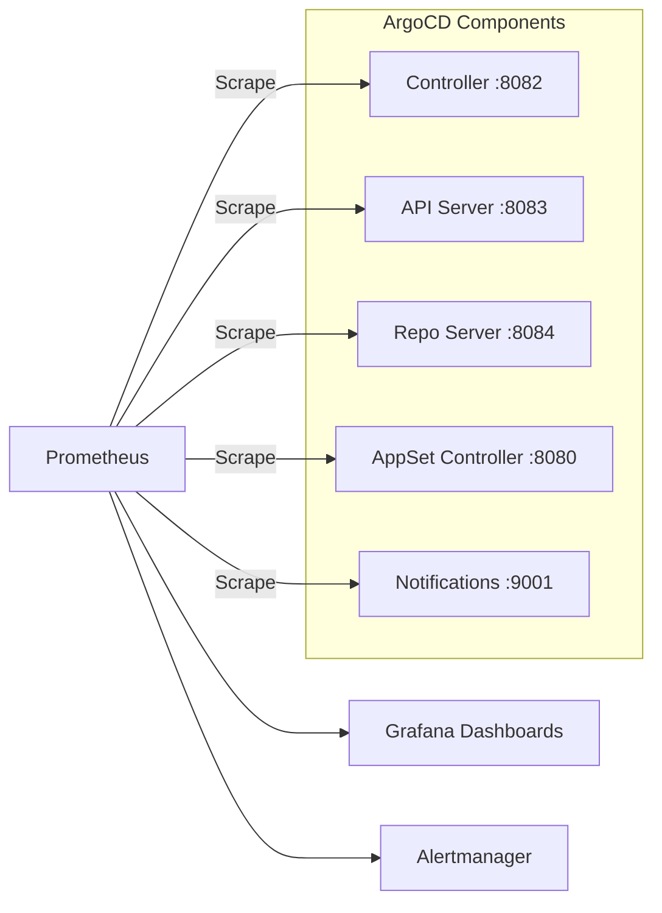

# How to Monitor ArgoCD Component Health

Author: [nawazdhandala](https://github.com/nawazdhandala)

Tags: ArgoCD, GitOps, Kubernetes, Monitoring, Observability

Description: Learn how to set up comprehensive monitoring for ArgoCD components using Prometheus, Grafana, and alerting to detect issues before they impact your GitOps pipeline.

---

ArgoCD is your deployment pipeline. If it goes down or degrades, deployments stop. Monitoring ArgoCD components proactively means you detect and fix issues before developers notice slow syncs or broken dashboards. This guide covers setting up complete monitoring for every ArgoCD component.

## ArgoCD Metrics Architecture

Every ArgoCD component exposes Prometheus metrics on dedicated ports:

| Component | Metrics Port | Endpoint |
|---|---|---|
| Application Controller | 8082 | /metrics |
| API Server | 8083 | /metrics |
| Repo Server | 8084 | /metrics |
| ApplicationSet Controller | 8080 | /metrics |
| Notifications Controller | 9001 | /metrics |



## Enable Metrics Scraping

### Using ServiceMonitors (Prometheus Operator)

If you use the Prometheus Operator, create ServiceMonitors:

```yaml
# argocd-metrics-servicemonitor.yaml
apiVersion: monitoring.coreos.com/v1
kind: ServiceMonitor
metadata:
  name: argocd-metrics
  namespace: argocd
  labels:
    release: prometheus  # Match your Prometheus selector
spec:
  selector:
    matchLabels:
      app.kubernetes.io/part-of: argocd
  endpoints:
    - port: metrics
      interval: 30s
      path: /metrics
---
apiVersion: monitoring.coreos.com/v1
kind: ServiceMonitor
metadata:
  name: argocd-server-metrics
  namespace: argocd
  labels:
    release: prometheus
spec:
  selector:
    matchLabels:
      app.kubernetes.io/name: argocd-server
  endpoints:
    - port: metrics
      interval: 30s
---
apiVersion: monitoring.coreos.com/v1
kind: ServiceMonitor
metadata:
  name: argocd-repo-server-metrics
  namespace: argocd
  labels:
    release: prometheus
spec:
  selector:
    matchLabels:
      app.kubernetes.io/name: argocd-repo-server
  endpoints:
    - port: metrics
      interval: 30s
```

### Using Helm Chart Configuration

Enable metrics in the ArgoCD Helm values:

```yaml
controller:
  metrics:
    enabled: true
    serviceMonitor:
      enabled: true
      interval: 30s

server:
  metrics:
    enabled: true
    serviceMonitor:
      enabled: true
      interval: 30s

repoServer:
  metrics:
    enabled: true
    serviceMonitor:
      enabled: true
      interval: 30s

applicationSet:
  metrics:
    enabled: true
    serviceMonitor:
      enabled: true
      interval: 30s

notifications:
  metrics:
    enabled: true
    serviceMonitor:
      enabled: true
      interval: 30s
```

### Using Prometheus Annotations (Without Operator)

Add annotations directly to the services:

```yaml
apiVersion: v1
kind: Service
metadata:
  name: argocd-metrics
  namespace: argocd
  annotations:
    prometheus.io/scrape: "true"
    prometheus.io/port: "8082"
    prometheus.io/path: "/metrics"
spec:
  selector:
    app.kubernetes.io/name: argocd-application-controller
  ports:
    - port: 8082
      targetPort: 8082
      name: metrics
```

## Key Metrics to Monitor

### Application Controller Metrics

```bash
# Verify metrics are accessible
kubectl port-forward svc/argocd-metrics -n argocd 8082:8082
curl localhost:8082/metrics
```

Critical metrics:

```promql
# Number of managed applications by sync status
argocd_app_info{sync_status="OutOfSync"}

# Reconciliation performance (how long each app takes to reconcile)
histogram_quantile(0.95, rate(argocd_app_reconcile_bucket[5m]))

# Sync operation count and duration
rate(argocd_app_sync_total[5m])

# Kubernetes API calls (detect excessive API usage)
rate(argocd_cluster_api_resource_actions_total[5m])

# Pending Kubernetes API requests (indicates overload)
argocd_kubectl_exec_pending

# Application health status
argocd_app_info{health_status="Degraded"}
argocd_app_info{health_status="Missing"}
```

### Repo Server Metrics

```promql
# Git operations performance
histogram_quantile(0.95, rate(argocd_git_request_duration_seconds_bucket[5m]))

# Total Git requests by type
rate(argocd_git_request_total[5m])

# Pending manifest generation requests
argocd_repo_pending_request_total
```

### API Server Metrics

```promql
# gRPC request rate by method
rate(grpc_server_handled_total{namespace="argocd"}[5m])

# gRPC error rate
sum(rate(grpc_server_handled_total{grpc_code!="OK",namespace="argocd"}[5m]))
/
sum(rate(grpc_server_handled_total{namespace="argocd"}[5m]))

# Request latency
histogram_quantile(0.95, rate(grpc_server_handling_seconds_bucket{namespace="argocd"}[5m]))
```

## Alerting Rules

Create comprehensive alerting rules:

```yaml
# argocd-alerts.yaml
apiVersion: monitoring.coreos.com/v1
kind: PrometheusRule
metadata:
  name: argocd-alerts
  namespace: argocd
  labels:
    release: prometheus
spec:
  groups:
    - name: argocd-application-health
      rules:
        - alert: ArgocdApplicationUnhealthy
          expr: argocd_app_info{health_status="Degraded"} == 1
          for: 15m
          labels:
            severity: warning
          annotations:
            summary: "ArgoCD application {{ $labels.name }} is degraded"
            description: "Application {{ $labels.name }} in project {{ $labels.project }} has been in Degraded health status for 15 minutes."

        - alert: ArgocdApplicationOutOfSync
          expr: argocd_app_info{sync_status="OutOfSync"} == 1
          for: 30m
          labels:
            severity: warning
          annotations:
            summary: "ArgoCD application {{ $labels.name }} is out of sync"
            description: "Application {{ $labels.name }} has been OutOfSync for 30 minutes."

        - alert: ArgocdApplicationSyncFailed
          expr: increase(argocd_app_sync_total{phase="Error"}[10m]) > 0
          labels:
            severity: critical
          annotations:
            summary: "ArgoCD application sync failed"

    - name: argocd-component-health
      rules:
        - alert: ArgocdControllerNotRunning
          expr: absent(up{job="argocd-metrics"} == 1)
          for: 5m
          labels:
            severity: critical
          annotations:
            summary: "ArgoCD application controller is not running"

        - alert: ArgocdRepoServerNotRunning
          expr: absent(up{job="argocd-repo-server-metrics"} == 1)
          for: 5m
          labels:
            severity: critical
          annotations:
            summary: "ArgoCD repo server is not running"

        - alert: ArgocdServerNotRunning
          expr: absent(up{job="argocd-server-metrics"} == 1)
          for: 5m
          labels:
            severity: critical
          annotations:
            summary: "ArgoCD API server is not running"

    - name: argocd-performance
      rules:
        - alert: ArgocdReconciliationSlow
          expr: histogram_quantile(0.95, rate(argocd_app_reconcile_bucket[10m])) > 30
          for: 15m
          labels:
            severity: warning
          annotations:
            summary: "ArgoCD reconciliation is slow (p95 > 30s)"

        - alert: ArgocdGitRequestSlow
          expr: histogram_quantile(0.95, rate(argocd_git_request_duration_seconds_bucket[10m])) > 30
          for: 15m
          labels:
            severity: warning
          annotations:
            summary: "ArgoCD Git requests are slow (p95 > 30s)"

        - alert: ArgocdHighMemoryUsage
          expr: |
            container_memory_working_set_bytes{namespace="argocd",container=~"argocd-.*"}
            / container_spec_memory_limit_bytes{namespace="argocd",container=~"argocd-.*"}
            > 0.85
          for: 10m
          labels:
            severity: warning
          annotations:
            summary: "ArgoCD {{ $labels.container }} memory usage above 85%"

        - alert: ArgocdPodRestarting
          expr: increase(kube_pod_container_status_restarts_total{namespace="argocd"}[1h]) > 3
          labels:
            severity: warning
          annotations:
            summary: "ArgoCD pod {{ $labels.pod }} restarting frequently"

    - name: argocd-cluster-health
      rules:
        - alert: ArgocdClusterConnectionFailed
          expr: argocd_cluster_info{connection_status!="Successful"} == 1
          for: 5m
          labels:
            severity: critical
          annotations:
            summary: "ArgoCD cannot connect to cluster {{ $labels.server }}"
```

## Grafana Dashboard

Create a comprehensive Grafana dashboard. Here is a JSON model for key panels:

```json
{
  "dashboard": {
    "title": "ArgoCD Overview",
    "panels": [
      {
        "title": "Applications by Sync Status",
        "type": "stat",
        "targets": [
          {"expr": "count(argocd_app_info{sync_status=\"Synced\"})"},
          {"expr": "count(argocd_app_info{sync_status=\"OutOfSync\"})"},
          {"expr": "count(argocd_app_info{sync_status=\"Unknown\"})"}
        ]
      },
      {
        "title": "Applications by Health Status",
        "type": "piechart",
        "targets": [
          {"expr": "count(argocd_app_info) by (health_status)"}
        ]
      },
      {
        "title": "Reconciliation Duration (p95)",
        "type": "timeseries",
        "targets": [
          {"expr": "histogram_quantile(0.95, rate(argocd_app_reconcile_bucket[5m]))"}
        ]
      },
      {
        "title": "Sync Operations per Minute",
        "type": "timeseries",
        "targets": [
          {"expr": "sum(rate(argocd_app_sync_total[5m])) by (phase) * 60"}
        ]
      }
    ]
  }
}
```

Import the official ArgoCD Grafana dashboard using dashboard ID **14584** from grafana.com:

```bash
# The official ArgoCD dashboard
# https://grafana.com/grafana/dashboards/14584
```

## Health Check Endpoint

ArgoCD also exposes health check endpoints for liveness and readiness monitoring:

```bash
# Controller health
curl -s http://argocd-metrics.argocd:8082/healthz

# API Server health
curl -sk https://argocd-server.argocd:443/healthz

# Repo Server health
curl -s http://argocd-repo-server.argocd:8084/healthz
```

Use these endpoints with external monitoring tools like [OneUptime](https://oneuptime.com) to get notifications when ArgoCD components become unhealthy, even if your in-cluster Prometheus is also having issues.

## Quick Health Check Script

For manual health verification:

```bash
#!/bin/bash
# argocd-health-check.sh

echo "=== ArgoCD Component Health ==="

# Check pods
echo -e "\nPod Status:"
kubectl get pods -n argocd -o wide | grep -v "Running\|Completed" || echo "All pods healthy"

# Check restarts
echo -e "\nRecent Restarts:"
kubectl get pods -n argocd -o json | \
  jq -r '.items[] | select(.status.containerStatuses[].restartCount > 0) | .metadata.name + ": " + (.status.containerStatuses[].restartCount | tostring) + " restarts"'

# Check cluster connections
echo -e "\nCluster Connections:"
argocd cluster list 2>/dev/null || echo "Cannot reach ArgoCD API"

# Check application health
echo -e "\nUnhealthy Applications:"
argocd app list -o json 2>/dev/null | \
  jq -r '.[] | select(.status.health.status != "Healthy") | .metadata.name + ": " + .status.health.status' || echo "Cannot reach ArgoCD API"

echo -e "\n=== Health Check Complete ==="
```

Monitoring ArgoCD is not optional in production. Set up metrics collection, build dashboards for visibility, and create alerts for both component health and application health. The investment in monitoring pays off immediately when you catch a degraded controller before it impacts your deployment pipeline.
