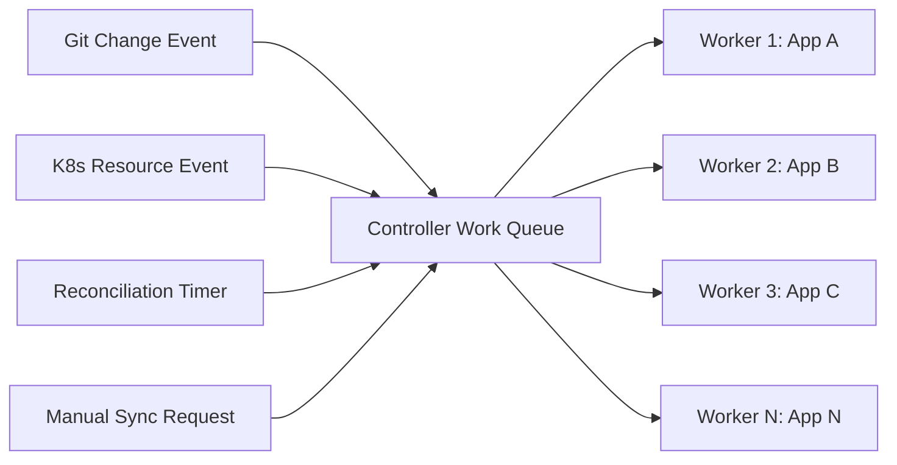
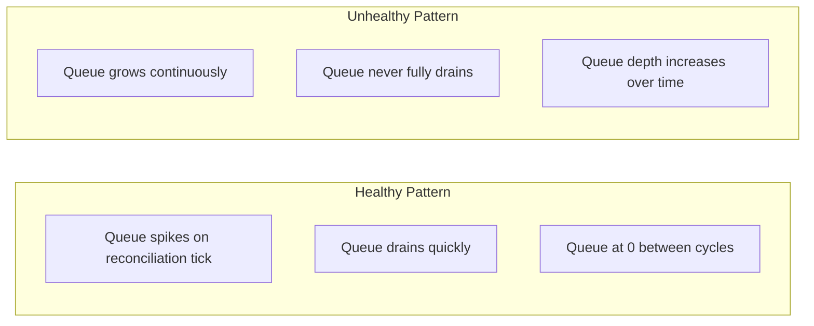

# How to Monitor ArgoCD Controller Queue Depth

Author: [nawazdhandala](https://github.com/nawazdhandala)

Tags: ArgoCD, GitOps, Kubernetes, Prometheus, Performance

Description: Learn how to monitor ArgoCD application controller queue depth to detect reconciliation bottlenecks, identify scaling issues, and prevent sync delays across your application fleet.

---

The ArgoCD application controller is the brain of the system. It watches your Kubernetes clusters, compares live state against desired state, and triggers sync operations when drift is detected. Every application managed by ArgoCD passes through the controller's work queue. When that queue grows too large, reconciliation slows down, sync operations get delayed, and applications stay OutOfSync longer than they should.

Monitoring queue depth is how you detect that the controller is overwhelmed before it impacts your deployment velocity.

## How the Controller Queue Works

The application controller maintains internal work queues for processing applications. When an event occurs - a Git change, a Kubernetes resource change, or a periodic reconciliation tick - the affected application is added to the queue. The controller processes items from the queue sequentially per application, but can process different applications in parallel.



When the rate of incoming events exceeds the rate at which workers can process them, the queue grows. A consistently growing queue means the controller needs more resources or more workers.

## Key Queue Metrics

ArgoCD exposes several metrics related to the controller queue:

**workqueue_depth** - The current number of items waiting in the queue:

```promql
# Current queue depth
workqueue_depth{namespace="argocd", name="app_operation"}
workqueue_depth{namespace="argocd", name="app_reconciliation"}
```

**workqueue_adds_total** - Total number of items added to the queue:

```promql
# Rate of items being added to the queue
rate(workqueue_adds_total{namespace="argocd", name="app_reconciliation"}[5m])
```

**workqueue_queue_duration_seconds** - How long items wait in the queue before processing:

```promql
# 95th percentile queue wait time
histogram_quantile(0.95,
  rate(workqueue_queue_duration_seconds_bucket{
    namespace="argocd",
    name="app_reconciliation"
  }[5m])
)
```

**workqueue_work_duration_seconds** - How long it takes to process each item:

```promql
# 95th percentile processing time
histogram_quantile(0.95,
  rate(workqueue_work_duration_seconds_bucket{
    namespace="argocd",
    name="app_reconciliation"
  }[5m])
)
```

## Understanding Queue Depth Behavior

A healthy controller shows queue depth that spikes briefly during reconciliation cycles and then returns to zero:



If the queue depth is consistently above zero or trending upward, the controller cannot keep up with the workload.

## Setting Up Alerts for Queue Depth

Create alerts that fire when the controller queue shows signs of backing up:

```yaml
groups:
- name: argocd-controller-queue
  rules:
  # Warning when queue depth is consistently above 10
  - alert: ArgocdControllerQueueHigh
    expr: |
      workqueue_depth{
        namespace="argocd",
        name="app_reconciliation"
      } > 10
    for: 10m
    labels:
      severity: warning
    annotations:
      summary: "ArgoCD controller reconciliation queue is backing up"
      description: "Controller queue depth is {{ $value }}. Applications may experience delayed reconciliation."

  # Critical when queue depth is very high
  - alert: ArgocdControllerQueueCritical
    expr: |
      workqueue_depth{
        namespace="argocd",
        name="app_reconciliation"
      } > 50
    for: 5m
    labels:
      severity: critical
    annotations:
      summary: "ArgoCD controller queue is critically backed up"
      description: "Controller queue depth is {{ $value }}. Sync operations are significantly delayed."

  # Alert on queue wait time
  - alert: ArgocdControllerQueueSlow
    expr: |
      histogram_quantile(0.95,
        rate(workqueue_queue_duration_seconds_bucket{
          namespace="argocd",
          name="app_reconciliation"
        }[5m])
      ) > 30
    for: 10m
    labels:
      severity: warning
    annotations:
      summary: "ArgoCD controller queue processing is slow"
      description: "95th percentile queue wait time is {{ $value }}s. Applications are waiting too long for reconciliation."
```

## Building a Queue Depth Dashboard

Create a Grafana dashboard focused on controller queue performance:

**Queue Depth Over Time (Time Series):**

```promql
workqueue_depth{namespace="argocd", name=~"app_.*"}
```

**Queue Add Rate (Time Series):**

```promql
rate(workqueue_adds_total{namespace="argocd", name=~"app_.*"}[5m])
```

**Queue Wait Time P95 (Time Series):**

```promql
histogram_quantile(0.95,
  rate(workqueue_queue_duration_seconds_bucket{
    namespace="argocd", name=~"app_.*"
  }[5m])
)
```

**Processing Time P95 (Time Series):**

```promql
histogram_quantile(0.95,
  rate(workqueue_work_duration_seconds_bucket{
    namespace="argocd", name=~"app_.*"
  }[5m])
)
```

**Queue Throughput - Items Processed Per Second (Time Series):**

```promql
rate(workqueue_adds_total{namespace="argocd", name=~"app_.*"}[5m])
```

## Diagnosing Queue Depth Issues

When queue depth is consistently high, investigate these common causes:

**Too many applications for a single controller:**

```bash
# Check how many applications the controller manages
argocd app list --output name | wc -l

# Check controller resource usage
kubectl top pod -n argocd -l app.kubernetes.io/name=argocd-application-controller
```

**Slow reconciliation due to large manifests:**

```promql
# Find applications with slow reconciliation
topk(10,
  histogram_quantile(0.95,
    rate(argocd_app_reconcile_duration_seconds_bucket[5m])
  ) by (name)
)
```

**Cluster connectivity issues slowing down operations:**

```promql
# Check for cluster connection errors
argocd_cluster_api_server_connectivity
```

**Too many Git operations blocking the queue:**

```promql
# Git request duration - if this is high, it slows everything
histogram_quantile(0.95,
  rate(argocd_git_request_duration_seconds_bucket[5m])
)
```

## Scaling the Controller

When monitoring shows the queue is consistently backed up, scale the controller:

**Increase controller parallelism:**

```yaml
apiVersion: v1
kind: ConfigMap
metadata:
  name: argocd-cmd-params-cm
  namespace: argocd
data:
  # Increase the number of concurrent application reconciliations
  controller.status.processors: "50"
  controller.operation.processors: "25"
```

The default is typically 20 status processors and 10 operation processors. Increasing these allows the controller to process more applications in parallel.

**Increase controller resources:**

```yaml
apiVersion: apps/v1
kind: Deployment
metadata:
  name: argocd-application-controller
  namespace: argocd
spec:
  template:
    spec:
      containers:
      - name: argocd-application-controller
        resources:
          requests:
            cpu: 500m
            memory: 1Gi
          limits:
            cpu: 2000m
            memory: 4Gi
```

**Enable controller sharding:**

For very large deployments (500+ applications), shard the controller across multiple replicas:

```yaml
apiVersion: apps/v1
kind: StatefulSet
metadata:
  name: argocd-application-controller
  namespace: argocd
spec:
  replicas: 3
  template:
    spec:
      containers:
      - name: argocd-application-controller
        env:
        - name: ARGOCD_CONTROLLER_REPLICAS
          value: "3"
```

After scaling, monitor the queue depth to verify the changes had the desired effect:

```promql
# Compare queue depth before and after scaling
workqueue_depth{namespace="argocd", name="app_reconciliation"}
```

## Correlation with Application Count

Plot queue depth against total application count to understand capacity:

```promql
# Queue depth
workqueue_depth{namespace="argocd", name="app_reconciliation"}

# Application count
count(argocd_app_info)
```

When these two metrics trend together, it means each additional application adds proportional queue pressure. When queue depth grows faster than application count, there is a compounding performance issue.

Controller queue depth is the canary in the coal mine for ArgoCD performance problems. Monitor it proactively and scale the controller before queue buildup starts affecting your deployment pipeline.
