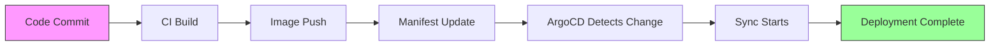

# How to Monitor ArgoCD Deployment Lead Time

Author: [nawazdhandala](https://github.com/nawazdhandala)

Tags: ArgoCD, GitOps, Kubernetes, DORA Metrics, Monitoring

Description: Learn how to measure and monitor deployment lead time in ArgoCD to understand how quickly code changes reach production through your GitOps pipeline.

---

Deployment lead time is one of the four DORA metrics that engineering teams use to measure software delivery performance. It tracks how long it takes from a code commit to that change running in production. In ArgoCD, this metric becomes especially interesting because the GitOps model introduces distinct stages between commit and deployment.

Understanding your lead time helps you identify bottlenecks in your delivery pipeline and make targeted improvements.

## What Is Deployment Lead Time in ArgoCD

In a traditional CI/CD pipeline, lead time is straightforward: commit to deploy. In ArgoCD's GitOps model, the path is more nuanced:



The total lead time includes:

1. **CI Time** - from commit to image build
2. **Manifest Update Time** - from image availability to manifest change in Git
3. **Detection Time** - from Git push to ArgoCD noticing the change
4. **Sync Time** - from sync start to deployment complete

Each of these stages can be measured and optimized independently.

## ArgoCD Metrics That Track Lead Time

ArgoCD exposes several metrics that help measure lead time components:

- `argocd_app_sync_total` - counts sync operations with status labels
- `argocd_app_reconcile_duration` - time spent reconciling application state
- `argocd_git_request_duration_seconds` - time to fetch Git changes
- `argocd_app_info` - application state including sync status and revision

However, ArgoCD does not natively track the full commit-to-deploy lead time. You need to calculate it from multiple sources.

## Approach 1: Git Commit Timestamp Comparison

The simplest approach compares the Git commit timestamp with the ArgoCD sync completion time. You can extract this from ArgoCD events and Git metadata.

Create a script that queries ArgoCD and Git:

```bash
#!/bin/bash
# lead-time-calculator.sh
# Calculates lead time for the most recent deployment

APP_NAME=$1
ARGOCD_SERVER="argocd-server.argocd.svc.cluster.local"

# Get the current deployed revision
REVISION=$(argocd app get "$APP_NAME" -o json | jq -r '.status.sync.revision')

# Get the commit timestamp from Git
COMMIT_TIME=$(git log -1 --format=%cI "$REVISION")
COMMIT_EPOCH=$(date -d "$COMMIT_TIME" +%s 2>/dev/null || date -j -f "%Y-%m-%dT%H:%M:%S" "$COMMIT_TIME" +%s)

# Get the sync completion time from ArgoCD history
SYNC_TIME=$(argocd app get "$APP_NAME" -o json | \
  jq -r '.status.history[-1].deployedAt')
SYNC_EPOCH=$(date -d "$SYNC_TIME" +%s 2>/dev/null || date -j -f "%Y-%m-%dT%H:%M:%S" "$SYNC_TIME" +%s)

# Calculate lead time in seconds
LEAD_TIME=$((SYNC_EPOCH - COMMIT_EPOCH))

echo "Application: $APP_NAME"
echo "Revision: $REVISION"
echo "Commit Time: $COMMIT_TIME"
echo "Sync Time: $SYNC_TIME"
echo "Lead Time: ${LEAD_TIME}s ($((LEAD_TIME / 60)) minutes)"
```

## Approach 2: Custom Prometheus Metrics with a Sidecar

For continuous monitoring, build a sidecar that calculates lead time and exposes it as a Prometheus metric.

```yaml
# lead-time-exporter deployment
apiVersion: apps/v1
kind: Deployment
metadata:
  name: argocd-lead-time-exporter
  namespace: argocd
spec:
  replicas: 1
  selector:
    matchLabels:
      app: lead-time-exporter
  template:
    metadata:
      labels:
        app: lead-time-exporter
      annotations:
        prometheus.io/scrape: "true"
        prometheus.io/port: "8080"
    spec:
      serviceAccountName: argocd-server
      containers:
        - name: exporter
          image: python:3.12-slim
          command: ["python", "/app/exporter.py"]
          ports:
            - containerPort: 8080
          volumeMounts:
            - name: script
              mountPath: /app
          env:
            - name: ARGOCD_SERVER
              value: "argocd-server.argocd:443"
            - name: ARGOCD_AUTH_TOKEN
              valueFrom:
                secretKeyRef:
                  name: argocd-lead-time-token
                  key: token
      volumes:
        - name: script
          configMap:
            name: lead-time-exporter-script
```

The Python exporter logic:

```python
# exporter.py
import time
import json
import subprocess
from http.server import HTTPServer, BaseHTTPRequestHandler
from datetime import datetime, timezone

# Store lead time per application
lead_times = {}

def get_argocd_apps():
    """Fetch all ArgoCD applications and their sync history."""
    result = subprocess.run(
        ["argocd", "app", "list", "-o", "json"],
        capture_output=True, text=True
    )
    return json.loads(result.stdout)

def calculate_lead_time(app):
    """Calculate lead time from commit to deploy for an app."""
    history = app.get("status", {}).get("history", [])
    if not history:
        return None

    latest = history[-1]
    revision = latest.get("revision", "")
    deployed_at = latest.get("deployedAt", "")

    if not revision or not deployed_at:
        return None

    # Parse deployment time
    deploy_time = datetime.fromisoformat(
        deployed_at.replace("Z", "+00:00")
    )

    # Get commit time from the source repo
    source = app.get("spec", {}).get("source", {})
    repo_url = source.get("repoURL", "")

    # Use ArgoCD API to get commit info
    result = subprocess.run(
        ["argocd", "app", "get", app["metadata"]["name"],
         "-o", "json"],
        capture_output=True, text=True
    )
    app_detail = json.loads(result.stdout)

    # Extract commit metadata
    commit_metadata = app_detail.get("status", {}).get(
        "sourceStatus", {}
    )

    # Calculate difference in seconds
    # This is simplified - in practice you would query
    # the Git provider API for the exact commit timestamp
    return {
        "app": app["metadata"]["name"],
        "revision": revision[:8],
        "deployed_at": deployed_at,
        "lead_time_seconds": (
            deploy_time - datetime.now(timezone.utc)
        ).total_seconds()
    }

def collect_metrics():
    """Build Prometheus metrics output."""
    lines = []
    lines.append(
        "# HELP argocd_lead_time_seconds "
        "Lead time from commit to deployment"
    )
    lines.append(
        "# TYPE argocd_lead_time_seconds gauge"
    )

    for app_name, lt in lead_times.items():
        lines.append(
            f'argocd_lead_time_seconds{{app="{app_name}"}} {lt}'
        )

    return "\n".join(lines) + "\n"

class MetricsHandler(BaseHTTPRequestHandler):
    def do_GET(self):
        if self.path == "/metrics":
            body = collect_metrics().encode()
            self.send_response(200)
            self.send_header("Content-Type", "text/plain")
            self.end_headers()
            self.wfile.write(body)

if __name__ == "__main__":
    server = HTTPServer(("0.0.0.0", 8080), MetricsHandler)
    print("Lead time exporter running on :8080")
    server.serve_forever()
```

## Approach 3: ArgoCD Notifications with Webhook

Use ArgoCD Notifications to send deployment events to a metrics collection endpoint:

```yaml
# argocd-notifications-cm ConfigMap
apiVersion: v1
kind: ConfigMap
metadata:
  name: argocd-notifications-cm
  namespace: argocd
data:
  trigger.on-sync-succeeded: |
    - when: app.status.operationState.phase in ['Succeeded']
      send: [lead-time-webhook]

  template.lead-time-webhook: |
    webhook:
      metrics-collector:
        method: POST
        body: |
          {
            "app": "{{.app.metadata.name}}",
            "revision": "{{.app.status.sync.revision}}",
            "syncFinished": "{{.app.status.operationState.finishedAt}}",
            "project": "{{.app.spec.project}}"
          }

  service.webhook.metrics-collector: |
    url: http://lead-time-collector.observability:8080/events
    headers:
      - name: Content-Type
        value: application/json
```

## Setting Up Alerts on Lead Time

Once you have lead time metrics, set up alerts to catch regressions:

```yaml
# PrometheusRule for lead time alerts
apiVersion: monitoring.coreos.com/v1
kind: PrometheusRule
metadata:
  name: argocd-lead-time-alerts
  namespace: argocd
spec:
  groups:
    - name: argocd-lead-time
      rules:
        - alert: HighDeploymentLeadTime
          # Alert if lead time exceeds 1 hour
          expr: argocd_lead_time_seconds > 3600
          for: 5m
          labels:
            severity: warning
          annotations:
            summary: "High deployment lead time for {{ $labels.app }}"
            description: >
              Application {{ $labels.app }} has a lead time of
              {{ $value | humanizeDuration }}, exceeding the 1-hour
              threshold.

        - alert: LeadTimeRegression
          # Alert if lead time increased by 50% compared to last week
          expr: >
            argocd_lead_time_seconds
            / argocd_lead_time_seconds offset 7d
            > 1.5
          for: 30m
          labels:
            severity: info
          annotations:
            summary: "Lead time regression for {{ $labels.app }}"
```

## Optimizing Lead Time in ArgoCD

Common bottlenecks and fixes:

1. **Long Git polling interval** - ArgoCD defaults to 3 minutes. Reduce it or use webhooks:
   ```yaml
   # argocd-cm
   data:
     timeout.reconciliation: 60s  # Check every 60 seconds
   ```

2. **Slow manifest generation** - Cache Helm charts and Kustomize builds by giving the repo server more resources.

3. **Sync waves slowing deployment** - Review your sync wave configuration to parallelize where possible.

4. **Manual sync required** - Enable auto-sync for faster lead times:
   ```yaml
   spec:
     syncPolicy:
       automated:
         prune: true
         selfHeal: true
   ```

## Summary

Monitoring deployment lead time in ArgoCD requires combining data from Git commits, CI pipelines, and ArgoCD sync operations. Whether you use a simple script, a custom Prometheus exporter, or ArgoCD Notifications, the key is tracking the full journey from commit to production. Use the resulting metrics to identify bottlenecks and drive improvements in your delivery pipeline.
