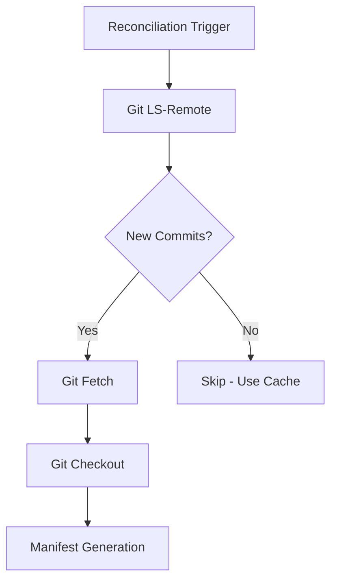

# How to Monitor ArgoCD Git Operations

Author: [nawazdhandala](https://github.com/nawazdhandala)

Tags: ArgoCD, GitOps, Kubernetes, Prometheus, Git

Description: Learn how to monitor ArgoCD Git operations using Prometheus metrics, including tracking fetch performance, detecting Git server issues, and optimizing repository access patterns.

---

Git operations are the foundation of ArgoCD's entire workflow. Every reconciliation cycle starts with a Git fetch to check for changes. Every sync starts with pulling the latest manifests from Git. When Git operations are slow or failing, the entire GitOps pipeline is compromised. Applications take longer to sync, drift detection is delayed, and your team loses confidence that the cluster reflects what is in Git.

Monitoring Git operations gives you visibility into this critical dependency and helps you catch problems before they cascade.

## Git Operation Types in ArgoCD

ArgoCD performs several types of Git operations:



- **ls-remote** - Lightweight check to see if the remote branch has new commits
- **fetch** - Download new commits and objects from the remote
- **checkout** - Switch the working directory to the target revision

Each of these operations has associated metrics that tell you their frequency, duration, and success rate.

## Key Git Metrics

### Request Total

```promql
# Total Git requests by type
argocd_git_request_total

# Request rate by type
rate(argocd_git_request_total[5m]) by (request_type)

# Request rate by status code
rate(argocd_git_request_total[5m]) by (grpc_code)
```

The `request_type` label can be `ls-remote`, `fetch`, or `checkout`. The `grpc_code` label indicates success (`OK`) or the type of failure.

### Request Duration

```promql
# Average Git request duration
rate(argocd_git_request_duration_seconds_sum[5m])
/ rate(argocd_git_request_duration_seconds_count[5m])

# 95th percentile duration
histogram_quantile(0.95,
  rate(argocd_git_request_duration_seconds_bucket[5m])
)

# Duration by request type
histogram_quantile(0.95,
  rate(argocd_git_request_duration_seconds_bucket[5m])
) by (request_type)
```

### Error Rate

```promql
# Git error rate
sum(rate(argocd_git_request_total{grpc_code!="OK"}[5m]))
/ sum(rate(argocd_git_request_total[5m]))

# Error count by error code
sum(rate(argocd_git_request_total{grpc_code!="OK"}[5m])) by (grpc_code)
```

## Building a Git Operations Dashboard

Create a Grafana dashboard focused on Git operation health:

**Row 1: Overview Stats**

Git request rate:
```promql
sum(rate(argocd_git_request_total[5m]))
```

Git error rate percentage:
```promql
sum(rate(argocd_git_request_total{grpc_code!="OK"}[5m]))
/ sum(rate(argocd_git_request_total[5m])) * 100
```

P95 Git latency:
```promql
histogram_quantile(0.95, rate(argocd_git_request_duration_seconds_bucket[5m]))
```

**Row 2: Request Duration**

Time series showing latency percentiles:
```promql
# P50
histogram_quantile(0.50, rate(argocd_git_request_duration_seconds_bucket[5m]))
# P95
histogram_quantile(0.95, rate(argocd_git_request_duration_seconds_bucket[5m]))
# P99
histogram_quantile(0.99, rate(argocd_git_request_duration_seconds_bucket[5m]))
```

Time series showing duration by request type:
```promql
histogram_quantile(0.95,
  rate(argocd_git_request_duration_seconds_bucket[5m])
) by (request_type)
```

**Row 3: Request Volume**

Stacked area chart of request rate by type:
```promql
sum(rate(argocd_git_request_total[5m])) by (request_type)
```

Bar chart of error breakdown:
```promql
sum(rate(argocd_git_request_total{grpc_code!="OK"}[5m])) by (grpc_code)
```

**Row 4: Repo Server Context**

CPU and memory usage alongside Git metrics to correlate resource constraints with Git performance:
```promql
rate(container_cpu_usage_seconds_total{namespace="argocd", container="argocd-repo-server"}[5m])
container_memory_working_set_bytes{namespace="argocd", container="argocd-repo-server"}
```

## Setting Up Git Operation Alerts

```yaml
apiVersion: monitoring.coreos.com/v1
kind: PrometheusRule
metadata:
  name: argocd-git-alerts
  namespace: monitoring
  labels:
    release: kube-prometheus-stack
spec:
  groups:
  - name: argocd-git-operations
    rules:
    # Git operations are slow
    - alert: ArgocdGitOperationsSlow
      expr: |
        histogram_quantile(0.95,
          rate(argocd_git_request_duration_seconds_bucket[10m])
        ) > 30
      for: 15m
      labels:
        severity: warning
      annotations:
        summary: "ArgoCD Git operations are slow"
        description: "P95 Git request duration is {{ $value }}s (normal: under 10s). This affects sync speed for all applications."

    # Git error rate is elevated
    - alert: ArgocdGitErrorsHigh
      expr: |
        sum(rate(argocd_git_request_total{grpc_code!="OK"}[5m]))
        / sum(rate(argocd_git_request_total[5m])) > 0.1
      for: 10m
      labels:
        severity: warning
      annotations:
        summary: "ArgoCD Git error rate is above 10%"
        description: "{{ $value | humanizePercentage }} of Git operations are failing."

    # Git operations completely failing
    - alert: ArgocdGitOperationsFailing
      expr: |
        sum(rate(argocd_git_request_total{grpc_code!="OK"}[5m]))
        / sum(rate(argocd_git_request_total[5m])) > 0.5
      for: 5m
      labels:
        severity: critical
      annotations:
        summary: "ArgoCD Git operations are mostly failing"
        description: "More than 50% of Git operations are failing. Applications cannot sync."

    # No Git requests at all (repo server might be down)
    - alert: ArgocdNoGitRequests
      expr: |
        sum(rate(argocd_git_request_total[10m])) == 0
      for: 10m
      labels:
        severity: critical
      annotations:
        summary: "No ArgoCD Git requests in the last 10 minutes"
        description: "The repo server may be down or all applications may have stopped reconciling."

    # Git latency spike (sudden increase)
    - alert: ArgocdGitLatencySpike
      expr: |
        histogram_quantile(0.95,
          rate(argocd_git_request_duration_seconds_bucket[5m])
        )
        > 3 *
        histogram_quantile(0.95,
          rate(argocd_git_request_duration_seconds_bucket[5m] offset 1h)
        )
      for: 10m
      labels:
        severity: warning
      annotations:
        summary: "ArgoCD Git latency has spiked 3x above baseline"
        description: "Current P95 Git latency is {{ $value }}s, which is 3x higher than an hour ago."
```

## Correlating Git Issues with Application State

When Git operations fail, applications stop reconciling and may show as OutOfSync or Unknown. Correlate Git metrics with application status:

```promql
# Are OutOfSync counts rising while Git errors are high?
count(argocd_app_info{sync_status="OutOfSync"})
# with
sum(rate(argocd_git_request_total{grpc_code!="OK"}[5m]))
```

Plot these on the same Grafana panel (dual Y-axis) to visually confirm correlation.

## Investigating Git Operation Failures

When Git alerts fire, investigate systematically:

```bash
# Check repo server logs for Git errors
kubectl logs -n argocd deployment/argocd-repo-server --tail=200 | \
  grep -i "error\|fail\|timeout\|refused"

# Test Git connectivity from within the cluster
kubectl exec -n argocd deployment/argocd-repo-server -- \
  git ls-remote https://github.com/myorg/myrepo.git

# Check if a specific repository is unreachable
argocd repo list

# Check for DNS resolution issues
kubectl exec -n argocd deployment/argocd-repo-server -- \
  nslookup github.com

# Check certificate issues
kubectl exec -n argocd deployment/argocd-repo-server -- \
  openssl s_client -connect github.com:443 -servername github.com </dev/null 2>/dev/null | \
  openssl x509 -noout -dates
```

## Common Git Operation Issues

**Rate limiting from Git providers:**
GitHub, GitLab, and Bitbucket impose rate limits. Monitor for HTTP 429 responses and reduce polling frequency by using webhooks. See our guide on [configuring Git retry logic](https://oneuptime.com/blog/post/2026-02-26-argocd-git-retry-logic/view).

**Slow Git server response:**
Self-hosted Git servers can become slow under load. Monitor server-side metrics alongside ArgoCD Git metrics to identify the bottleneck.

**Network issues:**
Intermittent connectivity problems between the cluster and the Git server. Check for proxy, firewall, or DNS issues.

**Credential expiration:**
GitHub App tokens, OAuth tokens, and SSH keys can expire. Monitor for authentication-related error codes.

## Recording Rules

```yaml
groups:
- name: argocd.git.recording
  rules:
  - record: argocd:git_request_rate:5m
    expr: sum(rate(argocd_git_request_total[5m]))

  - record: argocd:git_error_rate:5m
    expr: |
      sum(rate(argocd_git_request_total{grpc_code!="OK"}[5m]))
      / sum(rate(argocd_git_request_total[5m]))

  - record: argocd:git_latency_p95:5m
    expr: |
      histogram_quantile(0.95,
        rate(argocd_git_request_duration_seconds_bucket[5m])
      )

  - record: argocd:git_latency_p99:5m
    expr: |
      histogram_quantile(0.99,
        rate(argocd_git_request_duration_seconds_bucket[5m])
      )
```

Git operation monitoring is the most direct way to measure the health of your GitOps pipeline's input layer. When Git operations are healthy, ArgoCD can do its job. When they degrade, everything downstream suffers. Set up comprehensive monitoring and alerting for Git operations early in your ArgoCD deployment.
