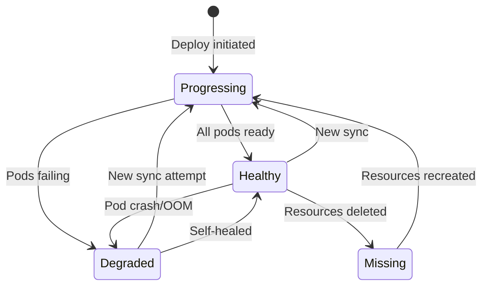

# How to Monitor ArgoCD Application Health with Metrics

Author: [nawazdhandala](https://github.com/nawazdhandala)

Tags: ArgoCD, GitOps, Kubernetes, Prometheus, Monitoring

Description: Learn how to monitor ArgoCD application health status using Prometheus metrics, including tracking Healthy, Degraded, Progressing, and Missing states across your deployment fleet.

---

Application health in ArgoCD tells you whether your deployed resources are actually working, not just whether they match Git. An application can be perfectly Synced but completely Degraded if the pods are crash-looping or the service is unreachable. Health status is the operational complement to sync status - together they give you the full picture of your deployment health.

This guide covers how to use Prometheus metrics to monitor application health, detect degraded states, and build alerts that catch problems early.

## Understanding Health Status Values

ArgoCD assigns one of several health statuses to each application based on the aggregate health of its Kubernetes resources:

| Status | Meaning |
|--------|---------|
| Healthy | All resources are running correctly |
| Progressing | Resources are being deployed or updated |
| Degraded | One or more resources have issues |
| Suspended | Resources are intentionally paused (e.g., Argo Rollouts) |
| Missing | Expected resources do not exist in the cluster |
| Unknown | ArgoCD cannot determine the health |



## Key Health Metrics

The primary metric for health status is `argocd_app_info`, which includes the `health_status` label:

```promql
# All applications with their health status
argocd_app_info

# Only Healthy applications
argocd_app_info{health_status="Healthy"}

# Only Degraded applications
argocd_app_info{health_status="Degraded"}

# Only Progressing applications
argocd_app_info{health_status="Progressing"}

# Applications in Missing state
argocd_app_info{health_status="Missing"}
```

## Tracking Health Status Distribution

Get an overview of your fleet's health:

```promql
# Count of applications by health status
count(argocd_app_info) by (health_status)

# Percentage of healthy applications
count(argocd_app_info{health_status="Healthy"})
/ count(argocd_app_info)
* 100

# Percentage of unhealthy applications (not Healthy, not Progressing)
count(argocd_app_info{health_status=~"Degraded|Missing|Unknown"})
/ count(argocd_app_info)
* 100
```

## Detecting Degraded Applications

Degraded is the most critical health status to monitor. It means something is wrong with the running workload:

```promql
# Currently degraded applications
argocd_app_info{health_status="Degraded"}

# Count of degraded applications
count(argocd_app_info{health_status="Degraded"}) or vector(0)

# Degraded applications in production namespace
argocd_app_info{health_status="Degraded", dest_namespace=~"production|prod"}
```

The `or vector(0)` ensures the query returns 0 when no applications are degraded, which is important for alerting rules that compare against thresholds.

## Detecting Stuck Progressing State

Applications in the Progressing state should eventually reach Healthy. If they stay Progressing for too long, something is wrong - usually a deployment that cannot complete due to insufficient resources, failed health checks, or image pull errors:

```promql
# Currently progressing applications
argocd_app_info{health_status="Progressing"}
```

Alert on applications stuck in Progressing:

```yaml
groups:
- name: argocd-health
  rules:
  - alert: ArgocdApplicationStuckProgressing
    expr: argocd_app_info{health_status="Progressing"} == 1
    for: 15m
    labels:
      severity: warning
    annotations:
      summary: "Application {{ $labels.name }} stuck in Progressing state"
      description: "Application {{ $labels.name }} has been in Progressing state for more than 15 minutes. Check for failed pods or resource constraints."
```

Fifteen minutes is a reasonable threshold for most applications. Adjust based on your deployment times - some applications with large init containers or slow startup probes might legitimately take longer.

## Alerting on Degraded Applications

Create graduated alerts for degraded applications:

```yaml
groups:
- name: argocd-health-alerts
  rules:
  # Warning for any degraded application
  - alert: ArgocdApplicationDegraded
    expr: argocd_app_info{health_status="Degraded"} == 1
    for: 5m
    labels:
      severity: warning
    annotations:
      summary: "Application {{ $labels.name }} is Degraded"
      description: "Application {{ $labels.name }} in project {{ $labels.project }} is in Degraded health state."

  # Critical for production degraded applications
  - alert: ArgocdProductionApplicationDegraded
    expr: |
      argocd_app_info{
        health_status="Degraded",
        dest_namespace=~"production|prod|prod-.*"
      } == 1
    for: 3m
    labels:
      severity: critical
    annotations:
      summary: "PRODUCTION application {{ $labels.name }} is Degraded"
      description: "Production application {{ $labels.name }} is Degraded. Immediate investigation required."

  # Alert when many applications are degraded simultaneously
  - alert: ArgocdMassDegradation
    expr: count(argocd_app_info{health_status="Degraded"}) > 3
    for: 5m
    labels:
      severity: critical
    annotations:
      summary: "Multiple ArgoCD applications are Degraded"
      description: "{{ $value }} applications are currently Degraded. This may indicate a cluster-wide issue."
```

## Combining Health and Sync Status

The most insightful queries combine both health and sync status:

```promql
# Applications that are Synced but Degraded (deployment succeeded but app is broken)
argocd_app_info{sync_status="Synced", health_status="Degraded"}

# Applications that are OutOfSync and Healthy (pending changes, currently working)
argocd_app_info{sync_status="OutOfSync", health_status="Healthy"}

# Applications that are both OutOfSync and Degraded (worst case)
argocd_app_info{sync_status="OutOfSync", health_status="Degraded"}
```

The "Synced but Degraded" state is particularly important. It means ArgoCD successfully applied the manifests from Git, but the resulting resources are not working. This usually indicates a configuration error in the manifests themselves.

## Health Status by Project

For multi-team environments, track health per project:

```promql
# Health distribution per project
count(argocd_app_info) by (project, health_status)

# Percentage of healthy apps per project
count(argocd_app_info{health_status="Healthy"}) by (project)
/ count(argocd_app_info) by (project)
* 100
```

## Building a Health Dashboard

Create a focused health dashboard in Grafana:

**Pie Chart - Health Status Distribution:**

```promql
count(argocd_app_info) by (health_status)
```

**Table - Unhealthy Applications:**

```promql
argocd_app_info{health_status!="Healthy"}
```

Show columns: name, health_status, sync_status, dest_namespace, project.

**Time Series - Health Status Counts Over Time:**

```promql
count(argocd_app_info{health_status="Healthy"})
count(argocd_app_info{health_status="Degraded"})
count(argocd_app_info{health_status="Progressing"})
count(argocd_app_info{health_status="Missing"})
```

**Stat Panel - Time Since Last Degraded:**

This requires a recording rule to track state changes:

```yaml
groups:
- name: argocd.health.recording
  rules:
  - record: argocd:degraded_app_count
    expr: count(argocd_app_info{health_status="Degraded"}) or vector(0)

  - record: argocd:healthy_percentage
    expr: |
      count(argocd_app_info{health_status="Healthy"})
      / count(argocd_app_info) * 100
```

## Troubleshooting Health Issues via Metrics

When metrics show degraded applications, use ArgoCD CLI to investigate:

```bash
# List all degraded applications
argocd app list --health-status Degraded

# Get details on a specific degraded app
argocd app get my-degraded-app

# Check the resource tree for unhealthy resources
argocd app resources my-degraded-app --health-status Degraded

# View events that might explain the degradation
kubectl get events -n production --sort-by='.lastTimestamp' | head -20
```

Common causes of Degraded health status:
- CrashLoopBackOff on one or more pods
- Failed readiness probes
- Insufficient CPU or memory (OOMKilled)
- Image pull failures
- PersistentVolumeClaim in Pending state
- Failed Jobs or CronJobs

Each of these has a corresponding Kubernetes event and metric that you can correlate with the ArgoCD health metric to pinpoint the root cause.

Health monitoring with metrics is the operational backbone of your ArgoCD deployment. Sync status tells you if your desired state matches Git. Health status tells you if that desired state actually works. Both are essential, and together they provide complete visibility into your GitOps pipeline.
