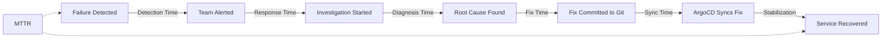
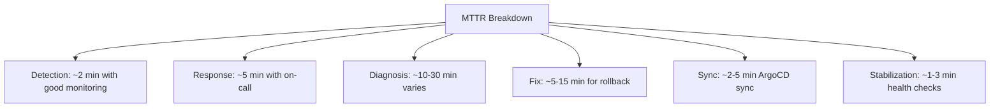

# How to Monitor ArgoCD Mean Time to Recovery

Author: [nawazdhandala](https://github.com/nawazdhandala)

Tags: ArgoCD, GitOps, Kubernetes, DORA Metrics, Observability

Description: Learn how to measure and monitor Mean Time to Recovery (MTTR) for ArgoCD deployments, tracking how quickly your team recovers from production failures.

---

Mean Time to Recovery (MTTR) measures how quickly your team can restore service after a production failure. It is one of the four DORA metrics that predict software delivery performance, and arguably the most directly tied to user experience. In a GitOps workflow with ArgoCD, MTTR encompasses the time from when a deployment failure is detected to when the service is restored to a healthy state.

This guide covers how to measure, monitor, and reduce MTTR in ArgoCD environments.

## What MTTR Means in an ArgoCD Context

In a GitOps workflow, recovery from a failed deployment typically follows this path:



MTTR = Detection Time + Response Time + Diagnosis Time + Fix Time + Sync Time + Stabilization Time

Each of these phases is measurable and optimizable.

## Defining Failure and Recovery Events

To calculate MTTR, you need to precisely define when a failure starts and when recovery is complete.

### Failure Start Events

A failure can be defined as any of these ArgoCD events:

```promql
# Application sync failed
argocd_app_sync_total{phase="Failed"}

# Application health degraded
argocd_app_info{health_status="Degraded"}

# Application health status is Missing
argocd_app_info{health_status="Missing"}
```

### Recovery Complete Events

Recovery is defined as the application returning to a healthy and synced state:

```promql
# Application is healthy and synced
argocd_app_info{health_status="Healthy", sync_status="Synced"}
```

## Collecting MTTR Data

### Method 1: ArgoCD Notifications Webhook

Use ArgoCD notifications to send events to a custom service that tracks failure/recovery pairs:

```yaml
apiVersion: v1
kind: ConfigMap
metadata:
  name: argocd-notifications-cm
  namespace: argocd
data:
  # Trigger when app becomes degraded
  trigger.on-health-degraded: |
    - when: app.status.health.status == 'Degraded'
      send: [failure-event]

  # Trigger when sync fails
  trigger.on-sync-failed: |
    - when: app.status.operationState.phase == 'Failed'
      send: [failure-event]

  # Trigger when app recovers
  trigger.on-health-healthy: |
    - when: app.status.health.status == 'Healthy' && app.status.sync.status == 'Synced'
      send: [recovery-event]

  template.failure-event: |
    webhook:
      mttr-tracker:
        url: http://mttr-service.monitoring:8080/events
        method: POST
        body: |
          {
            "app": "{{.app.metadata.name}}",
            "event": "failure",
            "timestamp": "{{now.Format \"2006-01-02T15:04:05Z07:00\"}}",
            "health": "{{.app.status.health.status}}",
            "sync": "{{.app.status.sync.status}}",
            "revision": "{{.app.status.sync.revision}}"
          }

  template.recovery-event: |
    webhook:
      mttr-tracker:
        url: http://mttr-service.monitoring:8080/events
        method: POST
        body: |
          {
            "app": "{{.app.metadata.name}}",
            "event": "recovery",
            "timestamp": "{{now.Format \"2006-01-02T15:04:05Z07:00\"}}",
            "health": "{{.app.status.health.status}}",
            "sync": "{{.app.status.sync.status}}",
            "revision": "{{.app.status.sync.revision}}"
          }
```

Apply the triggers to your applications:

```yaml
apiVersion: argoproj.io/v1alpha1
kind: Application
metadata:
  name: my-app
  annotations:
    notifications.argoproj.io/subscribe.on-health-degraded.mttr-tracker: ""
    notifications.argoproj.io/subscribe.on-sync-failed.mttr-tracker: ""
    notifications.argoproj.io/subscribe.on-health-healthy.mttr-tracker: ""
```

### Method 2: Prometheus Recording Rules

Use Prometheus recording rules to calculate MTTR from ArgoCD metrics:

```yaml
apiVersion: monitoring.coreos.com/v1
kind: PrometheusRule
metadata:
  name: argocd-mttr
  namespace: monitoring
spec:
  groups:
    - name: argocd-mttr
      interval: 30s
      rules:
        # Track when an app enters a failed state
        - record: argocd:app_failure_timestamp
          expr: |
            argocd_app_info{health_status=~"Degraded|Missing"} * on(name)
            group_left() (timestamp(argocd_app_info{health_status=~"Degraded|Missing"}) > 0)

        # Track when an app recovers
        - record: argocd:app_recovery_timestamp
          expr: |
            argocd_app_info{health_status="Healthy", sync_status="Synced"} * on(name)
            group_left() (timestamp(argocd_app_info{health_status="Healthy", sync_status="Synced"}) > 0)
```

### Method 3: Custom MTTR Tracking Service

Build a lightweight service that calculates MTTR from events:

```python
# mttr_service.py
from flask import Flask, request, jsonify
from prometheus_client import Histogram, Gauge, generate_latest
from datetime import datetime
import threading

app = Flask(__name__)

# MTTR histogram
mttr_histogram = Histogram(
    'argocd_mttr_seconds',
    'Mean Time to Recovery for ArgoCD applications',
    ['app'],
    buckets=[60, 120, 300, 600, 900, 1800, 3600, 7200, 14400, 28800]
)

# Current MTTR gauge
current_mttr = Gauge(
    'argocd_current_mttr_seconds',
    'Current MTTR for the last recovery',
    ['app']
)

# Track active failures
active_failures = {}
lock = threading.Lock()

@app.route('/events', methods=['POST'])
def handle_event():
    data = request.json
    app_name = data['app']
    event_type = data['event']
    timestamp = datetime.fromisoformat(data['timestamp'].replace('Z', '+00:00'))

    with lock:
        if event_type == 'failure':
            if app_name not in active_failures:
                active_failures[app_name] = timestamp
                print(f"Failure started: {app_name} at {timestamp}")

        elif event_type == 'recovery':
            if app_name in active_failures:
                failure_start = active_failures.pop(app_name)
                recovery_time = (timestamp - failure_start).total_seconds()

                # Record MTTR
                mttr_histogram.labels(app=app_name).observe(recovery_time)
                current_mttr.labels(app=app_name).set(recovery_time)

                print(f"Recovery: {app_name} - MTTR: {recovery_time:.0f}s")

    return jsonify({"status": "ok"})

@app.route('/metrics')
def metrics():
    return generate_latest()

@app.route('/active-failures')
def get_active_failures():
    with lock:
        return jsonify({
            app: str(ts) for app, ts in active_failures.items()
        })

if __name__ == '__main__':
    app.run(host='0.0.0.0', port=8080)
```

Deploy it as a simple service:

```yaml
apiVersion: apps/v1
kind: Deployment
metadata:
  name: mttr-service
  namespace: monitoring
spec:
  replicas: 1
  selector:
    matchLabels:
      app: mttr-service
  template:
    metadata:
      labels:
        app: mttr-service
      annotations:
        prometheus.io/scrape: "true"
        prometheus.io/port: "8080"
        prometheus.io/path: "/metrics"
    spec:
      containers:
        - name: mttr-service
          image: myorg/mttr-service:latest
          ports:
            - containerPort: 8080
---
apiVersion: v1
kind: Service
metadata:
  name: mttr-service
  namespace: monitoring
spec:
  selector:
    app: mttr-service
  ports:
    - port: 8080
```

## Building an MTTR Dashboard

### Key Panels

Create a Grafana dashboard with these essential panels:

**Average MTTR (last 30 days):**

```promql
# Average MTTR across all applications
avg(argocd_current_mttr_seconds) / 60
```

**MTTR by Application:**

```promql
# MTTR per application, sorted by worst performers
sort_desc(argocd_current_mttr_seconds / 60)
```

**MTTR Trend Over Time:**

```promql
# Weekly average MTTR
avg_over_time(argocd_current_mttr_seconds[7d]) / 60
```

**Active Failures (currently unrecovered):**

```promql
# Applications currently in a failed state
argocd_app_info{health_status=~"Degraded|Missing"}
```

**Recovery Rate:**

```promql
# Percentage of failures recovered within 1 hour
sum(rate(argocd_mttr_seconds_bucket{le="3600"}[30d]))
/
sum(rate(argocd_mttr_seconds_count[30d]))
```

## MTTR Breakdown Analysis

Understanding which phase of recovery takes the longest helps you target improvements:



Track each phase separately:

```yaml
# PrometheusRule for phase tracking
groups:
  - name: mttr-phases
    rules:
      # Detection phase: from health change to first alert acknowledgment
      - record: argocd:mttr_detection_seconds
        expr: |
          argocd_alert_acknowledged_timestamp - argocd_health_degraded_timestamp

      # Fix phase: from investigation start to fix committed
      - record: argocd:mttr_fix_seconds
        expr: |
          argocd_fix_committed_timestamp - argocd_investigation_started_timestamp

      # Sync phase: from fix committed to sync complete
      - record: argocd:mttr_sync_seconds
        expr: |
          argocd_sync_completed_timestamp - argocd_fix_committed_timestamp
```

## Reducing MTTR in ArgoCD

### 1. Reduce Detection Time

Fast detection is the biggest lever for MTTR reduction:

```yaml
# Configure aggressive health checks
apiVersion: argoproj.io/v1alpha1
kind: Application
metadata:
  name: my-app
spec:
  # Faster reconciliation for critical apps
  syncPolicy:
    automated:
      selfHeal: true
```

Configure alerts with short evaluation windows:

```yaml
- alert: ArgoCD_AppDegraded
  expr: argocd_app_info{health_status="Degraded"} == 1
  for: 1m  # Alert after just 1 minute
  labels:
    severity: critical
```

### 2. Reduce Diagnosis Time

Pre-build runbooks for common failure patterns:

```yaml
# ArgoCD Application with diagnostic links
apiVersion: argoproj.io/v1alpha1
kind: Application
metadata:
  name: my-app
  annotations:
    # Link to runbook
    notifications.argoproj.io/subscribe.on-health-degraded.slack: |
      Runbook: https://wiki.myorg.com/runbooks/my-app
      Grafana: https://grafana.myorg.com/d/my-app
      Logs: https://grafana.myorg.com/explore?query=my-app
```

### 3. Reduce Fix Time with Fast Rollbacks

The fastest fix is often a rollback. Prepare for this:

```bash
# Instant rollback using ArgoCD history
argocd app rollback my-app 0

# Or revert the Git commit
git revert HEAD --no-edit
git push origin main
```

Document which applications support instant rollback and which require manual intervention.

### 4. Reduce Sync Time

Configure ArgoCD for fast sync on critical applications:

```yaml
apiVersion: argoproj.io/v1alpha1
kind: Application
metadata:
  name: my-app
spec:
  syncPolicy:
    automated:
      selfHeal: true
      prune: true
    retry:
      limit: 3
      backoff:
        duration: 5s
        factor: 2
        maxDuration: 1m
```

## Alerting on MTTR Trends

Set up alerts when MTTR is deteriorating:

```yaml
apiVersion: monitoring.coreos.com/v1
kind: PrometheusRule
metadata:
  name: mttr-alerts
spec:
  groups:
    - name: mttr
      rules:
        - alert: HighMTTR
          expr: argocd_current_mttr_seconds > 1800
          labels:
            severity: warning
          annotations:
            summary: "MTTR for {{ $labels.app }} exceeded 30 minutes"
            description: "Consider automating recovery or improving runbooks"

        - alert: MTTRTrendingUp
          expr: |
            avg_over_time(argocd_current_mttr_seconds[7d])
            >
            1.5 * avg_over_time(argocd_current_mttr_seconds[30d])
          for: 1d
          labels:
            severity: info
          annotations:
            summary: "MTTR is trending upward for {{ $labels.app }}"
```

## MTTR Benchmarks

DORA research shows these performance levels for time to restore service:

| Performance Level | MTTR |
|---|---|
| Elite | Less than 1 hour |
| High | Less than 1 day |
| Medium | 1 day to 1 week |
| Low | More than 6 months |

With ArgoCD and GitOps, most recovery scenarios should fall in the Elite to High range because rollbacks are simple Git operations.

## Monitoring MTTR with OneUptime

[OneUptime](https://oneuptime.com) provides integrated incident management and DORA metrics tracking. By connecting ArgoCD events to OneUptime, you can automatically track incidents from detection through resolution, giving you accurate MTTR calculations without building custom services. OneUptime also correlates MTTR with other DORA metrics for a complete picture of your delivery performance.

## Conclusion

Mean Time to Recovery is a direct measure of your team's ability to respond to production issues. In an ArgoCD GitOps workflow, MTTR is influenced by monitoring coverage (detection time), operational readiness (response and diagnosis time), rollback capability (fix time), and ArgoCD configuration (sync time). By instrumenting failure and recovery events, building dashboards, and systematically reducing each phase, you can achieve Elite-level MTTR and minimize the impact of deployments that go wrong.
