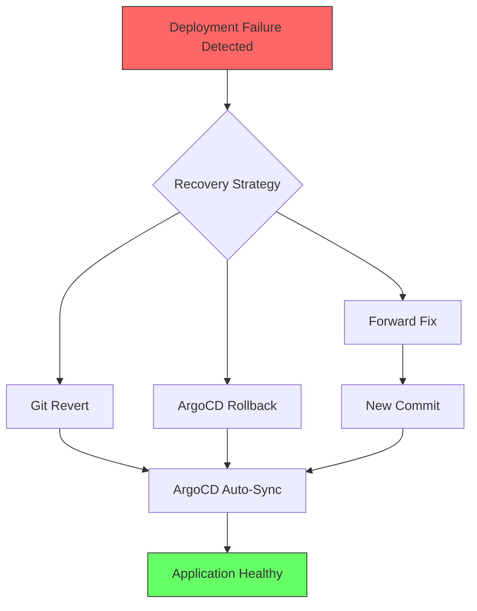

# How to Monitor ArgoCD Mean Time to Recovery

Author: [nawazdhandala](https://github.com/nawazdhandala)

Tags: ArgoCD, GitOps, Kubernetes, DORA Metrics, Observability

Description: Learn how to measure and monitor Mean Time to Recovery (MTTR) for ArgoCD deployments to understand how quickly your team recovers from failures.

---

Mean Time to Recovery (MTTR) is the fourth DORA metric and measures how long it takes to restore service after a deployment failure. In high-performing teams, MTTR is under an hour. In low-performing teams, it can stretch to weeks. ArgoCD's GitOps model has a natural advantage here because recovery often means reverting a Git commit, which ArgoCD then automatically deploys.

This guide covers how to track MTTR in ArgoCD, from detecting failures to measuring recovery time.

## How Recovery Works in ArgoCD

When a deployment fails in ArgoCD, recovery typically follows one of these paths:



Each recovery path has different time characteristics:

- **Git Revert** - Push a revert commit. ArgoCD detects and syncs. Usually 3 to 10 minutes.
- **ArgoCD Rollback** - Use `argocd app rollback`. Immediate, but can cause drift from Git.
- **Forward Fix** - Push a fix commit. Depends on how fast the fix is coded.

## Defining MTTR for ArgoCD

MTTR starts when a failure is detected and ends when the application returns to a healthy state:

```
MTTR = Time(Application Healthy) - Time(Failure Detected)
```

In ArgoCD terms:
- **Failure detected**: Application health status changes to Degraded, Missing, or Unknown
- **Recovery complete**: Application health status returns to Healthy

## Tracking Health State Transitions

ArgoCD exposes application health through the `argocd_app_info` metric. You need to track transitions in and out of unhealthy states.

### Recording Rules for State Transitions

```yaml
apiVersion: monitoring.coreos.com/v1
kind: PrometheusRule
metadata:
  name: argocd-mttr-recording
  namespace: argocd
spec:
  groups:
    - name: argocd-mttr
      interval: 30s
      rules:
        # Track when apps are not healthy (1 = unhealthy)
        - record: argocd:app_unhealthy:bool
          expr: >
            argocd_app_info{health_status!="Healthy"} > 0

        # Track transitions to unhealthy
        - record: argocd:app_became_unhealthy:bool
          expr: >
            argocd:app_unhealthy:bool
            unless
            argocd:app_unhealthy:bool offset 1m

        # Track duration of unhealthy state
        - record: argocd:app_unhealthy_duration:seconds
          expr: >
            (
              time() * argocd:app_unhealthy:bool
            )
            -
            (
              argocd:app_unhealthy:bool
              * on(name)
              group_left()
              (
                min_over_time(
                  (time() * argocd:app_unhealthy:bool)[24h:]
                )
              )
            )
```

## Building an MTTR Tracking Service

For accurate MTTR calculation, build a service that listens to ArgoCD health events:

```python
# mttr_tracker.py
import json
import time
from http.server import HTTPServer, BaseHTTPRequestHandler
from collections import defaultdict
from datetime import datetime, timezone
from statistics import mean

# Track failure start times and recovery times
incidents = defaultdict(list)
# Format: {app: [{start: timestamp, end: timestamp}]}

# Currently open incidents
open_incidents = {}
# Format: {app: start_timestamp}

class MTTRHandler(BaseHTTPRequestHandler):
    def do_POST(self):
        """Receive health transition events."""
        content_length = int(
            self.headers.get("Content-Length", 0)
        )
        body = json.loads(
            self.rfile.read(content_length).decode()
        )

        app = body["app"]
        health = body["health_status"]
        timestamp = datetime.fromisoformat(
            body["timestamp"].replace("Z", "+00:00")
        )

        if health in ("Degraded", "Missing", "Unknown"):
            # Failure detected - start tracking
            if app not in open_incidents:
                open_incidents[app] = timestamp
                print(
                    f"Incident started: {app} at {timestamp}"
                )
        elif health == "Healthy":
            # Recovery detected - close the incident
            if app in open_incidents:
                start = open_incidents.pop(app)
                duration = (timestamp - start).total_seconds()
                incidents[app].append({
                    "start": start.isoformat(),
                    "end": timestamp.isoformat(),
                    "duration_seconds": duration
                })
                print(
                    f"Incident resolved: {app} "
                    f"MTTR: {duration:.0f}s"
                )

        self.send_response(200)
        self.end_headers()

    def do_GET(self):
        """Serve Prometheus metrics."""
        if self.path == "/metrics":
            body = build_metrics().encode()
            self.send_response(200)
            self.send_header(
                "Content-Type", "text/plain"
            )
            self.end_headers()
            self.wfile.write(body)

def build_metrics():
    """Generate MTTR Prometheus metrics."""
    lines = [
        "# HELP argocd_mttr_seconds "
        "Mean time to recovery in seconds",
        "# TYPE argocd_mttr_seconds gauge",
        "# HELP argocd_mttr_last_seconds "
        "Last incident recovery time in seconds",
        "# TYPE argocd_mttr_last_seconds gauge",
        "# HELP argocd_incident_count "
        "Total number of incidents",
        "# TYPE argocd_incident_count counter",
        "# HELP argocd_incident_open "
        "Currently open incidents",
        "# TYPE argocd_incident_open gauge",
    ]

    for app, app_incidents in incidents.items():
        if app_incidents:
            durations = [
                i["duration_seconds"] for i in app_incidents
            ]
            avg_mttr = mean(durations)
            last_mttr = durations[-1]

            lines.append(
                f'argocd_mttr_seconds{{app="{app}"}} '
                f'{avg_mttr:.2f}'
            )
            lines.append(
                f'argocd_mttr_last_seconds{{app="{app}"}} '
                f'{last_mttr:.2f}'
            )
            lines.append(
                f'argocd_incident_count{{app="{app}"}} '
                f'{len(app_incidents)}'
            )

    for app in open_incidents:
        start = open_incidents[app]
        duration = (
            datetime.now(timezone.utc) - start
        ).total_seconds()
        lines.append(
            f'argocd_incident_open{{app="{app}"}} '
            f'{duration:.0f}'
        )

    return "\n".join(lines) + "\n"

if __name__ == "__main__":
    server = HTTPServer(("0.0.0.0", 8080), MTTRHandler)
    print("MTTR tracker running on :8080")
    server.serve_forever()
```

## Feeding Events from ArgoCD Notifications

Wire up ArgoCD Notifications to send health events to the tracker:

```yaml
apiVersion: v1
kind: ConfigMap
metadata:
  name: argocd-notifications-cm
  namespace: argocd
data:
  trigger.on-health-change: |
    - when: app.status.health.status in ['Healthy', 'Degraded', 'Missing', 'Unknown']
      send: [health-event]

  template.health-event: |
    webhook:
      mttr-tracker:
        method: POST
        body: |
          {
            "app": "{{.app.metadata.name}}",
            "health_status": "{{.app.status.health.status}}",
            "timestamp": "{{.app.status.reconciledAt}}",
            "revision": "{{.app.status.sync.revision}}"
          }

  service.webhook.mttr-tracker: |
    url: http://mttr-tracker.observability:8080/events
    headers:
      - name: Content-Type
        value: application/json
```

## PromQL Queries for MTTR Dashboards

If you are using the recording rules approach, here are useful dashboard queries:

```promql
# Average MTTR across all applications (last 30 days)
avg(argocd_mttr_seconds)

# MTTR per application
argocd_mttr_seconds

# Currently open incidents with duration
argocd_incident_open

# Applications with worst MTTR
topk(10, argocd_mttr_seconds)

# MTTR trend over time (using histogram if available)
avg_over_time(argocd_mttr_seconds[7d])
```

## Alerting on High MTTR

```yaml
apiVersion: monitoring.coreos.com/v1
kind: PrometheusRule
metadata:
  name: argocd-mttr-alerts
  namespace: argocd
spec:
  groups:
    - name: mttr-alerts
      rules:
        - alert: LongRecoveryTime
          # App has been unhealthy for more than 30 minutes
          expr: argocd_incident_open > 1800
          for: 5m
          labels:
            severity: critical
          annotations:
            summary: >
              {{ $labels.app }} has been unhealthy for
              {{ $value | humanizeDuration }}
            description: >
              Application {{ $labels.app }} has not recovered
              from a failure. Current downtime exceeds 30 minutes.

        - alert: MTTRRegression
          # Average MTTR increased significantly
          expr: >
            argocd_mttr_seconds
            > argocd_mttr_seconds offset 7d * 2
          for: 1h
          labels:
            severity: warning
          annotations:
            summary: "MTTR regression for {{ $labels.app }}"
```

## DORA Benchmarks for MTTR

| Performance Level | Mean Time to Recovery |
|---|---|
| Elite | Less than 1 hour |
| High | Less than 1 day |
| Medium | Between 1 day and 1 week |
| Low | More than 6 months |

## Improving MTTR with ArgoCD

ArgoCD provides several features that naturally reduce MTTR:

1. **Auto-sync with self-heal** - automatically recovers from drift
2. **Rollback** - instant rollback to previous revision
3. **Git revert workflow** - revert the bad commit, ArgoCD handles the rest
4. **Sync windows** - restrict deploys to safe windows to limit blast radius
5. **Health checks** - detect failures faster with custom health checks

The fastest path to low MTTR is combining automated rollback on health degradation:

```yaml
# Application with automated rollback on failure
apiVersion: argoproj.io/v1alpha1
kind: Application
metadata:
  name: my-app
  annotations:
    notifications.argoproj.io/subscribe.on-health-degraded.slack: my-channel
spec:
  syncPolicy:
    automated:
      selfHeal: true
    retry:
      limit: 3
      backoff:
        duration: 5s
        factor: 2
        maxDuration: 3m
```

## Summary

Tracking MTTR in ArgoCD requires monitoring health state transitions and calculating the time between failure detection and recovery. Use ArgoCD Notifications to feed events into a tracking service, and expose the results as Prometheus metrics for dashboards and alerting. The GitOps model inherently supports fast recovery through Git reverts and automated syncs, giving you a head start on achieving elite MTTR performance.

For the complete DORA metrics picture, combine MTTR with [deployment frequency](https://oneuptime.com/blog/post/2026-02-26-argocd-monitor-deployment-frequency/view) and [change failure rate](https://oneuptime.com/blog/post/2026-02-26-argocd-monitor-change-failure-rate/view).
