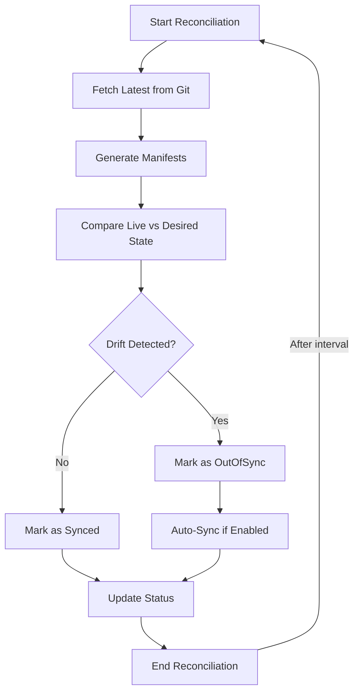

# How to Monitor ArgoCD Reconciliation Duration

Author: [nawazdhandala](https://github.com/nawazdhandala)

Tags: ArgoCD, GitOps, Kubernetes, Prometheus, Performance

Description: Learn how to monitor ArgoCD reconciliation duration using Prometheus metrics, identify slow-reconciling applications, and optimize the reconciliation loop for faster GitOps feedback.

---

Reconciliation is the core loop that makes ArgoCD work. During each reconciliation cycle, ArgoCD checks the desired state in Git, compares it against the live state in Kubernetes, and determines if a sync is needed. The duration of this loop directly impacts how quickly ArgoCD detects changes and how responsive your GitOps pipeline feels.

When reconciliation takes too long, changes in Git are not reflected in the cluster promptly. Applications stay OutOfSync longer than expected, manual syncs feel sluggish, and your team starts wondering if ArgoCD is working at all.

## Understanding the Reconciliation Loop

The reconciliation loop consists of several phases:



Each phase contributes to the total reconciliation duration. Slow Git fetches, complex manifest generation (large Helm charts), and expensive live/desired comparisons all add up.

## Key Reconciliation Metrics

**argocd_app_reconcile** - Counter of reconciliation events:

```promql
# Reconciliation rate
rate(argocd_app_reconcile_count[5m])

# Reconciliation rate by application
rate(argocd_app_reconcile_count[5m]) by (name)
```

**argocd_app_reconcile_duration_seconds** - Histogram of reconciliation duration:

```promql
# 95th percentile reconciliation duration
histogram_quantile(0.95,
  rate(argocd_app_reconcile_duration_seconds_bucket[5m])
)

# 99th percentile
histogram_quantile(0.99,
  rate(argocd_app_reconcile_duration_seconds_bucket[5m])
)

# Average reconciliation duration
rate(argocd_app_reconcile_duration_seconds_sum[5m])
/ rate(argocd_app_reconcile_duration_seconds_count[5m])
```

**Per-application duration:**

```promql
# Find the slowest applications to reconcile
topk(10,
  histogram_quantile(0.95,
    rate(argocd_app_reconcile_duration_seconds_bucket[5m])
  ) by (name)
)
```

## Building a Reconciliation Dashboard

Create a Grafana dashboard focused on reconciliation performance:

**Row 1: Overview**

P95 reconciliation duration stat:
```promql
histogram_quantile(0.95, rate(argocd_app_reconcile_duration_seconds_bucket[5m]))
```

Reconciliation rate stat:
```promql
sum(rate(argocd_app_reconcile_count[5m]))
```

Total managed applications stat:
```promql
count(argocd_app_info)
```

**Row 2: Duration Analysis**

Time series - Reconciliation duration percentiles over time:
```promql
histogram_quantile(0.50, rate(argocd_app_reconcile_duration_seconds_bucket[5m]))
histogram_quantile(0.95, rate(argocd_app_reconcile_duration_seconds_bucket[5m]))
histogram_quantile(0.99, rate(argocd_app_reconcile_duration_seconds_bucket[5m]))
```

Heatmap - Reconciliation duration distribution:
```promql
rate(argocd_app_reconcile_duration_seconds_bucket[5m])
```

**Row 3: Per-Application Analysis**

Bar gauge - Top 10 slowest applications:
```promql
topk(10,
  histogram_quantile(0.95,
    rate(argocd_app_reconcile_duration_seconds_bucket[10m])
  ) by (name)
)
```

Table - Application reconciliation details:
```promql
histogram_quantile(0.95,
  rate(argocd_app_reconcile_duration_seconds_bucket[5m])
) by (name)
```

**Row 4: Correlated Metrics**

Plot reconciliation duration alongside Git operation duration and controller queue depth to identify the bottleneck:

```promql
# Git duration
histogram_quantile(0.95, rate(argocd_git_request_duration_seconds_bucket[5m]))

# Reconciliation duration
histogram_quantile(0.95, rate(argocd_app_reconcile_duration_seconds_bucket[5m]))

# Queue depth
workqueue_depth{namespace="argocd", name="app_reconciliation"}
```

## Setting Up Reconciliation Alerts

```yaml
apiVersion: monitoring.coreos.com/v1
kind: PrometheusRule
metadata:
  name: argocd-reconciliation-alerts
  namespace: monitoring
  labels:
    release: kube-prometheus-stack
spec:
  groups:
  - name: argocd-reconciliation
    rules:
    # Overall reconciliation is slow
    - alert: ArgocdReconciliationSlow
      expr: |
        histogram_quantile(0.95,
          rate(argocd_app_reconcile_duration_seconds_bucket[10m])
        ) > 60
      for: 15m
      labels:
        severity: warning
      annotations:
        summary: "ArgoCD reconciliation P95 is above 60 seconds"
        description: "95th percentile reconciliation duration is {{ $value }}s. Changes in Git will be slow to reflect in the cluster."

    # Reconciliation is critically slow
    - alert: ArgocdReconciliationCritical
      expr: |
        histogram_quantile(0.95,
          rate(argocd_app_reconcile_duration_seconds_bucket[10m])
        ) > 300
      for: 10m
      labels:
        severity: critical
      annotations:
        summary: "ArgoCD reconciliation P95 is above 5 minutes"
        description: "Reconciliation is extremely slow at {{ $value }}s. GitOps feedback loop is severely degraded."

    # Specific application has slow reconciliation
    - alert: ArgocdApplicationSlowReconcile
      expr: |
        histogram_quantile(0.95,
          rate(argocd_app_reconcile_duration_seconds_bucket[10m])
        ) by (name) > 120
      for: 15m
      labels:
        severity: warning
      annotations:
        summary: "Application {{ $labels.name }} has slow reconciliation"
        description: "Application {{ $labels.name }} P95 reconciliation duration is {{ $value }}s."

    # Reconciliation has stopped
    - alert: ArgocdReconciliationStopped
      expr: |
        sum(rate(argocd_app_reconcile_count[10m])) == 0
      for: 15m
      labels:
        severity: critical
      annotations:
        summary: "ArgoCD reconciliation has stopped"
        description: "No reconciliation events in the last 15 minutes. The application controller may be down."

    # Reconciliation duration spike
    - alert: ArgocdReconciliationDurationSpike
      expr: |
        histogram_quantile(0.95,
          rate(argocd_app_reconcile_duration_seconds_bucket[5m])
        )
        > 3 *
        histogram_quantile(0.95,
          rate(argocd_app_reconcile_duration_seconds_bucket[5m] offset 1h)
        )
      for: 15m
      labels:
        severity: warning
      annotations:
        summary: "ArgoCD reconciliation duration spiked 3x above baseline"
        description: "Current P95 is {{ $value }}s, which is 3x higher than an hour ago."
```

## Identifying Reconciliation Bottlenecks

When reconciliation is slow, identify which phase is the bottleneck:

**Is it Git operations?**

```promql
# If this is high, Git is the bottleneck
histogram_quantile(0.95, rate(argocd_git_request_duration_seconds_bucket[5m]))
```

**Is it manifest generation?**

```promql
# If this is high, Helm/Kustomize rendering is slow
histogram_quantile(0.95, rate(argocd_repo_server_request_duration_seconds_bucket[5m]))
```

**Is it cluster API access?**

```promql
# Controller spending time talking to Kubernetes API
rate(rest_client_request_duration_seconds_sum{namespace="argocd"}[5m])
/ rate(rest_client_request_duration_seconds_count{namespace="argocd"}[5m])
```

**Is the controller resource-constrained?**

```promql
# CPU throttling
rate(container_cpu_cfs_throttled_seconds_total{namespace="argocd", container="argocd-application-controller"}[5m])

# Memory pressure
container_memory_working_set_bytes{namespace="argocd", container="argocd-application-controller"}
/ on(pod) kube_pod_container_resource_limits{namespace="argocd", container="argocd-application-controller", resource="memory"}
```

## Optimizing Reconciliation Performance

Based on your monitoring findings, apply targeted optimizations:

**Reduce reconciliation frequency for stable applications:**

```yaml
apiVersion: v1
kind: ConfigMap
metadata:
  name: argocd-cm
  namespace: argocd
data:
  # Increase the default reconciliation interval (default: 180s)
  timeout.reconciliation: "300s"
```

**Use webhooks to trigger reconciliation on-demand:**

Instead of polling every 3 minutes, configure webhooks so ArgoCD only reconciles when changes are pushed. This dramatically reduces unnecessary reconciliation cycles.

**Increase controller parallelism:**

```yaml
apiVersion: v1
kind: ConfigMap
metadata:
  name: argocd-cmd-params-cm
  namespace: argocd
data:
  controller.status.processors: "50"
  controller.operation.processors: "25"
```

**Optimize slow applications:**

For applications identified by the `topk()` query as slow reconcilers, investigate their manifest complexity. Large Helm charts with many dependencies, complex Kustomize overlays, or repositories with thousands of files all contribute to slow reconciliation.

## Recording Rules

```yaml
groups:
- name: argocd.reconciliation.recording
  rules:
  - record: argocd:reconciliation_duration_p95:5m
    expr: |
      histogram_quantile(0.95,
        rate(argocd_app_reconcile_duration_seconds_bucket[5m])
      )

  - record: argocd:reconciliation_duration_p99:5m
    expr: |
      histogram_quantile(0.99,
        rate(argocd_app_reconcile_duration_seconds_bucket[5m])
      )

  - record: argocd:reconciliation_rate:5m
    expr: sum(rate(argocd_app_reconcile_count[5m]))

  - record: argocd:slowest_reconciliation_p95:5m
    expr: |
      topk(10,
        histogram_quantile(0.95,
          rate(argocd_app_reconcile_duration_seconds_bucket[5m])
        ) by (name)
      )
```

Reconciliation duration is the heartbeat metric of ArgoCD. It tells you how fast your GitOps loop is running. Monitor it continuously, set alerts for degradation, and use the per-application breakdown to identify and optimize your slowest applications.
