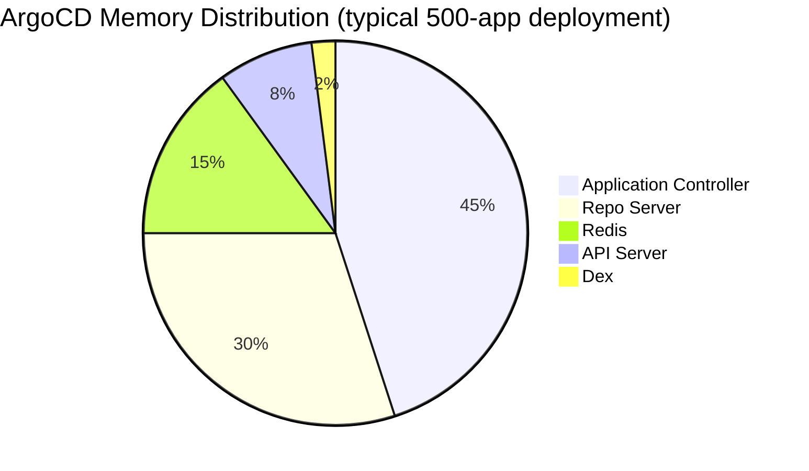

# How to Monitor and Reduce ArgoCD Memory Footprint

Author: [nawazdhandala](https://github.com/nawazdhandala)

Tags: ArgoCD, GitOps, Kubernetes, Performance Tuning, Monitoring

Description: Learn how to monitor ArgoCD memory usage across all components and implement practical strategies to reduce its memory footprint in production Kubernetes clusters.

---

ArgoCD can consume a surprising amount of memory, especially at scale. A single ArgoCD installation managing 500 applications can easily use 10GB or more across all its components. If left unmonitored, memory consumption grows silently until pods get OOMKilled and syncs start failing. This guide covers how to monitor memory usage across every ArgoCD component and practical strategies to reduce the footprint.

## Understanding ArgoCD Memory Consumers

Each ArgoCD component has different memory characteristics.



The application controller is almost always the largest consumer because it caches the live state of every managed resource. The repo server comes second because it clones repositories and generates manifests.

## Monitoring Memory with Prometheus

Set up Prometheus to scrape ArgoCD metrics and create dashboards for memory tracking.

```yaml
# ServiceMonitor for ArgoCD components
apiVersion: monitoring.coreos.com/v1
kind: ServiceMonitor
metadata:
  name: argocd-metrics
  namespace: argocd
spec:
  selector:
    matchLabels:
      app.kubernetes.io/part-of: argocd
  endpoints:
  - port: metrics
    interval: 30s
```

### Key Memory Metrics

```promql
# Container memory usage by component
container_memory_working_set_bytes{
  namespace="argocd",
  container=~"argocd-.*"
}

# Memory usage as percentage of limit
container_memory_working_set_bytes{namespace="argocd"} /
container_spec_memory_limit_bytes{namespace="argocd"} * 100

# Go runtime memory stats (heap, stack, etc.)
go_memstats_heap_alloc_bytes{namespace="argocd"}
go_memstats_heap_sys_bytes{namespace="argocd"}

# Garbage collection frequency
rate(go_gc_duration_seconds_count{namespace="argocd"}[5m])
```

### Memory Alert Rules

```yaml
# Prometheus alert rules
apiVersion: monitoring.coreos.com/v1
kind: PrometheusRule
metadata:
  name: argocd-memory-alerts
  namespace: argocd
spec:
  groups:
  - name: argocd-memory
    rules:
    # Alert when memory usage exceeds 80% of limit
    - alert: ArgoCDHighMemoryUsage
      expr: |
        container_memory_working_set_bytes{namespace="argocd"} /
        container_spec_memory_limit_bytes{namespace="argocd"} > 0.8
      for: 10m
      labels:
        severity: warning
      annotations:
        summary: "ArgoCD {{ $labels.container }} memory usage above 80%"

    # Alert on OOMKill
    - alert: ArgoCDOOMKilled
      expr: |
        kube_pod_container_status_last_terminated_reason{
          namespace="argocd",
          reason="OOMKilled"
        } > 0
      labels:
        severity: critical
      annotations:
        summary: "ArgoCD {{ $labels.container }} was OOMKilled"
```

## Reducing Controller Memory

The application controller is the biggest memory consumer. Here is how to reduce it.

### Enable Controller Sharding

Sharding distributes applications across multiple controller replicas. Each shard only holds state for its assigned applications.

```yaml
apiVersion: apps/v1
kind: StatefulSet
metadata:
  name: argocd-application-controller
  namespace: argocd
spec:
  replicas: 3
  template:
    spec:
      containers:
      - name: argocd-application-controller
        env:
        - name: ARGOCD_CONTROLLER_REPLICAS
          value: "3"
        resources:
          requests:
            memory: "2Gi"
          limits:
            memory: "4Gi"
```

With 3 shards managing 500 applications, each shard handles roughly 167 applications instead of all 500. Memory usage per shard drops proportionally.

### Reduce Managed Resources per Application

Each managed resource consumes memory in the controller's cache. Applications that generate many resources (like a Helm chart with 200+ resources) use disproportionate amounts of memory.

```yaml
# Check how many resources each app manages
# argocd app get my-app --show-resources | wc -l

# If an app manages too many resources, consider splitting it
# Before: One monolithic Helm release
apiVersion: argoproj.io/v1alpha1
kind: Application
metadata:
  name: platform-all  # 500 resources
spec:
  source:
    path: charts/platform

# After: Split into logical groups
# platform-networking: 50 resources
# platform-storage: 30 resources
# platform-monitoring: 80 resources
# etc.
```

### Disable Resource Caching for Non-Critical Apps

For applications that do not need real-time drift detection, you can disable the resource cache.

```yaml
# argocd-cm ConfigMap
apiVersion: v1
kind: ConfigMap
metadata:
  name: argocd-cm
  namespace: argocd
data:
  # Exclude certain resource types from caching
  resource.exclusions: |
    - apiGroups:
      - "events.k8s.io"
      kinds:
      - Event
      clusters:
      - "*"
    - apiGroups:
      - ""
      kinds:
      - Event
      clusters:
      - "*"
```

Excluding Events from tracking reduces memory significantly because Events are numerous and change frequently.

## Reducing Repo Server Memory

The repo server memory usage correlates with repository size and the number of concurrent manifest generation operations.

### Limit Concurrent Operations

```yaml
apiVersion: apps/v1
kind: Deployment
metadata:
  name: argocd-repo-server
  namespace: argocd
spec:
  template:
    spec:
      containers:
      - name: argocd-repo-server
        args:
        - /usr/local/bin/argocd-repo-server
        # Limit concurrent manifest generations
        - --parallelism-limit=5
        resources:
          requests:
            memory: "1Gi"
          limits:
            memory: "2Gi"
```

Setting a parallelism limit caps peak memory usage. Without a limit, all pending requests are processed simultaneously, which can cause memory spikes.

### Clean Up Clone Cache

The repo server caches cloned repositories. Over time, this cache can grow large.

```yaml
# Use emptyDir with a size limit to prevent unbounded growth
volumes:
- name: tmp
  emptyDir:
    sizeLimit: 5Gi  # Cap clone cache size
```

The repo server automatically evicts old clones when space is needed, but the sizeLimit ensures it cannot consume all available disk space.

### Use Smaller Base Images

If you run custom plugins, ensure your plugin containers are based on minimal images.

```dockerfile
# Bad: Full Ubuntu base with many unused packages
FROM ubuntu:22.04

# Good: Minimal Alpine base
FROM alpine:3.19
RUN apk add --no-cache git helm kubectl
```

Smaller images mean less memory overhead for the container runtime.

## Reducing Redis Memory

Redis memory grows with the number of cached manifests and the size of each manifest.

```yaml
# Configure Redis with appropriate memory limits
apiVersion: apps/v1
kind: Deployment
metadata:
  name: argocd-redis
  namespace: argocd
spec:
  template:
    spec:
      containers:
      - name: redis
        args:
        - redis-server
        # Set max memory
        - --maxmemory=1gb
        # Use LRU eviction to stay within limits
        - --maxmemory-policy=allkeys-lru
        # Compress large values
        - --rdbcompression=yes
        resources:
          requests:
            memory: "1Gi"
          limits:
            memory: "1.5Gi"
```

The `allkeys-lru` eviction policy ensures Redis stays within memory limits by evicting the least recently used keys.

## Reducing API Server Memory

The API server memory is primarily driven by concurrent WebSocket connections from UI users.

```yaml
apiVersion: apps/v1
kind: Deployment
metadata:
  name: argocd-server
  namespace: argocd
spec:
  template:
    spec:
      containers:
      - name: argocd-server
        resources:
          requests:
            memory: "512Mi"
          limits:
            memory: "1Gi"
```

If memory is a concern, consider using ArgoCD CLI instead of the UI for automation tasks. Each CLI command opens a short-lived connection rather than a persistent WebSocket.

## Memory Sizing Guide

Use this table as a starting point for resource requests.

| Component | Per 100 Apps | Minimum | Notes |
|-----------|-------------|---------|-------|
| Controller | 800Mi | 512Mi | Scales with resource count |
| Repo Server | 500Mi | 256Mi | Scales with repo size |
| Redis | 200Mi | 128Mi | Scales with manifest size |
| API Server | 256Mi | 128Mi | Scales with concurrent users |
| Dex | 64Mi | 64Mi | Mostly static |

For 500 applications: Controller ~4Gi, Repo Server ~2.5Gi, Redis ~1Gi, API Server ~512Mi.

## Continuous Monitoring Dashboard

Create a Grafana dashboard that shows memory trends over time.

```promql
# Memory growth rate (should be near zero in steady state)
deriv(container_memory_working_set_bytes{namespace="argocd"}[1h])

# Memory usage per application (approximate)
container_memory_working_set_bytes{
  container="argocd-application-controller"
} / argocd_app_info

# GC pressure (high GC frequency indicates memory pressure)
rate(go_gc_duration_seconds_count{namespace="argocd"}[5m])
```

If memory grows linearly over time without plateauing, you likely have a memory leak. Check ArgoCD release notes for known issues and consider upgrading.

## Summary

Monitor ArgoCD memory with Prometheus alerts before problems occur. The biggest memory reductions come from controller sharding (splits memory across replicas), excluding unnecessary resource types like Events, splitting large applications into smaller ones, and setting appropriate Redis eviction policies. Set memory limits on all components and configure alerts at 80% utilization to catch issues before OOMKills disrupt deployments.
