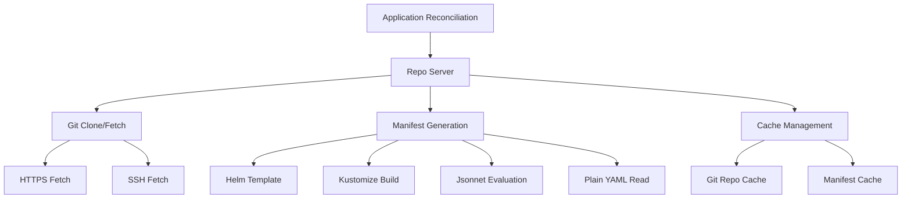

# How to Monitor ArgoCD Repo Server Performance

Author: [nawazdhandala](https://github.com/nawazdhandala)

Tags: ArgoCD, GitOps, Kubernetes, Prometheus, Performance

Description: Learn how to monitor ArgoCD repo server performance using Prometheus metrics, including tracking Git operations, manifest generation, cache efficiency, and resource utilization.

---

The ArgoCD repo server is responsible for two critical operations: fetching manifests from Git repositories and generating Kubernetes manifests from Helm charts, Kustomize overlays, and other templating tools. When the repo server is slow, every application in your ArgoCD installation feels the impact. Syncs are delayed, reconciliation takes longer, and your team waits for deployments that should be instant.

Monitoring repo server performance helps you identify bottlenecks before they cascade into deployment delays.

## Repo Server Responsibilities

The repo server handles several types of work:



Each of these operations has associated metrics that tell you where time is being spent.

## Key Performance Metrics

### Git Operation Metrics

```promql
# Git request count by type and status
rate(argocd_git_request_total[5m]) by (request_type, grpc_code)

# Git request duration - 95th percentile
histogram_quantile(0.95,
  rate(argocd_git_request_duration_seconds_bucket[5m])
)

# Git request duration by request type
histogram_quantile(0.95,
  rate(argocd_git_request_duration_seconds_bucket[5m])
) by (request_type)

# Failed Git requests
rate(argocd_git_request_total{grpc_code!="OK"}[5m])
```

### Manifest Generation Metrics

```promql
# Repo server request duration for manifest generation
histogram_quantile(0.95,
  rate(argocd_repo_server_request_duration_seconds_bucket[5m])
)

# Request duration by source type (Helm, Kustomize, etc.)
histogram_quantile(0.95,
  rate(argocd_repo_server_request_duration_seconds_bucket[5m])
) by (request_type)

# Total repo server requests
rate(argocd_repo_server_request_total[5m])
```

### Resource Utilization Metrics

```promql
# CPU usage
rate(container_cpu_usage_seconds_total{
  namespace="argocd",
  container="argocd-repo-server"
}[5m])

# Memory usage
container_memory_working_set_bytes{
  namespace="argocd",
  container="argocd-repo-server"
}

# Disk usage (if using PVC)
kubelet_volume_stats_used_bytes{
  namespace="argocd",
  persistentvolumeclaim=~"argocd-repo.*"
}
```

## Building a Repo Server Dashboard

Create a Grafana dashboard with these panels:

**Row 1: Overview Stats**

Git request rate stat:
```promql
sum(rate(argocd_git_request_total[5m]))
```

Git error rate gauge:
```promql
sum(rate(argocd_git_request_total{grpc_code!="OK"}[5m]))
/ sum(rate(argocd_git_request_total[5m])) * 100
```

P95 Git duration stat:
```promql
histogram_quantile(0.95, rate(argocd_git_request_duration_seconds_bucket[5m]))
```

**Row 2: Git Operations**

Time series - Git request duration percentiles:
```promql
histogram_quantile(0.50, rate(argocd_git_request_duration_seconds_bucket[5m]))
histogram_quantile(0.95, rate(argocd_git_request_duration_seconds_bucket[5m]))
histogram_quantile(0.99, rate(argocd_git_request_duration_seconds_bucket[5m]))
```

Time series - Git request rate by status:
```promql
sum(rate(argocd_git_request_total[5m])) by (grpc_code)
```

**Row 3: Manifest Generation**

Time series - Manifest generation duration:
```promql
histogram_quantile(0.95,
  rate(argocd_repo_server_request_duration_seconds_bucket[5m])
) by (request_type)
```

**Row 4: Resource Usage**

Time series - CPU and memory:
```promql
rate(container_cpu_usage_seconds_total{namespace="argocd", container="argocd-repo-server"}[5m])
container_memory_working_set_bytes{namespace="argocd", container="argocd-repo-server"}
```

## Setting Up Alerts

Configure alerts for repo server performance issues:

```yaml
groups:
- name: argocd-repo-server
  rules:
  # Git operations are slow
  - alert: ArgocdRepoServerGitSlow
    expr: |
      histogram_quantile(0.95,
        rate(argocd_git_request_duration_seconds_bucket[10m])
      ) > 30
    for: 15m
    labels:
      severity: warning
    annotations:
      summary: "ArgoCD repo server Git operations are slow"
      description: "95th percentile Git request duration is {{ $value }}s. Normal is under 10s."

  # Git operations are failing
  - alert: ArgocdRepoServerGitErrors
    expr: |
      rate(argocd_git_request_total{grpc_code!="OK"}[5m])
      / rate(argocd_git_request_total[5m]) > 0.1
    for: 10m
    labels:
      severity: warning
    annotations:
      summary: "ArgoCD repo server Git error rate is elevated"
      description: "More than 10% of Git requests are failing."

  # Manifest generation is slow
  - alert: ArgocdRepoServerManifestGenSlow
    expr: |
      histogram_quantile(0.95,
        rate(argocd_repo_server_request_duration_seconds_bucket[10m])
      ) > 60
    for: 10m
    labels:
      severity: warning
    annotations:
      summary: "ArgoCD manifest generation is slow"
      description: "95th percentile manifest generation is {{ $value }}s."

  # Memory is approaching limits
  - alert: ArgocdRepoServerHighMemory
    expr: |
      container_memory_working_set_bytes{
        namespace="argocd",
        container="argocd-repo-server"
      }
      / on(pod) kube_pod_container_resource_limits{
        namespace="argocd",
        container="argocd-repo-server",
        resource="memory"
      } > 0.85
    for: 10m
    labels:
      severity: warning
    annotations:
      summary: "ArgoCD repo server memory usage is high"
      description: "Repo server is using more than 85% of its memory limit."
```

## Identifying Performance Bottlenecks

When repo server metrics show degraded performance, follow this investigation flow:

**Step 1: Is it Git or manifest generation?**

```promql
# Compare Git duration vs manifest generation duration
histogram_quantile(0.95, rate(argocd_git_request_duration_seconds_bucket[5m]))
histogram_quantile(0.95, rate(argocd_repo_server_request_duration_seconds_bucket[5m]))
```

If Git duration is high, the problem is network or Git server related. If manifest generation is high, the problem is Helm/Kustomize processing.

**Step 2: Which repositories are slow?**

Check repo server logs for slow operations:

```bash
kubectl logs -n argocd deployment/argocd-repo-server --tail=500 | \
  grep -E "duration|timeout|slow"
```

**Step 3: Is the server resource-constrained?**

```bash
# Check current resource usage
kubectl top pod -n argocd -l app.kubernetes.io/name=argocd-repo-server

# Check for OOM kills
kubectl get events -n argocd --field-selector reason=OOMKilled | grep repo-server
```

## Tuning Repo Server Performance

Based on metrics analysis, tune the repo server:

**Increase parallelism:**

```yaml
apiVersion: v1
kind: ConfigMap
metadata:
  name: argocd-cmd-params-cm
  namespace: argocd
data:
  reposerver.parallelism.limit: "20"
```

**Increase cache expiration:**

```yaml
data:
  reposerver.default.cache.expiration: "24h"
```

**Scale horizontally:**

```yaml
apiVersion: apps/v1
kind: Deployment
metadata:
  name: argocd-repo-server
  namespace: argocd
spec:
  replicas: 3
  template:
    spec:
      containers:
      - name: argocd-repo-server
        resources:
          requests:
            cpu: 500m
            memory: 512Mi
          limits:
            cpu: 2000m
            memory: 2Gi
```

**Use persistent storage for repo cache:**

```yaml
volumes:
  - name: tmp
    persistentVolumeClaim:
      claimName: argocd-repo-server-cache
```

## Recording Rules for Performance Tracking

Pre-compute repo server performance metrics:

```yaml
groups:
- name: argocd.reposerver.recording
  rules:
  - record: argocd:git_request_latency_p95:5m
    expr: |
      histogram_quantile(0.95,
        rate(argocd_git_request_duration_seconds_bucket[5m])
      )

  - record: argocd:manifest_gen_latency_p95:5m
    expr: |
      histogram_quantile(0.95,
        rate(argocd_repo_server_request_duration_seconds_bucket[5m])
      )

  - record: argocd:git_error_rate:5m
    expr: |
      rate(argocd_git_request_total{grpc_code!="OK"}[5m])
      / rate(argocd_git_request_total[5m])
```

The repo server is often the first component to show performance degradation as your ArgoCD installation grows. Proactive monitoring of Git operations and manifest generation gives you the visibility to scale before users notice delays.
