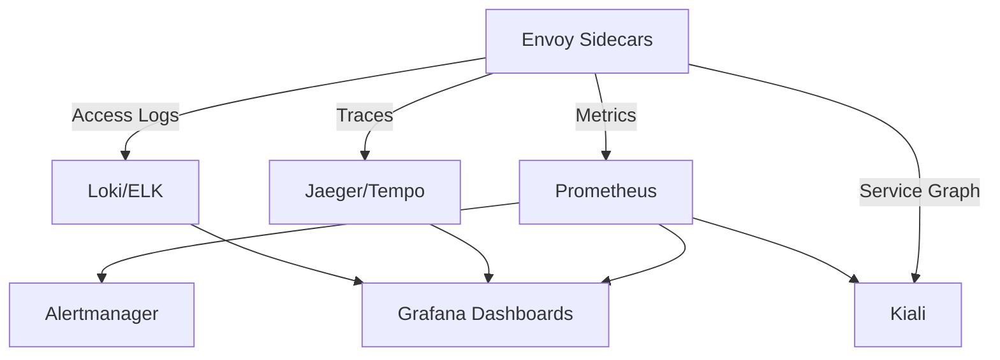

# How to Monitor Service Mesh with ArgoCD

Author: [nawazdhandala](https://github.com/nawazdhandala)

Tags: ArgoCD, GitOps, Kubernetes, Service Mesh, Monitoring

Description: Learn how to deploy and manage a complete service mesh monitoring stack using ArgoCD including Prometheus, Grafana dashboards, and Kiali for mesh observability.

---

A service mesh generates a wealth of observability data - request rates, latencies, error rates, connection metrics, and more. But deploying and maintaining the monitoring stack that captures this data is a project in itself. ArgoCD turns your monitoring configuration into versioned, declarative code that stays in sync with your mesh.

This guide covers deploying a complete Istio monitoring stack through ArgoCD.

## The Monitoring Stack Components

A typical Istio monitoring setup includes several components:



## Application of Applications Pattern

Manage the entire monitoring stack with an ApplicationSet or an App of Apps:

```yaml
# monitoring-appset.yaml
apiVersion: argoproj.io/v1alpha1
kind: ApplicationSet
metadata:
  name: mesh-monitoring
  namespace: argocd
spec:
  generators:
    - list:
        elements:
          - name: prometheus
            chart: kube-prometheus-stack
            repo: https://prometheus-community.github.io/helm-charts
            version: "55.5.0"
            namespace: monitoring
          - name: kiali
            chart: kiali-server
            repo: https://kiali.org/helm-charts
            version: "1.80.0"
            namespace: istio-system
          - name: jaeger
            chart: jaeger
            repo: https://jaegertracing.github.io/helm-charts
            version: "3.0.0"
            namespace: observability
  template:
    metadata:
      name: "mesh-mon-{{name}}"
      namespace: argocd
    spec:
      project: monitoring
      source:
        repoURL: "{{repo}}"
        chart: "{{chart}}"
        targetRevision: "{{version}}"
        helm:
          valueFiles:
            - values.yaml
      destination:
        server: https://kubernetes.default.svc
        namespace: "{{namespace}}"
      syncPolicy:
        automated:
          selfHeal: true
        syncOptions:
          - CreateNamespace=true
          - ServerSideApply=true
```

## Prometheus Configuration for Istio

Deploy Prometheus with Istio-specific scrape configurations. Store your custom values in Git:

```yaml
# monitoring/prometheus/values.yaml
prometheus:
  prometheusSpec:
    # Scrape Istio control plane
    additionalScrapeConfigs:
      - job_name: 'istiod'
        kubernetes_sd_configs:
          - role: endpoints
            namespaces:
              names:
                - istio-system
        relabel_configs:
          - source_labels: [__meta_kubernetes_service_name]
            action: keep
            regex: istiod
          - source_labels: [__meta_kubernetes_endpoint_port_name]
            action: keep
            regex: http-monitoring

      - job_name: 'envoy-stats'
        metrics_path: /stats/prometheus
        kubernetes_sd_configs:
          - role: pod
        relabel_configs:
          - source_labels: [__meta_kubernetes_pod_container_name]
            action: keep
            regex: istio-proxy
          - source_labels: [__meta_kubernetes_pod_annotation_prometheus_io_port]
            action: replace
            target_label: __address__
            regex: (.+)
            replacement: $1:15090

    # Retention and storage
    retention: 30d
    storageSpec:
      volumeClaimTemplate:
        spec:
          storageClassName: gp3
          accessModes: ["ReadWriteOnce"]
          resources:
            requests:
              storage: 100Gi

  # Service monitors for mesh components
  additionalServiceMonitors:
    - name: istio-component-monitor
      selector:
        matchExpressions:
          - key: istio
            operator: In
            values: ["pilot", "mixer", "galley", "citadel"]
      namespaceSelector:
        matchNames:
          - istio-system
      endpoints:
        - port: http-monitoring
          interval: 15s
```

## Grafana Dashboards as Code

Store your Grafana dashboards in Git as ConfigMaps. ArgoCD keeps them in sync:

```yaml
# monitoring/grafana/istio-mesh-dashboard-cm.yaml
apiVersion: v1
kind: ConfigMap
metadata:
  name: istio-mesh-dashboard
  namespace: monitoring
  labels:
    grafana_dashboard: "1"
data:
  istio-mesh-dashboard.json: |
    {
      "dashboard": {
        "title": "Istio Mesh Dashboard",
        "panels": [
          {
            "title": "Request Rate",
            "type": "timeseries",
            "targets": [
              {
                "expr": "sum(rate(istio_requests_total[5m])) by (destination_service_name)",
                "legendFormat": "{{destination_service_name}}"
              }
            ]
          },
          {
            "title": "P99 Latency",
            "type": "timeseries",
            "targets": [
              {
                "expr": "histogram_quantile(0.99, sum(rate(istio_request_duration_milliseconds_bucket[5m])) by (le, destination_service_name))",
                "legendFormat": "{{destination_service_name}}"
              }
            ]
          },
          {
            "title": "Error Rate",
            "type": "stat",
            "targets": [
              {
                "expr": "sum(rate(istio_requests_total{response_code=~\"5.*\"}[5m])) / sum(rate(istio_requests_total[5m])) * 100",
                "legendFormat": "5xx Error Rate %"
              }
            ]
          }
        ]
      }
    }
```

Create a dedicated ArgoCD Application for dashboards:

```yaml
# grafana-dashboards-app.yaml
apiVersion: argoproj.io/v1alpha1
kind: Application
metadata:
  name: grafana-dashboards
  namespace: argocd
spec:
  project: monitoring
  source:
    repoURL: https://github.com/myorg/k8s-monitoring.git
    path: monitoring/grafana
    targetRevision: main
  destination:
    server: https://kubernetes.default.svc
    namespace: monitoring
  syncPolicy:
    automated:
      selfHeal: true
      prune: true
```

## Kiali for Mesh Visualization

Kiali provides real-time visualization of your service mesh traffic. Deploy it with ArgoCD:

```yaml
# monitoring/kiali/values.yaml
auth:
  strategy: token

deployment:
  accessible_namespaces:
    - "**"
  ingress:
    enabled: true
    override_yaml:
      spec:
        rules:
          - host: kiali.internal.example.com
            http:
              paths:
                - path: /
                  pathType: Prefix
                  backend:
                    service:
                      name: kiali
                      port:
                        number: 20001

external_services:
  prometheus:
    url: http://prometheus-kube-prometheus-prometheus.monitoring:9090
  grafana:
    url: http://prometheus-grafana.monitoring:80
    in_cluster_url: http://prometheus-grafana.monitoring:80
  tracing:
    url: http://jaeger-query.observability:16686
    in_cluster_url: http://jaeger-query.observability:16686
```

## Alert Rules for Mesh Health

Define PrometheusRules in Git, managed by ArgoCD:

```yaml
# monitoring/alerts/mesh-alerts.yaml
apiVersion: monitoring.coreos.com/v1
kind: PrometheusRule
metadata:
  name: istio-mesh-alerts
  namespace: monitoring
spec:
  groups:
    - name: istio-mesh
      rules:
        - alert: HighErrorRate
          expr: |
            sum(rate(istio_requests_total{response_code=~"5.*"}[5m])) by (destination_service_name, namespace)
            /
            sum(rate(istio_requests_total[5m])) by (destination_service_name, namespace)
            > 0.05
          for: 5m
          labels:
            severity: critical
          annotations:
            summary: "High 5xx error rate for {{ $labels.destination_service_name }}"
            description: "Service {{ $labels.destination_service_name }} in {{ $labels.namespace }} has error rate above 5%"

        - alert: HighP99Latency
          expr: |
            histogram_quantile(0.99,
              sum(rate(istio_request_duration_milliseconds_bucket[5m]))
              by (le, destination_service_name, namespace)
            ) > 5000
          for: 10m
          labels:
            severity: warning
          annotations:
            summary: "High P99 latency for {{ $labels.destination_service_name }}"
            description: "P99 latency above 5 seconds for {{ $labels.destination_service_name }}"

        - alert: IstiodUnhealthy
          expr: |
            up{job="istiod"} == 0
          for: 2m
          labels:
            severity: critical
          annotations:
            summary: "Istiod is down"
            description: "The Istio control plane is not responding"

        - alert: ProxyPushErrors
          expr: |
            sum(rate(pilot_xds_push_errors[5m])) > 0
          for: 5m
          labels:
            severity: warning
          annotations:
            summary: "Istio proxy configuration push errors"
            description: "Istiod is failing to push configuration to proxies"

        - alert: MeshMTLSErrors
          expr: |
            sum(rate(envoy_ssl_connection_error_total[5m])) by (namespace) > 0.1
          for: 5m
          labels:
            severity: warning
          annotations:
            summary: "mTLS connection errors in {{ $labels.namespace }}"
```

## Custom Health Checks for Monitoring Components

Tell ArgoCD how to assess the health of monitoring-specific resources:

```yaml
# In argocd-cm ConfigMap
resource.customizations.health.monitoring.coreos.com_Prometheus: |
  hs = {}
  if obj.status ~= nil then
    if obj.status.conditions ~= nil then
      for _, condition in ipairs(obj.status.conditions) do
        if condition.type == "Available" and condition.status == "True" then
          hs.status = "Healthy"
          hs.message = "Prometheus is available"
          return hs
        end
      end
    end
  end
  hs.status = "Progressing"
  hs.message = "Prometheus is starting up"
  return hs
```

## Recording Rules for Performance

Pre-compute expensive queries with recording rules. This keeps dashboards fast:

```yaml
# monitoring/alerts/recording-rules.yaml
apiVersion: monitoring.coreos.com/v1
kind: PrometheusRule
metadata:
  name: istio-recording-rules
  namespace: monitoring
spec:
  groups:
    - name: istio-recording
      interval: 30s
      rules:
        - record: istio:request_rate:5m
          expr: sum(rate(istio_requests_total[5m])) by (destination_service_name, namespace)

        - record: istio:error_rate:5m
          expr: |
            sum(rate(istio_requests_total{response_code=~"5.*"}[5m])) by (destination_service_name, namespace)
            /
            sum(rate(istio_requests_total[5m])) by (destination_service_name, namespace)

        - record: istio:p99_latency:5m
          expr: |
            histogram_quantile(0.99,
              sum(rate(istio_request_duration_milliseconds_bucket[5m]))
              by (le, destination_service_name, namespace)
            )
```

## Integrating with OneUptime

For external monitoring of your mesh endpoints, integrate with [OneUptime](https://oneuptime.com) to monitor uptime from outside your cluster. This catches issues that internal monitoring might miss, like DNS failures or load balancer problems.

## Summary

Monitoring a service mesh with ArgoCD means your entire observability stack - Prometheus configuration, Grafana dashboards, alert rules, and visualization tools - lives in Git. Changes are reviewed through pull requests, automatically applied by ArgoCD, and self-healed if anyone modifies them manually. This gives you reliable, consistent mesh monitoring across all your environments.
