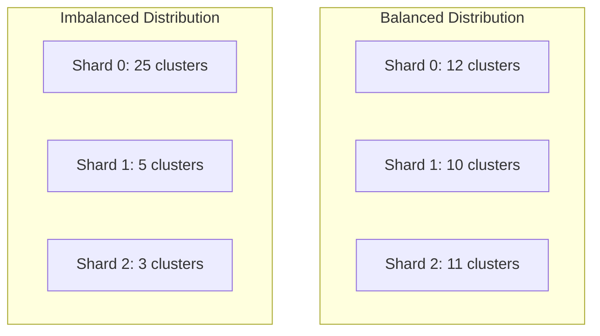

# How to Monitor Shard Assignment in ArgoCD

Author: [nawazdhandala](https://github.com/nawazdhandala)

Tags: ArgoCD, GitOps, Kubernetes, Monitoring, Sharding

Description: Learn how to monitor and troubleshoot ArgoCD controller shard assignments to ensure clusters are properly distributed and all shards are healthy.

---

When you run ArgoCD with multiple application controller shards, monitoring the shard assignments becomes critical. You need to know which shard manages which cluster, whether the distribution is balanced, and whether any shard is overloaded or unresponsive. This guide covers the tools and techniques for monitoring shard health in production.

## Checking Current Shard Assignments

The primary way to see shard assignments is through cluster secrets. ArgoCD stores cluster connection details as Kubernetes secrets, and each secret has a shard annotation when sharding is enabled.

```bash
# List all clusters and their shard assignments
kubectl get secrets -n argocd \
  -l argocd.argoproj.io/secret-type=cluster \
  -o custom-columns=\
'CLUSTER:.metadata.name,SHARD:.metadata.annotations.argocd\.argoproj\.io/shard'
```

Example output:

```
CLUSTER                    SHARD
cluster-prod-us            0
cluster-prod-eu            1
cluster-staging            2
cluster-dev                0
cluster-prod-apac          1
```

For a more detailed view including the server URL:

```bash
# Detailed cluster info with shard assignments
kubectl get secrets -n argocd \
  -l argocd.argoproj.io/secret-type=cluster \
  -o json | jq -r '
  .items[] |
  "\(.metadata.annotations["argocd.argoproj.io/shard"] // "unassigned") | \(.metadata.name) | \(.data.server | @base64d)"
' | sort | column -t -s '|'
```

## Monitoring Shard Distribution Balance

An uneven distribution means some shards do more work than others. To check balance:

```bash
# Count clusters per shard
kubectl get secrets -n argocd \
  -l argocd.argoproj.io/secret-type=cluster \
  -o json | jq '
  [.items[].metadata.annotations["argocd.argoproj.io/shard"] // "unassigned"] |
  group_by(.) |
  map({shard: .[0], count: length}) |
  sort_by(.shard)
'
```

This outputs something like:

```json
[
  { "shard": "0", "count": 12 },
  { "shard": "1", "count": 10 },
  { "shard": "2", "count": 11 }
]
```

A good distribution has roughly equal counts across shards. If one shard has significantly more clusters, it may become a bottleneck.



## Controller Pod Health

Each shard runs as a separate pod in the StatefulSet. Start by checking pod status:

```bash
# Check all controller pods
kubectl get pods -n argocd \
  -l app.kubernetes.io/name=argocd-application-controller \
  -o wide

# Check pod resource usage
kubectl top pods -n argocd \
  -l app.kubernetes.io/name=argocd-application-controller
```

Healthy output looks like:

```
NAME                                  READY   STATUS    CPU    MEMORY
argocd-application-controller-0       1/1     Running   250m   1.2Gi
argocd-application-controller-1       1/1     Running   180m   980Mi
argocd-application-controller-2       1/1     Running   210m   1.1Gi
```

If one pod shows significantly higher CPU or memory than others, its shard may be handling heavier clusters.

## Prometheus Metrics for Shard Monitoring

ArgoCD exposes detailed metrics that you can scrape with Prometheus. Here are the most important ones for shard monitoring.

### Application Reconciliation Metrics

```promql
# Reconciliation rate per controller pod (shard)
sum(rate(argocd_app_reconcile_count[5m])) by (pod)

# Reconciliation duration - p95 per shard
histogram_quantile(0.95,
  sum(rate(argocd_app_reconcile_bucket[5m])) by (le, pod)
)

# Failed reconciliations per shard
sum(rate(argocd_app_reconcile_count{result="error"}[5m])) by (pod)
```

### Workqueue Metrics

```promql
# Queue depth per shard - should stay close to 0
workqueue_depth{
  job="argocd-application-controller-metrics",
  name="app_reconciliation_queue"
}

# Queue add rate - how fast work is coming in
rate(workqueue_adds_total{
  name="app_reconciliation_queue"
}[5m])

# Queue processing latency
workqueue_queue_duration_seconds{
  name="app_reconciliation_queue"
}
```

### Cluster Metrics

```promql
# Number of clusters per shard
count(argocd_cluster_info) by (shard)

# Cluster connection status
argocd_cluster_info{connection_status!="Successful"}

# API server request rate per cluster
sum(rate(argocd_cluster_api_request_total[5m])) by (server)
```

## Building a Grafana Dashboard

Create a Grafana dashboard that gives you a complete view of shard health. Here is a JSON snippet for the key panels:

```json
{
  "panels": [
    {
      "title": "Clusters per Shard",
      "type": "stat",
      "targets": [{
        "expr": "count(argocd_cluster_info) by (shard)"
      }]
    },
    {
      "title": "Reconciliation Latency by Shard",
      "type": "timeseries",
      "targets": [{
        "expr": "histogram_quantile(0.95, sum(rate(argocd_app_reconcile_bucket[5m])) by (le, pod))"
      }]
    },
    {
      "title": "Memory Usage by Shard",
      "type": "timeseries",
      "targets": [{
        "expr": "container_memory_working_set_bytes{container=\"argocd-application-controller\"}"
      }]
    },
    {
      "title": "Queue Depth by Shard",
      "type": "timeseries",
      "targets": [{
        "expr": "workqueue_depth{name=\"app_reconciliation_queue\"}"
      }]
    }
  ]
}
```

## Setting Up Alerts

Configure alerts to catch shard problems before they affect your deployments:

```yaml
# PrometheusRule for ArgoCD shard monitoring
apiVersion: monitoring.coreos.com/v1
kind: PrometheusRule
metadata:
  name: argocd-shard-alerts
  namespace: argocd
spec:
  groups:
    - name: argocd-shards
      rules:
        # Alert when a shard's queue depth is consistently high
        - alert: ArgocdShardQueueDepthHigh
          expr: workqueue_depth{name="app_reconciliation_queue"} > 10
          for: 5m
          labels:
            severity: warning
          annotations:
            summary: "ArgoCD shard {{ $labels.pod }} has high queue depth"

        # Alert when reconciliation is slow
        - alert: ArgocdShardReconcileSlow
          expr: |
            histogram_quantile(0.95,
              sum(rate(argocd_app_reconcile_bucket[5m])) by (le, pod)
            ) > 30
          for: 10m
          labels:
            severity: warning
          annotations:
            summary: "ArgoCD shard {{ $labels.pod }} p95 reconcile time above 30s"

        # Alert when a shard pod is down
        - alert: ArgocdShardDown
          expr: |
            kube_statefulset_status_replicas_ready{
              statefulset="argocd-application-controller"
            } < kube_statefulset_replicas{
              statefulset="argocd-application-controller"
            }
          for: 2m
          labels:
            severity: critical
          annotations:
            summary: "ArgoCD controller shard is down"
```

## Checking Controller Logs

Controller logs provide real-time visibility into shard behavior:

```bash
# Check which clusters a specific shard is processing
kubectl logs argocd-application-controller-0 -n argocd \
  --tail=200 | grep "Processing cluster"

# Check for errors on a specific shard
kubectl logs argocd-application-controller-1 -n argocd \
  --tail=500 | grep -i "error\|warn\|fail"

# Watch reconciliation activity in real time
kubectl logs -f argocd-application-controller-2 -n argocd \
  | grep "Reconciliation"
```

## Troubleshooting Common Issues

### Cluster Showing as Unknown

If a cluster shows Unknown health status, check whether its assigned shard is running:

```bash
# Find the cluster's shard
kubectl get secret cluster-prod-us -n argocd \
  -o jsonpath='{.metadata.annotations.argocd\.argoproj\.io/shard}'

# Check if that shard pod is running
kubectl get pod argocd-application-controller-<shard-id> -n argocd
```

### Shard Not Processing Any Clusters

If a shard pod is running but not processing clusters, verify the `ARGOCD_CONTROLLER_REPLICAS` value matches the StatefulSet replica count:

```bash
# Check the env var inside the pod
kubectl exec argocd-application-controller-0 -n argocd -- \
  env | grep ARGOCD_CONTROLLER_REPLICAS

# Compare with StatefulSet replicas
kubectl get statefulset argocd-application-controller -n argocd \
  -o jsonpath='{.spec.replicas}'
```

### Uneven Memory Usage Across Shards

Large variance in memory usage typically means some shards manage clusters with more resources. You can either redistribute clusters or increase memory limits for the heavier shards:

```bash
# Check per-pod memory usage
kubectl top pods -n argocd \
  -l app.kubernetes.io/name=argocd-application-controller \
  --sort-by=memory
```

Monitoring shard assignments is not a one-time setup. As you add clusters, deploy more applications, and scale your infrastructure, the shard distribution and resource requirements will change. Build monitoring into your ArgoCD operations from day one, and you will catch problems before they impact your deployment pipelines.
