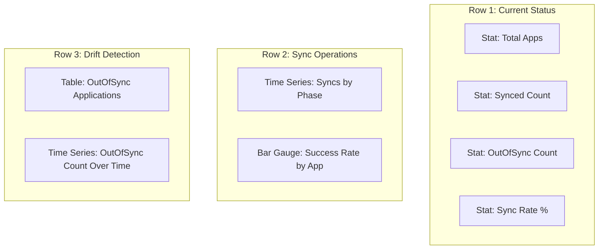

# How to Monitor ArgoCD Application Sync Status with Metrics

Author: [nawazdhandala](https://github.com/nawazdhandala)

Tags: ArgoCD, GitOps, Kubernetes, Prometheus, Monitoring

Description: Learn how to monitor ArgoCD application sync status using Prometheus metrics, including tracking sync operations, detecting OutOfSync drift, and measuring deployment success rates.

---

Sync status is the single most important metric in an ArgoCD deployment. It tells you whether your applications match what is declared in Git. When applications drift OutOfSync or sync operations fail, you need to know immediately. Prometheus metrics give you the data to track sync status in real time, build dashboards, and create alerts that notify your team before drift becomes a production issue.

This guide covers the key metrics for monitoring sync status and how to use them effectively.

## Key Sync Status Metrics

ArgoCD exposes several metrics related to sync operations:

**argocd_app_info** - A gauge metric with labels for every application:

```promql
argocd_app_info{
  name="my-app",
  namespace="argocd",
  dest_namespace="production",
  dest_server="https://kubernetes.default.svc",
  health_status="Healthy",
  sync_status="Synced",
  project="default"
}
```

This metric always has a value of 1 and carries the current sync_status and health_status as labels.

**argocd_app_sync_total** - A counter for sync operations:

```promql
argocd_app_sync_total{
  name="my-app",
  namespace="argocd",
  dest_server="https://kubernetes.default.svc",
  phase="Succeeded",
  project="default"
}
```

The `phase` label can be: Succeeded, Failed, Error, or Running.

## Tracking Current Sync Status

To see which applications are currently Synced vs OutOfSync:

```promql
# All OutOfSync applications
argocd_app_info{sync_status="OutOfSync"}

# Count of OutOfSync applications
count(argocd_app_info{sync_status="OutOfSync"})

# Count of Synced applications
count(argocd_app_info{sync_status="Synced"})

# Sync status breakdown
count(argocd_app_info) by (sync_status)
```

For a percentage view:

```promql
# Percentage of applications in sync
count(argocd_app_info{sync_status="Synced"})
/ count(argocd_app_info)
* 100
```

## Tracking Sync Operations Over Time

The `argocd_app_sync_total` counter lets you track how many syncs happen and their outcomes:

```promql
# Sync operations per minute (succeeded)
sum(rate(argocd_app_sync_total{phase="Succeeded"}[5m])) * 60

# Sync operations per minute (failed)
sum(rate(argocd_app_sync_total{phase="Failed"}[5m])) * 60

# Total syncs by phase over time
sum(rate(argocd_app_sync_total[5m])) by (phase) * 60
```

## Calculating Sync Success Rate

The sync success rate is a key SLI (Service Level Indicator) for your GitOps pipeline:

```promql
# Sync success rate over the last hour
sum(rate(argocd_app_sync_total{phase="Succeeded"}[1h]))
/ sum(rate(argocd_app_sync_total[1h]))
* 100
```

For per-application success rates:

```promql
# Success rate per application over 24 hours
sum(rate(argocd_app_sync_total{phase="Succeeded"}[24h])) by (name)
/ sum(rate(argocd_app_sync_total[24h])) by (name)
* 100
```

## Detecting Sync Drift

Drift detection is about identifying applications that have been OutOfSync for longer than expected. ArgoCD does not have a built-in "time since last sync" metric, but you can detect prolonged OutOfSync states:

```promql
# Applications that have been OutOfSync for more than 5 minutes
# This works because the metric continuously reports the current state
argocd_app_info{sync_status="OutOfSync"}
```

For alerting on prolonged drift, use Prometheus alerting rules with a `for` duration:

```yaml
groups:
- name: argocd-sync-drift
  rules:
  - alert: ArgocdApplicationOutOfSync
    expr: argocd_app_info{sync_status="OutOfSync"} == 1
    for: 15m
    labels:
      severity: warning
    annotations:
      summary: "Application {{ $labels.name }} is OutOfSync"
      description: "Application {{ $labels.name }} has been OutOfSync for more than 15 minutes."
```

The `for: 15m` clause ensures the alert only fires if the application stays OutOfSync continuously for 15 minutes. Transient OutOfSync states during normal deployments will not trigger it.

## Monitoring Auto-Sync vs Manual Sync

If some applications use automated sync and others use manual sync, track them separately:

```promql
# Applications with automated sync enabled
argocd_app_info{autosync_enabled="true"}

# Applications without automated sync
argocd_app_info{autosync_enabled="false"}
```

Applications with automated sync should rarely be OutOfSync for extended periods. Applications with manual sync might be OutOfSync intentionally. Create different alert thresholds:

```yaml
# Alert for auto-sync apps that are stuck OutOfSync
- alert: ArgocdAutoSyncStuck
  expr: |
    argocd_app_info{sync_status="OutOfSync", autosync_enabled="true"} == 1
  for: 10m
  labels:
    severity: critical
  annotations:
    summary: "Auto-sync application {{ $labels.name }} is stuck OutOfSync"

# Warning for manual sync apps that are OutOfSync for a long time
- alert: ArgocdManualSyncPending
  expr: |
    argocd_app_info{sync_status="OutOfSync", autosync_enabled="false"} == 1
  for: 2h
  labels:
    severity: warning
  annotations:
    summary: "Manual sync application {{ $labels.name }} needs attention"
```

## Tracking Deployment Frequency

Sync operations correspond to deployments. Tracking their frequency gives you deployment velocity metrics:

```promql
# Deployments (successful syncs) per hour
sum(increase(argocd_app_sync_total{phase="Succeeded"}[1h]))

# Deployments per day
sum(increase(argocd_app_sync_total{phase="Succeeded"}[24h]))

# Deployments per application per day
sum(increase(argocd_app_sync_total{phase="Succeeded"}[24h])) by (name)
```

This data aligns with DORA metrics for deployment frequency, one of the four key metrics for measuring software delivery performance.

## Building a Sync Status Dashboard

Here is a Grafana dashboard layout focused on sync status:



**Row 1 panels:**

Stat panel for total apps: `count(argocd_app_info)`
Stat panel for synced: `count(argocd_app_info{sync_status="Synced"})`
Stat panel for OutOfSync: `count(argocd_app_info{sync_status="OutOfSync"})`
Gauge panel for sync rate: `count(argocd_app_info{sync_status="Synced"}) / count(argocd_app_info) * 100`

**Row 2 panels:**

Time series showing sync operations over time grouped by phase.

**Row 3 panels:**

Table listing all currently OutOfSync applications with their project and destination namespace.

## Cross-referencing with Other Metrics

Sync status metrics become more powerful when combined with other data:

```promql
# Applications that are OutOfSync AND have Git fetch errors
argocd_app_info{sync_status="OutOfSync"}
  and on(name)
argocd_app_sync_total{phase="Error"}
```

This helps you distinguish between applications that are OutOfSync because of legitimate Git changes (normal) versus applications that are OutOfSync because ArgoCD cannot reach the repository (a problem).

## Recording Rules for Performance

Pre-compute commonly used sync metrics with recording rules:

```yaml
groups:
- name: argocd.sync.recording
  rules:
  - record: argocd:sync_success_rate:1h
    expr: |
      sum(rate(argocd_app_sync_total{phase="Succeeded"}[1h]))
      / sum(rate(argocd_app_sync_total[1h]))

  - record: argocd:outofsync_count
    expr: count(argocd_app_info{sync_status="OutOfSync"}) or vector(0)

  - record: argocd:deployment_frequency:24h
    expr: sum(increase(argocd_app_sync_total{phase="Succeeded"}[24h]))
```

Monitoring sync status with Prometheus metrics gives you the foundation for GitOps observability. It answers the most critical question: are your applications running what is defined in Git? Build alerts around these metrics early in your ArgoCD deployment to catch drift and sync failures before they impact your users.
