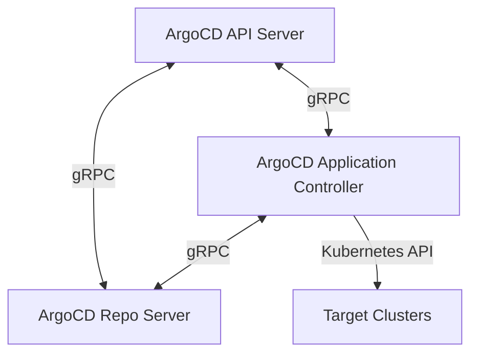
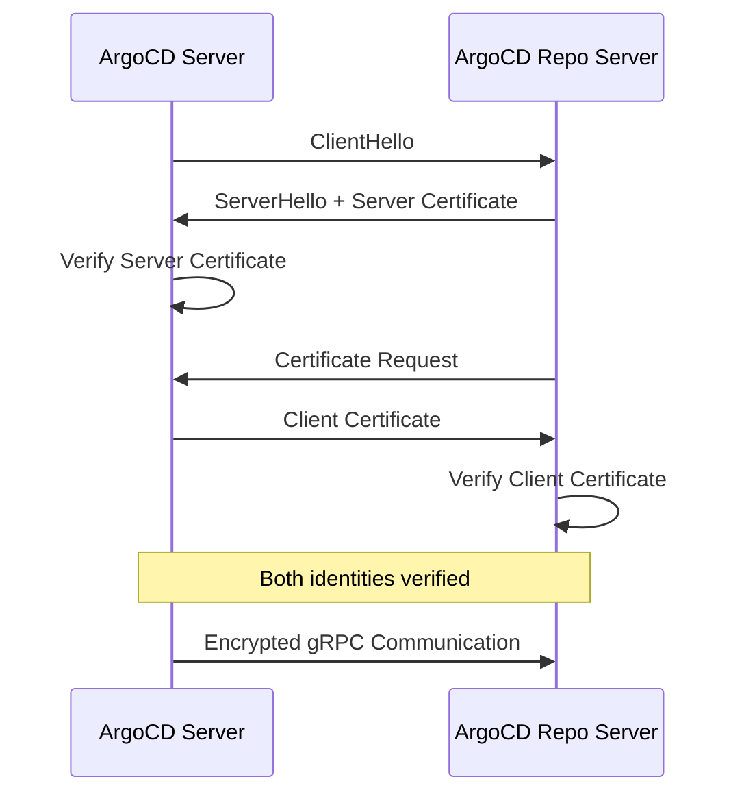

# How to Configure mTLS Between ArgoCD Components

Author: [nawazdhandala](https://github.com/nawazdhandala)

Tags: ArgoCD, GitOps, Kubernetes, TLS, Security

Description: Learn how to configure mutual TLS authentication between ArgoCD server, repo server, and application controller for secure internal communication in production environments.

---

By default, ArgoCD components communicate over internal TLS connections, but they do not verify each other's identity through mutual TLS (mTLS). In a standard installation, the server trusts any connection from within the cluster. In production environments - especially those with strict security requirements like SOC2, HIPAA, or PCI DSS - you need mTLS so that each component authenticates itself to every other component.

This guide covers configuring mTLS between the three main ArgoCD components: the API server, the repo server, and the application controller.

## Understanding ArgoCD Internal Communication

ArgoCD has three main components that communicate with each other:



- **API Server to Repo Server** - Requests manifest generation (Helm template, Kustomize build, etc.)
- **Application Controller to Repo Server** - Requests manifest generation for sync operations
- **API Server to Application Controller** - Forwards user actions (sync, rollback, etc.)

Without mTLS, any pod in the cluster that can reach these services can pretend to be an ArgoCD component.

## What mTLS Adds

In standard TLS, only the client verifies the server's identity. In mTLS, both sides verify each other:



## Step 1: Generate Certificates

You need a CA and individual certificates for each component.

### Create the Internal CA

```bash
# Generate CA private key
openssl genrsa -out ca.key 4096

# Generate CA certificate (valid for 10 years)
openssl req -new -x509 -sha256 -days 3650 \
  -key ca.key -out ca.crt \
  -subj "/CN=ArgoCD Internal CA/O=ArgoCD"
```

### Generate Component Certificates

Create a certificate for each ArgoCD component:

```bash
# ArgoCD Server certificate
openssl genrsa -out argocd-server.key 2048
openssl req -new -key argocd-server.key -out argocd-server.csr \
  -subj "/CN=argocd-server/O=ArgoCD"

cat > argocd-server-ext.cnf << 'EOF'
basicConstraints=CA:FALSE
subjectAltName = @alt_names
extendedKeyUsage = serverAuth, clientAuth

[alt_names]
DNS.1 = argocd-server
DNS.2 = argocd-server.argocd
DNS.3 = argocd-server.argocd.svc
DNS.4 = argocd-server.argocd.svc.cluster.local
EOF

openssl x509 -req -sha256 -days 365 \
  -in argocd-server.csr \
  -CA ca.crt -CAkey ca.key -CAcreateserial \
  -out argocd-server.crt \
  -extfile argocd-server-ext.cnf


# ArgoCD Repo Server certificate
openssl genrsa -out argocd-repo-server.key 2048
openssl req -new -key argocd-repo-server.key -out argocd-repo-server.csr \
  -subj "/CN=argocd-repo-server/O=ArgoCD"

cat > argocd-repo-server-ext.cnf << 'EOF'
basicConstraints=CA:FALSE
subjectAltName = @alt_names
extendedKeyUsage = serverAuth, clientAuth

[alt_names]
DNS.1 = argocd-repo-server
DNS.2 = argocd-repo-server.argocd
DNS.3 = argocd-repo-server.argocd.svc
DNS.4 = argocd-repo-server.argocd.svc.cluster.local
EOF

openssl x509 -req -sha256 -days 365 \
  -in argocd-repo-server.csr \
  -CA ca.crt -CAkey ca.key -CAcreateserial \
  -out argocd-repo-server.crt \
  -extfile argocd-repo-server-ext.cnf


# ArgoCD Application Controller certificate
openssl genrsa -out argocd-application-controller.key 2048
openssl req -new -key argocd-application-controller.key -out argocd-application-controller.csr \
  -subj "/CN=argocd-application-controller/O=ArgoCD"

cat > argocd-application-controller-ext.cnf << 'EOF'
basicConstraints=CA:FALSE
subjectAltName = @alt_names
extendedKeyUsage = serverAuth, clientAuth

[alt_names]
DNS.1 = argocd-application-controller
DNS.2 = argocd-application-controller.argocd
DNS.3 = argocd-application-controller.argocd.svc
DNS.4 = argocd-application-controller.argocd.svc.cluster.local
EOF

openssl x509 -req -sha256 -days 365 \
  -in argocd-application-controller.csr \
  -CA ca.crt -CAkey ca.key -CAcreateserial \
  -out argocd-application-controller.crt \
  -extfile argocd-application-controller-ext.cnf
```

The `extendedKeyUsage` includes both `serverAuth` and `clientAuth` because each component acts as both a server (receiving connections) and a client (making connections to other components).

## Step 2: Create Kubernetes Secrets

Store the certificates as Kubernetes secrets:

```bash
# CA certificate (shared by all components)
kubectl create secret generic argocd-internal-ca \
  --from-file=ca.crt=ca.crt \
  -n argocd

# Server certificate
kubectl create secret tls argocd-server-internal-tls \
  --cert=argocd-server.crt \
  --key=argocd-server.key \
  -n argocd

# Repo Server certificate
kubectl create secret tls argocd-repo-server-internal-tls \
  --cert=argocd-repo-server.crt \
  --key=argocd-repo-server.key \
  -n argocd

# Application Controller certificate
kubectl create secret tls argocd-application-controller-internal-tls \
  --cert=argocd-application-controller.crt \
  --key=argocd-application-controller.key \
  -n argocd
```

## Step 3: Configure ArgoCD Components

Configure each ArgoCD component to use mTLS through the `argocd-cmd-params-cm` ConfigMap and volume mounts.

### Configure via argocd-cmd-params-cm

```yaml
apiVersion: v1
kind: ConfigMap
metadata:
  name: argocd-cmd-params-cm
  namespace: argocd
data:
  # Repo server TLS configuration
  reposerver.tls.certificate: /app/config/server/tls/tls.crt
  reposerver.tls.key: /app/config/server/tls/tls.key
  reposerver.tls.ca: /app/config/server/tls/ca.crt

  # Enable strict TLS verification for repo server connections
  repo.server.strict.tls: "true"
```

### Mount Certificates into the Repo Server

```yaml
apiVersion: apps/v1
kind: Deployment
metadata:
  name: argocd-repo-server
  namespace: argocd
spec:
  template:
    spec:
      containers:
        - name: argocd-repo-server
          args:
            - /usr/local/bin/argocd-repo-server
            - --tls-cert-file=/app/config/server/tls/tls.crt
            - --tls-key-file=/app/config/server/tls/tls.key
            - --tls-ca-file=/app/config/server/tls/ca.crt
          volumeMounts:
            - name: repo-server-tls
              mountPath: /app/config/server/tls
              readOnly: true
      volumes:
        - name: repo-server-tls
          projected:
            sources:
              - secret:
                  name: argocd-repo-server-internal-tls
                  items:
                    - key: tls.crt
                      path: tls.crt
                    - key: tls.key
                      path: tls.key
              - secret:
                  name: argocd-internal-ca
                  items:
                    - key: ca.crt
                      path: ca.crt
```

### Mount Certificates into the API Server

```yaml
apiVersion: apps/v1
kind: Deployment
metadata:
  name: argocd-server
  namespace: argocd
spec:
  template:
    spec:
      containers:
        - name: argocd-server
          args:
            - /usr/local/bin/argocd-server
            - --repo-server-strict-tls
          volumeMounts:
            - name: server-tls
              mountPath: /app/config/server/tls
              readOnly: true
      volumes:
        - name: server-tls
          projected:
            sources:
              - secret:
                  name: argocd-server-internal-tls
                  items:
                    - key: tls.crt
                      path: tls.crt
                    - key: tls.key
                      path: tls.key
              - secret:
                  name: argocd-internal-ca
                  items:
                    - key: ca.crt
                      path: ca.crt
```

### Mount Certificates into the Application Controller

```yaml
apiVersion: apps/v1
kind: Deployment
metadata:
  name: argocd-application-controller
  namespace: argocd
spec:
  template:
    spec:
      containers:
        - name: argocd-application-controller
          args:
            - /usr/local/bin/argocd-application-controller
            - --repo-server-strict-tls
          volumeMounts:
            - name: controller-tls
              mountPath: /app/config/server/tls
              readOnly: true
      volumes:
        - name: controller-tls
          projected:
            sources:
              - secret:
                  name: argocd-application-controller-internal-tls
                  items:
                    - key: tls.crt
                      path: tls.crt
                    - key: tls.key
                      path: tls.key
              - secret:
                  name: argocd-internal-ca
                  items:
                    - key: ca.crt
                      path: ca.crt
```

## Step 4: Apply and Verify

Apply all the configuration changes:

```bash
# Apply the ConfigMap
kubectl apply -f argocd-cmd-params-cm.yaml

# Apply the deployment patches
kubectl apply -f argocd-server-deployment.yaml
kubectl apply -f argocd-repo-server-deployment.yaml
kubectl apply -f argocd-application-controller-deployment.yaml

# Wait for rollout
kubectl rollout status deployment argocd-server -n argocd
kubectl rollout status deployment argocd-repo-server -n argocd
kubectl rollout status deployment argocd-application-controller -n argocd
```

Verify mTLS is working:

```bash
# Check that all pods are running
kubectl get pods -n argocd

# Check logs for TLS-related messages
kubectl logs deployment/argocd-server -n argocd | grep -i tls
kubectl logs deployment/argocd-repo-server -n argocd | grep -i tls
kubectl logs deployment/argocd-application-controller -n argocd | grep -i tls

# Verify an application still syncs correctly
argocd app sync my-test-app
```

## Using cert-manager for Internal Certificates

Instead of manually generating certificates, use cert-manager with an internal CA:

```yaml
# Create an internal CA issuer
apiVersion: cert-manager.io/v1
kind: Issuer
metadata:
  name: argocd-internal-ca-issuer
  namespace: argocd
spec:
  ca:
    secretName: argocd-internal-ca-keypair
---
# Create a self-signed issuer for the CA itself
apiVersion: cert-manager.io/v1
kind: Issuer
metadata:
  name: selfsigned-issuer
  namespace: argocd
spec:
  selfSigned: {}
---
# Generate the CA certificate
apiVersion: cert-manager.io/v1
kind: Certificate
metadata:
  name: argocd-internal-ca
  namespace: argocd
spec:
  isCA: true
  commonName: ArgoCD Internal CA
  secretName: argocd-internal-ca-keypair
  issuerRef:
    name: selfsigned-issuer
    kind: Issuer
---
# Generate repo server certificate
apiVersion: cert-manager.io/v1
kind: Certificate
metadata:
  name: argocd-repo-server-tls
  namespace: argocd
spec:
  secretName: argocd-repo-server-internal-tls
  duration: 8760h  # 1 year
  renewBefore: 720h  # 30 days
  commonName: argocd-repo-server
  usages:
    - server auth
    - client auth
  dnsNames:
    - argocd-repo-server
    - argocd-repo-server.argocd
    - argocd-repo-server.argocd.svc
    - argocd-repo-server.argocd.svc.cluster.local
  issuerRef:
    name: argocd-internal-ca-issuer
    kind: Issuer
```

Create similar Certificate resources for the API server and application controller. cert-manager will handle rotation automatically.

## Certificate Rotation

### Manual Rotation

```bash
# Generate new certificates (repeat the openssl commands from Step 1)

# Update the secrets
kubectl create secret tls argocd-repo-server-internal-tls \
  --cert=new-argocd-repo-server.crt \
  --key=new-argocd-repo-server.key \
  -n argocd --dry-run=client -o yaml | kubectl apply -f -

# Restart the components to pick up new certificates
kubectl rollout restart deployment argocd-server argocd-repo-server argocd-application-controller -n argocd
```

### Automated Rotation with cert-manager

If you used cert-manager (as shown above), rotation is automatic. cert-manager renews certificates before they expire and updates the Kubernetes secrets. ArgoCD components pick up the new certificates on the next pod restart or through file watching.

## Troubleshooting mTLS

### Components Cannot Connect

```bash
# Check for TLS handshake errors
kubectl logs deployment/argocd-server -n argocd | grep -i "tls\|certificate\|handshake"

# Common causes:
# - Certificate SAN does not match the service DNS name
# - CA certificate mismatch between components
# - Certificate expired
# - Wrong key paired with certificate
```

### Verify Certificate Details

```bash
# Check certificate in a secret
kubectl get secret argocd-repo-server-internal-tls -n argocd \
  -o jsonpath='{.data.tls\.crt}' | base64 -d | \
  openssl x509 -noout -text | grep -A1 "Subject Alternative Name"
```

### Test Connectivity Between Components

```bash
# Exec into the server pod and test connection to repo server
kubectl exec -it deployment/argocd-server -n argocd -- \
  openssl s_client -connect argocd-repo-server:8081 \
  -cert /app/config/server/tls/tls.crt \
  -key /app/config/server/tls/tls.key \
  -CAfile /app/config/server/tls/ca.crt
```

## Summary

Configuring mTLS between ArgoCD components adds authentication to internal communication, ensuring that only legitimate ArgoCD components can talk to each other. Generate certificates for each component with both serverAuth and clientAuth extended key usage, store them as Kubernetes secrets, mount them into each deployment, and enable strict TLS verification. For automated certificate management, use cert-manager with an internal CA issuer that handles rotation automatically. This setup is essential for production environments with strict security compliance requirements.
