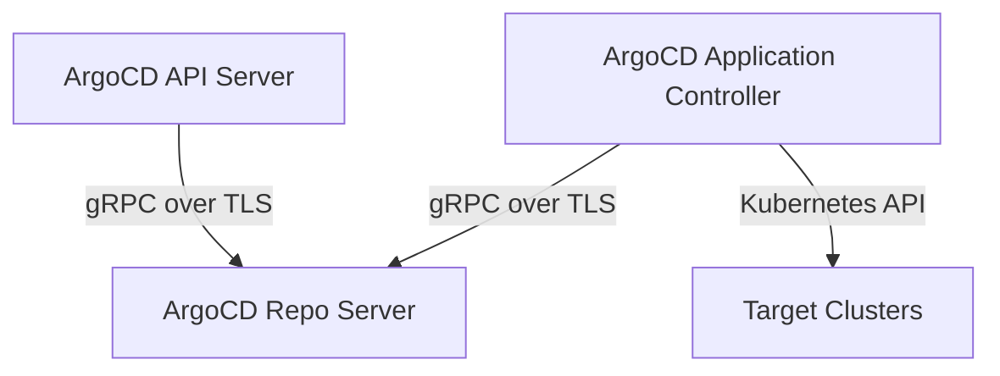
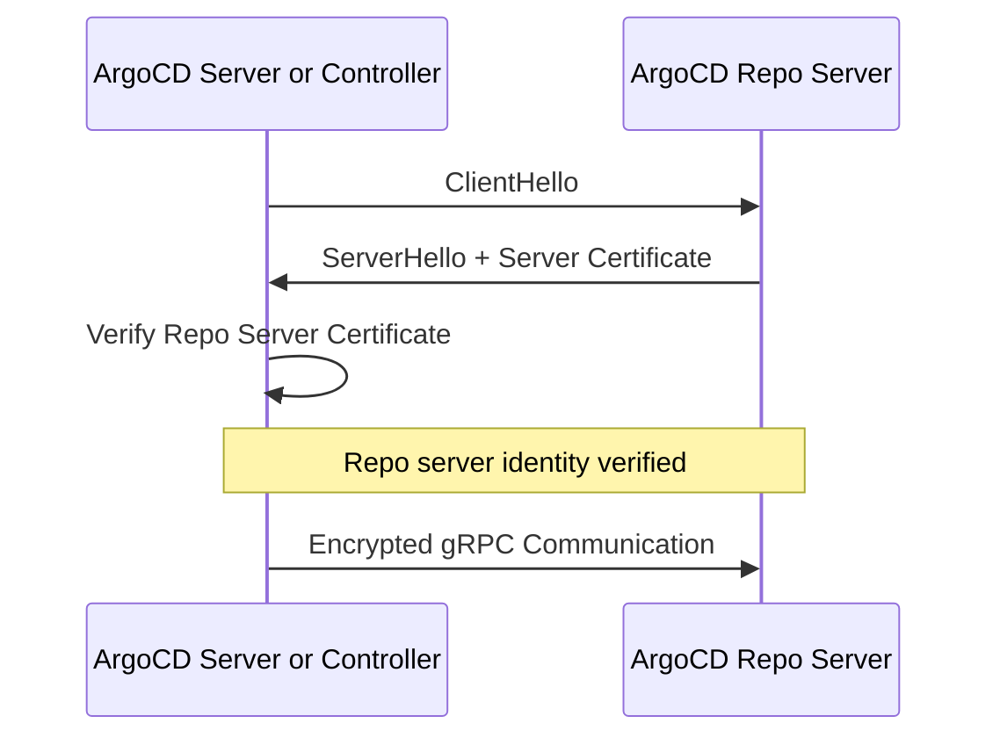

# How to Configure mTLS Between ArgoCD Components

Author: [nawazdhandala](https://github.com/nawazdhandala)

Tags: ArgoCD, GitOps, Kubernetes, TLS, Security

Description: Learn how to configure mutual TLS authentication between ArgoCD server, repo server, and application controller for secure internal communication in production environments.

---

By default, ArgoCD components communicate with the repo server over internal TLS connections, but clients do not strictly verify the repo server's certificate. In a standard installation, ArgoCD uses non-validating TLS for these internal repo server connections because the repo server generates a non-persistent self-signed certificate at startup.

This guide covers configuring strict TLS verification for the ArgoCD repo server endpoint used by the API server and the application controller. This is not mutual TLS (mTLS): ArgoCD verifies the repo server certificate, but the repo server does not authenticate client certificates from the other ArgoCD components. If you need true mTLS between components, use a service mesh or sidecar proxy that provides mTLS and configure ArgoCD to communicate with that proxy.

## Understanding ArgoCD Internal Communication

ArgoCD components communicate with the repo server to generate manifests:


```mermaid
graph TD
    A[ArgoCD API Server] -->|gRPC over TLS| B[ArgoCD Repo Server]
    C[ArgoCD Application Controller] -->|gRPC over TLS| B
    C -->|Kubernetes API| D[Target Clusters]
```

- **API Server to Repo Server** - Requests manifest generation (Helm template, Kustomize build, etc.)
- **Application Controller to Repo Server** - Requests manifest generation for sync operations

Without strict TLS validation, ArgoCD clients encrypt traffic to the repo server but do not validate the repo server certificate.

## What Strict TLS Adds

In standard TLS, the client verifies the server's identity. ArgoCD can be configured so that repo server clients validate the repo server certificate:


```mermaid
sequenceDiagram
    participant Client as ArgoCD Server or Controller
    participant Server as ArgoCD Repo Server

    Client->>Server: ClientHello
    Server->>Client: ServerHello + Server Certificate
    Client->>Client: Verify Repo Server Certificate
    Note over Client,Server: Repo server identity verified
    Client->>Server: Encrypted gRPC Communication
```

## Step 1: Generate Certificates

You need a CA and a certificate for the repo server.

### Create the Internal CA

```bash
# Generate CA private key
openssl genrsa -out ca.key 4096

# Generate CA certificate (valid for 10 years)
openssl req -new -x509 -sha256 -days 3650 \
  -key ca.key -out ca.crt \
  -subj "/CN=ArgoCD Internal CA/O=ArgoCD"
```

### Generate Repo Server Certificate

Create a certificate for the ArgoCD repo server:

```bash
# ArgoCD Repo Server certificate
openssl genrsa -out argocd-repo-server.key 2048
openssl req -new -key argocd-repo-server.key -out argocd-repo-server.csr \
  -subj "/CN=argocd-repo-server/O=ArgoCD"

cat > argocd-repo-server-ext.cnf << 'EOF'
basicConstraints=CA:FALSE
keyUsage = digitalSignature, keyEncipherment
extendedKeyUsage = serverAuth
subjectAltName = @alt_names

[alt_names]
DNS.1 = argocd-repo-server
DNS.2 = argocd-repo-server.argocd
DNS.3 = argocd-repo-server.argocd.svc
DNS.4 = argocd-repo-server.argocd.svc.cluster.local
EOF

openssl x509 -req -sha256 -days 365 \
  -in argocd-repo-server.csr \
  -CA ca.crt -CAkey ca.key -CAcreateserial \
  -out argocd-repo-server.crt \
  -extfile argocd-repo-server-ext.cnf
```

The certificate needs `serverAuth` because the repo server presents this certificate to ArgoCD clients. The DNS names must match the repo server service name used by ArgoCD, usually `argocd-repo-server:8081`.

## Step 2: Create Kubernetes Secrets

Store the repo server certificate in the secret name ArgoCD expects:

```bash
kubectl create secret generic argocd-repo-server-tls \
  --from-file=tls.crt=argocd-repo-server.crt \
  --from-file=tls.key=argocd-repo-server.key \
  --from-file=ca.crt=ca.crt \
  -n argocd
```

The `argocd-repo-server-tls` secret must contain `tls.crt` and `tls.key`. When the certificate is signed by your own CA, include `ca.crt` so ArgoCD clients can validate it.

## Step 3: Configure ArgoCD Components

Configure ArgoCD clients to use strict TLS verification when connecting to the repo server.

### Configure via argocd-cmd-params-cm

```yaml
apiVersion: v1
kind: ConfigMap
metadata:
  name: argocd-cmd-params-cm
  namespace: argocd
  labels:
    app.kubernetes.io/name: argocd-cmd-params-cm
    app.kubernetes.io/part-of: argocd
data:
  # Enable strict TLS verification for repo server connections from argocd-server
  server.repo.server.strict.tls: "true"

  # Enable strict TLS verification for repo server connections from argocd-application-controller
  controller.repo.server.strict.tls: "true"
```

If you run the ApplicationSet controller or notifications controller, configure their repo server strict TLS settings as well.

### Configure via Container Args

Alternatively, add the `--repo-server-strict-tls` argument to `argocd-server` and `argocd-application-controller`:

```yaml
apiVersion: apps/v1
kind: Deployment
metadata:
  name: argocd-server
  namespace: argocd
spec:
  template:
    spec:
      containers:
        - name: argocd-server
          args:
            - /usr/local/bin/argocd-server
            - --repo-server-strict-tls
```

```yaml
apiVersion: apps/v1
kind: StatefulSet
metadata:
  name: argocd-application-controller
  namespace: argocd
spec:
  template:
    spec:
      containers:
        - name: argocd-application-controller
          args:
            - /usr/local/bin/argocd-application-controller
            - --repo-server-strict-tls
```

The repo server does not need `--tls-cert-file`, `--tls-key-file`, or `--tls-ca-file` arguments. ArgoCD reads the repo server TLS certificate from the `argocd-repo-server-tls` secret.

## Step 4: Apply and Verify

Apply all the configuration changes:

```bash
# Apply the ConfigMap
kubectl apply -f argocd-cmd-params-cm.yaml

# Create or update the repo server TLS secret
kubectl create secret generic argocd-repo-server-tls \
  --from-file=tls.crt=argocd-repo-server.crt \
  --from-file=tls.key=argocd-repo-server.key \
  --from-file=ca.crt=ca.crt \
  -n argocd --dry-run=client -o yaml | kubectl apply -f -

# Restart the components so they pick up the new certificate and settings
kubectl rollout restart deployment/argocd-server -n argocd
kubectl rollout restart deployment/argocd-repo-server -n argocd
kubectl rollout restart statefulset/argocd-application-controller -n argocd

# Wait for rollout
kubectl rollout status deployment/argocd-server -n argocd
kubectl rollout status deployment/argocd-repo-server -n argocd
kubectl rollout status statefulset/argocd-application-controller -n argocd
```

Verify strict TLS is working:

```bash
# Check that all pods are running
kubectl get pods -n argocd

# Check logs for TLS-related errors
kubectl logs deployment/argocd-server -n argocd | grep -i "tls\|certificate\|x509"
kubectl logs statefulset/argocd-application-controller -n argocd | grep -i "tls\|certificate\|x509"

# Verify an application still syncs correctly
argocd app sync my-test-app
```

## Using cert-manager for Internal Certificates

Instead of manually generating certificates, use cert-manager with an internal CA:

```yaml
# Create a self-signed issuer for the CA itself
apiVersion: cert-manager.io/v1
kind: Issuer
metadata:
  name: selfsigned-issuer
  namespace: argocd
spec:
  selfSigned: {}
---
# Generate the CA certificate
apiVersion: cert-manager.io/v1
kind: Certificate
metadata:
  name: argocd-internal-ca
  namespace: argocd
spec:
  isCA: true
  commonName: ArgoCD Internal CA
  secretName: argocd-internal-ca-keypair
  issuerRef:
    name: selfsigned-issuer
    kind: Issuer
---
# Create an internal CA issuer
apiVersion: cert-manager.io/v1
kind: Issuer
metadata:
  name: argocd-internal-ca-issuer
  namespace: argocd
spec:
  ca:
    secretName: argocd-internal-ca-keypair
---
# Generate repo server certificate
apiVersion: cert-manager.io/v1
kind: Certificate
metadata:
  name: argocd-repo-server-tls
  namespace: argocd
spec:
  secretName: argocd-repo-server-tls
  duration: 8760h  # 1 year
  renewBefore: 720h  # 30 days
  commonName: argocd-repo-server
  usages:
    - server auth
  dnsNames:
    - argocd-repo-server
    - argocd-repo-server.argocd
    - argocd-repo-server.argocd.svc
    - argocd-repo-server.argocd.svc.cluster.local
  issuerRef:
    name: argocd-internal-ca-issuer
    kind: Issuer
```

cert-manager will create and renew the `argocd-repo-server-tls` secret automatically.

## Certificate Rotation

### Manual Rotation

```bash
# Generate a new repo server certificate (repeat the openssl commands from Step 1)

# Update the secret
kubectl create secret generic argocd-repo-server-tls \
  --from-file=tls.crt=new-argocd-repo-server.crt \
  --from-file=tls.key=new-argocd-repo-server.key \
  --from-file=ca.crt=ca.crt \
  -n argocd --dry-run=client -o yaml | kubectl apply -f -

# Restart the components to pick up new certificates
kubectl rollout restart deployment/argocd-server deployment/argocd-repo-server -n argocd
kubectl rollout restart statefulset/argocd-application-controller -n argocd
```

### Automated Rotation with cert-manager

If you used cert-manager (as shown above), rotation is automatic. cert-manager renews certificates before they expire and updates the Kubernetes secret. Restart the repo server and the ArgoCD clients that connect to it so all components use the renewed certificate.

## Troubleshooting TLS

### Components Cannot Connect

```bash
# Check for TLS handshake or certificate errors
kubectl logs deployment/argocd-server -n argocd | grep -i "tls\|certificate\|handshake\|x509"

# Common causes:
# - Certificate SAN does not match the service DNS name
# - CA certificate is missing from argocd-repo-server-tls
# - Certificate expired
# - Wrong key paired with certificate
```

### Verify Certificate Details

```bash
# Check certificate in the secret
kubectl get secret argocd-repo-server-tls -n argocd \
  -o jsonpath='{.data.tls\.crt}' | base64 -d | \
  openssl x509 -noout -text | grep -A1 "Subject Alternative Name"

# Verify the certificate chains to the CA
kubectl get secret argocd-repo-server-tls -n argocd \
  -o jsonpath='{.data.tls\.crt}' | base64 -d > /tmp/repo-server.crt
kubectl get secret argocd-repo-server-tls -n argocd \
  -o jsonpath='{.data.ca\.crt}' | base64 -d > /tmp/ca.crt
openssl verify -CAfile /tmp/ca.crt /tmp/repo-server.crt
```

## Summary

Configuring strict TLS verification between ArgoCD components ensures that the API server and application controller validate the repo server certificate before using its gRPC endpoint. Generate a repo server certificate with the correct DNS SAN entries, store it in the `argocd-repo-server-tls` secret with the CA certificate, and enable strict TLS verification for repo server clients. For true mTLS, use a service mesh or sidecar proxy that handles mutual authentication between workloads.
