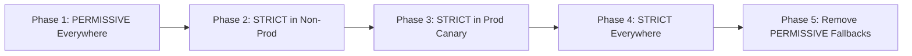

# How to Implement mTLS Configuration with ArgoCD

Author: [nawazdhandala](https://github.com/nawazdhandala)

Tags: ArgoCD, GitOps, Kubernetes, mTLS, Security

Description: Learn how to implement and manage mutual TLS configuration across your Kubernetes cluster using ArgoCD and GitOps workflows for consistent security enforcement.

---

Mutual TLS (mTLS) is the backbone of zero-trust networking in Kubernetes. Every service-to-service communication gets encrypted and authenticated without application code changes. But managing mTLS configuration across dozens or hundreds of services is where things get messy. ArgoCD turns this into a declarative, auditable process.

This guide covers implementing mTLS with Istio service mesh managed through ArgoCD, from strict enforcement to gradual rollout strategies.

## Understanding mTLS Modes in Istio

Istio supports three mTLS modes that you manage through PeerAuthentication resources:

- **PERMISSIVE** - Accepts both plaintext and mTLS traffic (good for migration)
- **STRICT** - Only accepts mTLS traffic (zero-trust)
- **DISABLE** - No mTLS (rarely used in production)

The challenge is moving from PERMISSIVE to STRICT across an entire cluster without breaking services that have not been enrolled in the mesh yet.

## Mesh-Wide mTLS with ArgoCD

Start with a base mTLS configuration managed as an ArgoCD Application. This sets the default policy for the entire mesh.

```yaml
# mtls-base-app.yaml
apiVersion: argoproj.io/v1alpha1
kind: Application
metadata:
  name: mtls-policies
  namespace: argocd
spec:
  project: security
  source:
    repoURL: https://github.com/myorg/k8s-security.git
    path: mtls-policies
    targetRevision: main
  destination:
    server: https://kubernetes.default.svc
  syncPolicy:
    automated:
      selfHeal: true
      prune: true
    syncOptions:
      - ServerSideApply=true
```

Inside the `mtls-policies` directory, start with a mesh-wide PERMISSIVE policy:

```yaml
# mtls-policies/mesh-wide-policy.yaml
apiVersion: security.istio.io/v1beta1
kind: PeerAuthentication
metadata:
  name: default
  namespace: istio-system  # Mesh-wide when in istio-system
spec:
  mtls:
    mode: PERMISSIVE
```

## Namespace-Level mTLS Enforcement

The smart approach is to roll out STRICT mTLS one namespace at a time. Each namespace gets its own PeerAuthentication resource:

```yaml
# mtls-policies/namespaces/production.yaml
apiVersion: security.istio.io/v1beta1
kind: PeerAuthentication
metadata:
  name: default
  namespace: production
spec:
  mtls:
    mode: STRICT
---
# DestinationRule to ensure outgoing connections use mTLS
apiVersion: networking.istio.io/v1beta1
kind: DestinationRule
metadata:
  name: default
  namespace: production
spec:
  host: "*.production.svc.cluster.local"
  trafficPolicy:
    tls:
      mode: ISTIO_MUTUAL
```

```yaml
# mtls-policies/namespaces/staging.yaml
apiVersion: security.istio.io/v1beta1
kind: PeerAuthentication
metadata:
  name: default
  namespace: staging
spec:
  mtls:
    mode: STRICT
```

## Gradual Rollout Strategy

The safest approach is a three-phase rollout. Here is the workflow managed through Git branches and ArgoCD:



Phase 1 is your starting point. For Phase 2, commit the namespace-level STRICT policies for dev and staging:

```bash
# Directory structure in your Git repo
mtls-policies/
  mesh-wide-policy.yaml          # PERMISSIVE (baseline)
  namespaces/
    dev.yaml                     # STRICT
    staging.yaml                 # STRICT
    production.yaml              # PERMISSIVE (not yet strict)
    production-canary.yaml       # STRICT for canary namespace
```

## Per-Service mTLS Exceptions

Some services legitimately cannot use mTLS - external-facing gateways, legacy services, or third-party integrations. Handle these with port-level exceptions:

```yaml
# mtls-policies/exceptions/legacy-payment-service.yaml
apiVersion: security.istio.io/v1beta1
kind: PeerAuthentication
metadata:
  name: legacy-payment
  namespace: production
spec:
  selector:
    matchLabels:
      app: legacy-payment-gateway
  mtls:
    mode: STRICT
  portLevelMtls:
    8443:
      mode: STRICT
    8080:
      mode: PERMISSIVE  # Legacy clients connect here without mTLS
```

Add a corresponding DestinationRule so the mesh knows how to reach this service:

```yaml
# mtls-policies/exceptions/legacy-payment-dr.yaml
apiVersion: networking.istio.io/v1beta1
kind: DestinationRule
metadata:
  name: legacy-payment
  namespace: production
spec:
  host: legacy-payment-gateway.production.svc.cluster.local
  trafficPolicy:
    tls:
      mode: ISTIO_MUTUAL
    portLevelSettings:
      - port:
          number: 8080
        tls:
          mode: DISABLE
```

## Validating mTLS with Pre-Sync Hooks

Before ArgoCD applies stricter mTLS policies, validate that all services in the target namespace have sidecar proxies injected:

```yaml
# mtls-policies/hooks/pre-sync-validate.yaml
apiVersion: batch/v1
kind: Job
metadata:
  name: mtls-readiness-check
  namespace: argocd
  annotations:
    argocd.argoproj.io/hook: PreSync
    argocd.argoproj.io/hook-delete-policy: HookSucceeded
spec:
  template:
    spec:
      containers:
        - name: check
          image: bitnami/kubectl:latest
          command:
            - /bin/sh
            - -c
            - |
              echo "Checking sidecar injection in production namespace..."

              # Count pods without sidecars
              NO_SIDECAR=$(kubectl get pods -n production \
                -o jsonpath='{range .items[*]}{.metadata.name}{" "}{range .spec.containers[*]}{.name}{" "}{end}{"\n"}{end}' \
                | grep -v istio-proxy | grep -v "^$" | wc -l)

              TOTAL=$(kubectl get pods -n production --no-headers | wc -l)

              echo "Pods without sidecar: $NO_SIDECAR out of $TOTAL total"

              if [ "$NO_SIDECAR" -gt 0 ]; then
                echo "WARNING: Some pods lack sidecar proxies."
                echo "Switching to STRICT mTLS will break these services."
                kubectl get pods -n production \
                  -o jsonpath='{range .items[*]}{.metadata.name}{" containers: "}{range .spec.containers[*]}{.name}{","}{end}{"\n"}{end}' \
                  | grep -v istio-proxy
                exit 1
              fi

              echo "All pods have sidecar proxies. Safe to enable STRICT mTLS."
      restartPolicy: Never
      serviceAccountName: mtls-checker
  backoffLimit: 1
```

## Certificate Management

Istio manages certificates automatically through its internal CA, but you may want to bring your own root CA. Manage this through ArgoCD as well:

```yaml
# mtls-policies/certs/custom-ca.yaml
apiVersion: v1
kind: Secret
metadata:
  name: cacerts
  namespace: istio-system
type: Opaque
data:
  ca-cert.pem: <base64-encoded-cert>
  ca-key.pem: <base64-encoded-key>
  root-cert.pem: <base64-encoded-root>
  cert-chain.pem: <base64-encoded-chain>
```

For production environments, use External Secrets Operator or Sealed Secrets instead of raw secrets in Git:

```yaml
# mtls-policies/certs/external-secret.yaml
apiVersion: external-secrets.io/v1beta1
kind: ExternalSecret
metadata:
  name: cacerts
  namespace: istio-system
spec:
  refreshInterval: 24h
  secretStoreRef:
    name: vault-backend
    kind: ClusterSecretStore
  target:
    name: cacerts
    template:
      type: Opaque
  data:
    - secretKey: ca-cert.pem
      remoteRef:
        key: istio/ca-cert
    - secretKey: ca-key.pem
      remoteRef:
        key: istio/ca-key
    - secretKey: root-cert.pem
      remoteRef:
        key: istio/root-cert
    - secretKey: cert-chain.pem
      remoteRef:
        key: istio/cert-chain
```

## Monitoring mTLS Status

After enabling STRICT mTLS, monitor for connection failures. Create a PrometheusRule that triggers alerts when mTLS handshake failures spike:

```yaml
apiVersion: monitoring.coreos.com/v1
kind: PrometheusRule
metadata:
  name: mtls-alerts
  namespace: monitoring
spec:
  groups:
    - name: mtls
      rules:
        - alert: HighMTLSHandshakeFailures
          expr: |
            sum(rate(envoy_ssl_connection_error_total[5m])) by (namespace) > 0.1
          for: 5m
          labels:
            severity: warning
          annotations:
            summary: "High mTLS handshake failures in {{ $labels.namespace }}"
```

## Audit Trail Benefits

With ArgoCD managing mTLS configuration, every change is a Git commit. Your security team can see exactly when mTLS was enabled for each namespace, who approved the change, and what the configuration looked like before and after. This audit trail is invaluable for compliance requirements like SOC 2 and PCI DSS.

## Summary

Managing mTLS with ArgoCD transforms a risky manual process into a safe, incremental rollout. Start with PERMISSIVE mode mesh-wide, use namespace-level policies to gradually enable STRICT mode, validate sidecar injection with pre-sync hooks, and handle exceptions at the port level. The entire mTLS posture of your cluster lives in Git, making it auditable, reviewable, and reversible.
