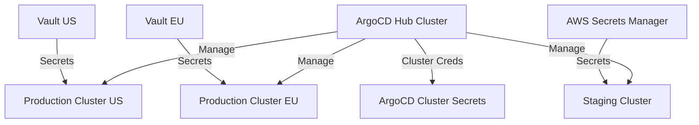

# How to Handle Secrets in Multi-Cluster ArgoCD Setup

Author: [nawazdhandala](https://github.com/nawazdhandala)

Tags: ArgoCD, GitOps, Kubernetes, Secret, Multi-Cluster

Description: Learn how to manage and distribute secrets across multiple Kubernetes clusters in an ArgoCD multi-cluster setup, covering per-cluster stores, replication, and access patterns.

---

Managing secrets across multiple Kubernetes clusters adds layers of complexity. Each cluster may need different credentials, different secret providers, or different access policies. When ArgoCD manages applications across clusters, the secret management strategy must account for cluster-specific secrets, shared secrets, and the secure distribution of credentials between clusters. This guide covers the patterns and tools for handling secrets in multi-cluster ArgoCD deployments.

## Multi-Cluster Secret Challenges

In a multi-cluster setup, you face several unique challenges:

- **Cluster credentials**: ArgoCD needs credentials to manage each cluster
- **Per-cluster secrets**: Database credentials differ between staging and production
- **Shared secrets**: Some secrets (like API keys) are shared across clusters
- **Regional compliance**: Some secrets must stay within specific regions
- **Secret provider access**: Each cluster may use a different secret backend



## Pattern 1: Per-Cluster Secret Stores

Deploy the External Secrets Operator in each managed cluster with its own SecretStore configuration:

```yaml
# ApplicationSet to deploy ESO in each managed cluster
apiVersion: argoproj.io/v1alpha1
kind: ApplicationSet
metadata:
  name: external-secrets-operator
  namespace: argocd
spec:
  generators:
    - clusters:
        selector:
          matchLabels:
            eso: enabled
  template:
    metadata:
      name: "eso-{{name}}"
    spec:
      project: platform
      source:
        repoURL: https://charts.external-secrets.io
        chart: external-secrets
        targetRevision: 0.9.12
      destination:
        server: "{{server}}"
        namespace: external-secrets
      syncPolicy:
        automated:
          selfHeal: true
        syncOptions:
          - CreateNamespace=true
```

Deploy cluster-specific SecretStores:

```yaml
# ApplicationSet for per-cluster SecretStore configuration
apiVersion: argoproj.io/v1alpha1
kind: ApplicationSet
metadata:
  name: cluster-secret-stores
  namespace: argocd
spec:
  generators:
    - clusters:
        selector:
          matchLabels:
            eso: enabled
        values:
          # Each cluster has its own Vault endpoint and role
          vaultAddr: "{{metadata.labels.vault-addr}}"
          vaultRole: "{{metadata.labels.vault-role}}"
          region: "{{metadata.labels.region}}"
  template:
    metadata:
      name: "secret-store-{{name}}"
    spec:
      project: platform
      source:
        repoURL: https://github.com/myorg/platform-config
        path: secret-stores/{{values.region}}
        targetRevision: main
      destination:
        server: "{{server}}"
        namespace: external-secrets
```

Each cluster's secret store configuration:

```yaml
# secret-stores/us-east-1/secret-store.yaml
apiVersion: external-secrets.io/v1beta1
kind: ClusterSecretStore
metadata:
  name: vault-backend
spec:
  provider:
    vault:
      server: https://vault-us-east.example.com
      path: secret
      version: v2
      auth:
        kubernetes:
          mountPath: kubernetes-prod-us
          role: external-secrets-prod-us
          serviceAccountRef:
            name: external-secrets
            namespace: external-secrets
---
# secret-stores/eu-west-1/secret-store.yaml
apiVersion: external-secrets.io/v1beta1
kind: ClusterSecretStore
metadata:
  name: vault-backend
spec:
  provider:
    vault:
      server: https://vault-eu-west.example.com
      path: secret
      version: v2
      auth:
        kubernetes:
          mountPath: kubernetes-prod-eu
          role: external-secrets-prod-eu
          serviceAccountRef:
            name: external-secrets
            namespace: external-secrets
```

## Pattern 2: Centralized Secret Store with Cluster Context

Use a single secret provider but organize secrets by cluster:

```bash
# Vault secret structure organized by cluster
vault kv put secret/clusters/prod-us/payments/database \
  host=db-us.payments.internal password=us-password

vault kv put secret/clusters/prod-eu/payments/database \
  host=db-eu.payments.internal password=eu-password

vault kv put secret/clusters/staging/payments/database \
  host=db-staging.payments.internal password=staging-password
```

Use ArgoCD ApplicationSet generators to inject the cluster name into ExternalSecret paths:

```yaml
# ApplicationSet that deploys application with cluster-specific secrets
apiVersion: argoproj.io/v1alpha1
kind: ApplicationSet
metadata:
  name: payment-service
  namespace: argocd
spec:
  generators:
    - clusters:
        selector:
          matchLabels:
            app: payments
        values:
          clusterEnv: "{{metadata.labels.environment}}"
  template:
    metadata:
      name: "payment-service-{{name}}"
    spec:
      source:
        repoURL: https://github.com/myorg/payment-service
        path: k8s/overlays/{{values.clusterEnv}}
        targetRevision: main
      destination:
        server: "{{server}}"
        namespace: payments
```

The ExternalSecret in each overlay references the cluster-specific path:

```yaml
# k8s/overlays/prod-us/external-secret.yaml
apiVersion: external-secrets.io/v1beta1
kind: ExternalSecret
metadata:
  name: database-credentials
spec:
  refreshInterval: 15m
  secretStoreRef:
    name: vault-backend
    kind: ClusterSecretStore
  target:
    name: database-credentials
  data:
    - secretKey: DB_HOST
      remoteRef:
        # Cluster-specific path in Vault
        key: clusters/prod-us/payments/database
        property: host
    - secretKey: DB_PASSWORD
      remoteRef:
        key: clusters/prod-us/payments/database
        property: password
```

## Pattern 3: Secret Replication Across Clusters

Some secrets need to exist in multiple clusters. Use ESO's PushSecret to replicate secrets from a source cluster:

```yaml
# PushSecret - replicate a secret from hub to managed clusters
apiVersion: external-secrets.io/v1alpha1
kind: PushSecret
metadata:
  name: shared-api-key
  namespace: shared-secrets
spec:
  # Delete the secret from the provider when PushSecret is deleted
  deletionPolicy: Delete
  # Refresh interval
  refreshInterval: 1h
  # Source secret in the hub cluster
  selector:
    secret:
      name: shared-api-key
  # Push to the external provider
  data:
    - match:
        secretKey: API_KEY
        remoteRef:
          remoteKey: shared/api-key
          property: value
```

Alternatively, use a CronJob to replicate secrets between clusters:

```yaml
# CronJob to sync shared secrets across clusters
apiVersion: batch/v1
kind: CronJob
metadata:
  name: sync-shared-secrets
  namespace: argocd
spec:
  schedule: "*/30 * * * *"
  jobTemplate:
    spec:
      template:
        spec:
          serviceAccountName: secret-replicator
          containers:
            - name: sync
              image: bitnami/kubectl:latest
              command:
                - /bin/sh
                - -c
                - |
                  # Read shared secret from hub cluster
                  SECRET=$(kubectl get secret shared-api-key -n shared-secrets -o json)

                  # List of managed cluster contexts
                  CLUSTERS="prod-us prod-eu staging"

                  for cluster in $CLUSTERS; do
                    echo "Syncing to $cluster"
                    echo "$SECRET" | \
                      jq 'del(.metadata.resourceVersion, .metadata.uid, .metadata.creationTimestamp)' | \
                      kubectl apply --context="$cluster" -n shared-secrets -f -
                  done
          restartPolicy: OnFailure
```

## Pattern 4: Managing ArgoCD Cluster Credentials

ArgoCD stores cluster credentials as Kubernetes Secrets in the argocd namespace. These are sensitive and need lifecycle management:

```yaml
# ArgoCD cluster secret structure
apiVersion: v1
kind: Secret
metadata:
  name: prod-us-cluster
  namespace: argocd
  labels:
    argocd.argoproj.io/secret-type: cluster
type: Opaque
stringData:
  name: prod-us
  server: https://prod-us.k8s.example.com:6443
  config: |
    {
      "bearerToken": "<service-account-token>",
      "tlsClientConfig": {
        "insecure": false,
        "caData": "<base64-ca-cert>"
      }
    }
```

Manage cluster credentials through ESO to avoid storing tokens in Git:

```yaml
# ExternalSecret for ArgoCD cluster credentials
apiVersion: external-secrets.io/v1beta1
kind: ExternalSecret
metadata:
  name: prod-us-cluster
  namespace: argocd
  labels:
    argocd.argoproj.io/secret-type: cluster
spec:
  refreshInterval: 1h
  secretStoreRef:
    name: vault-backend
    kind: ClusterSecretStore
  target:
    name: prod-us-cluster
    template:
      metadata:
        labels:
          argocd.argoproj.io/secret-type: cluster
      data:
        name: prod-us
        server: "{{ .server }}"
        config: |
          {
            "bearerToken": "{{ .token }}",
            "tlsClientConfig": {
              "insecure": false,
              "caData": "{{ .ca_data }}"
            }
          }
  data:
    - secretKey: server
      remoteRef:
        key: argocd/clusters/prod-us
        property: server
    - secretKey: token
      remoteRef:
        key: argocd/clusters/prod-us
        property: token
    - secretKey: ca_data
      remoteRef:
        key: argocd/clusters/prod-us
        property: ca_data
```

## Pattern 5: Regional Secret Compliance

For GDPR or data residency requirements, ensure secrets stay within their region:

```yaml
# Vault policy restricting EU secrets to EU clusters
path "secret/data/clusters/prod-eu/*" {
  capabilities = ["read"]
}

# Deny EU secrets from US clusters
path "secret/data/clusters/prod-us/*" {
  capabilities = ["deny"]
}
```

Configure separate Vault auth roles per cluster:

```bash
# EU cluster role can only access EU secrets
vault write auth/kubernetes/role/eso-prod-eu \
  bound_service_account_names=external-secrets \
  bound_service_account_namespaces=external-secrets \
  policies=eu-secrets-read \
  ttl=1h

# US cluster role can only access US secrets
vault write auth/kubernetes/role/eso-prod-us \
  bound_service_account_names=external-secrets \
  bound_service_account_namespaces=external-secrets \
  policies=us-secrets-read \
  ttl=1h
```

## Monitoring Multi-Cluster Secrets

Create a monitoring dashboard that tracks secret health across all clusters:

```yaml
# PrometheusRule for multi-cluster secret monitoring
apiVersion: monitoring.coreos.com/v1
kind: PrometheusRule
metadata:
  name: multi-cluster-secret-alerts
spec:
  groups:
    - name: multi-cluster-secrets
      rules:
        - alert: ExternalSecretSyncFailed
          expr: |
            external_secrets_status_condition{condition="Ready", status="False"} == 1
          for: 15m
          labels:
            severity: critical
          annotations:
            summary: "ExternalSecret {{ $labels.name }} in cluster {{ $labels.cluster }} sync failed"

        - alert: SecretStoreUnhealthy
          expr: |
            external_secrets_provider_status{status="unhealthy"} == 1
          for: 5m
          labels:
            severity: critical
          annotations:
            summary: "SecretStore {{ $labels.name }} in cluster {{ $labels.cluster }} is unhealthy"
```

## Summary

Multi-cluster secret management with ArgoCD requires choosing the right pattern for your organization. Use per-cluster SecretStores for isolation, centralized stores with cluster context for simplicity, or secret replication for shared credentials. Always manage ArgoCD cluster credentials through ESO rather than storing them in Git, and enforce regional compliance through Vault policies. The key is ensuring each cluster can independently access its secrets while maintaining centralized governance. For related topics, see our guides on [secret rotation with Vault](https://oneuptime.com/blog/post/2026-02-26-argocd-secret-rotation-vault/view) and [auditing secret access](https://oneuptime.com/blog/post/2026-02-26-argocd-audit-secret-access/view).
