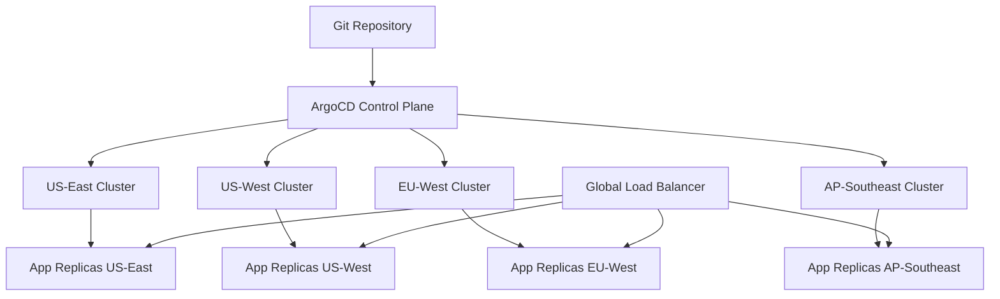
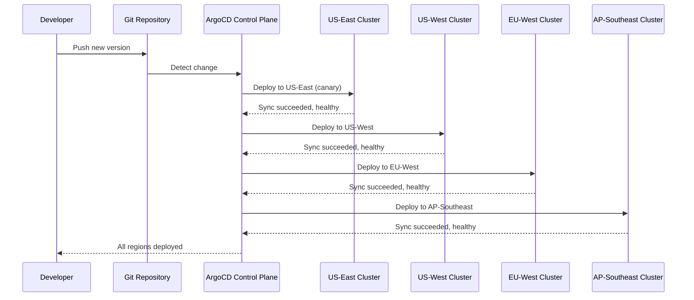

# How to Implement Multi-Region Deployments with ArgoCD

Author: [nawazdhandala](https://github.com/nawazdhandala)

Tags: ArgoCD, GitOps, Kubernetes, Multi-Region, High Availability

Description: Learn how to implement multi-region deployments with ArgoCD using ApplicationSets, cluster generators, and region-aware sync strategies for global applications.

---

Multi-region deployments distribute your applications across geographic regions for lower latency, higher availability, and compliance with data locality requirements. ArgoCD is well-suited for this pattern because it can manage applications across multiple Kubernetes clusters from a single control plane. The challenge is coordinating deployments across regions while handling region-specific configurations.

This guide covers the architecture, configuration patterns, and operational practices for running multi-region applications with ArgoCD.

## Multi-Region Architecture



## Step 1: Register Multiple Clusters

Register each regional cluster with ArgoCD:

```bash
# Register clusters using ArgoCD CLI
argocd cluster add us-east-1-cluster \
  --name us-east-1 \
  --label region=us-east-1 \
  --label environment=production

argocd cluster add us-west-2-cluster \
  --name us-west-2 \
  --label region=us-west-2 \
  --label environment=production

argocd cluster add eu-west-1-cluster \
  --name eu-west-1 \
  --label region=eu-west-1 \
  --label environment=production

argocd cluster add ap-southeast-1-cluster \
  --name ap-southeast-1 \
  --label region=ap-southeast-1 \
  --label environment=production
```

Or declaratively through Secrets:

```yaml
# argocd/clusters/us-east-1.yaml
apiVersion: v1
kind: Secret
metadata:
  name: us-east-1-cluster
  namespace: argocd
  labels:
    argocd.argoproj.io/secret-type: cluster
    region: us-east-1
    environment: production
type: Opaque
stringData:
  name: us-east-1
  server: https://us-east-1.k8s.company.com
  config: |
    {
      "bearerToken": "<token>",
      "tlsClientConfig": {
        "insecure": false,
        "caData": "<base64-ca-cert>"
      }
    }
```

## Step 2: Use ApplicationSets for Multi-Region Deployment

The Cluster Generator in ApplicationSets automatically creates applications for each registered cluster.

```yaml
# argocd/applicationsets/multi-region-app.yaml
apiVersion: argoproj.io/v1alpha1
kind: ApplicationSet
metadata:
  name: payment-service-global
  namespace: argocd
spec:
  generators:
    - clusters:
        selector:
          matchLabels:
            environment: production
        values:
          # Default values for all regions
          replicaCount: "3"
  template:
    metadata:
      name: "payment-service-{{name}}"
      labels:
        app: payment-service
        region: "{{metadata.labels.region}}"
      annotations:
        notifications.argoproj.io/subscribe.on-sync-failed.slack: global-deployments
    spec:
      project: global-apps
      source:
        repoURL: https://github.com/company/payment-service.git
        targetRevision: main
        path: deploy/production
        helm:
          values: |
            region: {{metadata.labels.region}}
            replicaCount: {{values.replicaCount}}
            image:
              tag: v2.1.0
      destination:
        server: "{{server}}"
        namespace: payment-service
      syncPolicy:
        automated:
          prune: true
          selfHeal: true
        syncOptions:
          - CreateNamespace=true
```

## Step 3: Progressive Multi-Region Rollout

Do not deploy to all regions simultaneously. Use a progressive rollout strategy:

```yaml
# argocd/applicationsets/progressive-rollout.yaml
apiVersion: argoproj.io/v1alpha1
kind: ApplicationSet
metadata:
  name: api-service-global
  namespace: argocd
spec:
  generators:
    - clusters:
        selector:
          matchLabels:
            environment: production
  strategy:
    type: RollingSync
    rollingSync:
      steps:
        # Step 1: Deploy to canary region first
        - matchExpressions:
            - key: region
              operator: In
              values:
                - us-east-1
          maxUpdate: 1

        # Step 2: Deploy to remaining US regions
        - matchExpressions:
            - key: region
              operator: In
              values:
                - us-west-2
          maxUpdate: 1

        # Step 3: Deploy to EU
        - matchExpressions:
            - key: region
              operator: In
              values:
                - eu-west-1
          maxUpdate: 1

        # Step 4: Deploy to APAC
        - matchExpressions:
            - key: region
              operator: In
              values:
                - ap-southeast-1
          maxUpdate: 1
  template:
    metadata:
      name: "api-service-{{name}}"
      labels:
        app: api-service
        region: "{{metadata.labels.region}}"
    spec:
      project: global-apps
      source:
        repoURL: https://github.com/company/api-service.git
        targetRevision: main
        path: "deploy/regions/{{metadata.labels.region}}"
      destination:
        server: "{{server}}"
        namespace: api-service
      syncPolicy:
        automated:
          prune: true
          selfHeal: true
```

This rolls out to one region at a time. If the deployment fails in US-East, it stops and does not propagate to other regions.

## Step 4: Region-Specific Overlays with Kustomize

Use Kustomize overlays for region-specific configuration:

```
deploy/
  base/
    kustomization.yaml
    deployment.yaml
    service.yaml
    hpa.yaml
  regions/
    us-east-1/
      kustomization.yaml
      patches/
        replica-count.yaml
        resource-limits.yaml
    us-west-2/
      kustomization.yaml
      patches/
        replica-count.yaml
    eu-west-1/
      kustomization.yaml
      patches/
        replica-count.yaml
        gdpr-annotations.yaml
    ap-southeast-1/
      kustomization.yaml
      patches/
        replica-count.yaml
```

Region-specific overlay example:

```yaml
# deploy/regions/eu-west-1/kustomization.yaml
apiVersion: kustomize.config.k8s.io/v1beta1
kind: Kustomization
resources:
  - ../../base
patches:
  - path: patches/replica-count.yaml
  - path: patches/gdpr-annotations.yaml
configMapGenerator:
  - name: region-config
    literals:
      - REGION=eu-west-1
      - AVAILABILITY_ZONES=eu-west-1a,eu-west-1b,eu-west-1c
      - DATA_RESIDENCY=eu
      - LOG_RETENTION_DAYS=365
```

```yaml
# deploy/regions/eu-west-1/patches/gdpr-annotations.yaml
apiVersion: apps/v1
kind: Deployment
metadata:
  name: api-service
  annotations:
    compliance.company.com/gdpr: "true"
    compliance.company.com/data-residency: "eu"
spec:
  template:
    metadata:
      annotations:
        compliance.company.com/gdpr: "true"
```

## Step 5: Global Health Monitoring

Monitor application health across all regions from a single dashboard:

```yaml
# monitoring/global-service-monitor.yaml
apiVersion: monitoring.coreos.com/v1
kind: PrometheusRule
metadata:
  name: multi-region-health
  namespace: monitoring
spec:
  groups:
    - name: multi-region.rules
      rules:
        # Alert if a region has no healthy instances
        - alert: RegionDown
          expr: |
            count by (region) (
              argocd_app_health_status{
                health_status="Healthy",
                name=~"api-service-.*"
              }
            ) == 0
          for: 5m
          labels:
            severity: critical
          annotations:
            summary: "No healthy api-service in region {{ $labels.region }}"

        # Alert if deployment is not consistent across regions
        - alert: RegionVersionDrift
          expr: |
            count(
              count by (revision) (
                argocd_app_info{
                  name=~"api-service-.*",
                  sync_status="Synced"
                }
              )
            ) > 1
          for: 30m
          labels:
            severity: warning
          annotations:
            summary: "api-service running different versions across regions"
```

Integrate with [OneUptime](https://oneuptime.com) for global uptime monitoring that checks each region independently and alerts on regional outages.

## Step 6: Regional Failover Automation

When a region becomes unhealthy, automate traffic failover:

```yaml
# Notification to trigger failover
template.region-failover: |
  webhook:
    traffic-manager:
      method: POST
      body: |
        {
          "action": "drain_region",
          "region": "{{index .app.metadata.labels "region"}}",
          "application": "{{.app.metadata.name}}",
          "reason": "ArgoCD health status: {{.app.status.health.status}}"
        }

trigger.on-region-unhealthy: |
  - description: Region application is unhealthy
    when: >-
      app.status.health.status == 'Degraded' and
      app.metadata.labels.region != ''
    send:
      - region-failover
```

## Multi-Region Deployment Flow



## Handling Region-Specific Outages

If a sync fails in one region, the progressive rollout stops. To handle partial failures:

```yaml
spec:
  strategy:
    type: RollingSync
    rollingSync:
      steps:
        - matchExpressions:
            - key: region
              operator: In
              values: [us-east-1]
          maxUpdate: 1
        - matchExpressions:
            - key: region
              operator: In
              values: [us-west-2, eu-west-1, ap-southeast-1]
          # Deploy remaining regions in parallel after canary
          maxUpdate: 3
```

This deploys to the canary region first, then fans out to all remaining regions simultaneously once the canary succeeds.

## Conclusion

Multi-region deployments with ArgoCD require careful coordination but provide significant resilience benefits. The Cluster Generator in ApplicationSets automatically handles cluster discovery, progressive rollout strategies prevent bad deployments from going global, and region-specific overlays handle the configuration differences between regions. The key practices are: always deploy progressively (never all regions at once), monitor for version drift across regions, automate failover for regional outages, and use Kustomize overlays for region-specific customization. This approach gives you global reach with controlled rollouts.
