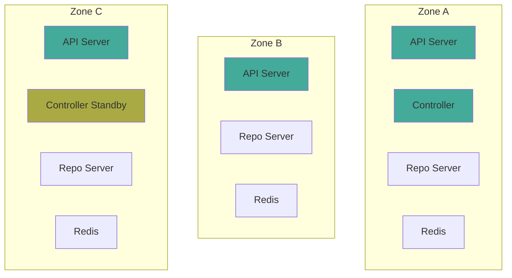

# How to Deploy ArgoCD Across Multiple Availability Zones

Author: [nawazdhandala](https://github.com/nawazdhandala)

Tags: ArgoCD, GitOps, Kubernetes, High Availability, Multi-AZ

Description: Learn how to deploy ArgoCD across multiple availability zones for zone-level fault tolerance, including topology spread constraints, storage considerations, and zone-aware configurations.

---

Deploying ArgoCD in a single availability zone means a zone outage takes down your entire GitOps pipeline. In production, ArgoCD pods should be spread across at least two, preferably three availability zones so that losing an entire zone does not impact deployment capabilities. This guide covers the configuration needed to achieve zone-resilient ArgoCD.

## Why Multi-AZ Matters for ArgoCD

Cloud providers experience zone-level outages. AWS, GCP, and Azure have all had incidents where an entire availability zone became unavailable. If all your ArgoCD pods are in that zone:

- No new deployments can be triggered
- Application health status becomes unknown
- The UI and CLI become inaccessible
- Webhook-triggered syncs fail
- Automated self-healing stops working



## Topology Spread Constraints

Kubernetes topology spread constraints distribute pods across topology domains (zones, nodes, etc.):

```yaml
# Global topology spread for all ArgoCD components
global:
  topologySpreadConstraints:
    - maxSkew: 1
      topologyKey: topology.kubernetes.io/zone
      whenUnsatisfiable: DoNotSchedule
      labelSelector:
        matchLabels:
          app.kubernetes.io/part-of: argocd
```

### Per-Component Configuration

For more granular control, configure each component separately:

```yaml
# API Server - Spread across zones
server:
  replicas: 3
  topologySpreadConstraints:
    - maxSkew: 1
      topologyKey: topology.kubernetes.io/zone
      whenUnsatisfiable: DoNotSchedule
      labelSelector:
        matchLabels:
          app.kubernetes.io/name: argocd-server

# Application Controller
controller:
  replicas: 2
  topologySpreadConstraints:
    - maxSkew: 1
      topologyKey: topology.kubernetes.io/zone
      whenUnsatisfiable: DoNotSchedule
      labelSelector:
        matchLabels:
          app.kubernetes.io/name: argocd-application-controller

# Repo Server
repoServer:
  replicas: 3
  topologySpreadConstraints:
    - maxSkew: 1
      topologyKey: topology.kubernetes.io/zone
      whenUnsatisfiable: DoNotSchedule
      labelSelector:
        matchLabels:
          app.kubernetes.io/name: argocd-repo-server
```

The `maxSkew: 1` ensures pods are evenly distributed. With 3 replicas across 3 zones, you get 1 pod per zone. With 5 replicas across 3 zones, you get a 2-2-1 distribution.

## Combine with Pod Anti-Affinity

Topology spread constraints distribute across zones, but you also want to avoid multiple replicas on the same node within a zone:

```yaml
server:
  replicas: 3
  topologySpreadConstraints:
    - maxSkew: 1
      topologyKey: topology.kubernetes.io/zone
      whenUnsatisfiable: DoNotSchedule
      labelSelector:
        matchLabels:
          app.kubernetes.io/name: argocd-server
  affinity:
    podAntiAffinity:
      preferredDuringSchedulingIgnoredDuringExecution:
        - weight: 100
          podAffinityTerm:
            labelSelector:
              matchLabels:
                app.kubernetes.io/name: argocd-server
            topologyKey: kubernetes.io/hostname
```

This configuration:
1. Spreads pods evenly across zones (hard constraint)
2. Tries to place pods on different nodes within each zone (soft preference)

## Redis HA Multi-AZ

Redis HA is particularly important for multi-AZ because Redis Sentinel needs a quorum (majority) to elect a new master:

```yaml
redis-ha:
  enabled: true
  replicas: 3
  topologySpreadConstraints:
    - maxSkew: 1
      topologyKey: topology.kubernetes.io/zone
      whenUnsatisfiable: DoNotSchedule
      labelSelector:
        matchLabels:
          app.kubernetes.io/name: argocd-redis-ha

  haproxy:
    replicas: 3
    topologySpreadConstraints:
      - maxSkew: 1
        topologyKey: topology.kubernetes.io/zone
        whenUnsatisfiable: DoNotSchedule
        labelSelector:
          matchLabels:
            app.kubernetes.io/name: argocd-redis-ha-haproxy
```

With 3 Redis replicas across 3 zones, losing one zone still leaves 2 Sentinels - enough for quorum to elect a new master.

## Persistent Volume Considerations

If Redis HA uses persistent volumes, you must use a zone-aware storage class:

```yaml
apiVersion: storage.k8s.io/v1
kind: StorageClass
metadata:
  name: argocd-redis-storage
provisioner: ebs.csi.aws.com  # Or your cloud provider's CSI driver
parameters:
  type: gp3
  encrypted: "true"
volumeBindingMode: WaitForFirstConsumer  # Critical for multi-AZ
reclaimPolicy: Retain
allowedTopologies:
  - matchLabelExpressions:
      - key: topology.kubernetes.io/zone
        values:
          - us-east-1a
          - us-east-1b
          - us-east-1c
```

The `WaitForFirstConsumer` binding mode is critical. It ensures the PersistentVolume is created in the same zone as the pod, preventing cross-zone volume attachment failures.

If a Redis pod fails over to a different zone, it cannot access its PV in the original zone. For this reason, many ArgoCD deployments disable Redis persistence entirely:

```yaml
redis-ha:
  redis:
    config:
      save: ""
      appendonly: "no"
  persistentVolume:
    enabled: false
```

ArgoCD's cache can be rebuilt from Git and Kubernetes APIs, so losing the Redis cache during a zone failover is acceptable.

## Complete Multi-AZ Helm Configuration

```yaml
# argocd-multi-az-values.yaml

global:
  topologySpreadConstraints:
    - maxSkew: 1
      topologyKey: topology.kubernetes.io/zone
      whenUnsatisfiable: DoNotSchedule

controller:
  replicas: 2
  pdb:
    enabled: true
    minAvailable: 1
  resources:
    requests:
      cpu: 500m
      memory: 1Gi
    limits:
      cpu: "2"
      memory: 4Gi

server:
  replicas: 3
  pdb:
    enabled: true
    minAvailable: 2
  resources:
    requests:
      cpu: 200m
      memory: 256Mi
    limits:
      cpu: "1"
      memory: 512Mi

repoServer:
  replicas: 3
  pdb:
    enabled: true
    minAvailable: 2
  resources:
    requests:
      cpu: 500m
      memory: 512Mi
    limits:
      cpu: "2"
      memory: 2Gi

redis:
  enabled: false

redis-ha:
  enabled: true
  replicas: 3
  persistentVolume:
    enabled: false
  topologySpreadConstraints:
    - maxSkew: 1
      topologyKey: topology.kubernetes.io/zone
      whenUnsatisfiable: DoNotSchedule
  haproxy:
    replicas: 3

applicationSet:
  replicas: 2
  pdb:
    enabled: true
    minAvailable: 1
```

Install:

```bash
helm install argocd argo/argo-cd \
  --namespace argocd \
  --create-namespace \
  --values argocd-multi-az-values.yaml
```

## Verifying Zone Distribution

After deployment, verify pods are spread across zones:

```bash
# Check pod zone distribution
kubectl get pods -n argocd -o wide | \
  while read line; do
    POD=$(echo "$line" | awk '{print $1}')
    NODE=$(echo "$line" | awk '{print $7}')
    if [ "$POD" != "NAME" ] && [ -n "$NODE" ]; then
      ZONE=$(kubectl get node "$NODE" -o jsonpath='{.metadata.labels.topology\.kubernetes\.io/zone}')
      echo "$POD -> $NODE -> $ZONE"
    fi
  done

# Simpler: group pods by zone
kubectl get pods -n argocd -o json | \
  jq -r '.items[] |
    .metadata.name + " -> " + .spec.nodeName' | \
  while IFS=' -> ' read pod node; do
    zone=$(kubectl get node "$node" -o jsonpath='{.metadata.labels.topology\.kubernetes\.io/zone}' 2>/dev/null)
    echo "$pod | $zone"
  done | sort -t'|' -k2
```

## Testing Zone Failure

Simulate a zone failure by cordoning all nodes in one zone:

```bash
# Get nodes in zone us-east-1a
NODES=$(kubectl get nodes -l topology.kubernetes.io/zone=us-east-1a -o name)

# Cordon all nodes in the zone
for NODE in $NODES; do
  kubectl cordon "$NODE"
done

# Verify ArgoCD still works
argocd app list
argocd app sync some-test-app

# Uncordon after testing
for NODE in $NODES; do
  kubectl uncordon "$NODE"
done
```

During the simulated zone failure:
- At least 2 API server pods should still be running (in other zones)
- At least 1 controller should be running
- At least 2 repo servers should be running
- Redis should maintain quorum (2 out of 3)

## Cost Considerations

Multi-AZ deployment increases costs through:
- Cross-zone data transfer charges (Redis replication, Git fetches)
- More nodes across zones to maintain anti-affinity
- EBS volumes in multiple zones (if using persistent storage)

To minimize costs while maintaining zone resilience:
- Disable Redis persistence (avoid cross-zone volume issues)
- Use 2 zones instead of 3 where acceptable
- Use `preferredDuringSchedulingIgnoredDuringExecution` instead of hard constraints if budget is tight

Multi-AZ deployment is essential for production ArgoCD. The additional cost and complexity are minimal compared to the risk of losing your entire deployment pipeline during a zone outage. For monitoring your multi-AZ deployment, see our guide on [monitoring ArgoCD component health](https://oneuptime.com/blog/post/2026-02-26-argocd-monitor-component-health/view).
