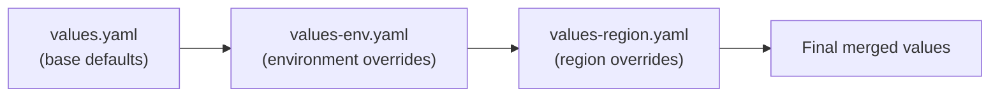

# How to Use Multiple Helm Values Files in ArgoCD

Author: [nawazdhandala](https://github.com/nawazdhandala)

Tags: ArgoCD, GitOps, Kubernetes, Helm, Configuration Management

Description: Learn how to layer multiple Helm values files in ArgoCD for structured configuration management across teams, environments, and regions.

---

As your Kubernetes deployments grow, a single values file is not enough. You need to separate concerns - base configurations, environment-specific settings, region-specific overrides, team-specific customizations, and sensitive values. ArgoCD lets you specify multiple Helm values files that are merged in order, giving you a layered configuration approach.

In this guide, we will explore how to structure and use multiple values files in ArgoCD, covering common patterns for environment management, team ownership, and regional deployments.

## How Multiple Values Files Work

When you specify multiple values files in ArgoCD, they are passed to Helm in order. Each file merges with and overrides values from previous files:



Later files override earlier files. For maps (objects), the merge is deep - only the specific keys you set are overridden. For arrays, the entire array is replaced.

## Configuring Multiple Values Files

Specify multiple files in the `valueFiles` list:

```yaml
apiVersion: argoproj.io/v1alpha1
kind: Application
metadata:
  name: my-app-production-us-east
  namespace: argocd
spec:
  source:
    repoURL: https://github.com/myorg/my-charts.git
    targetRevision: main
    path: charts/my-app
    helm:
      valueFiles:
        - values.yaml               # Layer 1: Base defaults
        - values-production.yaml     # Layer 2: Production settings
        - values-us-east.yaml        # Layer 3: Region-specific
  destination:
    server: https://kubernetes.default.svc
    namespace: production
```

## Layered Values Structure

Here is a practical values file structure for a multi-environment, multi-region deployment:

### Layer 1: Base Defaults (values.yaml)

```yaml
# values.yaml - sensible defaults for all environments
replicaCount: 1
image:
  repository: myorg/my-app
  tag: latest
  pullPolicy: IfNotPresent
service:
  type: ClusterIP
  port: 80
resources:
  requests:
    memory: "128Mi"
    cpu: "100m"
  limits:
    memory: "256Mi"
    cpu: "200m"
autoscaling:
  enabled: false
  minReplicas: 1
  maxReplicas: 5
monitoring:
  enabled: true
  serviceMonitor: true
logging:
  level: info
  format: json
```

### Layer 2: Environment Overrides (values-production.yaml)

```yaml
# values-production.yaml - production-specific settings
replicaCount: 3
image:
  tag: v1.5.2
  pullPolicy: Always
resources:
  requests:
    memory: "512Mi"
    cpu: "500m"
  limits:
    memory: "1Gi"
    cpu: "1000m"
autoscaling:
  enabled: true
  minReplicas: 3
  maxReplicas: 20
  targetCPUUtilizationPercentage: 70
logging:
  level: warn
```

### Layer 3: Region Overrides (values-us-east.yaml)

```yaml
# values-us-east.yaml - US East region specifics
ingress:
  hosts:
    - host: my-app-us-east.example.com
      paths:
        - path: /
          pathType: Prefix
  annotations:
    external-dns.alpha.kubernetes.io/hostname: my-app-us-east.example.com
nodeSelector:
  topology.kubernetes.io/region: us-east-1
tolerations:
  - key: "dedicated"
    operator: "Equal"
    value: "app-tier"
    effect: "NoSchedule"
```

The final result merges all three: base defaults + production overrides + US East specifics.

## Repository Structure

A well-organized repository for multi-file values:

```
charts/my-app/
  Chart.yaml
  templates/
  values.yaml                    # Base defaults

environments/
  dev/
    values.yaml                  # Dev environment
  staging/
    values.yaml                  # Staging environment
  production/
    values.yaml                  # Production base
    values-us-east.yaml          # US East region
    values-us-west.yaml          # US West region
    values-eu-west.yaml          # EU West region
```

ArgoCD Application for production US East:

```yaml
apiVersion: argoproj.io/v1alpha1
kind: Application
metadata:
  name: my-app-prod-us-east
  namespace: argocd
spec:
  source:
    repoURL: https://github.com/myorg/my-repo.git
    targetRevision: main
    path: charts/my-app
    helm:
      valueFiles:
        - values.yaml
        - ../../environments/production/values.yaml
        - ../../environments/production/values-us-east.yaml
  destination:
    server: https://us-east-cluster.example.com
    namespace: production
```

## Using ApplicationSets for Multiple Environments

Instead of manually creating an Application for each environment/region combination, use ApplicationSets:

```yaml
apiVersion: argoproj.io/v1alpha1
kind: ApplicationSet
metadata:
  name: my-app
  namespace: argocd
spec:
  generators:
    - matrix:
        generators:
          - list:
              elements:
                - env: production
                  cluster: https://prod-cluster.example.com
                - env: staging
                  cluster: https://staging-cluster.example.com
          - list:
              elements:
                - region: us-east
                - region: us-west
                - region: eu-west
  template:
    metadata:
      name: 'my-app-{{env}}-{{region}}'
    spec:
      source:
        repoURL: https://github.com/myorg/my-repo.git
        targetRevision: main
        path: charts/my-app
        helm:
          valueFiles:
            - values.yaml
            - '../../environments/{{env}}/values.yaml'
            - '../../environments/{{env}}/values-{{region}}.yaml'
      destination:
        server: '{{cluster}}'
        namespace: '{{env}}'
```

This generates 6 applications (2 environments x 3 regions), each with the correct layered values.

## Team-Owned Values Files

In larger organizations, different teams may own different parts of the configuration:

```yaml
# Structure:
# values.yaml           - Platform team (base infra)
# values-security.yaml  - Security team (policies, network)
# values-app.yaml       - App team (app-specific config)

apiVersion: argoproj.io/v1alpha1
kind: Application
metadata:
  name: my-app
  namespace: argocd
spec:
  source:
    repoURL: https://github.com/myorg/my-repo.git
    path: charts/my-app
    helm:
      valueFiles:
        - values.yaml            # Platform team
        - values-security.yaml   # Security team
        - values-app.yaml        # App team (highest precedence for app values)
```

Each team owns and updates their respective values file, and changes go through their own review process.

## Handling Merge Behavior

Understanding how Helm merges multiple values files is critical:

```yaml
# values.yaml (first file)
resources:
  requests:
    memory: "128Mi"
    cpu: "100m"
  limits:
    memory: "256Mi"
    cpu: "200m"
labels:
  - app
  - tier

# values-prod.yaml (second file)
resources:
  requests:
    memory: "512Mi"
    # cpu is NOT specified here, so it keeps "100m" from the first file

labels:
  - production
  # Arrays are REPLACED entirely, not merged
  # The final labels will be: ["production"], NOT ["app", "tier", "production"]
```

Key merge rules:
- **Maps**: Deep merged. Only specified keys are overridden.
- **Arrays**: Completely replaced. The last file wins entirely.
- **Scalars**: Overridden by the last value.

## Verifying the Merged Result

Always verify that your layered values produce the expected result:

```bash
# Preview rendered manifests
argocd app manifests my-app-prod-us-east

# Or use Helm directly for local testing
helm template my-app charts/my-app \
  -f charts/my-app/values.yaml \
  -f environments/production/values.yaml \
  -f environments/production/values-us-east.yaml
```

## Common Issues

1. **File not found**: Values file paths are relative to the chart path. Double-check your `../` references.
2. **Array replacement surprise**: Remember that arrays are replaced, not merged. If you need additive behavior, restructure as a map.
3. **Too many layers**: More than 3-4 layers of values files becomes hard to debug. Keep it simple.

## Summary

Multiple Helm values files in ArgoCD give you a layered configuration system for managing deployments across environments, regions, and teams. List files in the `valueFiles` array in order from most general to most specific. Remember that maps are deep merged while arrays are replaced entirely. Use ApplicationSets to generate applications with the correct values files for each environment and region combination. For overriding individual values, see our guide on [how to override Helm values](https://oneuptime.com/blog/post/2026-02-26-argocd-override-helm-values/view).
