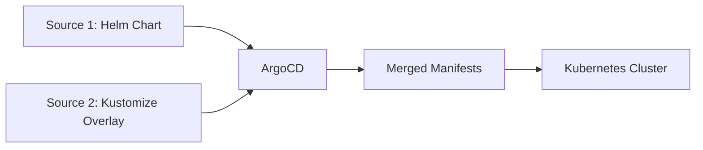

# How to Use Multiple Sources with Helm and Kustomize Together in ArgoCD

Author: [nawazdhandala](https://github.com/nawazdhandala)

Tags: ArgoCD, GitOps, Kubernetes, Helm, Kustomize

Description: Learn how to combine Helm charts and Kustomize overlays in a single ArgoCD application using multiple sources for flexible configuration management.

---

Helm and Kustomize serve different purposes. Helm packages applications as reusable charts with templating, while Kustomize patches existing YAML without templates. Combining them in a single ArgoCD application gives you the best of both worlds - use Helm for the base application and Kustomize to apply environment-specific patches without forking the chart.

## Why Combine Helm and Kustomize

Here are real scenarios where this combination shines:

- You deploy a third-party Helm chart but need to add annotations that the chart does not support as values
- You want to inject sidecars or init containers into a Helm-deployed application
- You need to patch resource limits or labels beyond what the chart's values expose
- You want to add Kubernetes resources that are not part of the chart (like ServiceMonitors or NetworkPolicies) alongside the chart's resources

ArgoCD's multi-source feature lets you deploy a Helm chart from one source and Kustomize overlays from another, combining them into a single application.

## Architecture Overview



The Helm chart source renders templates into manifests. The Kustomize source provides additional resources or patches. ArgoCD combines all manifests and applies them together.

## Basic Configuration

```yaml
# app-with-helm-and-kustomize.yaml
apiVersion: argoproj.io/v1alpha1
kind: Application
metadata:
  name: my-app
  namespace: argocd
spec:
  project: default
  sources:
    # Source 1: Deploy nginx-ingress via Helm
    - repoURL: https://kubernetes.github.io/ingress-nginx
      chart: ingress-nginx
      targetRevision: 4.9.0
      helm:
        releaseName: ingress-nginx
        valuesObject:
          controller:
            replicaCount: 2
            service:
              type: LoadBalancer

    # Source 2: Additional resources via Kustomize
    - repoURL: https://github.com/your-org/k8s-configs.git
      targetRevision: main
      path: overlays/ingress-extras
      kustomize: {}

  destination:
    server: https://kubernetes.default.svc
    namespace: ingress-nginx
  syncPolicy:
    automated:
      prune: true
      selfHeal: true
```

## Adding Resources Alongside a Helm Chart

The most common pattern is adding resources that the Helm chart does not create. For example, adding a ServiceMonitor for Prometheus monitoring and a PodDisruptionBudget:

```
k8s-configs/
  overlays/
    ingress-extras/
      kustomization.yaml
      servicemonitor.yaml
      poddisruptionbudget.yaml
      networkpolicy.yaml
```

```yaml
# overlays/ingress-extras/kustomization.yaml
apiVersion: kustomize.config.k8s.io/v1beta1
kind: Kustomization
resources:
  - servicemonitor.yaml
  - poddisruptionbudget.yaml
  - networkpolicy.yaml
```

```yaml
# overlays/ingress-extras/servicemonitor.yaml
apiVersion: monitoring.coreos.com/v1
kind: ServiceMonitor
metadata:
  name: ingress-nginx
  namespace: ingress-nginx
  labels:
    release: prometheus
spec:
  selector:
    matchLabels:
      app.kubernetes.io/name: ingress-nginx
  endpoints:
    - port: metrics
      interval: 30s
```

```yaml
# overlays/ingress-extras/poddisruptionbudget.yaml
apiVersion: policy/v1
kind: PodDisruptionBudget
metadata:
  name: ingress-nginx-controller
  namespace: ingress-nginx
spec:
  minAvailable: 1
  selector:
    matchLabels:
      app.kubernetes.io/name: ingress-nginx
```

```yaml
# overlays/ingress-extras/networkpolicy.yaml
apiVersion: networking.k8s.io/v1
kind: NetworkPolicy
metadata:
  name: ingress-nginx-allow
  namespace: ingress-nginx
spec:
  podSelector:
    matchLabels:
      app.kubernetes.io/name: ingress-nginx
  policyTypes:
    - Ingress
  ingress:
    - ports:
        - port: 80
        - port: 443
```

## Helm Values from a Kustomize Repo

You can also combine Helm values with the `ref` mechanism while having Kustomize resources in the same repo:

```yaml
apiVersion: argoproj.io/v1alpha1
kind: Application
metadata:
  name: cert-manager
  namespace: argocd
spec:
  sources:
    # Helm chart with external values
    - repoURL: https://charts.jetstack.io
      chart: cert-manager
      targetRevision: 1.14.2
      helm:
        releaseName: cert-manager
        valueFiles:
          - $config/cert-manager/values.yaml
        parameters:
          - name: installCRDs
            value: "true"

    # Git repo providing both values files and Kustomize resources
    - repoURL: https://github.com/your-org/k8s-configs.git
      targetRevision: main
      ref: config  # For Helm values reference

    # Same repo, different path - Kustomize extras
    - repoURL: https://github.com/your-org/k8s-configs.git
      targetRevision: main
      path: cert-manager/extras
      kustomize: {}

  destination:
    server: https://kubernetes.default.svc
    namespace: cert-manager
```

This pulls the Helm chart from JetStack, values from your config repo, and additional Kustomize resources from the same config repo.

## Multi-Environment with Helm + Kustomize

Different environments can use the same Helm chart but with different Kustomize overlays:

```
k8s-configs/
  cert-manager/
    values-base.yaml
    values-staging.yaml
    values-production.yaml
    extras/
      base/
        kustomization.yaml
        clusterissuer.yaml
      staging/
        kustomization.yaml
        clusterissuer-staging.yaml
      production/
        kustomization.yaml
        clusterissuer-production.yaml
        additional-issuer.yaml
```

```yaml
# Staging cert-manager
spec:
  sources:
    - repoURL: https://charts.jetstack.io
      chart: cert-manager
      targetRevision: 1.14.2
      helm:
        releaseName: cert-manager
        valueFiles:
          - $config/cert-manager/values-base.yaml
          - $config/cert-manager/values-staging.yaml

    - repoURL: https://github.com/your-org/k8s-configs.git
      targetRevision: main
      ref: config

    - repoURL: https://github.com/your-org/k8s-configs.git
      targetRevision: main
      path: cert-manager/extras/staging
```

```yaml
# Production cert-manager
spec:
  sources:
    - repoURL: https://charts.jetstack.io
      chart: cert-manager
      targetRevision: 1.14.2
      helm:
        releaseName: cert-manager
        valueFiles:
          - $config/cert-manager/values-base.yaml
          - $config/cert-manager/values-production.yaml

    - repoURL: https://github.com/your-org/k8s-configs.git
      targetRevision: main
      ref: config

    - repoURL: https://github.com/your-org/k8s-configs.git
      targetRevision: main
      path: cert-manager/extras/production
```

## Important Limitation: No Cross-Source Patching

A critical point to understand: Kustomize patches from one source cannot modify resources generated by another source (like the Helm chart). Each source's output is independent. The Kustomize source can only add new resources - it cannot patch Helm-generated resources.

If you need to patch Helm output, you have two alternatives:

**Option 1:** Use Helm post-renderers (requires a config management plugin)

**Option 2:** Use Helm values to customize the chart output, and use Kustomize only for adding resources that are not part of the chart

**Option 3:** Deploy the Helm chart as a Kustomize base using `helmCharts` in the kustomization.yaml. This allows Kustomize patches on Helm output but requires a single-source approach:

```yaml
# kustomization.yaml that uses a Helm chart as its base
apiVersion: kustomize.config.k8s.io/v1beta1
kind: Kustomization
helmCharts:
  - name: ingress-nginx
    repo: https://kubernetes.github.io/ingress-nginx
    version: 4.9.0
    releaseName: ingress-nginx
    valuesFile: values.yaml
patches:
  - target:
      kind: Deployment
      name: ingress-nginx-controller
    patch: |
      - op: add
        path: /spec/template/metadata/annotations/custom-annotation
        value: "my-value"
```

## Troubleshooting

```bash
# View all rendered manifests from both sources
argocd app manifests my-app

# Check for resource conflicts
argocd app manifests my-app | grep "^kind:" | sort | uniq -c

# Verify the Kustomize source renders correctly
cd k8s-configs/overlays/ingress-extras
kustomize build .

# Check for sync errors
argocd app get my-app
```

Common issues:
- **Kustomize source not rendering** - Ensure the path contains a valid `kustomization.yaml`
- **Missing resources** - Each source contributes independently. Verify both sources have the expected files.
- **Namespace conflicts** - Resources from both sources should target the same namespace

## Best Practices

**Use Helm values for what the chart supports** - Exhaust the chart's values.yaml options before reaching for Kustomize additions.

**Keep Kustomize additions simple** - The Kustomize source should contain resources that complement the Helm chart, not compete with it.

**Document the relationship** - Make it clear in your repository which Kustomize resources are companions to which Helm charts.

**Test independently** - Verify each source renders correctly on its own before combining them.

For more multi-source patterns, see [using multiple sources in ArgoCD](https://oneuptime.com/blog/post/2026-02-26-argocd-multiple-sources-single-application/view) and [debugging multi-source issues](https://oneuptime.com/blog/post/2026-02-26-argocd-debug-multi-source-issues/view).
