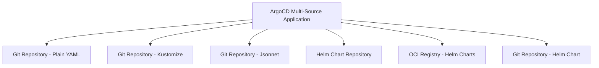
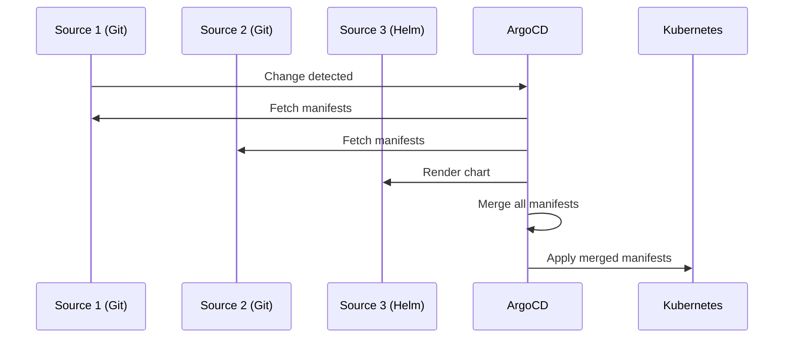

# How to Use Multiple Sources for a Single ArgoCD Application

Author: [nawazdhandala](https://github.com/nawazdhandala)

Tags: ArgoCD, GitOps, Kubernetes, Multi-Source, Configuration Management

Description: Learn how to configure ArgoCD applications with multiple sources to combine manifests from different repositories, Helm charts, and directories in a single deployment.

---

ArgoCD's multi-source feature lets a single Application pull manifests from multiple locations - different Git repositories, different paths within the same repo, or a combination of Helm charts and plain YAML. This solves a real problem: when your application configuration is split across multiple sources, you no longer need to consolidate everything into one repo or create separate applications and coordinate their syncs.

## Why Multiple Sources

Before multi-source support, you had two options when your configuration lived in multiple places:

1. **Consolidate into one repo** - Copy everything into a single repository, which creates maintenance overhead and breaks the separation of concerns.
2. **Create separate Applications** - Deploy each source as its own ArgoCD Application, which means coordinating syncs and losing the unified health view.

Multi-source applications solve both problems. A single Application can reference multiple sources and ArgoCD merges all the manifests into one deployment.

Common use cases include:

- Helm chart from a chart repository plus values file from a Git repo
- Base manifests from a shared infrastructure repo plus app-specific configs from a team repo
- CRDs from one source plus custom resources from another
- A third-party tool from its official repo plus your custom configuration

## Basic Multi-Source Configuration

Instead of the singular `source` field, use the plural `sources` field (note: you cannot use both `source` and `sources` in the same Application):

```yaml
# multi-source-app.yaml - Application with multiple sources
apiVersion: argoproj.io/v1alpha1
kind: Application
metadata:
  name: my-platform
  namespace: argocd
spec:
  project: default
  # Use "sources" (plural) instead of "source" (singular)
  sources:
    # Source 1: Shared infrastructure manifests
    - repoURL: https://github.com/your-org/shared-infra.git
      targetRevision: main
      path: base/monitoring
    # Source 2: Application-specific manifests
    - repoURL: https://github.com/your-org/app-configs.git
      targetRevision: main
      path: apps/my-platform
    # Source 3: Helm chart from a chart repository
    - repoURL: https://charts.bitnami.com/bitnami
      chart: redis
      targetRevision: 18.6.1
      helm:
        releaseName: platform-redis
        valuesObject:
          architecture: standalone
          auth:
            enabled: true
  destination:
    server: https://kubernetes.default.svc
    namespace: my-platform
  syncPolicy:
    automated:
      prune: true
      selfHeal: true
    syncOptions:
      - CreateNamespace=true
```

This single Application combines infrastructure manifests from one Git repo, application configs from another, and a Redis Helm chart from a chart repository.

## Source Types You Can Combine

ArgoCD multi-source supports mixing any combination of:



Each source in the `sources` array is independent and can use any source type ArgoCD supports.

## Practical Example: Application with External Config

A common pattern is deploying a Helm chart but keeping the values file in a separate Git repository. This way, the chart comes from the vendor and your team manages only the configuration:

```yaml
apiVersion: argoproj.io/v1alpha1
kind: Application
metadata:
  name: prometheus-stack
  namespace: argocd
spec:
  project: default
  sources:
    # Source 1: The Helm chart
    - repoURL: https://prometheus-community.github.io/helm-charts
      chart: kube-prometheus-stack
      targetRevision: 56.6.2
      helm:
        releaseName: monitoring
        # Reference values from another source using $ref
        valueFiles:
          - $values/monitoring/prometheus-values.yaml
    # Source 2: Your values files repo (referenced as $values)
    - repoURL: https://github.com/your-org/helm-values.git
      targetRevision: main
      ref: values  # This creates the $values reference
  destination:
    server: https://kubernetes.default.svc
    namespace: monitoring
  syncPolicy:
    automated:
      prune: true
      selfHeal: true
```

The `ref: values` on the second source creates a reference name `$values` that the first source can use in `valueFiles`. This is the key mechanism for cross-referencing sources.

## The ref Mechanism Explained

The `ref` field assigns a name to a source that other sources can reference. It is used exclusively for Helm values files:

```yaml
sources:
  # Helm chart source - uses $config reference for values
  - repoURL: https://charts.example.com
    chart: my-app
    targetRevision: 1.0.0
    helm:
      valueFiles:
        - $config/environments/staging/values.yaml
        - $config/common/base-values.yaml

  # Config source - provides values files
  - repoURL: https://github.com/your-org/config.git
    targetRevision: main
    ref: config  # Creates $config reference
```

The path in `$config/environments/staging/values.yaml` is resolved relative to the root of the referenced Git repository.

Important rules for `ref`:

- A source with `ref` does not need a `path` field - it exposes the entire repository
- Multiple sources can reference the same `ref`
- A source with `ref` does not contribute manifests directly (unless it also has a `path`)
- The `ref` name must be a valid identifier (letters, numbers, hyphens)

## Multiple Git Repositories as Sources

Combine manifests from multiple Git repos without the `ref` mechanism:

```yaml
apiVersion: argoproj.io/v1alpha1
kind: Application
metadata:
  name: full-stack-app
  namespace: argocd
spec:
  project: default
  sources:
    # Backend manifests from the backend team's repo
    - repoURL: https://github.com/your-org/backend-k8s.git
      targetRevision: main
      path: deploy/production

    # Frontend manifests from the frontend team's repo
    - repoURL: https://github.com/your-org/frontend-k8s.git
      targetRevision: main
      path: deploy/production

    # Shared infrastructure from the platform team's repo
    - repoURL: https://github.com/your-org/platform-infra.git
      targetRevision: v2.1.0
      path: shared/networking

  destination:
    server: https://kubernetes.default.svc
    namespace: production
```

Each source can track different branches or tags independently. This is powerful for teams that release at different cadences.

## Sync Behavior with Multiple Sources

When any source changes, ArgoCD detects the application as OutOfSync. The sync operation processes all sources together:



All sources are always processed during a sync - you cannot sync individual sources independently. If you need independent sync control, use separate Applications.

## Viewing Multi-Source Applications

```bash
# View application details - shows all sources
argocd app get my-platform

# View rendered manifests from all sources combined
argocd app manifests my-platform

# Check diff between desired and live state
argocd app diff my-platform
```

In the ArgoCD UI, multi-source applications show all sources in the application details panel. The resource tree combines resources from all sources.

## Limitations and Considerations

**No per-source sync** - You cannot sync one source without syncing all of them. A change in any source triggers a full sync.

**Resource conflicts** - If two sources define the same resource (same kind, name, and namespace), ArgoCD will detect a conflict. The last source in the array wins, but this is unpredictable and should be avoided.

**No source-level health** - Health status is computed for the entire application, not per source. If a resource from one source is unhealthy, the whole application shows as unhealthy.

**CLI limitations** - Some CLI commands that reference `--source` may not work as expected with multi-source applications. Use the YAML-based approach for full control.

**ApplicationSet compatibility** - Multi-source works with ApplicationSets, but template variable substitution applies to all sources equally.

## Migrating from Single-Source to Multi-Source

To convert an existing single-source application, change `source` to `sources` (an array):

```yaml
# Before - single source
spec:
  source:
    repoURL: https://github.com/your-org/k8s-manifests.git
    targetRevision: main
    path: apps/my-app

# After - multi-source (same behavior, but now you can add more)
spec:
  sources:
    - repoURL: https://github.com/your-org/k8s-manifests.git
      targetRevision: main
      path: apps/my-app
```

For a detailed migration guide, see our post on [migrating single-source apps to multi-source](https://oneuptime.com/blog/post/2026-02-26-argocd-migrate-single-to-multi-source/view).

## Best Practices

**Keep sources focused** - Each source should have a clear purpose. Avoid adding sources just because you can.

**Use refs for Helm values** - When deploying Helm charts with external values, always use the `ref` mechanism rather than trying to combine sources manually.

**Pin versions per source** - Each source should track a specific branch, tag, or revision. Avoid having all sources track `HEAD` as it makes debugging harder.

**Document source ownership** - Add comments in your Application YAML explaining which team or system owns each source.

For more on specific multi-source patterns, see our guides on [combining Helm with external values](https://oneuptime.com/blog/post/2026-02-26-argocd-helm-external-values-multiple-sources/view) and [handling conflicts between multiple sources](https://oneuptime.com/blog/post/2026-02-26-argocd-conflicts-multiple-sources/view).
