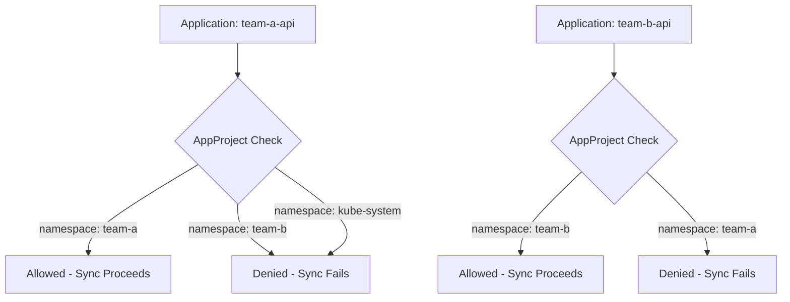

# How to Configure Namespace-Level Isolation in ArgoCD

Author: [nawazdhandala](https://github.com/nawazdhandala)

Tags: ArgoCD, GitOps, Kubernetes, Multi-Tenancy, Namespace

Description: Learn how to configure namespace-level isolation in ArgoCD to restrict teams to their own namespaces with AppProjects, destination restrictions, and namespace-scoped applications.

---

Namespace-level isolation is the most common multi-tenancy pattern in ArgoCD. Each team gets one or more namespaces, and ArgoCD ensures they can only deploy to those namespaces - never to another team's space. This is more granular than project-level isolation and gives you precise control over where each application can land.

This guide walks through configuring namespace restrictions in ArgoCD AppProjects, setting up applications that respect namespace boundaries, and handling the edge cases that come up in real deployments.

## How Namespace Isolation Works in ArgoCD

ArgoCD enforces namespace isolation through AppProject destination restrictions. When an application tries to sync, the controller checks whether the target namespace is allowed by the application's project. If not, the sync fails.



## Configuring AppProject Destination Restrictions

The core of namespace isolation is the `destinations` field in your AppProject. This whitelist defines exactly which clusters and namespaces the project's applications can target.

```yaml
apiVersion: argoproj.io/v1alpha1
kind: AppProject
metadata:
  name: team-alpha
  namespace: argocd
spec:
  description: "Team Alpha's project - restricted to team-alpha namespaces"
  # Only allow deployments to team-alpha namespaces
  destinations:
    - server: https://kubernetes.default.svc
      namespace: team-alpha-dev
    - server: https://kubernetes.default.svc
      namespace: team-alpha-staging
    - server: https://kubernetes.default.svc
      namespace: team-alpha-prod
  # Restrict source repositories
  sourceRepos:
    - https://github.com/myorg/team-alpha-*
    - https://charts.example.com
  # Only allow namespace-scoped resources
  namespaceResourceWhitelist:
    - group: ""
      kind: "*"
    - group: apps
      kind: "*"
    - group: batch
      kind: "*"
    - group: networking.k8s.io
      kind: Ingress
  # Deny all cluster-scoped resources
  clusterResourceWhitelist: []
```

Setting `clusterResourceWhitelist` to an empty array prevents teams from creating cluster-scoped resources like ClusterRoles, Namespaces, or CustomResourceDefinitions. Only the platform team's project should have access to those.

## Using Glob Patterns for Namespace Matching

For teams with many namespaces or dynamic namespace names, use glob patterns instead of listing each namespace individually.

```yaml
apiVersion: argoproj.io/v1alpha1
kind: AppProject
metadata:
  name: team-alpha
  namespace: argocd
spec:
  destinations:
    # Match all namespaces starting with team-alpha-
    - server: https://kubernetes.default.svc
      namespace: "team-alpha-*"
    # Also allow a shared namespace for cross-team services
    - server: https://kubernetes.default.svc
      namespace: shared-services
```

This pattern scales better because adding a new environment (like `team-alpha-perf`) does not require updating the AppProject.

## Preventing Namespace Escape

Teams might try to work around namespace restrictions by:

1. **Creating a new namespace** - blocked by empty `clusterResourceWhitelist`
2. **Deploying to another team's namespace** - blocked by destination restrictions
3. **Using ClusterRoleBindings** - blocked by restricting cluster-scoped resources
4. **Modifying the AppProject** - blocked by ArgoCD RBAC

Lock down each of these vectors:

```yaml
apiVersion: argoproj.io/v1alpha1
kind: AppProject
metadata:
  name: team-alpha
  namespace: argocd
spec:
  destinations:
    - server: https://kubernetes.default.svc
      namespace: "team-alpha-*"
  # Block cluster-scoped resources entirely
  clusterResourceWhitelist: []
  # Block specific dangerous namespace resources
  namespaceResourceBlacklist:
    - group: ""
      kind: ResourceQuota  # Only platform team sets quotas
    - group: ""
      kind: LimitRange     # Only platform team sets limits
    - group: networking.k8s.io
      kind: NetworkPolicy   # Only platform team manages network policies
```

## Applications in Any Namespace

ArgoCD 2.5+ supports applications in any namespace, not just the `argocd` namespace. This enables teams to manage their own Application resources within their namespaces.

First, enable this feature in the ArgoCD ConfigMap:

```yaml
apiVersion: v1
kind: ConfigMap
metadata:
  name: argocd-cmd-params-cm
  namespace: argocd
data:
  # Allow applications in these namespaces
  application.namespaces: "team-alpha-*, team-beta-*"
```

Then teams can create Application resources in their own namespaces:

```yaml
apiVersion: argoproj.io/v1alpha1
kind: Application
metadata:
  name: my-api
  namespace: team-alpha-dev  # Not in argocd namespace
spec:
  project: team-alpha  # Must reference their project
  source:
    repoURL: https://github.com/myorg/team-alpha-api.git
    path: k8s/dev
    targetRevision: main
  destination:
    server: https://kubernetes.default.svc
    namespace: team-alpha-dev
```

This gives teams self-service capability while the AppProject still enforces where they can deploy.

## Namespace-Scoped ArgoCD Installation

For maximum isolation, you can run ArgoCD in namespace-scoped mode where it only watches specific namespaces instead of the entire cluster.

```yaml
# In the ArgoCD deployment
env:
  - name: ARGOCD_APPLICATION_NAMESPACES
    value: "team-alpha-dev,team-alpha-staging,team-alpha-prod"
```

This is useful when you have strict compliance requirements or when running multiple ArgoCD instances for different organizational units.

## Combining with RBAC

Namespace isolation in AppProjects must be paired with ArgoCD RBAC to prevent users from modifying projects or accessing applications outside their team.

```csv
# ArgoCD RBAC policy
# Team Alpha can only manage applications in their project
p, role:team-alpha, applications, *, team-alpha/*, allow
p, role:team-alpha, repositories, get, *, allow
p, role:team-alpha, clusters, get, *, allow

# Team Alpha cannot modify projects
p, role:team-alpha, projects, get, team-alpha, allow

# Bind SSO group to role
g, team-alpha-devs, role:team-alpha
```

This ensures team members can view and sync their own applications but cannot modify the project that restricts them.

## Handling Shared Resources

Some resources need to be accessible across namespaces - shared databases, message queues, or service meshes. Handle this by creating a dedicated shared-services namespace that select projects can access.

```yaml
# Platform team's project - manages shared services
apiVersion: argoproj.io/v1alpha1
kind: AppProject
metadata:
  name: platform
  namespace: argocd
spec:
  destinations:
    - server: https://kubernetes.default.svc
      namespace: shared-services
    - server: https://kubernetes.default.svc
      namespace: "platform-*"
  clusterResourceWhitelist:
    - group: "*"
      kind: "*"
```

Teams access shared services through Kubernetes Services and DNS, not by deploying to the shared namespace.

## Testing Namespace Isolation

Verify your isolation works by attempting to deploy outside allowed namespaces:

```bash
# Create a test application targeting a wrong namespace
argocd app create test-escape \
  --repo https://github.com/myorg/team-alpha-api.git \
  --path k8s/dev \
  --dest-server https://kubernetes.default.svc \
  --dest-namespace team-beta-dev \
  --project team-alpha

# This should fail with:
# "application destination {https://kubernetes.default.svc team-beta-dev}
# is not permitted in project 'team-alpha'"
```

Run this test for every project after changes to ensure no gaps exist.

## Monitoring Namespace Isolation

Track isolation violations through ArgoCD metrics and alerts. The `argocd_app_sync_total` metric with a `phase=Error` label catches sync failures, including those caused by namespace restriction violations.

Set up alerts for unexpected sync failures:

```yaml
# Prometheus alert rule
groups:
  - name: argocd-isolation
    rules:
      - alert: ArgoCDNamespaceViolation
        expr: |
          increase(argocd_app_sync_total{phase="Error"}[5m]) > 0
        for: 1m
        labels:
          severity: warning
        annotations:
          summary: "ArgoCD sync error detected - possible namespace violation"
```

Namespace-level isolation in ArgoCD provides the security boundary that multi-tenant clusters need. Teams work independently within their spaces, the platform team controls the boundaries, and every restriction is enforced automatically on every sync. Combined with [RBAC bootstrapping](https://oneuptime.com/blog/post/2026-02-26-argocd-bootstrap-rbac-configurations/view) and [network policies](https://oneuptime.com/blog/post/2026-02-26-argocd-bootstrap-network-policies/view), this creates a defense-in-depth approach to cluster multi-tenancy.
