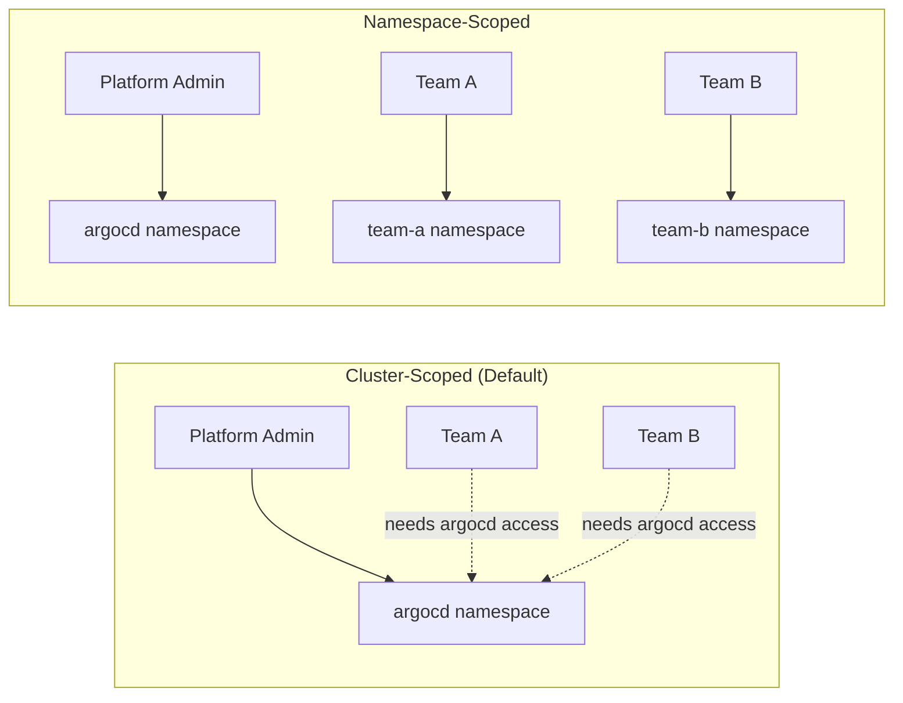
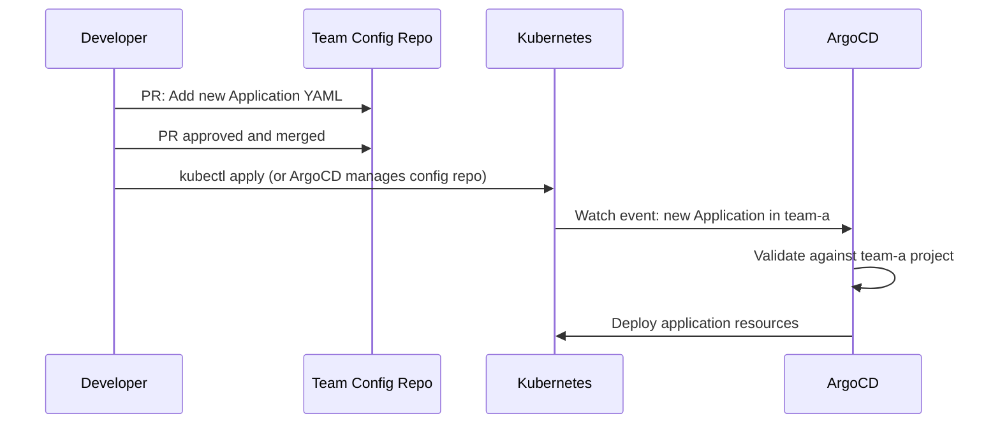

# How to Use Namespace-Scoped Applications in ArgoCD

Author: [nawazdhandala](https://github.com/nawazdhandala)

Tags: ArgoCD, GitOps, Kubernetes, Namespaces, Multi-Tenancy

Description: Learn how to create and manage ArgoCD Application resources scoped to specific namespaces for team isolation, self-service deployment, and reduced blast radius.

---

Namespace-scoped applications in ArgoCD allow teams to own and manage their Application custom resources within their own Kubernetes namespaces. Instead of all Application resources living in the centralized argocd namespace, each team creates applications in their team namespace. This pattern improves security, enables self-service, and aligns ArgoCD with Kubernetes-native multi-tenancy.

## Namespace-Scoped vs Cluster-Scoped

In standard ArgoCD, Application resources are effectively cluster-scoped in practice - they all live in one namespace (argocd), and access control happens through ArgoCD's internal RBAC. With namespace-scoped applications, you use Kubernetes-native RBAC to control who can create and manage Application resources.



## Setting Up Namespace-Scoped Applications

### Step 1: Enable Multi-Namespace Watch

Configure ArgoCD to watch team namespaces:

```yaml
apiVersion: v1
kind: ConfigMap
metadata:
  name: argocd-cmd-params-cm
  namespace: argocd
data:
  application.namespaces: "team-a, team-b, team-c"
```

Restart ArgoCD after applying:

```bash
kubectl apply -f argocd-cmd-params-cm.yaml
kubectl rollout restart deployment/argocd-server -n argocd
kubectl rollout restart statefulset/argocd-application-controller -n argocd
```

### Step 2: Create Team Namespaces

Set up namespaces with proper labels:

```yaml
apiVersion: v1
kind: Namespace
metadata:
  name: team-a
  labels:
    team: a
    argocd-enabled: "true"
---
apiVersion: v1
kind: Namespace
metadata:
  name: team-b
  labels:
    team: b
    argocd-enabled: "true"
```

### Step 3: Create Team-Specific Projects

Each team gets a project that restricts their access scope:

```yaml
apiVersion: argoproj.io/v1alpha1
kind: AppProject
metadata:
  name: team-a
  namespace: argocd
spec:
  description: "Team A's project"
  sourceNamespaces:
    - team-a
  sourceRepos:
    - 'https://github.com/myorg/team-a-*'
  destinations:
    - server: https://kubernetes.default.svc
      namespace: team-a-*
  namespaceResourceWhitelist:
    - group: '*'
      kind: '*'
```

### Step 4: Set Up Kubernetes RBAC

Grant teams permission to manage Application resources in their namespace:

```yaml
apiVersion: rbac.authorization.k8s.io/v1
kind: Role
metadata:
  name: application-manager
  namespace: team-a
rules:
  - apiGroups: ['argoproj.io']
    resources: ['applications']
    verbs: ['*']
  - apiGroups: ['argoproj.io']
    resources: ['applicationsets']
    verbs: ['*']
---
apiVersion: rbac.authorization.k8s.io/v1
kind: RoleBinding
metadata:
  name: team-a-app-managers
  namespace: team-a
roleRef:
  apiGroup: rbac.authorization.k8s.io
  kind: Role
  name: application-manager
subjects:
  - kind: Group
    name: team-a-members
    apiGroup: rbac.authorization.k8s.io
```

## Creating Namespace-Scoped Applications

Teams create Application resources in their own namespace:

```yaml
# Applied by team-a members to team-a namespace
apiVersion: argoproj.io/v1alpha1
kind: Application
metadata:
  name: user-service
  namespace: team-a
  finalizers:
    - resources-finalizer.argocd.argoproj.io
  labels:
    team: a
    service: user-service
spec:
  project: team-a
  source:
    repoURL: https://github.com/myorg/team-a-user-service.git
    targetRevision: main
    path: k8s/production
  destination:
    server: https://kubernetes.default.svc
    namespace: team-a-user-service
  syncPolicy:
    automated:
      prune: true
      selfHeal: true
    syncOptions:
      - CreateNamespace=true
```

```bash
# Team members apply to their own namespace
kubectl apply -f user-service-app.yaml -n team-a

# They can list their applications
kubectl get applications -n team-a

# And check status
kubectl describe application user-service -n team-a
```

## Self-Service Deployment Workflow

With namespace-scoped applications, teams can adopt a self-service workflow:



Teams can even use ArgoCD to manage their own Application definitions using a config repo:

```yaml
# Team A's meta-application - manages their Application resources
apiVersion: argoproj.io/v1alpha1
kind: Application
metadata:
  name: team-a-apps
  namespace: team-a
spec:
  project: team-a
  source:
    repoURL: https://github.com/myorg/team-a-config.git
    targetRevision: main
    path: argocd-apps
  destination:
    server: https://kubernetes.default.svc
    namespace: team-a  # Creates Application resources in team-a namespace
  syncPolicy:
    automated:
      prune: true
      selfHeal: true
```

The team's config repo contains their Application manifests:

```
team-a-config/
  argocd-apps/
    user-service.yaml
    order-service.yaml
    notification-service.yaml
```

## Accessing Namespace-Scoped Applications

### CLI Access

The ArgoCD CLI supports the `--app-namespace` flag:

```bash
# List all applications (across all namespaces)
argocd app list

# List applications in a specific namespace
argocd app list --app-namespace team-a

# Get details of a specific application
argocd app get user-service --app-namespace team-a

# Sync an application
argocd app sync user-service --app-namespace team-a

# Use the namespace/name format
argocd app get team-a/user-service
```

### UI Access

The ArgoCD UI automatically shows applications from all watched namespaces. Users can filter by project or namespace using the UI filters. The namespace where the Application lives is displayed alongside the application name.

### API Access

When using the ArgoCD API, include the `appNamespace` query parameter:

```bash
# Get application via API
curl -H "Authorization: Bearer $ARGOCD_TOKEN" \
  "https://argocd.example.com/api/v1/applications/user-service?appNamespace=team-a"
```

## Application Naming

When applications live in different namespaces, you can reuse names. Each namespace provides its own scope:

```yaml
# team-a/user-service - Team A's user service
apiVersion: argoproj.io/v1alpha1
kind: Application
metadata:
  name: user-service
  namespace: team-a

# team-b/user-service - Team B's user service (different app, same name)
apiVersion: argoproj.io/v1alpha1
kind: Application
metadata:
  name: user-service
  namespace: team-b
```

Both applications can coexist because they are in different namespaces. Reference them as `team-a/user-service` and `team-b/user-service`.

## Resource Quotas for Application Resources

To prevent teams from creating too many Application resources, use Kubernetes ResourceQuotas:

```yaml
apiVersion: v1
kind: ResourceQuota
metadata:
  name: argocd-app-quota
  namespace: team-a
spec:
  hard:
    count/applications.argoproj.io: "50"
    count/applicationsets.argoproj.io: "10"
```

This limits team-a to 50 Application resources and 10 ApplicationSet resources.

## Notifications for Namespace-Scoped Apps

ArgoCD Notifications works with namespace-scoped applications. Configure notification triggers as usual:

```yaml
# Annotation on the namespace-scoped Application
apiVersion: argoproj.io/v1alpha1
kind: Application
metadata:
  name: user-service
  namespace: team-a
  annotations:
    notifications.argoproj.io/subscribe.on-sync-succeeded.slack: team-a-deployments
    notifications.argoproj.io/subscribe.on-health-degraded.pagerduty: team-a-oncall
spec:
  # ...
```

## Cleanup and Lifecycle

When a team namespace is deleted, all Application resources in it are deleted by Kubernetes garbage collection. If those applications have finalizers, ArgoCD processes the cleanup:

```bash
# Deleting a team namespace triggers cleanup of all their applications
# WARNING: This deletes all their Application resources AND deployed resources
kubectl delete namespace team-a
```

To decommission a team's applications safely:

```bash
# Step 1: List all applications in the namespace
kubectl get applications -n team-a

# Step 2: Remove finalizers if you want to keep deployed resources
for app in $(kubectl get applications -n team-a -o jsonpath='{.items[*].metadata.name}'); do
  kubectl patch application "$app" -n team-a \
    --type json \
    -p '[{"op": "remove", "path": "/metadata/finalizers"}]'
done

# Step 3: Delete Application resources (deployed resources stay)
kubectl delete applications --all -n team-a
```

## Troubleshooting

### Application Created But Not Syncing

```bash
# Check that the namespace is in the watch list
kubectl get cm argocd-cmd-params-cm -n argocd -o jsonpath='{.data.application\.namespaces}'

# Check the project's sourceNamespaces
kubectl get appproject team-a -n argocd -o jsonpath='{.spec.sourceNamespaces}'

# Check controller logs for errors
kubectl logs -n argocd -l app.kubernetes.io/name=argocd-application-controller \
  --tail=200 | grep "team-a"
```

### Forbidden Error When Creating Application

This usually means the user does not have Kubernetes RBAC permission to create Application resources:

```bash
# Check RBAC permissions
kubectl auth can-i create applications.argoproj.io \
  -n team-a \
  --as user@example.com
```

Namespace-scoped applications bring ArgoCD closer to Kubernetes-native multi-tenancy. By distributing Application ownership to team namespaces, you enable self-service deployments while maintaining security through the project system and Kubernetes RBAC. For related configuration, see [restricting application namespaces](https://oneuptime.com/blog/post/2026-02-26-argocd-restrict-application-namespaces/view) and [configuring ArgoCD to watch multiple namespaces](https://oneuptime.com/blog/post/2026-02-26-argocd-configure-watch-multiple-namespaces/view).
