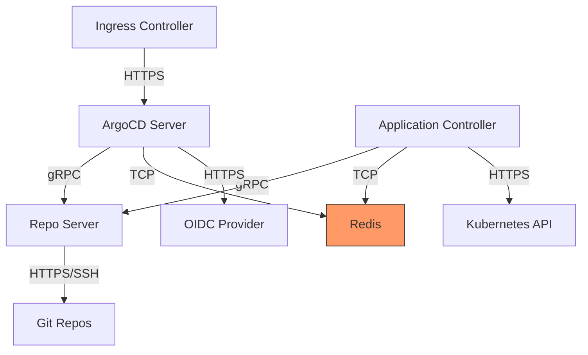

# How to Use Network Policies to Secure ArgoCD Components

Author: [nawazdhandala](https://github.com/nawazdhandala)

Tags: ArgoCD, GitOps, Kubernetes, Security, NetworkPolicy

Description: Learn how to create Kubernetes Network Policies to restrict traffic between ArgoCD components and protect against lateral movement attacks.

---

By default, Kubernetes allows all pods to communicate with each other. This means if an attacker compromises any pod in your cluster, they can reach ArgoCD's API server, Redis cache, and repo server. Network Policies restrict this communication to only what is necessary, significantly reducing the attack surface. This guide provides production-ready Network Policies for every ArgoCD component.

## Why Network Policies for ArgoCD

ArgoCD components have specific communication needs:



Without Network Policies, Redis (which has no authentication by default) is accessible to every pod in the cluster. An attacker in any namespace could connect to Redis and potentially extract cached data or poison the cache.

## Prerequisites

Network Policies require a CNI plugin that supports them. Common options include:

- Calico
- Cilium
- Weave Net
- Azure CNI

Check if your cluster supports Network Policies:

```bash
# Create a test network policy
kubectl apply -f - <<EOF
apiVersion: networking.k8s.io/v1
kind: NetworkPolicy
metadata:
  name: test-netpol
  namespace: default
spec:
  podSelector: {}
  policyTypes:
    - Ingress
EOF

# If no error, your CNI supports network policies
kubectl delete networkpolicy test-netpol -n default
```

## Default Deny Policy

Start with a default deny policy for the argocd namespace. This blocks all traffic by default, and then you add specific allow rules:

```yaml
apiVersion: networking.k8s.io/v1
kind: NetworkPolicy
metadata:
  name: default-deny-all
  namespace: argocd
spec:
  podSelector: {}
  policyTypes:
    - Ingress
    - Egress
```

**Important**: After applying this, all ArgoCD components will stop working until you add the allow rules below. Apply the deny policy and allow rules together.

## ArgoCD Server Network Policy

The ArgoCD server needs to accept connections from the ingress controller and communicate with the repo server, Redis, Dex, and Kubernetes API:

```yaml
apiVersion: networking.k8s.io/v1
kind: NetworkPolicy
metadata:
  name: argocd-server
  namespace: argocd
spec:
  podSelector:
    matchLabels:
      app.kubernetes.io/name: argocd-server
  policyTypes:
    - Ingress
    - Egress
  ingress:
    # Allow from ingress controller
    - from:
        - namespaceSelector:
            matchLabels:
              kubernetes.io/metadata.name: ingress-nginx
          podSelector:
            matchLabels:
              app.kubernetes.io/name: ingress-nginx
      ports:
        - port: 8080  # HTTP/HTTPS
          protocol: TCP
        - port: 8083  # gRPC
          protocol: TCP
    # Allow from application controller (for API calls)
    - from:
        - podSelector:
            matchLabels:
              app.kubernetes.io/name: argocd-application-controller
      ports:
        - port: 8080
          protocol: TCP
  egress:
    # DNS resolution
    - to:
        - namespaceSelector: {}
      ports:
        - port: 53
          protocol: UDP
        - port: 53
          protocol: TCP
    # Communication with repo server
    - to:
        - podSelector:
            matchLabels:
              app.kubernetes.io/name: argocd-repo-server
      ports:
        - port: 8081
          protocol: TCP
    # Communication with Redis
    - to:
        - podSelector:
            matchLabels:
              app.kubernetes.io/name: argocd-redis
      ports:
        - port: 6379
          protocol: TCP
    # Communication with Dex (SSO)
    - to:
        - podSelector:
            matchLabels:
              app.kubernetes.io/name: argocd-dex-server
      ports:
        - port: 5556
          protocol: TCP
        - port: 5557
          protocol: TCP
    # HTTPS to external OIDC providers and Kubernetes API
    - to:
        - ipBlock:
            cidr: 0.0.0.0/0
            except:
              - 10.0.0.0/8
              - 172.16.0.0/12
              - 192.168.0.0/16
      ports:
        - port: 443
          protocol: TCP
    # Kubernetes API (usually on 443 or 6443)
    - to:
        - ipBlock:
            cidr: 0.0.0.0/0
      ports:
        - port: 443
          protocol: TCP
        - port: 6443
          protocol: TCP
```

## Application Controller Network Policy

The application controller needs to talk to the Kubernetes API, repo server, and Redis:

```yaml
apiVersion: networking.k8s.io/v1
kind: NetworkPolicy
metadata:
  name: argocd-application-controller
  namespace: argocd
spec:
  podSelector:
    matchLabels:
      app.kubernetes.io/name: argocd-application-controller
  policyTypes:
    - Ingress
    - Egress
  ingress:
    # The controller does not typically receive inbound connections
    # but metrics scrapers may need access
    - from:
        - namespaceSelector:
            matchLabels:
              kubernetes.io/metadata.name: monitoring
      ports:
        - port: 8082
          protocol: TCP
  egress:
    # DNS
    - to:
        - namespaceSelector: {}
      ports:
        - port: 53
          protocol: UDP
        - port: 53
          protocol: TCP
    # Repo server
    - to:
        - podSelector:
            matchLabels:
              app.kubernetes.io/name: argocd-repo-server
      ports:
        - port: 8081
          protocol: TCP
    # Redis
    - to:
        - podSelector:
            matchLabels:
              app.kubernetes.io/name: argocd-redis
      ports:
        - port: 6379
          protocol: TCP
    # ArgoCD server API
    - to:
        - podSelector:
            matchLabels:
              app.kubernetes.io/name: argocd-server
      ports:
        - port: 8080
          protocol: TCP
    # Kubernetes API for all managed clusters
    - to:
        - ipBlock:
            cidr: 0.0.0.0/0
      ports:
        - port: 443
          protocol: TCP
        - port: 6443
          protocol: TCP
```

## Repo Server Network Policy

The repo server needs to reach Git repositories and Helm registries:

```yaml
apiVersion: networking.k8s.io/v1
kind: NetworkPolicy
metadata:
  name: argocd-repo-server
  namespace: argocd
spec:
  podSelector:
    matchLabels:
      app.kubernetes.io/name: argocd-repo-server
  policyTypes:
    - Ingress
    - Egress
  ingress:
    # Allow from ArgoCD server and application controller
    - from:
        - podSelector:
            matchLabels:
              app.kubernetes.io/name: argocd-server
        - podSelector:
            matchLabels:
              app.kubernetes.io/name: argocd-application-controller
      ports:
        - port: 8081
          protocol: TCP
  egress:
    # DNS
    - to:
        - namespaceSelector: {}
      ports:
        - port: 53
          protocol: UDP
        - port: 53
          protocol: TCP
    # HTTPS to Git repos and Helm registries
    - to:
        - ipBlock:
            cidr: 0.0.0.0/0
      ports:
        - port: 443
          protocol: TCP
        - port: 80
          protocol: TCP
    # SSH to Git repos
    - to:
        - ipBlock:
            cidr: 0.0.0.0/0
      ports:
        - port: 22
          protocol: TCP
```

## Redis Network Policy

Redis should only be accessible from ArgoCD components:

```yaml
apiVersion: networking.k8s.io/v1
kind: NetworkPolicy
metadata:
  name: argocd-redis
  namespace: argocd
spec:
  podSelector:
    matchLabels:
      app.kubernetes.io/name: argocd-redis
  policyTypes:
    - Ingress
    - Egress
  ingress:
    # Only allow ArgoCD components
    - from:
        - podSelector:
            matchLabels:
              app.kubernetes.io/name: argocd-server
        - podSelector:
            matchLabels:
              app.kubernetes.io/name: argocd-application-controller
      ports:
        - port: 6379
          protocol: TCP
  egress:
    # Redis does not need any egress
    # DNS only for HA mode with Sentinel
    - to:
        - namespaceSelector: {}
      ports:
        - port: 53
          protocol: UDP
```

## Dex Server Network Policy

```yaml
apiVersion: networking.k8s.io/v1
kind: NetworkPolicy
metadata:
  name: argocd-dex-server
  namespace: argocd
spec:
  podSelector:
    matchLabels:
      app.kubernetes.io/name: argocd-dex-server
  policyTypes:
    - Ingress
    - Egress
  ingress:
    # Allow from ArgoCD server only
    - from:
        - podSelector:
            matchLabels:
              app.kubernetes.io/name: argocd-server
      ports:
        - port: 5556
          protocol: TCP
        - port: 5557
          protocol: TCP
  egress:
    # DNS
    - to:
        - namespaceSelector: {}
      ports:
        - port: 53
          protocol: UDP
        - port: 53
          protocol: TCP
    # HTTPS to OIDC providers
    - to:
        - ipBlock:
            cidr: 0.0.0.0/0
      ports:
        - port: 443
          protocol: TCP
```

## Testing Network Policies

After applying all policies, verify that ArgoCD still works:

```bash
# Test ArgoCD UI access
curl -k https://argocd.example.com

# Test application sync
argocd app sync my-app

# Test repository connection
argocd repo list

# Verify Redis is not accessible from other namespaces
kubectl run test-pod --image=redis:7 -n default --rm -it -- \
  redis-cli -h argocd-redis.argocd.svc.cluster.local ping
# Expected: Connection timeout (blocked by network policy)
```

## Troubleshooting Network Policy Issues

If ArgoCD components cannot communicate after applying policies:

```bash
# Check if network policies are applied
kubectl get networkpolicy -n argocd

# Check pod labels match policy selectors
kubectl get pods -n argocd --show-labels

# Check if the CNI supports network policies
kubectl describe networkpolicy argocd-server -n argocd

# Temporarily remove default deny to test
kubectl delete networkpolicy default-deny-all -n argocd
```

## Conclusion

Network Policies are essential for securing ArgoCD in production. The default-deny approach ensures that only explicitly allowed communication happens. The most critical policy is restricting Redis access, as it often has no authentication. Apply all policies together (default deny plus all allow rules) to avoid breaking ArgoCD. Test thoroughly in a staging environment before applying to production.

For more security hardening, see our guide on [hardening ArgoCD server for production](https://oneuptime.com/blog/post/2026-02-26-argocd-harden-server-production/view).
