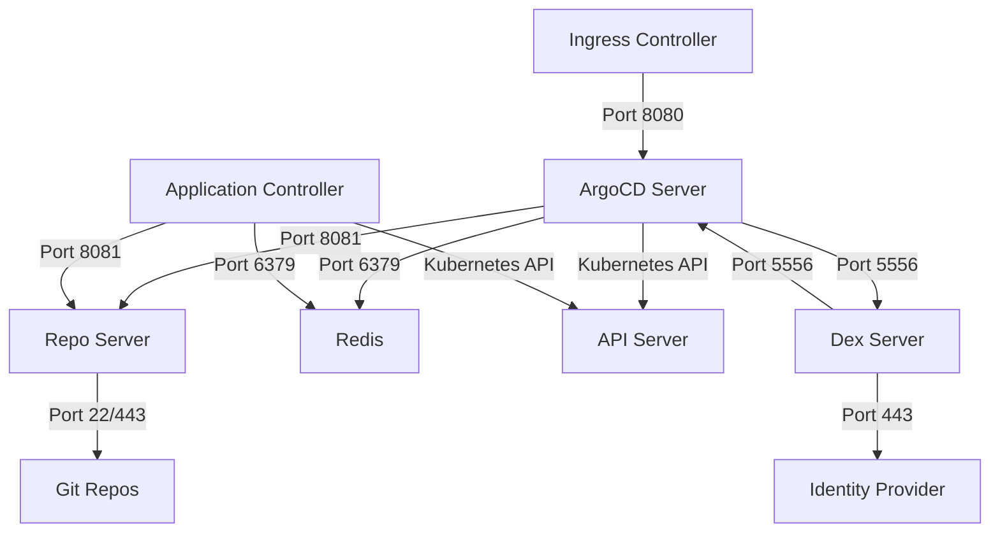

# How to Configure ArgoCD with Network Policies in Kubernetes

Author: [nawazdhandala](https://github.com/nawazdhandala)

Tags: ArgoCD, GitOps, Kubernetes, Network Policies, Security

Description: Secure ArgoCD components with Kubernetes Network Policies to control traffic flow between pods, namespaces, and external services in your cluster.

---

Kubernetes Network Policies act as a firewall for pod-to-pod communication. By default, all pods can talk to all other pods in a cluster. In production, you want to lock this down so that only authorized traffic reaches your ArgoCD components. This guide shows you how to create Network Policies that secure ArgoCD without breaking its functionality.

## Understanding ArgoCD's Network Requirements

ArgoCD consists of several components that need to communicate with each other and external services. Before writing policies, you need to understand the traffic patterns:



Key traffic flows:

- **Ingress to ArgoCD Server**: Web UI and API access
- **ArgoCD Server to Repo Server**: Fetching manifests
- **ArgoCD Server to Redis**: Caching
- **Application Controller to Repo Server**: Generating manifests
- **Application Controller to Redis**: Caching
- **Application Controller to Kubernetes API**: Managing resources
- **Repo Server to Git Repos**: Cloning repositories
- **Dex to Identity Providers**: SSO authentication

## Default Deny Policy

Start with a default deny policy that blocks all traffic in the ArgoCD namespace. Then add explicit allow rules for each required flow:

```yaml
apiVersion: networking.k8s.io/v1
kind: NetworkPolicy
metadata:
  name: default-deny-all
  namespace: argocd
spec:
  podSelector: {}
  policyTypes:
    - Ingress
    - Egress
```

This blocks everything. Now add allow rules one by one.

## ArgoCD Server Network Policy

The ArgoCD server needs inbound traffic from the ingress and outbound to several services:

```yaml
apiVersion: networking.k8s.io/v1
kind: NetworkPolicy
metadata:
  name: argocd-server
  namespace: argocd
spec:
  podSelector:
    matchLabels:
      app.kubernetes.io/name: argocd-server
  policyTypes:
    - Ingress
    - Egress
  ingress:
    # Allow traffic from the ingress controller
    - from:
        - namespaceSelector:
            matchLabels:
              kubernetes.io/metadata.name: ingress-nginx
      ports:
        - port: 8080
          protocol: TCP
        - port: 8443
          protocol: TCP
    # Allow traffic from Dex for SSO callbacks
    - from:
        - podSelector:
            matchLabels:
              app.kubernetes.io/name: argocd-dex-server
      ports:
        - port: 8080
          protocol: TCP
  egress:
    # Allow DNS resolution
    - to:
        - namespaceSelector: {}
          podSelector:
            matchLabels:
              k8s-app: kube-dns
      ports:
        - port: 53
          protocol: UDP
        - port: 53
          protocol: TCP
    # Allow access to the Repo Server
    - to:
        - podSelector:
            matchLabels:
              app.kubernetes.io/name: argocd-repo-server
      ports:
        - port: 8081
          protocol: TCP
    # Allow access to Redis
    - to:
        - podSelector:
            matchLabels:
              app.kubernetes.io/name: argocd-redis
      ports:
        - port: 6379
          protocol: TCP
    # Allow access to Dex
    - to:
        - podSelector:
            matchLabels:
              app.kubernetes.io/name: argocd-dex-server
      ports:
        - port: 5556
          protocol: TCP
        - port: 5557
          protocol: TCP
    # Allow access to Kubernetes API
    - to:
        - ipBlock:
            cidr: 0.0.0.0/0
      ports:
        - port: 443
          protocol: TCP
        - port: 6443
          protocol: TCP
```

## Application Controller Network Policy

The application controller manages the lifecycle of applications and needs access to the Kubernetes API and repo server:

```yaml
apiVersion: networking.k8s.io/v1
kind: NetworkPolicy
metadata:
  name: argocd-application-controller
  namespace: argocd
spec:
  podSelector:
    matchLabels:
      app.kubernetes.io/name: argocd-application-controller
  policyTypes:
    - Ingress
    - Egress
  ingress:
    # Allow metrics scraping (if using Prometheus)
    - from:
        - namespaceSelector:
            matchLabels:
              kubernetes.io/metadata.name: monitoring
      ports:
        - port: 8082
          protocol: TCP
  egress:
    # DNS
    - to:
        - namespaceSelector: {}
          podSelector:
            matchLabels:
              k8s-app: kube-dns
      ports:
        - port: 53
          protocol: UDP
        - port: 53
          protocol: TCP
    # Repo Server
    - to:
        - podSelector:
            matchLabels:
              app.kubernetes.io/name: argocd-repo-server
      ports:
        - port: 8081
          protocol: TCP
    # Redis
    - to:
        - podSelector:
            matchLabels:
              app.kubernetes.io/name: argocd-redis
      ports:
        - port: 6379
          protocol: TCP
    # Kubernetes API (for all managed clusters)
    - to:
        - ipBlock:
            cidr: 0.0.0.0/0
      ports:
        - port: 443
          protocol: TCP
        - port: 6443
          protocol: TCP
```

## Repo Server Network Policy

The repo server clones Git repositories and generates manifests:

```yaml
apiVersion: networking.k8s.io/v1
kind: NetworkPolicy
metadata:
  name: argocd-repo-server
  namespace: argocd
spec:
  podSelector:
    matchLabels:
      app.kubernetes.io/name: argocd-repo-server
  policyTypes:
    - Ingress
    - Egress
  ingress:
    # Allow from ArgoCD Server
    - from:
        - podSelector:
            matchLabels:
              app.kubernetes.io/name: argocd-server
      ports:
        - port: 8081
          protocol: TCP
    # Allow from Application Controller
    - from:
        - podSelector:
            matchLabels:
              app.kubernetes.io/name: argocd-application-controller
      ports:
        - port: 8081
          protocol: TCP
  egress:
    # DNS
    - to:
        - namespaceSelector: {}
          podSelector:
            matchLabels:
              k8s-app: kube-dns
      ports:
        - port: 53
          protocol: UDP
        - port: 53
          protocol: TCP
    # Git repos over HTTPS
    - to:
        - ipBlock:
            cidr: 0.0.0.0/0
      ports:
        - port: 443
          protocol: TCP
    # Git repos over SSH
    - to:
        - ipBlock:
            cidr: 0.0.0.0/0
      ports:
        - port: 22
          protocol: TCP
    # Helm repos over HTTPS
    - to:
        - ipBlock:
            cidr: 0.0.0.0/0
      ports:
        - port: 443
          protocol: TCP
```

## Redis Network Policy

Redis should only accept connections from ArgoCD components:

```yaml
apiVersion: networking.k8s.io/v1
kind: NetworkPolicy
metadata:
  name: argocd-redis
  namespace: argocd
spec:
  podSelector:
    matchLabels:
      app.kubernetes.io/name: argocd-redis
  policyTypes:
    - Ingress
    - Egress
  ingress:
    - from:
        - podSelector:
            matchLabels:
              app.kubernetes.io/name: argocd-server
        - podSelector:
            matchLabels:
              app.kubernetes.io/name: argocd-application-controller
      ports:
        - port: 6379
          protocol: TCP
  egress: []
```

## Dex Server Network Policy

If you use Dex for SSO:

```yaml
apiVersion: networking.k8s.io/v1
kind: NetworkPolicy
metadata:
  name: argocd-dex-server
  namespace: argocd
spec:
  podSelector:
    matchLabels:
      app.kubernetes.io/name: argocd-dex-server
  policyTypes:
    - Ingress
    - Egress
  ingress:
    - from:
        - podSelector:
            matchLabels:
              app.kubernetes.io/name: argocd-server
      ports:
        - port: 5556
          protocol: TCP
        - port: 5557
          protocol: TCP
  egress:
    # DNS
    - to:
        - namespaceSelector: {}
          podSelector:
            matchLabels:
              k8s-app: kube-dns
      ports:
        - port: 53
          protocol: UDP
        - port: 53
          protocol: TCP
    # Identity providers over HTTPS
    - to:
        - ipBlock:
            cidr: 0.0.0.0/0
      ports:
        - port: 443
          protocol: TCP
    # ArgoCD Server callback
    - to:
        - podSelector:
            matchLabels:
              app.kubernetes.io/name: argocd-server
      ports:
        - port: 8080
          protocol: TCP
```

## Testing Network Policies

After applying policies, verify ArgoCD still works:

```bash
# Apply all policies
kubectl apply -f network-policies/

# Check that ArgoCD server is still accessible
kubectl port-forward svc/argocd-server -n argocd 8080:80
curl http://localhost:8080/healthz

# Check that applications can sync
argocd app sync my-app

# Check repo server can reach Git
kubectl logs -n argocd -l app.kubernetes.io/name=argocd-repo-server

# Check application controller logs
kubectl logs -n argocd -l app.kubernetes.io/name=argocd-application-controller
```

## Troubleshooting

**ArgoCD UI not loading**: The ingress controller namespace label might not match. Check:

```bash
kubectl get namespace ingress-nginx --show-labels
```

**Applications stuck in "Unknown" state**: The application controller cannot reach the Kubernetes API. Check the egress rule for API server access.

**Repo sync failures**: The repo server cannot reach Git repositories. Verify the egress rules allow ports 22 and 443.

**SSO not working**: Dex cannot reach the identity provider. Check Dex egress rules for port 443.

For more on securing ArgoCD, see [configuring RBAC policies in ArgoCD](https://oneuptime.com/blog/post/2026-01-25-rbac-policies-argocd/view) and [ArgoCD SSO with OIDC](https://oneuptime.com/blog/post/2026-01-25-sso-oidc-argocd/view).
