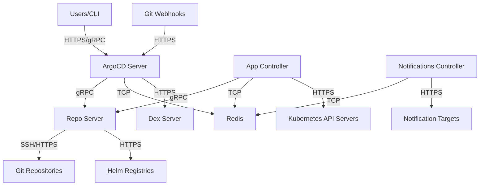

# How to Implement Network Segmentation for ArgoCD

Author: [nawazdhandala](https://github.com/nawazdhandala)

Tags: ArgoCD, GitOps, Kubernetes, Network Security, Zero Trust

Description: Learn how to implement network segmentation for ArgoCD to isolate components, restrict traffic flows, and apply zero-trust networking principles to your GitOps infrastructure.

---

ArgoCD consists of multiple components that communicate with each other, external Git repositories, container registries, and Kubernetes API servers across clusters. Without proper network segmentation, a compromise of any single component could allow lateral movement to the entire deployment infrastructure. This guide shows you how to implement network segmentation to contain the blast radius of any security incident.

## ArgoCD Network Architecture

Before segmenting, you need to understand the traffic flows:



Each arrow represents a traffic flow that should be explicitly allowed, with everything else denied by default.

## Default Deny Policy

Start by denying all traffic in the ArgoCD namespace:

```yaml
apiVersion: networking.k8s.io/v1
kind: NetworkPolicy
metadata:
  name: default-deny-all
  namespace: argocd
spec:
  podSelector: {}
  policyTypes:
    - Ingress
    - Egress
```

This blocks everything. Now we selectively allow only what is needed.

## ArgoCD Server Network Policy

The server needs to accept user traffic and communicate with internal components:

```yaml
apiVersion: networking.k8s.io/v1
kind: NetworkPolicy
metadata:
  name: argocd-server
  namespace: argocd
spec:
  podSelector:
    matchLabels:
      app.kubernetes.io/name: argocd-server
  policyTypes:
    - Ingress
    - Egress
  ingress:
    # Accept traffic from ingress controller
    - from:
        - namespaceSelector:
            matchLabels:
              kubernetes.io/metadata.name: ingress-nginx
      ports:
        - port: 8080
          protocol: TCP
        - port: 8083
          protocol: TCP  # Metrics
  egress:
    # To Repo Server
    - to:
        - podSelector:
            matchLabels:
              app.kubernetes.io/name: argocd-repo-server
      ports:
        - port: 8081
          protocol: TCP
    # To Redis
    - to:
        - podSelector:
            matchLabels:
              app.kubernetes.io/name: argocd-redis
      ports:
        - port: 6379
          protocol: TCP
    # To Dex
    - to:
        - podSelector:
            matchLabels:
              app.kubernetes.io/name: argocd-dex-server
      ports:
        - port: 5556
          protocol: TCP
        - port: 5557
          protocol: TCP
    # To Kubernetes API (for application status)
    - to:
        - ipBlock:
            cidr: 0.0.0.0/0
      ports:
        - port: 443
          protocol: TCP
        - port: 6443
          protocol: TCP
    # DNS resolution
    - to:
        - namespaceSelector: {}
      ports:
        - port: 53
          protocol: TCP
        - port: 53
          protocol: UDP
```

## Application Controller Network Policy

The controller needs to reach the Kubernetes API and the repo server:

```yaml
apiVersion: networking.k8s.io/v1
kind: NetworkPolicy
metadata:
  name: argocd-application-controller
  namespace: argocd
spec:
  podSelector:
    matchLabels:
      app.kubernetes.io/name: argocd-application-controller
  policyTypes:
    - Ingress
    - Egress
  ingress:
    # Accept metrics scraping from monitoring
    - from:
        - namespaceSelector:
            matchLabels:
              kubernetes.io/metadata.name: monitoring
      ports:
        - port: 8082
          protocol: TCP
  egress:
    # To Repo Server
    - to:
        - podSelector:
            matchLabels:
              app.kubernetes.io/name: argocd-repo-server
      ports:
        - port: 8081
          protocol: TCP
    # To Redis
    - to:
        - podSelector:
            matchLabels:
              app.kubernetes.io/name: argocd-redis
      ports:
        - port: 6379
          protocol: TCP
    # To Kubernetes API servers (all clusters)
    - to:
        - ipBlock:
            cidr: 0.0.0.0/0
      ports:
        - port: 443
          protocol: TCP
        - port: 6443
          protocol: TCP
    # DNS
    - to:
        - namespaceSelector: {}
      ports:
        - port: 53
          protocol: TCP
        - port: 53
          protocol: UDP
```

## Repo Server Network Policy

The repo server needs to reach Git repositories and Helm registries:

```yaml
apiVersion: networking.k8s.io/v1
kind: NetworkPolicy
metadata:
  name: argocd-repo-server
  namespace: argocd
spec:
  podSelector:
    matchLabels:
      app.kubernetes.io/name: argocd-repo-server
  policyTypes:
    - Ingress
    - Egress
  ingress:
    # Accept from ArgoCD Server
    - from:
        - podSelector:
            matchLabels:
              app.kubernetes.io/name: argocd-server
      ports:
        - port: 8081
          protocol: TCP
    # Accept from Application Controller
    - from:
        - podSelector:
            matchLabels:
              app.kubernetes.io/name: argocd-application-controller
      ports:
        - port: 8081
          protocol: TCP
    # Accept metrics from monitoring
    - from:
        - namespaceSelector:
            matchLabels:
              kubernetes.io/metadata.name: monitoring
      ports:
        - port: 8084
          protocol: TCP
  egress:
    # To Git repositories (HTTPS)
    - to:
        - ipBlock:
            cidr: 0.0.0.0/0
      ports:
        - port: 443
          protocol: TCP
    # To Git repositories (SSH)
    - to:
        - ipBlock:
            cidr: 0.0.0.0/0
      ports:
        - port: 22
          protocol: TCP
    # DNS
    - to:
        - namespaceSelector: {}
      ports:
        - port: 53
          protocol: TCP
        - port: 53
          protocol: UDP
```

## Redis Network Policy

Redis should only be accessible by ArgoCD components:

```yaml
apiVersion: networking.k8s.io/v1
kind: NetworkPolicy
metadata:
  name: argocd-redis
  namespace: argocd
spec:
  podSelector:
    matchLabels:
      app.kubernetes.io/name: argocd-redis
  policyTypes:
    - Ingress
    - Egress
  ingress:
    # Only ArgoCD components can access Redis
    - from:
        - podSelector:
            matchLabels:
              app.kubernetes.io/part-of: argocd
      ports:
        - port: 6379
          protocol: TCP
  egress:
    # Redis should not initiate any outbound connections
    # Exception: DNS for Redis Sentinel/HA
    - to:
        - namespaceSelector: {}
      ports:
        - port: 53
          protocol: TCP
        - port: 53
          protocol: UDP
```

## Dex Server Network Policy

```yaml
apiVersion: networking.k8s.io/v1
kind: NetworkPolicy
metadata:
  name: argocd-dex-server
  namespace: argocd
spec:
  podSelector:
    matchLabels:
      app.kubernetes.io/name: argocd-dex-server
  policyTypes:
    - Ingress
    - Egress
  ingress:
    # Only ArgoCD Server can access Dex
    - from:
        - podSelector:
            matchLabels:
              app.kubernetes.io/name: argocd-server
      ports:
        - port: 5556
          protocol: TCP
        - port: 5557
          protocol: TCP
    # Callback from external identity provider
    - from:
        - namespaceSelector:
            matchLabels:
              kubernetes.io/metadata.name: ingress-nginx
      ports:
        - port: 5556
          protocol: TCP
  egress:
    # To identity providers (OIDC, LDAP, etc.)
    - to:
        - ipBlock:
            cidr: 0.0.0.0/0
      ports:
        - port: 443
          protocol: TCP
        - port: 636
          protocol: TCP  # LDAPS
    # DNS
    - to:
        - namespaceSelector: {}
      ports:
        - port: 53
          protocol: TCP
        - port: 53
          protocol: UDP
```

## Notifications Controller Network Policy

```yaml
apiVersion: networking.k8s.io/v1
kind: NetworkPolicy
metadata:
  name: argocd-notifications
  namespace: argocd
spec:
  podSelector:
    matchLabels:
      app.kubernetes.io/name: argocd-notifications-controller
  policyTypes:
    - Ingress
    - Egress
  ingress:
    # Metrics only
    - from:
        - namespaceSelector:
            matchLabels:
              kubernetes.io/metadata.name: monitoring
      ports:
        - port: 9001
          protocol: TCP
  egress:
    # To Redis
    - to:
        - podSelector:
            matchLabels:
              app.kubernetes.io/name: argocd-redis
      ports:
        - port: 6379
          protocol: TCP
    # To notification targets (Slack, email, webhooks)
    - to:
        - ipBlock:
            cidr: 0.0.0.0/0
      ports:
        - port: 443
          protocol: TCP
        - port: 587
          protocol: TCP  # SMTP
        - port: 465
          protocol: TCP  # SMTPS
    # DNS
    - to:
        - namespaceSelector: {}
      ports:
        - port: 53
          protocol: TCP
        - port: 53
          protocol: UDP
```

## Restricting Git Repository Access

If you know the IP ranges of your Git provider, restrict the repo server egress further:

```yaml
# GitHub IP ranges (check https://api.github.com/meta for current ranges)
egress:
  - to:
      - ipBlock:
          cidr: 140.82.112.0/20  # GitHub
      - ipBlock:
          cidr: 143.55.64.0/20   # GitHub
    ports:
      - port: 443
        protocol: TCP
      - port: 22
        protocol: TCP
```

## Service Mesh Integration

If you use Istio, apply strict mTLS between ArgoCD components:

```yaml
apiVersion: security.istio.io/v1beta1
kind: PeerAuthentication
metadata:
  name: argocd-strict-mtls
  namespace: argocd
spec:
  mtls:
    mode: STRICT
---
apiVersion: security.istio.io/v1beta1
kind: AuthorizationPolicy
metadata:
  name: argocd-server-authz
  namespace: argocd
spec:
  selector:
    matchLabels:
      app.kubernetes.io/name: argocd-server
  rules:
    - from:
        - source:
            namespaces: ["ingress-nginx"]
      to:
        - operation:
            ports: ["8080"]
```

## Verifying Network Segmentation

Test that your policies work:

```bash
# Test that Redis is not accessible from outside ArgoCD namespace
kubectl run test-pod --rm -it --image=busybox -n default -- \
  nc -zv argocd-redis.argocd.svc.cluster.local 6379
# Should fail: connection refused or timeout

# Test that the repo server can reach GitHub
kubectl exec -n argocd deployment/argocd-repo-server -- \
  curl -s -o /dev/null -w "%{http_code}" https://github.com
# Should return 200

# Test that the repo server CANNOT reach internal services it should not
kubectl exec -n argocd deployment/argocd-repo-server -- \
  nc -zv some-internal-service.default.svc.cluster.local 80
# Should fail
```

## Complete Policy Set

Apply all policies at once:

```bash
# Apply all network policies
kubectl apply -f network-policies/

# Verify they are active
kubectl get networkpolicy -n argocd

# Watch for any blocked connections in the logs
kubectl logs -n argocd deployment/argocd-server | grep -i "connection refused\|timeout"
kubectl logs -n argocd deployment/argocd-application-controller | grep -i "connection refused\|timeout"
```

Network segmentation is a fundamental security control for ArgoCD. By restricting traffic to only what is necessary, you limit the blast radius of any compromise and make it much harder for an attacker to move laterally through your infrastructure. For more on ArgoCD security, see our guide on [securing the GitOps pipeline](https://oneuptime.com/blog/post/2026-02-26-argocd-secure-gitops-pipeline/view).
