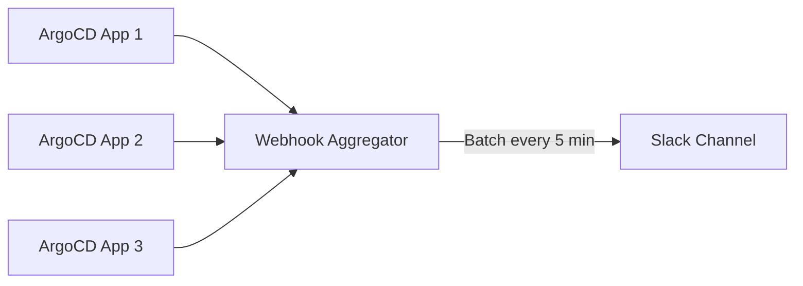

# How to Handle Notification Rate Limiting in ArgoCD

Author: [nawazdhandala](https://github.com/nawazdhandala)

Tags: ArgoCD, GitOps, Kubernetes, Notifications, DevOps

Description: Learn how to handle and prevent ArgoCD notification rate limiting by configuring oncePer deduplication, adjusting reconciliation intervals.

---

When you manage hundreds of ArgoCD applications, notification volume can become a serious problem. A single cluster outage can trigger thousands of notifications in minutes. Slack starts dropping messages, PagerDuty generates alert storms, and email inboxes become unusable. This guide covers how to handle rate limiting from notification services and how to architect your notification system to prevent message floods.

## Understanding Where Rate Limits Hit

Rate limiting in ArgoCD notifications happens at multiple levels:

1. **ArgoCD reconciliation loop** - the controller evaluates triggers every reconciliation cycle (default 3 minutes)
2. **oncePer deduplication** - ArgoCD's built-in mechanism to prevent duplicate notifications
3. **Service-side rate limits** - Slack, PagerDuty, email providers, and webhooks all have their own rate limits

### Common Service Rate Limits

- **Slack**: 1 message per second per channel, 50 messages per minute for web API
- **PagerDuty**: 120 events per minute per integration key
- **Email (SMTP)**: varies by provider, Gmail limits to 500/day for free accounts
- **Microsoft Teams**: 4 messages per second per connector
- **Webhooks**: depends entirely on the receiving service

## Using oncePer to Control Volume

The `oncePer` field is your primary tool for preventing notification floods. It tells ArgoCD to send a notification only once per unique value of the expression:

```yaml
apiVersion: v1
kind: ConfigMap
metadata:
  name: argocd-notifications-cm
  namespace: argocd
data:
  # Good: one notification per revision that causes OutOfSync
  trigger.on-outofsync: |
    - when: app.status.sync.status == 'OutOfSync'
      oncePer: app.status.sync.revision
      send:
        - app-outofsync

  # Good: one notification per sync operation
  trigger.on-sync-failed: |
    - when: app.status.operationState != nil and app.status.operationState.phase in ['Error', 'Failed']
      oncePer: app.status.operationState.finishedAt
      send:
        - sync-failed

  # Bad: no oncePer means notification every reconciliation cycle
  trigger.on-degraded-noisy: |
    - when: app.status.health.status == 'Degraded'
      send:
        - app-degraded
```

### Choosing the Right oncePer Expression

The expression you use for `oncePer` determines how aggressively deduplication works:

```yaml
  # Very aggressive dedup: one notification per app, ever
  # Useful for one-time setup notifications
  oncePer: app.metadata.name

  # Standard dedup: one notification per revision
  # Good for sync status changes
  oncePer: app.status.sync.revision

  # Per-operation dedup: one notification per sync attempt
  # Good for operation results
  oncePer: app.status.operationState.finishedAt

  # Composite dedup: one notification per health+revision combo
  # Good for health changes that correlate with deployments
  oncePer: app.status.health.status + '/' + app.status.sync.revision
```

## Adjusting Reconciliation Interval

ArgoCD reconciles applications on a fixed interval. Reducing the frequency reduces how often triggers are evaluated:

```bash
# Check current reconciliation timeout
kubectl get configmap argocd-cm -n argocd -o json | \
  jq -r '.data["timeout.reconciliation"]'

# Set reconciliation to 5 minutes (default is 180 seconds / 3 minutes)
kubectl patch configmap argocd-cm -n argocd --type merge -p '{"data":{"timeout.reconciliation":"300s"}}'
```

Increasing the reconciliation interval means notifications arrive less frequently but also means ArgoCD detects changes more slowly. Find the right balance for your environment.

## Implementing Notification Aggregation

ArgoCD does not natively support notification aggregation (batching multiple events into a single message), but you can achieve it with an intermediate webhook:

```yaml
  # Send notifications to an aggregation webhook instead of directly to Slack
  service.webhook.notification-aggregator: |
    url: http://notification-aggregator.argocd.svc.cluster.local:8080/events
    headers:
      - name: Content-Type
        value: application/json

  template.app-event: |
    webhook:
      notification-aggregator:
        method: POST
        body: |
          {
            "app": "{{.app.metadata.name}}",
            "event": "{{.app.status.operationState.phase}}",
            "health": "{{.app.status.health.status}}",
            "sync": "{{.app.status.sync.status}}",
            "timestamp": "{{.app.status.operationState.finishedAt}}"
          }
```

The aggregation service collects events for a time window and sends a single summary message:



## Preventing Alert Storms During Outages

When a cluster or Git server goes down, every application goes OutOfSync or Degraded simultaneously. Without protection, this creates an alert storm.

### Strategy 1: Use Project-Level Notifications Only

Instead of per-application notifications, use project-level subscriptions so you get one notification pattern per project, not per application:

```yaml
apiVersion: argoproj.io/v1alpha1
kind: AppProject
metadata:
  name: production
  annotations:
    notifications.argoproj.io/subscribe.on-sync-failed.slack: prod-alerts
```

### Strategy 2: Environment-Specific Triggers with Aggregation

Create triggers that only fire for high-priority applications during mass events:

```yaml
  trigger.on-critical-app-degraded: |
    - when: >
        app.status.health.status == 'Degraded' and
        app.metadata.labels['criticality'] == 'high'
      oncePer: app.status.health.status + app.status.sync.revision
      send:
        - critical-degraded
```

This filters out notifications for non-critical applications, reducing the total volume significantly.

### Strategy 3: Rate-Limited Webhook Proxy

Deploy a simple rate-limiting proxy between ArgoCD and your notification services:

```yaml
apiVersion: apps/v1
kind: Deployment
metadata:
  name: notification-rate-limiter
  namespace: argocd
spec:
  replicas: 1
  template:
    spec:
      containers:
        - name: rate-limiter
          image: nginx:alpine
          ports:
            - containerPort: 8080
          volumeMounts:
            - name: config
              mountPath: /etc/nginx/conf.d
      volumes:
        - name: config
          configMap:
            name: rate-limiter-config
---
apiVersion: v1
kind: ConfigMap
metadata:
  name: rate-limiter-config
  namespace: argocd
data:
  default.conf: |
    limit_req_zone $binary_remote_addr zone=notifications:10m rate=10r/m;
    server {
      listen 8080;
      location / {
        limit_req zone=notifications burst=5;
        proxy_pass https://hooks.slack.com;
      }
    }
```

## Handling Slack Rate Limit Responses

When Slack rate limits your bot, it returns HTTP 429 with a `Retry-After` header. The ArgoCD notifications controller does not automatically retry, so the notification is lost.

To mitigate this:

1. **Reduce notification frequency** using oncePer and longer reconciliation intervals
2. **Use fewer channels** - sending the same notification to 5 channels means 5x the API calls
3. **Use webhook mode** instead of the Slack web API when possible

Check if you are being rate limited:

```bash
# Look for 429 responses in controller logs
kubectl logs -n argocd -l app.kubernetes.io/component=notifications-controller | grep "429\|rate.limit\|too many"
```

## Monitoring Notification Volume

Track how many notifications you are sending to detect volume problems before they hit rate limits:

```yaml
# Prometheus alert for high notification volume
- alert: ArgoCDHighNotificationVolume
  expr: |
    sum(rate(argocd_notifications_deliveries_total[5m])) > 1
  for: 10m
  labels:
    severity: warning
  annotations:
    summary: "ArgoCD sending more than 1 notification per second"
    description: "High notification volume may trigger rate limiting from external services."
```

## Best Practices Summary

**Always use oncePer**: This is the single most important setting for preventing notification floods. Every trigger should have an oncePer expression.

**Start with project-level subscriptions**: Use project subscriptions as the default, and only add application-level subscriptions for critical services that need specific routing.

**Use separate services for different urgency levels**: Route critical alerts through PagerDuty (which handles its own deduplication) and informational alerts through Slack.

**Monitor your notification volume**: Track the `argocd_notifications_deliveries_total` metric and alert when volume spikes unexpectedly.

**Test with realistic scale**: If you have 500 applications, test your notification configuration with 500 applications. Rate limiting issues only appear at scale.

**Consider notification aggregation for large deployments**: If you routinely deploy 50+ applications at once, an aggregation layer between ArgoCD and your notification services will prevent alert storms.

Rate limiting is a signal that your notification strategy needs refinement. Focus on sending fewer, more meaningful notifications rather than trying to work around service limits. For more on notification configuration, see [configuring notification triggers](https://oneuptime.com/blog/post/2026-02-26-argocd-notification-triggers-sync-status/view) and [monitoring notification system health](https://oneuptime.com/blog/post/2026-02-26-argocd-monitor-notification-system-health/view).
