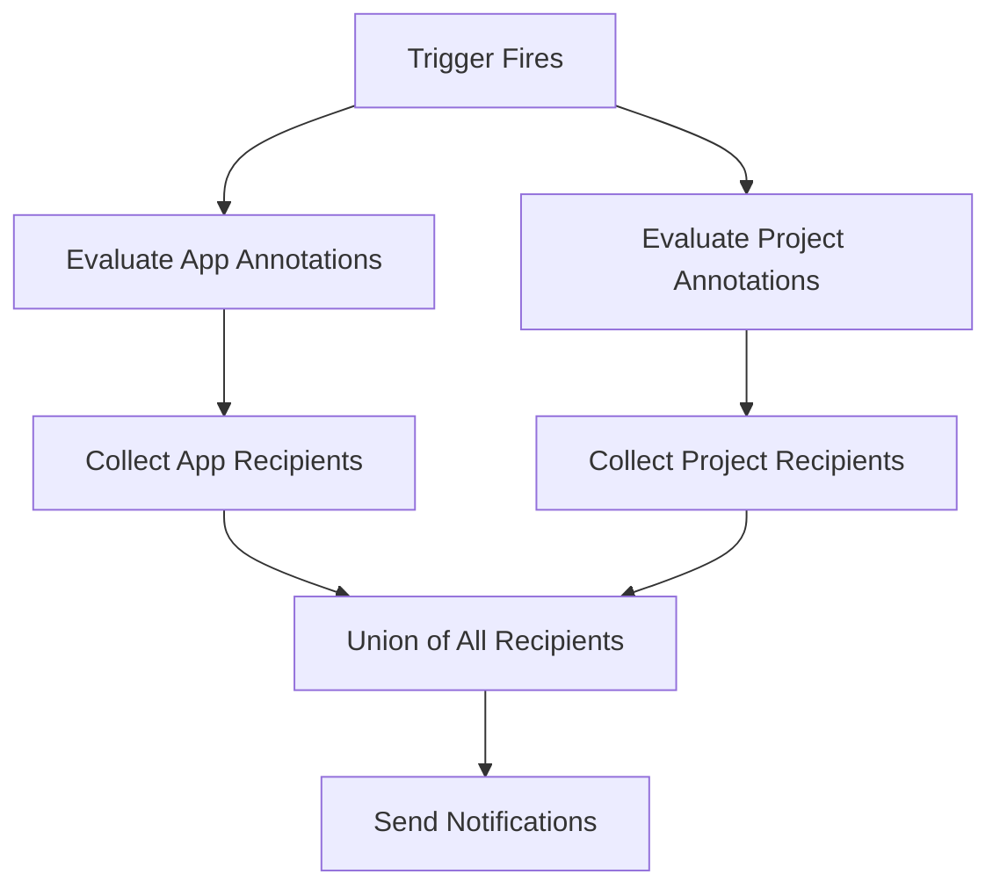

# How to Use Notification Subscriptions with Annotations in ArgoCD

Author: [nawazdhandala](https://github.com/nawazdhandala)

Tags: ArgoCD, GitOps, Kubernetes, Notifications, Automation

Description: Learn how to use annotation-based notification subscriptions in ArgoCD to manage alerting at scale, including patterns for bulk annotation management and template-driven subscriptions.

---

ArgoCD notification subscriptions are driven entirely by annotations. This design choice means notification routing is part of your application manifest, lives in Git alongside your code, and follows the same review and approval process. This guide dives deep into annotation-based subscription patterns, bulk management strategies, and advanced techniques for handling notifications at scale.

## The Annotation-Based Subscription Model

Every notification subscription in ArgoCD is expressed as a Kubernetes annotation on either an Application or an AppProject resource. The format is:

```text
notifications.argoproj.io/subscribe.<trigger>.<service>: <recipient>
```

Breaking this down:
- `notifications.argoproj.io/subscribe` - the fixed prefix that the notifications controller watches
- `<trigger>` - the trigger name defined in `argocd-notifications-cm`
- `<service>` - the service name (slack, email, pagerduty, webhook, etc.)
- `<recipient>` - the channel, email address, or other service-specific recipient

## Basic Annotation Patterns

### Single Trigger, Single Service

```yaml
metadata:
  annotations:
    notifications.argoproj.io/subscribe.on-sync-failed.slack: alerts
```

### Single Trigger, Multiple Recipients

Separate recipients with semicolons:

```yaml
metadata:
  annotations:
    notifications.argoproj.io/subscribe.on-sync-failed.slack: alerts;team-backend
```

### Multiple Triggers, Same Service

Each trigger gets its own annotation:

```yaml
metadata:
  annotations:
    notifications.argoproj.io/subscribe.on-sync-failed.slack: alerts
    notifications.argoproj.io/subscribe.on-sync-succeeded.slack: deployments
    notifications.argoproj.io/subscribe.on-health-degraded.slack: alerts
```

### Same Trigger, Multiple Services

```yaml
metadata:
  annotations:
    notifications.argoproj.io/subscribe.on-sync-failed.slack: alerts
    notifications.argoproj.io/subscribe.on-sync-failed.email: oncall@company.com
    notifications.argoproj.io/subscribe.on-sync-failed.pagerduty: ""
```

### Default Trigger Subscriptions

When you use default triggers (configured in the notifications ConfigMap), you can subscribe without specifying a trigger name:

```yaml
metadata:
  annotations:
    notifications.argoproj.io/subscribe.slack: deployments
```

This subscribes to whatever triggers are listed in `defaultTriggers` in `argocd-notifications-cm`.

## Managing Annotations at Scale with Kustomize

When managing many applications, Kustomize is the best tool for applying consistent annotations:

```yaml
# kustomization.yaml
apiVersion: kustomize.config.k8s.io/v1beta1
kind: Kustomization

resources:
  - apps/frontend.yaml
  - apps/backend.yaml
  - apps/database.yaml

# Apply notification subscriptions to ALL applications
commonAnnotations:
  notifications.argoproj.io/subscribe.on-sync-failed.slack: alerts
  notifications.argoproj.io/subscribe.on-deployed.slack: deployments
```

This adds the notification annotations to every resource in the Kustomization. If your directory only contains ArgoCD Application manifests, every application gets the same subscriptions.

### Per-Environment Overlays

Use Kustomize overlays to apply different subscriptions per environment:

```yaml
# base/kustomization.yaml
apiVersion: kustomize.config.k8s.io/v1beta1
kind: Kustomization
resources:
  - app.yaml

---
# overlays/production/kustomization.yaml
apiVersion: kustomize.config.k8s.io/v1beta1
kind: Kustomization
resources:
  - ../../base
commonAnnotations:
  notifications.argoproj.io/subscribe.on-sync-failed.slack: prod-critical
  notifications.argoproj.io/subscribe.on-sync-failed.pagerduty: ""
  notifications.argoproj.io/subscribe.on-deployed.slack: prod-deployments

---
# overlays/staging/kustomization.yaml
apiVersion: kustomize.config.k8s.io/v1beta1
kind: Kustomization
resources:
  - ../../base
commonAnnotations:
  notifications.argoproj.io/subscribe.on-sync-failed.slack: staging-deploys
  notifications.argoproj.io/subscribe.on-deployed.slack: staging-deploys
```

## Managing Annotations with Helm

If you use Helm to deploy ArgoCD Application resources, pass annotations as values:

```yaml
# values-production.yaml
notifications:
  subscriptions:
    on-sync-failed:
      slack: prod-critical
      pagerduty: ""
    on-deployed:
      slack: prod-deployments
    on-health-degraded:
      slack: prod-critical
```

In your Application template:

```yaml
# templates/application.yaml
apiVersion: argoproj.io/v1alpha1
kind: Application
metadata:
  name: {{ .Values.name }}
  annotations:
    {{- range $trigger, $services := .Values.notifications.subscriptions }}
    {{- range $service, $recipient := $services }}
    notifications.argoproj.io/subscribe.{{ $trigger }}.{{ $service }}: {{ $recipient | quote }}
    {{- end }}
    {{- end }}
```

## Bulk Annotation Management with kubectl

For quick changes across multiple applications:

```bash
# Add a subscription to all applications in a namespace
for app in $(kubectl get applications -n argocd -o name); do
  kubectl annotate "$app" -n argocd \
    notifications.argoproj.io/subscribe.on-sync-failed.slack=alerts \
    --overwrite
done

# Add a subscription to applications matching a label
kubectl get applications -n argocd -l team=backend -o name | \
  xargs -I {} kubectl annotate {} -n argocd \
    notifications.argoproj.io/subscribe.on-sync-failed.slack=team-backend-alerts \
    --overwrite
```

## Managing Annotations with ApplicationSets

When using ApplicationSets, you can template notification annotations into the generated applications:

```yaml
apiVersion: argoproj.io/v1alpha1
kind: ApplicationSet
metadata:
  name: microservices
  namespace: argocd
spec:
  generators:
    - list:
        elements:
          - name: frontend
            team: frontend
            alertChannel: team-frontend-alerts
          - name: backend
            team: backend
            alertChannel: team-backend-alerts
          - name: payments
            team: payments
            alertChannel: team-payments-alerts
  template:
    metadata:
      name: '{{name}}'
      annotations:
        notifications.argoproj.io/subscribe.on-sync-failed.slack: '{{alertChannel}}'
        notifications.argoproj.io/subscribe.on-deployed.slack: '{{alertChannel}}'
    spec:
      project: default
      source:
        repoURL: https://github.com/company/k8s-manifests.git
        path: 'services/{{name}}'
        targetRevision: main
      destination:
        server: https://kubernetes.default.svc
        namespace: '{{name}}'
```

Each generated application gets its team-specific alert channel automatically.

## Annotation Precedence and Merging

When both an Application and its parent AppProject have subscription annotations:

1. Both sets of subscriptions are evaluated independently
2. Notifications are sent to all matching channels from both sources
3. There is no deduplication - if both subscribe to the same trigger and channel, you get two notifications



## Removing Subscription Annotations

Remove annotations with kubectl using the minus suffix:

```bash
# Remove a specific subscription
kubectl annotate application my-app \
  -n argocd \
  notifications.argoproj.io/subscribe.on-sync-failed.slack-

# Remove all notification annotations (be careful)
kubectl get application my-app -n argocd -o json | \
  jq -r '.metadata.annotations | keys[] | select(startswith("notifications"))' | \
  xargs -I {} kubectl annotate application my-app -n argocd {}-
```

## Auditing Notification Subscriptions

List all notification subscriptions across your cluster:

```bash
# All applications with their notification subscriptions
kubectl get applications -n argocd -o json | \
  jq '.items[] | {
    name: .metadata.name,
    project: .spec.project,
    subscriptions: [
      .metadata.annotations // {} | to_entries[] |
      select(.key | startswith("notifications.argoproj.io/subscribe")) |
      {trigger_service: (.key | sub("notifications.argoproj.io/subscribe."; "")), recipient: .value}
    ]
  } | select(.subscriptions | length > 0)'
```

This gives you a clear view of which applications send notifications where, useful for audits and troubleshooting.

## Best Practices

**Store annotations in Git**: Treat notification subscriptions as code. Changes should go through pull requests so you have an audit trail of who changed notification routing and why.

**Use Kustomize or Helm for consistency**: Manual kubectl annotations will be overwritten if the application is managed declaratively. Always manage annotations through the same tool that manages the Application resource.

**Avoid overly broad subscriptions**: If every application sends to the same channel, that channel becomes noise. Use per-team or per-service channels for actionable alerts.

**Use project subscriptions for baselines**: Put mandatory organizational alerts (like compliance notifications) at the project level. Let teams add their own channels at the application level.

**Document your trigger names**: Maintain a README or wiki page listing all available triggers and what they mean. Teams cannot subscribe to triggers they do not know about.

Annotation-based subscriptions give you full GitOps control over notification routing. For more on setting up triggers that these annotations reference, see [configuring notification triggers based on sync status](https://oneuptime.com/blog/post/2026-02-26-argocd-notification-triggers-sync-status/view) and [sending different notifications for success vs failure](https://oneuptime.com/blog/post/2026-02-26-argocd-notifications-success-vs-failure/view).
