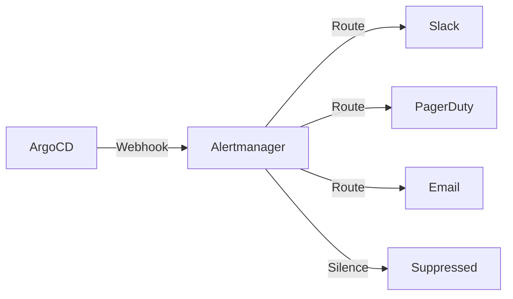

# How to Send ArgoCD Notifications to Alertmanager

Author: [nawazdhandala](https://github.com/nawazdhandala)

Tags: ArgoCD, GitOps, Kubernetes, Alertmanager, Prometheus

Description: Learn how to send ArgoCD deployment failure alerts to Prometheus Alertmanager for unified alert routing, silencing, and integration with your existing on-call workflows.

---

If your team already uses Prometheus Alertmanager for managing alerts, sending ArgoCD deployment failures there keeps everything in one system. Instead of managing separate notification channels for ArgoCD, you route deployment alerts through Alertmanager's existing routing rules, silence policies, and escalation paths. This guide shows you how to connect ArgoCD to Alertmanager.

## Why Alertmanager for ArgoCD

Alertmanager provides capabilities that ArgoCD's built-in notification system lacks:

- **Grouping**: Combine multiple related alerts into a single notification
- **Silencing**: Temporarily suppress alerts during maintenance
- **Inhibition**: Suppress less important alerts when a critical one is firing
- **Routing**: Route alerts to different receivers based on labels
- **Deduplication**: Prevent duplicate notifications automatically



## Configuring the Webhook Service

ArgoCD sends alerts to Alertmanager via the Alertmanager API:

```yaml
apiVersion: v1
kind: ConfigMap
metadata:
  name: argocd-notifications-cm
  namespace: argocd
data:
  service.webhook.alertmanager: |
    url: http://alertmanager.monitoring:9093/api/v2/alerts
    headers:
      - name: Content-Type
        value: application/json
```

If Alertmanager is in a different namespace or cluster, adjust the URL accordingly. For external Alertmanager instances, use the full URL:

```yaml
  service.webhook.alertmanager: |
    url: https://alertmanager.example.com/api/v2/alerts
    headers:
      - name: Content-Type
        value: application/json
      - name: Authorization
        value: Bearer $alertmanager-token
```

## Creating Alert Templates

Alertmanager expects alerts in a specific format. Each alert has labels (for routing and grouping), annotations (for display information), and optional timing fields.

### Sync Failure Alert

```yaml
  template.alertmanager-sync-failed: |
    webhook:
      alertmanager:
        method: POST
        body: |
          [{
            "labels": {
              "alertname": "ArgoCDSyncFailed",
              "severity": "critical",
              "app": "{{ .app.metadata.name }}",
              "project": "{{ .app.spec.project }}",
              "namespace": "{{ .app.spec.destination.namespace }}",
              "source": "argocd"
            },
            "annotations": {
              "summary": "ArgoCD sync failed for {{ .app.metadata.name }}",
              "description": "Application {{ .app.metadata.name }} in project {{ .app.spec.project }} failed to sync.\nRevision: {{ .app.status.sync.revision | trunc 7 }}\nError: {{ .app.status.operationState.message }}",
              "argocd_url": "https://argocd.example.com/applications/{{ .app.metadata.name }}"
            },
            "generatorURL": "https://argocd.example.com/applications/{{ .app.metadata.name }}"
          }]
```

### Health Degraded Alert

```yaml
  template.alertmanager-health-degraded: |
    webhook:
      alertmanager:
        method: POST
        body: |
          [{
            "labels": {
              "alertname": "ArgoCDHealthDegraded",
              "severity": "warning",
              "app": "{{ .app.metadata.name }}",
              "project": "{{ .app.spec.project }}",
              "namespace": "{{ .app.spec.destination.namespace }}",
              "health_status": "{{ .app.status.health.status }}",
              "source": "argocd"
            },
            "annotations": {
              "summary": "ArgoCD app {{ .app.metadata.name }} health is {{ .app.status.health.status }}",
              "description": "Application {{ .app.metadata.name }} health status changed to {{ .app.status.health.status }}.\nSync status: {{ .app.status.sync.status }}",
              "argocd_url": "https://argocd.example.com/applications/{{ .app.metadata.name }}"
            },
            "generatorURL": "https://argocd.example.com/applications/{{ .app.metadata.name }}"
          }]
```

### Auto-Resolving Alerts

Alertmanager supports resolving alerts by sending the same alert with an `endsAt` field. When ArgoCD syncs successfully, send a resolve:

```yaml
  template.alertmanager-sync-resolved: |
    webhook:
      alertmanager:
        method: POST
        body: |
          [{
            "labels": {
              "alertname": "ArgoCDSyncFailed",
              "severity": "critical",
              "app": "{{ .app.metadata.name }}",
              "project": "{{ .app.spec.project }}",
              "namespace": "{{ .app.spec.destination.namespace }}",
              "source": "argocd"
            },
            "annotations": {
              "summary": "ArgoCD sync resolved for {{ .app.metadata.name }}",
              "description": "Sync succeeded at revision {{ .app.status.sync.revision | trunc 7 }}"
            },
            "endsAt": "{{ .app.status.operationState.finishedAt }}"
          }]

  template.alertmanager-health-resolved: |
    webhook:
      alertmanager:
        method: POST
        body: |
          [{
            "labels": {
              "alertname": "ArgoCDHealthDegraded",
              "severity": "warning",
              "app": "{{ .app.metadata.name }}",
              "project": "{{ .app.spec.project }}",
              "namespace": "{{ .app.spec.destination.namespace }}",
              "health_status": "Healthy",
              "source": "argocd"
            },
            "annotations": {
              "summary": "ArgoCD app {{ .app.metadata.name }} health recovered"
            },
            "endsAt": "{{ .app.status.operationState.finishedAt }}"
          }]
```

The key is matching the `labels` exactly between the firing and resolving alerts. Alertmanager uses labels to identify which alert to resolve.

## Configuring Triggers

```yaml
  trigger.on-sync-failed-am: |
    - when: app.status.operationState.phase in ['Error', 'Failed']
      send: [alertmanager-sync-failed]

  trigger.on-sync-succeeded-am: |
    - when: app.status.operationState.phase in ['Succeeded']
      send: [alertmanager-sync-resolved]

  trigger.on-health-degraded-am: |
    - when: app.status.health.status == 'Degraded'
      send: [alertmanager-health-degraded]

  trigger.on-health-recovered-am: |
    - when: app.status.health.status == 'Healthy'
      send: [alertmanager-health-resolved]
```

## Alertmanager Routing Configuration

Configure Alertmanager to route ArgoCD alerts appropriately:

```yaml
# alertmanager.yml
route:
  receiver: default
  routes:
    # ArgoCD alerts get their own routing
    - match:
        source: argocd
      receiver: argocd-alerts
      group_by: ['alertname', 'app']
      group_wait: 30s
      group_interval: 5m
      repeat_interval: 4h
      routes:
        # Critical sync failures go to PagerDuty
        - match:
            alertname: ArgoCDSyncFailed
            severity: critical
          receiver: pagerduty-argocd

        # Health degradations go to Slack
        - match:
            alertname: ArgoCDHealthDegraded
          receiver: slack-argocd

receivers:
  - name: default
    # ... default receiver config

  - name: argocd-alerts
    slack_configs:
      - channel: '#argocd-alerts'
        send_resolved: true

  - name: pagerduty-argocd
    pagerduty_configs:
      - service_key: 'your-pagerduty-key'
        send_resolved: true

  - name: slack-argocd
    slack_configs:
      - channel: '#argocd-health'
        send_resolved: true
```

## Alertmanager Inhibition Rules

Suppress health degradation alerts when a sync failure is already firing for the same app:

```yaml
# alertmanager.yml
inhibit_rules:
  - source_match:
      alertname: ArgoCDSyncFailed
    target_match:
      alertname: ArgoCDHealthDegraded
    equal: ['app', 'namespace']
```

This prevents alert spam when a failed sync causes health degradation - you only get the sync failure alert.

## Subscribing Applications

```bash
kubectl annotate app my-app -n argocd \
  notifications.argoproj.io/subscribe.on-sync-failed-am.alertmanager=""
kubectl annotate app my-app -n argocd \
  notifications.argoproj.io/subscribe.on-sync-succeeded-am.alertmanager=""
kubectl annotate app my-app -n argocd \
  notifications.argoproj.io/subscribe.on-health-degraded-am.alertmanager=""
kubectl annotate app my-app -n argocd \
  notifications.argoproj.io/subscribe.on-health-recovered-am.alertmanager=""
```

Default subscriptions:

```yaml
  subscriptions: |
    - recipients:
        - alertmanager:
      triggers:
        - on-sync-failed-am
        - on-sync-succeeded-am
        - on-health-degraded-am
        - on-health-recovered-am
```

## Debugging

```bash
# Check ArgoCD notification logs
kubectl logs -n argocd deploy/argocd-notifications-controller -f

# Check Alertmanager for active alerts
curl http://alertmanager.monitoring:9093/api/v2/alerts | jq '.[] | select(.labels.source=="argocd")'

# Test sending an alert to Alertmanager
curl -X POST http://alertmanager.monitoring:9093/api/v2/alerts \
  -H "Content-Type: application/json" \
  -d '[{
    "labels": {"alertname": "ArgoCDTest", "source": "argocd", "app": "test"},
    "annotations": {"summary": "Test alert from ArgoCD"}
  }]'

# Check Alertmanager logs
kubectl logs -n monitoring deploy/alertmanager -f
```

For the complete ArgoCD notification setup, see our [notifications from scratch guide](https://oneuptime.com/blog/post/2026-02-26-argocd-notifications-setup-from-scratch/view). For direct incident management integration, check out [PagerDuty](https://oneuptime.com/blog/post/2026-02-26-argocd-notifications-pagerduty/view) and [Opsgenie](https://oneuptime.com/blog/post/2026-02-26-argocd-notifications-opsgenie/view).

Routing ArgoCD notifications through Alertmanager gives you a unified alerting pipeline. You get grouping, silencing, inhibition, and routing that ArgoCD's native notifications do not provide, all while reusing the alert infrastructure your team already manages.
