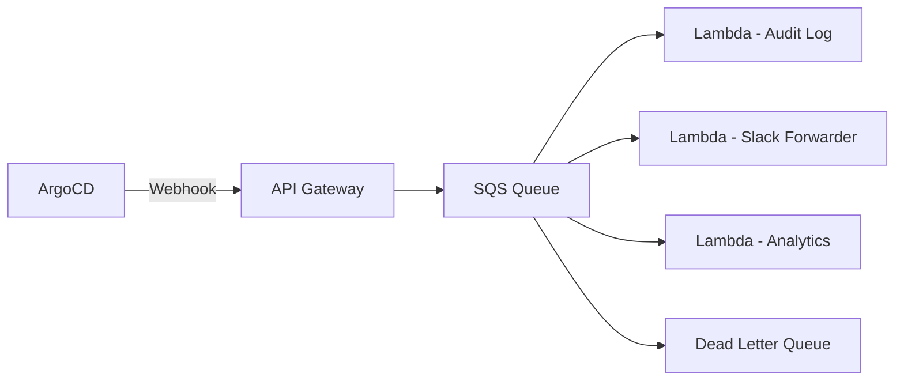

# How to Send ArgoCD Notifications to AWS SQS

Author: [nawazdhandala](https://github.com/nawazdhandala)

Tags: ArgoCD, GitOps, Kubernetes, AWS SQS, Notifications

Description: Learn how to configure ArgoCD to send deployment event notifications to AWS SQS queues for asynchronous processing, audit trails, and event-driven architectures.

---

Sending ArgoCD notifications to AWS SQS lets you decouple deployment event processing from the notification delivery. Instead of sending directly to Slack or email, you push events to a queue where consumers can process them reliably - building audit logs, triggering Lambda functions, feeding analytics pipelines, or routing to multiple downstream systems. This guide covers the setup using ArgoCD webhooks with the SQS API.

## Why SQS for ArgoCD Notifications

Direct notification services like Slack or email are fire-and-forget. If the service is temporarily down, you lose the notification. SQS gives you:

- **Reliability**: Messages persist until consumed, with configurable retention
- **Decoupling**: Multiple consumers can process events independently
- **Ordering**: FIFO queues guarantee message ordering
- **Dead letter queues**: Failed processing attempts are captured
- **Integration**: Lambda, Step Functions, and other AWS services consume from SQS natively



## Setting Up the SQS Queue

Create the SQS queue using the AWS CLI or Terraform:

```bash
# Create a standard SQS queue
aws sqs create-queue \
  --queue-name argocd-deployment-events \
  --attributes '{
    "MessageRetentionPeriod": "1209600",
    "VisibilityTimeout": "30",
    "ReceiveMessageWaitTimeSeconds": "20"
  }'

# Or create a FIFO queue for ordered processing
aws sqs create-queue \
  --queue-name argocd-deployment-events.fifo \
  --attributes '{
    "FifoQueue": "true",
    "ContentBasedDeduplication": "true",
    "MessageRetentionPeriod": "1209600"
  }'
```

With Terraform:

```hcl
resource "aws_sqs_queue" "argocd_events" {
  name                       = "argocd-deployment-events"
  message_retention_seconds  = 1209600  # 14 days
  visibility_timeout_seconds = 30
  receive_wait_time_seconds  = 20

  # Dead letter queue for failed processing
  redrive_policy = jsonencode({
    deadLetterTargetArn = aws_sqs_queue.argocd_events_dlq.arn
    maxReceiveCount     = 3
  })
}

resource "aws_sqs_queue" "argocd_events_dlq" {
  name                      = "argocd-deployment-events-dlq"
  message_retention_seconds = 1209600
}
```

## Option 1: Direct SQS API via Webhook

The simplest approach is to send SQS messages directly from ArgoCD using signed API requests. However, this requires AWS SigV4 signing, which ArgoCD webhooks do not natively support.

Instead, use an API Gateway endpoint in front of SQS.

## Option 2: API Gateway to SQS (Recommended)

Create an API Gateway that receives ArgoCD webhook requests and forwards them to SQS:

```bash
# Using AWS SAM or CloudFormation, create an API Gateway -> SQS integration
```

Here is the CloudFormation template:

```yaml
AWSTemplateFormatVersion: '2010-09-09'
Resources:
  ArgocdWebhookApi:
    Type: AWS::ApiGatewayV2::Api
    Properties:
      Name: argocd-webhook
      ProtocolType: HTTP

  SQSIntegration:
    Type: AWS::ApiGatewayV2::Integration
    Properties:
      ApiId: !Ref ArgocdWebhookApi
      IntegrationType: AWS_PROXY
      IntegrationSubtype: SQS-SendMessage
      CredentialsArn: !GetAtt ApiGatewayRole.Arn
      RequestParameters:
        QueueUrl: !Ref ArgoCDEventsQueue
        MessageBody: $request.body

  WebhookRoute:
    Type: AWS::ApiGatewayV2::Route
    Properties:
      ApiId: !Ref ArgocdWebhookApi
      RouteKey: POST /events
      Target: !Sub integrations/${SQSIntegration}
      AuthorizationType: NONE

  ArgoCDEventsQueue:
    Type: AWS::SQS::Queue
    Properties:
      QueueName: argocd-deployment-events

  ApiGatewayRole:
    Type: AWS::IAM::Role
    Properties:
      AssumeRolePolicyDocument:
        Version: '2012-10-17'
        Statement:
          - Effect: Allow
            Principal:
              Service: apigateway.amazonaws.com
            Action: sts:AssumeRole
      Policies:
        - PolicyName: SQSSendMessage
          PolicyDocument:
            Version: '2012-10-17'
            Statement:
              - Effect: Allow
                Action: sqs:SendMessage
                Resource: !GetAtt ArgoCDEventsQueue.Arn
```

## Configuring ArgoCD

After setting up the API Gateway, configure ArgoCD to send webhooks to it:

```bash
kubectl patch secret argocd-notifications-secret -n argocd \
  --type merge \
  -p '{"stringData": {"sqs-webhook-url": "https://your-api-id.execute-api.us-east-1.amazonaws.com/events"}}'
```

```yaml
apiVersion: v1
kind: ConfigMap
metadata:
  name: argocd-notifications-cm
  namespace: argocd
data:
  service.webhook.aws-sqs: |
    url: $sqs-webhook-url
    headers:
      - name: Content-Type
        value: application/json
```

## Creating SQS Message Templates

### Standard Deployment Event

```yaml
  template.sqs-deployment-event: |
    webhook:
      aws-sqs:
        method: POST
        body: |
          {
            "eventType": "deployment",
            "source": "argocd",
            "timestamp": "{{ .app.status.operationState.finishedAt }}",
            "application": {
              "name": "{{ .app.metadata.name }}",
              "namespace": "{{ .app.spec.destination.namespace }}",
              "project": "{{ .app.spec.project }}",
              "cluster": "{{ .app.spec.destination.server }}"
            },
            "sync": {
              "status": "{{ .app.status.sync.status }}",
              "revision": "{{ .app.status.sync.revision }}",
              "phase": "{{ .app.status.operationState.phase }}"
            },
            "health": {
              "status": "{{ .app.status.health.status }}"
            },
            "source": {
              "repoURL": "{{ .app.spec.source.repoURL }}",
              "path": "{{ .app.spec.source.path }}",
              "targetRevision": "{{ .app.spec.source.targetRevision }}"
            }
          }
```

### Audit Event with Full Context

```yaml
  template.sqs-audit-event: |
    webhook:
      aws-sqs:
        method: POST
        body: |
          {
            "eventType": "audit",
            "source": "argocd",
            "timestamp": "{{ .app.status.operationState.finishedAt }}",
            "action": "sync",
            "result": "{{ .app.status.operationState.phase }}",
            "application": "{{ .app.metadata.name }}",
            "project": "{{ .app.spec.project }}",
            "revision": "{{ .app.status.sync.revision }}",
            "message": "{{ .app.status.operationState.message }}",
            "startedAt": "{{ .app.status.operationState.startedAt }}",
            "finishedAt": "{{ .app.status.operationState.finishedAt }}"
          }
```

## Configuring Triggers

```yaml
  trigger.on-any-sync-sqs: |
    - when: app.status.operationState.phase in ['Succeeded', 'Error', 'Failed']
      send: [sqs-deployment-event]

  trigger.on-health-change-sqs: |
    - when: app.status.health.status in ['Degraded', 'Healthy', 'Missing']
      send: [sqs-deployment-event]
```

## Processing SQS Messages

### Lambda Consumer Example

```python
# lambda_function.py
import json
import boto3
import os

dynamodb = boto3.resource('dynamodb')
table = dynamodb.Table(os.environ['DEPLOYMENTS_TABLE'])

def handler(event, context):
    for record in event['Records']:
        body = json.loads(record['body'])

        # Store in DynamoDB for audit trail
        table.put_item(Item={
            'pk': f"APP#{body['application']['name']}",
            'sk': body['timestamp'],
            'eventType': body['eventType'],
            'syncPhase': body['sync']['phase'],
            'revision': body['sync']['revision'],
            'healthStatus': body['health']['status'],
            'namespace': body['application']['namespace'],
            'project': body['application']['project'],
            'ttl': int(time.time()) + (90 * 86400)  # 90-day retention
        })

    return {'statusCode': 200}
```

## Subscribing Applications

```bash
kubectl annotate app my-app -n argocd \
  notifications.argoproj.io/subscribe.on-any-sync-sqs.aws-sqs=""
```

For all applications:

```yaml
  subscriptions: |
    - recipients:
        - aws-sqs:
      triggers:
        - on-any-sync-sqs
        - on-health-change-sqs
```

## Debugging

```bash
# Check ArgoCD logs
kubectl logs -n argocd deploy/argocd-notifications-controller -f

# Check if messages are arriving in SQS
aws sqs get-queue-attributes \
  --queue-url https://sqs.us-east-1.amazonaws.com/123456789012/argocd-deployment-events \
  --attribute-names ApproximateNumberOfMessages

# Receive a test message
aws sqs receive-message \
  --queue-url https://sqs.us-east-1.amazonaws.com/123456789012/argocd-deployment-events
```

For related notification setups, see our [webhook endpoints guide](https://oneuptime.com/blog/post/2026-02-26-argocd-notifications-webhook-endpoints/view) and the [complete ArgoCD notifications setup](https://oneuptime.com/blog/post/2026-02-26-argocd-notifications-setup-from-scratch/view).

SQS integration transforms ArgoCD notifications from simple alerts into a reliable event bus that powers audit logs, analytics, and custom automation. Once events are in SQS, you can build any downstream processing you need without modifying ArgoCD.
