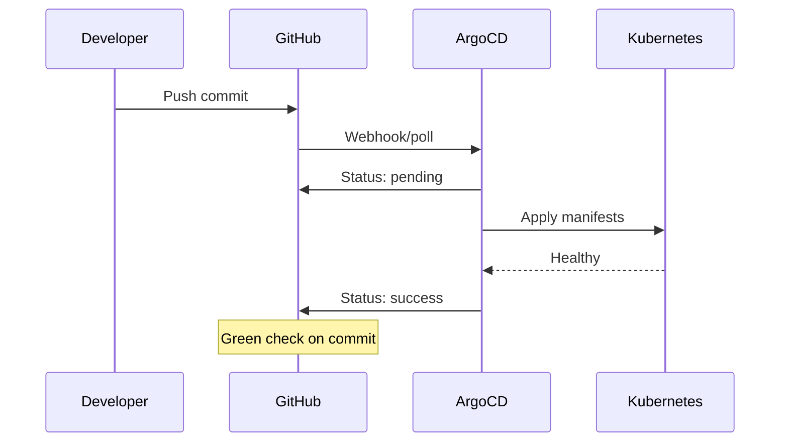

# How to Send ArgoCD Notifications to GitHub Commit Status

Author: [nawazdhandala](https://github.com/nawazdhandala)

Tags: ArgoCD, GitOps, Kubernetes, GitHub, CI/CD

Description: Learn how to configure ArgoCD to update GitHub commit statuses automatically, showing deployment status directly on pull requests and commits.

---

GitHub commit statuses show colored indicators (green check, red X, yellow dot) next to commits and on pull requests. When ArgoCD updates the commit status after a sync, developers see deployment results right in GitHub without checking the ArgoCD UI. This closes the feedback loop - push a commit, see it deployed, all from the GitHub interface.

## How GitHub Commit Status Works

GitHub's Commit Status API lets external systems report the state of a commit:

- **pending**: Deployment in progress (yellow dot)
- **success**: Deployment succeeded (green check)
- **failure**: Deployment failed (red X)
- **error**: Something went wrong with the deployment system itself (red X)



## Creating a GitHub Token

1. Go to GitHub Settings and then Developer settings and then Personal access tokens
2. Create a fine-grained token (recommended) or classic token
3. For fine-grained tokens:
   - Select the repository (or repositories) where you want status updates
   - Grant "Commit statuses" permission (Read and Write)
4. For classic tokens:
   - Select the `repo:status` scope
5. Copy the token

Store it in the ArgoCD secret:

```bash
kubectl patch secret argocd-notifications-secret -n argocd \
  --type merge \
  -p '{"stringData": {"github-token": "ghp_your_github_token"}}'
```

## Configuring ArgoCD with Built-in GitHub Service

ArgoCD has a built-in GitHub notification service specifically for commit status updates:

```yaml
apiVersion: v1
kind: ConfigMap
metadata:
  name: argocd-notifications-cm
  namespace: argocd
data:
  service.github: |
    appID: 0
    installationID: 0
    privateKey: ""
```

Wait - the above is for GitHub App authentication. For personal access tokens, use the webhook approach instead, which gives you more control over the status format.

## Option 1: Using Webhook to GitHub API

```yaml
apiVersion: v1
kind: ConfigMap
metadata:
  name: argocd-notifications-cm
  namespace: argocd
data:
  service.webhook.github-status: |
    url: https://api.github.com
    headers:
      - name: Content-Type
        value: application/json
      - name: Authorization
        value: token $github-token
```

### Deployment Status Templates

```yaml
  # Set status to success when sync succeeds and app is healthy
  template.github-commit-status-success: |
    webhook:
      github-status:
        method: POST
        path: /repos/{{call .repo.FullNameByRepoURL .app.spec.source.repoURL}}/statuses/{{.app.status.operationState.operation.sync.revision}}
        body: |
          {
            "state": "success",
            "description": "{{ .app.metadata.name }} synced and healthy",
            "target_url": "https://argocd.example.com/applications/{{ .app.metadata.name }}",
            "context": "argocd/{{ .app.metadata.name }}"
          }

  # Set status to failure when sync fails
  template.github-commit-status-failure: |
    webhook:
      github-status:
        method: POST
        path: /repos/{{call .repo.FullNameByRepoURL .app.spec.source.repoURL}}/statuses/{{.app.status.operationState.operation.sync.revision}}
        body: |
          {
            "state": "failure",
            "description": "{{ .app.metadata.name }} sync failed",
            "target_url": "https://argocd.example.com/applications/{{ .app.metadata.name }}",
            "context": "argocd/{{ .app.metadata.name }}"
          }

  # Set status to pending when sync starts
  template.github-commit-status-pending: |
    webhook:
      github-status:
        method: POST
        path: /repos/{{call .repo.FullNameByRepoURL .app.spec.source.repoURL}}/statuses/{{.app.status.operationState.operation.sync.revision}}
        body: |
          {
            "state": "pending",
            "description": "{{ .app.metadata.name }} syncing...",
            "target_url": "https://argocd.example.com/applications/{{ .app.metadata.name }}",
            "context": "argocd/{{ .app.metadata.name }}"
          }

  # Set status to error when health is degraded
  template.github-commit-status-degraded: |
    webhook:
      github-status:
        method: POST
        path: /repos/{{call .repo.FullNameByRepoURL .app.spec.source.repoURL}}/statuses/{{.app.status.operationState.operation.sync.revision}}
        body: |
          {
            "state": "error",
            "description": "{{ .app.metadata.name }} health: {{ .app.status.health.status }}",
            "target_url": "https://argocd.example.com/applications/{{ .app.metadata.name }}",
            "context": "argocd/{{ .app.metadata.name }}"
          }
```

### Understanding the Context Field

The `context` field is critical. It uniquely identifies the status check. Using `argocd/{{ .app.metadata.name }}` means each ArgoCD application gets its own status line on the commit. If you have multiple apps tracking the same repo, you will see a status for each one.

### Handling Hardcoded Repo Paths

If `FullNameByRepoURL` is not available in your ArgoCD version, hardcode the repo path:

```yaml
  template.github-commit-status-success-simple: |
    webhook:
      github-status:
        method: POST
        path: /repos/your-org/your-repo/statuses/{{.app.status.operationState.operation.sync.revision}}
        body: |
          {
            "state": "success",
            "description": "Deployed to {{ .app.spec.destination.namespace }}",
            "target_url": "https://argocd.example.com/applications/{{ .app.metadata.name }}",
            "context": "argocd/{{ .app.metadata.name }}"
          }
```

## Option 2: Using GitHub App Authentication

For organizations, a GitHub App is more secure than personal access tokens:

1. Create a GitHub App in your organization settings
2. Grant "Commit statuses" permission (Read & Write)
3. Install the app on the target repositories
4. Note the App ID and Installation ID
5. Generate and download a private key

```yaml
  service.github: |
    appID: 12345
    installationID: 67890
    privateKey: $github-app-private-key
```

Store the private key:

```bash
kubectl patch secret argocd-notifications-secret -n argocd \
  --type merge \
  -p "{\"stringData\": {\"github-app-private-key\": \"$(cat private-key.pem)\"}}"
```

With the GitHub App service, use the built-in template format:

```yaml
  template.github-status-success: |
    github:
      status:
        state: success
        label: "argocd/{{ .app.metadata.name }}"
        targetURL: "https://argocd.example.com/applications/{{ .app.metadata.name }}"

  template.github-status-failure: |
    github:
      status:
        state: failure
        label: "argocd/{{ .app.metadata.name }}"
        targetURL: "https://argocd.example.com/applications/{{ .app.metadata.name }}"

  template.github-status-pending: |
    github:
      status:
        state: pending
        label: "argocd/{{ .app.metadata.name }}"
        targetURL: "https://argocd.example.com/applications/{{ .app.metadata.name }}"
```

## Configuring Triggers

```yaml
  trigger.on-sync-running-github: |
    - when: app.status.operationState.phase in ['Running']
      send: [github-commit-status-pending]

  trigger.on-deployed-github: |
    - when: app.status.operationState.phase in ['Succeeded'] and app.status.health.status == 'Healthy'
      send: [github-commit-status-success]

  trigger.on-sync-failed-github: |
    - when: app.status.operationState.phase in ['Error', 'Failed']
      send: [github-commit-status-failure]

  trigger.on-health-degraded-github: |
    - when: app.status.health.status == 'Degraded'
      send: [github-commit-status-degraded]
```

## Subscribing Applications

```bash
# Subscribe to all status-related triggers
kubectl annotate app my-app -n argocd \
  notifications.argoproj.io/subscribe.on-sync-running-github.github-status=""
kubectl annotate app my-app -n argocd \
  notifications.argoproj.io/subscribe.on-deployed-github.github-status=""
kubectl annotate app my-app -n argocd \
  notifications.argoproj.io/subscribe.on-sync-failed-github.github-status=""
```

For default subscriptions:

```yaml
  subscriptions: |
    - recipients:
        - github-status:
      triggers:
        - on-sync-running-github
        - on-deployed-github
        - on-sync-failed-github
        - on-health-degraded-github
```

## Branch Protection Integration

With commit statuses in place, you can use them in GitHub Branch Protection rules:

1. Go to your repository settings and then Branches
2. Edit the branch protection rule for your main branch
3. Enable "Require status checks to pass before merging"
4. Search for and select your ArgoCD status context (`argocd/your-app-name`)

This prevents merging until ArgoCD confirms the deployment succeeded.

## Debugging

```bash
# Check notification controller logs
kubectl logs -n argocd deploy/argocd-notifications-controller -f

# Test the GitHub API directly
curl -X POST https://api.github.com/repos/your-org/your-repo/statuses/COMMIT_SHA \
  -H "Authorization: token YOUR_TOKEN" \
  -H "Content-Type: application/json" \
  -d '{
    "state": "success",
    "description": "Test from ArgoCD",
    "target_url": "https://argocd.example.com",
    "context": "argocd/test"
  }'

# Check the commit status
curl https://api.github.com/repos/your-org/your-repo/commits/COMMIT_SHA/statuses \
  -H "Authorization: token YOUR_TOKEN"
```

Common issues:
- **404 Not Found**: Token does not have access to the repository
- **422 Validation Failed**: Invalid state value or missing required fields
- **Empty revision**: The sync revision is empty if the app has never been synced

For the complete ArgoCD notification setup, see our [notifications from scratch guide](https://oneuptime.com/blog/post/2026-02-26-argocd-notifications-setup-from-scratch/view). For other CI/CD integrations, check out our [webhook endpoints guide](https://oneuptime.com/blog/post/2026-02-26-argocd-notifications-webhook-endpoints/view).

GitHub commit status integration closes the GitOps feedback loop. Developers see deployment results right where they work - on the pull request and commit pages. No context switching needed.
