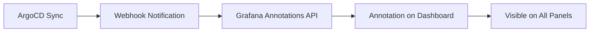

# How to Send ArgoCD Notifications to Grafana

Author: [nawazdhandala](https://github.com/nawazdhandala)

Tags: ArgoCD, GitOps, Kubernetes, Grafana, Monitoring

Description: Learn how to send ArgoCD deployment events to Grafana as annotations on dashboards, providing visual deployment markers on your monitoring graphs.

---

Adding ArgoCD deployment annotations to Grafana dashboards is one of the most powerful ways to correlate deployments with application behavior. When you see a latency spike on a graph, a deployment marker right on the timeline tells you instantly if a deploy caused it. This guide shows you how to push ArgoCD events to Grafana annotations.

## How Grafana Annotations Work

Grafana annotations are markers on time-series graphs that highlight specific events. They appear as vertical lines on panels with a tooltip showing event details. Grafana exposes an HTTP API for creating annotations programmatically, which is what we use with ArgoCD webhooks.



## Setting Up Grafana API Access

First, create a Grafana API key or service account token:

1. In Grafana, go to Configuration and then API keys (or Service accounts)
2. Click "Add API key" or "Create service account"
3. Set the role to "Editor" (needs permission to create annotations)
4. Copy the generated token

Store it in the ArgoCD notifications secret:

```bash
kubectl patch secret argocd-notifications-secret -n argocd \
  --type merge \
  -p '{"stringData": {"grafana-api-key": "eyJrIjoixxxxxxxxxxxxxxxxxxxxxxx"}}'
```

## Configuring ArgoCD for Grafana

Set up the webhook service pointing to Grafana's annotations API:

```yaml
apiVersion: v1
kind: ConfigMap
metadata:
  name: argocd-notifications-cm
  namespace: argocd
data:
  service.webhook.grafana: |
    url: https://grafana.example.com/api/annotations
    headers:
      - name: Content-Type
        value: application/json
      - name: Authorization
        value: Bearer $grafana-api-key
```

## Creating Annotation Templates

### Basic Deployment Annotation

```yaml
  template.grafana-deploy-annotation: |
    webhook:
      grafana:
        method: POST
        body: |
          {
            "text": "Deployed {{ .app.metadata.name }} ({{ .app.status.sync.revision | trunc 7 }})",
            "tags": ["argocd", "deployment", "{{ .app.metadata.name }}", "{{ .app.spec.project }}"]
          }
```

This creates a global annotation visible on all dashboards.

### Dashboard-Specific Annotation

To add annotations to a specific dashboard:

```yaml
  template.grafana-dashboard-annotation: |
    webhook:
      grafana:
        method: POST
        body: |
          {
            "dashboardUID": "your-dashboard-uid",
            "text": "{{ .app.metadata.name }} deployed to {{ .app.spec.destination.namespace }}\nRevision: {{ .app.status.sync.revision | trunc 7 }}\nHealth: {{ .app.status.health.status }}",
            "tags": ["argocd", "deployment", "{{ .app.metadata.name }}"]
          }
```

### Panel-Specific Annotation

For even more granularity, target a specific panel:

```yaml
  template.grafana-panel-annotation: |
    webhook:
      grafana:
        method: POST
        body: |
          {
            "dashboardUID": "your-dashboard-uid",
            "panelId": 4,
            "text": "{{ .app.metadata.name }} v{{ .app.status.sync.revision | trunc 7 }}",
            "tags": ["deployment"]
          }
```

### Color-Coded by Status

Use different tags to color-code annotations by deployment status:

```yaml
  template.grafana-success-annotation: |
    webhook:
      grafana:
        method: POST
        body: |
          {
            "text": "{{ .app.metadata.name }} deployed successfully\nRevision: {{ .app.status.sync.revision | trunc 7 }}\nNamespace: {{ .app.spec.destination.namespace }}",
            "tags": ["argocd", "deploy-success", "{{ .app.metadata.name }}"]
          }

  template.grafana-failure-annotation: |
    webhook:
      grafana:
        method: POST
        body: |
          {
            "text": "{{ .app.metadata.name }} sync FAILED\nError: {{ .app.status.operationState.message }}\nRevision: {{ .app.status.sync.revision | trunc 7 }}",
            "tags": ["argocd", "deploy-failure", "{{ .app.metadata.name }}"]
          }

  template.grafana-health-degraded-annotation: |
    webhook:
      grafana:
        method: POST
        body: |
          {
            "text": "{{ .app.metadata.name }} health degraded to {{ .app.status.health.status }}",
            "tags": ["argocd", "health-degraded", "{{ .app.metadata.name }}"]
          }
```

Then in Grafana, configure annotation queries with different colors:
- `deploy-success` tag with green color
- `deploy-failure` tag with red color
- `health-degraded` tag with yellow color

### Timed Annotation (Start and End)

Create annotations that span the duration of a sync operation:

```yaml
  template.grafana-sync-start-annotation: |
    webhook:
      grafana:
        method: POST
        body: |
          {
            "text": "Sync started: {{ .app.metadata.name }}",
            "tags": ["argocd", "sync-start", "{{ .app.metadata.name }}"],
            "time": {{ .app.status.operationState.startedAt | toUnixMilli }}
          }

  template.grafana-sync-end-annotation: |
    webhook:
      grafana:
        method: POST
        body: |
          {
            "text": "Sync completed: {{ .app.metadata.name }} ({{ .app.status.operationState.phase }})",
            "tags": ["argocd", "sync-end", "{{ .app.metadata.name }}"],
            "time": {{ .app.status.operationState.finishedAt | toUnixMilli }},
            "timeEnd": {{ .app.status.operationState.finishedAt | toUnixMilli }}
          }
```

## Configuring Triggers

```yaml
  trigger.on-deployed-grafana: |
    - when: app.status.operationState.phase in ['Succeeded'] and app.status.health.status == 'Healthy'
      oncePer: app.status.sync.revision
      send: [grafana-success-annotation]

  trigger.on-sync-failed-grafana: |
    - when: app.status.operationState.phase in ['Error', 'Failed']
      send: [grafana-failure-annotation]

  trigger.on-health-degraded-grafana: |
    - when: app.status.health.status == 'Degraded'
      send: [grafana-health-degraded-annotation]
```

## Subscribing Applications

```bash
kubectl annotate app my-app -n argocd \
  notifications.argoproj.io/subscribe.on-deployed-grafana.grafana=""
kubectl annotate app my-app -n argocd \
  notifications.argoproj.io/subscribe.on-sync-failed-grafana.grafana=""
```

For all applications:

```yaml
  subscriptions: |
    - recipients:
        - grafana:
      triggers:
        - on-deployed-grafana
        - on-sync-failed-grafana
        - on-health-degraded-grafana
```

## Configuring Grafana to Display Annotations

In your Grafana dashboard settings:

1. Go to Dashboard Settings and then Annotations
2. Click "Add annotation query"
3. Set the datasource to "Grafana"
4. Filter by tags: `argocd`
5. Set the color based on the tag
6. Enable "Show in" for the panels where you want annotations

You can also configure annotations directly in panel JSON:

```json
{
  "annotations": {
    "list": [
      {
        "datasource": "-- Grafana --",
        "enable": true,
        "hide": false,
        "iconColor": "#18be52",
        "limit": 100,
        "name": "Deployments",
        "tags": ["argocd", "deploy-success"],
        "type": "tags"
      },
      {
        "datasource": "-- Grafana --",
        "enable": true,
        "hide": false,
        "iconColor": "#E96D76",
        "limit": 100,
        "name": "Failed Deploys",
        "tags": ["argocd", "deploy-failure"],
        "type": "tags"
      }
    ]
  }
}
```

## Filtering Annotations by Application

Use tag-based filtering to show annotations only for specific applications:

In Grafana, create an annotation query filtered by both `argocd` and the application name tag. Since our templates include `{{ .app.metadata.name }}` as a tag, you can filter precisely.

## Debugging

```bash
# Check notification controller logs
kubectl logs -n argocd deploy/argocd-notifications-controller -f

# Test Grafana annotation API directly
curl -X POST https://grafana.example.com/api/annotations \
  -H "Content-Type: application/json" \
  -H "Authorization: Bearer $GRAFANA_API_KEY" \
  -d '{
    "text": "Test annotation from ArgoCD",
    "tags": ["argocd", "test"]
  }'

# List recent annotations
curl https://grafana.example.com/api/annotations?tags=argocd \
  -H "Authorization: Bearer $GRAFANA_API_KEY"
```

Common issues:
- **403 Forbidden**: API key does not have Editor role
- **404 Not Found**: Grafana URL is wrong or annotations API is at a different path
- **Dashboard annotations not showing**: Check that the annotation query is enabled on the dashboard

For the complete notification setup, see our [ArgoCD notifications guide](https://oneuptime.com/blog/post/2026-02-26-argocd-notifications-setup-from-scratch/view). For other monitoring integrations, check out our guide on [sending ArgoCD notifications to Alertmanager](https://oneuptime.com/blog/post/2026-02-26-argocd-notifications-alertmanager/view).

Grafana annotations turn your monitoring dashboards into a deployment-aware view of your system. When you can see exactly when each deployment happened alongside your metrics, debugging production issues becomes dramatically faster.
