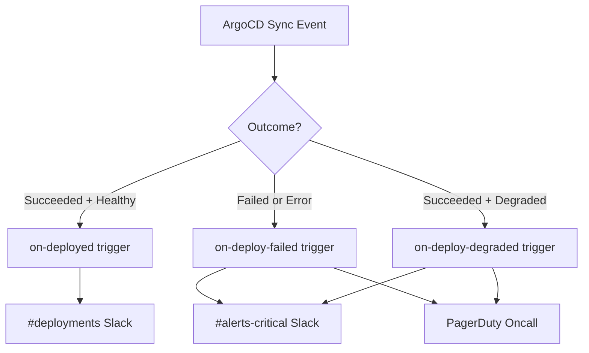

# How to Send Different Notifications for Success vs Failure in ArgoCD

Author: [nawazdhandala](https://github.com/nawazdhandala)

Tags: ArgoCD, GitOps, Kubernetes, Notifications, DevOps

Description: Learn how to configure ArgoCD to send different notification messages, channels, and formats for successful deployments versus failed syncs to reduce alert fatigue.

---

Not all deployment events deserve the same level of attention. A successful sync in staging is routine, but a failed sync in production is an emergency. ArgoCD notifications let you configure entirely different templates, channels, and routing logic depending on whether a sync succeeded or failed. This guide shows you how to build a notification strategy that separates success from failure alerts effectively.

## The Problem with One-Size-Fits-All Notifications

Many teams start with a single trigger that fires on all sync completions. The result is a noisy channel where critical failures get buried among routine deployments. The fix is to create separate triggers and templates for success and failure, then route them to appropriate channels.

## Setting Up Separate Triggers

Define distinct triggers for success and failure in your `argocd-notifications-cm` ConfigMap:

```yaml
apiVersion: v1
kind: ConfigMap
metadata:
  name: argocd-notifications-cm
  namespace: argocd
data:
  # Success trigger
  trigger.on-deployed: |
    - when: >
        app.status.operationState != nil and
        app.status.operationState.phase in ['Succeeded'] and
        app.status.health.status == 'Healthy' and
        app.status.sync.status == 'Synced'
      oncePer: app.status.operationState.finishedAt
      send:
        - deployment-succeeded

  # Failure trigger
  trigger.on-deploy-failed: |
    - when: >
        app.status.operationState != nil and
        app.status.operationState.phase in ['Error', 'Failed']
      oncePer: app.status.operationState.finishedAt
      send:
        - deployment-failed

  # Degraded after sync trigger
  trigger.on-deploy-degraded: |
    - when: >
        app.status.operationState != nil and
        app.status.operationState.phase in ['Succeeded'] and
        app.status.health.status == 'Degraded'
      oncePer: app.status.operationState.finishedAt
      send:
        - deployment-degraded
```

Notice the third trigger. This catches the tricky case where sync succeeds (YAML applied without errors) but the application ends up degraded (pods crashing, services unreachable). This is arguably more dangerous than a sync failure because it means broken code reached your cluster.

## Creating Different Templates for Each Outcome

### Success Template - Informational

Success notifications should be brief and non-intrusive. Include just enough context for record-keeping:

```yaml
  template.deployment-succeeded: |
    message: "{{.app.metadata.name}} deployed successfully to {{.app.spec.destination.namespace}}"
    slack:
      attachments: |
        [{
          "color": "#18be52",
          "title": "Deployment Succeeded",
          "fields": [
            {"title": "Application", "value": "{{.app.metadata.name}}", "short": true},
            {"title": "Namespace", "value": "{{.app.spec.destination.namespace}}", "short": true},
            {"title": "Revision", "value": "{{.app.status.sync.revision | trunc 7}}", "short": true},
            {"title": "Duration", "value": "{{.app.status.operationState.finishedAt}} - {{.app.status.operationState.startedAt}}", "short": true}
          ]
        }]
```

### Failure Template - Urgent and Detailed

Failure notifications need maximum detail so the on-call engineer can start troubleshooting immediately:

```yaml
  template.deployment-failed: |
    message: |
      DEPLOYMENT FAILED: {{.app.metadata.name}}
      Error: {{.app.status.operationState.message}}
      Revision: {{.app.status.sync.revision}}
      Repo: {{.app.spec.source.repoURL}}
    slack:
      attachments: |
        [{
          "color": "#e5343a",
          "title": "DEPLOYMENT FAILED - {{.app.metadata.name}}",
          "text": "{{.app.status.operationState.message}}",
          "fields": [
            {"title": "Application", "value": "{{.app.metadata.name}}", "short": true},
            {"title": "Project", "value": "{{.app.spec.project}}", "short": true},
            {"title": "Namespace", "value": "{{.app.spec.destination.namespace}}", "short": true},
            {"title": "Revision", "value": "{{.app.status.sync.revision | trunc 7}}", "short": true},
            {"title": "Repository", "value": "{{.app.spec.source.repoURL}}", "short": false},
            {"title": "Error", "value": "{{.app.status.operationState.message}}", "short": false}
          ],
          "footer": "Check ArgoCD UI for full sync details"
        }]
    email:
      subject: "[ALERT] Deployment failed: {{.app.metadata.name}}"
      body: |
        <h2>Deployment Failed</h2>
        <p><b>Application:</b> {{.app.metadata.name}}</p>
        <p><b>Error:</b> {{.app.status.operationState.message}}</p>
        <p><b>Revision:</b> {{.app.status.sync.revision}}</p>
        <p><b>Repository:</b> {{.app.spec.source.repoURL}}</p>
```

### Degraded Template - Warning Level

The degraded template sits between success and failure in urgency:

```yaml
  template.deployment-degraded: |
    message: |
      WARNING: {{.app.metadata.name}} synced but is DEGRADED
    slack:
      attachments: |
        [{
          "color": "#f4c030",
          "title": "Sync Succeeded but App is Degraded - {{.app.metadata.name}}",
          "text": "The sync completed without errors but the application health is degraded. Pods may be crash-looping or failing health checks.",
          "fields": [
            {"title": "Application", "value": "{{.app.metadata.name}}", "short": true},
            {"title": "Health", "value": "{{.app.status.health.status}}", "short": true},
            {"title": "Namespace", "value": "{{.app.spec.destination.namespace}}", "short": true},
            {"title": "Revision", "value": "{{.app.status.sync.revision | trunc 7}}", "short": true}
          ]
        }]
```

## Routing to Different Channels

The real power comes from sending success and failure to different destinations. Subscribe applications with channel-specific annotations:

```yaml
apiVersion: argoproj.io/v1alpha1
kind: Application
metadata:
  name: payment-service
  annotations:
    # Success goes to general deployments channel
    notifications.argoproj.io/subscribe.on-deployed.slack: deployments
    # Failures go to critical alerts
    notifications.argoproj.io/subscribe.on-deploy-failed.slack: alerts-critical
    notifications.argoproj.io/subscribe.on-deploy-failed.pagerduty: payment-team-oncall
    # Degraded goes to both
    notifications.argoproj.io/subscribe.on-deploy-degraded.slack: alerts-critical
    notifications.argoproj.io/subscribe.on-deploy-degraded.pagerduty: payment-team-oncall
```

This setup means your `#deployments` channel gets a steady stream of green success messages (useful for audit trails), while `#alerts-critical` only lights up when something is actually wrong.

## Multi-Service Configuration with Different Channels

Here is a flow showing how notifications route for different outcomes:



## Environment-Aware Success and Failure Routing

For teams that manage multiple environments, add environment checks to your triggers:

```yaml
  # Production failure - page the on-call
  trigger.on-prod-deploy-failed: |
    - when: >
        app.status.operationState != nil and
        app.status.operationState.phase in ['Error', 'Failed'] and
        app.metadata.labels['env'] == 'production'
      oncePer: app.status.operationState.finishedAt
      send:
        - deployment-failed-prod

  # Staging failure - just notify the team
  trigger.on-staging-deploy-failed: |
    - when: >
        app.status.operationState != nil and
        app.status.operationState.phase in ['Error', 'Failed'] and
        app.metadata.labels['env'] == 'staging'
      oncePer: app.status.operationState.finishedAt
      send:
        - deployment-failed-staging

  # Production success
  trigger.on-prod-deployed: |
    - when: >
        app.status.operationState != nil and
        app.status.operationState.phase in ['Succeeded'] and
        app.status.health.status == 'Healthy' and
        app.metadata.labels['env'] == 'production'
      oncePer: app.status.operationState.finishedAt
      send:
        - deployment-succeeded-prod
```

## Adding Webhook Notifications for CI/CD Integration

Beyond Slack, you might want to update external systems differently for success and failure:

```yaml
  # Service configuration for webhook
  service.webhook.deployment-tracker: |
    url: https://deploy-tracker.internal.company.com/api/events
    headers:
      - name: Authorization
        value: Bearer $webhook-token
      - name: Content-Type
        value: application/json

  template.deployment-succeeded: |
    webhook:
      deployment-tracker:
        method: POST
        body: |
          {
            "app": "{{.app.metadata.name}}",
            "status": "success",
            "revision": "{{.app.status.sync.revision}}",
            "namespace": "{{.app.spec.destination.namespace}}",
            "timestamp": "{{.app.status.operationState.finishedAt}}"
          }

  template.deployment-failed: |
    webhook:
      deployment-tracker:
        method: POST
        body: |
          {
            "app": "{{.app.metadata.name}}",
            "status": "failed",
            "revision": "{{.app.status.sync.revision}}",
            "error": "{{.app.status.operationState.message}}",
            "timestamp": "{{.app.status.operationState.finishedAt}}"
          }
```

## Best Practices

**Keep success notifications minimal**: Nobody reads long success messages. A one-line confirmation with app name and revision is enough.

**Make failure notifications actionable**: Include the error message, the revision (so engineers can find the commit), and the repository URL. Link to the ArgoCD UI if possible.

**Use oncePer consistently**: Without it, you will get duplicate notifications. Key success on `finishedAt`, failure on `finishedAt`, and degraded on `finishedAt + health.status`.

**Separate PagerDuty from Slack**: Use PagerDuty only for failures and degradations. Never page someone for a successful deployment.

**Test with a low-risk application**: Before rolling out to production apps, test your triggers on a staging application by intentionally breaking a deployment.

By splitting your notifications into success, failure, and degraded paths, you create a notification system that your team trusts. When the critical channel lights up, people pay attention because they know it means something is actually broken. For more on configuring the subscription annotations, see [how to subscribe applications to notification channels](https://oneuptime.com/blog/post/2026-02-26-argocd-subscribe-applications-notifications/view).
