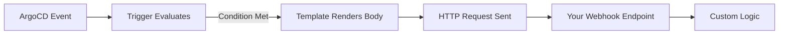

# How to Send ArgoCD Notifications to Webhook Endpoints

Author: [nawazdhandala](https://github.com/nawazdhandala)

Tags: ArgoCD, GitOps, Kubernetes, Webhooks, Notifications

Description: Learn how to configure ArgoCD webhook notifications to send deployment events to any HTTP endpoint, enabling custom integrations and event-driven automation.

---

Webhook notifications are the most flexible option in ArgoCD's notification system. They let you send deployment events to any HTTP endpoint - custom APIs, serverless functions, event buses, or third-party services that do not have dedicated ArgoCD support. If the service has an HTTP API, you can integrate it with ArgoCD webhooks.

## How Webhook Notifications Work

When a trigger fires, ArgoCD sends an HTTP request to the configured URL with a body that you define in the template. You control:

- The HTTP method (POST, PUT, PATCH)
- The URL and path
- Custom headers
- The request body (with access to application data through Go templates)



## Basic Webhook Configuration

Here is the simplest webhook setup:

```yaml
apiVersion: v1
kind: ConfigMap
metadata:
  name: argocd-notifications-cm
  namespace: argocd
data:
  service.webhook.my-webhook: |
    url: https://api.example.com/deployments
    headers:
      - name: Content-Type
        value: application/json
      - name: Authorization
        value: Bearer $webhook-auth-token
---
apiVersion: v1
kind: Secret
metadata:
  name: argocd-notifications-secret
  namespace: argocd
type: Opaque
stringData:
  webhook-auth-token: your-secret-token
```

## Creating Webhook Templates

### Simple JSON Payload

```yaml
  template.webhook-deploy-event: |
    webhook:
      my-webhook:
        method: POST
        body: |
          {
            "event": "deployment",
            "application": "{{ .app.metadata.name }}",
            "project": "{{ .app.spec.project }}",
            "revision": "{{ .app.status.sync.revision }}",
            "syncStatus": "{{ .app.status.sync.status }}",
            "healthStatus": "{{ .app.status.health.status }}",
            "namespace": "{{ .app.spec.destination.namespace }}",
            "cluster": "{{ .app.spec.destination.server }}",
            "timestamp": "{{ .app.status.operationState.finishedAt }}"
          }
```

### Detailed Deployment Report

```yaml
  template.webhook-detailed-report: |
    webhook:
      my-webhook:
        method: POST
        body: |
          {
            "event_type": "argocd_sync",
            "application": {
              "name": "{{ .app.metadata.name }}",
              "namespace": "{{ .app.metadata.namespace }}",
              "project": "{{ .app.spec.project }}"
            },
            "sync": {
              "status": "{{ .app.status.sync.status }}",
              "revision": "{{ .app.status.sync.revision }}",
              "comparedTo": {
                "source": {
                  "repoURL": "{{ .app.spec.source.repoURL }}",
                  "path": "{{ .app.spec.source.path }}",
                  "targetRevision": "{{ .app.spec.source.targetRevision }}"
                }
              }
            },
            "operation": {
              "phase": "{{ .app.status.operationState.phase }}",
              "message": "{{ .app.status.operationState.message }}",
              "startedAt": "{{ .app.status.operationState.startedAt }}",
              "finishedAt": "{{ .app.status.operationState.finishedAt }}"
            },
            "health": {
              "status": "{{ .app.status.health.status }}"
            },
            "destination": {
              "server": "{{ .app.spec.destination.server }}",
              "namespace": "{{ .app.spec.destination.namespace }}"
            }
          }
```

### Using Custom Path

You can append paths to the base URL:

```yaml
  template.webhook-with-path: |
    webhook:
      my-webhook:
        method: POST
        path: /api/v1/events/argocd
        body: |
          {
            "app": "{{ .app.metadata.name }}",
            "status": "{{ .app.status.operationState.phase }}"
          }
```

The request goes to `https://api.example.com/deployments/api/v1/events/argocd`.

## Multiple Webhook Endpoints

Send different events to different endpoints:

```yaml
  # Deployment tracker
  service.webhook.deploy-tracker: |
    url: https://deploy-tracker.internal:8080
    headers:
      - name: Content-Type
        value: application/json

  # Audit log service
  service.webhook.audit-log: |
    url: https://audit.internal:9090/events
    headers:
      - name: Content-Type
        value: application/json
      - name: X-Source
        value: argocd

  # External monitoring
  service.webhook.monitoring: |
    url: https://monitoring.example.com/api/events
    headers:
      - name: Content-Type
        value: application/json
      - name: Authorization
        value: Bearer $monitoring-token

  template.deploy-event: |
    webhook:
      deploy-tracker:
        method: POST
        body: |
          {"app": "{{ .app.metadata.name }}", "revision": "{{ .app.status.sync.revision }}", "status": "{{ .app.status.operationState.phase }}"}
      audit-log:
        method: POST
        body: |
          {"timestamp": "{{ .app.status.operationState.finishedAt }}", "action": "sync", "app": "{{ .app.metadata.name }}", "result": "{{ .app.status.operationState.phase }}"}
      monitoring:
        method: POST
        body: |
          {"event": "deployment", "app": "{{ .app.metadata.name }}", "health": "{{ .app.status.health.status }}"}
```

A single template can fan out to multiple webhook endpoints simultaneously.

## Triggers

```yaml
  trigger.on-sync-completed: |
    - when: app.status.operationState.phase in ['Succeeded']
      send: [deploy-event]

  trigger.on-sync-failed: |
    - when: app.status.operationState.phase in ['Error', 'Failed']
      send: [deploy-event]

  trigger.on-health-change: |
    - when: app.status.health.status in ['Degraded', 'Missing']
      send: [deploy-event]
```

## Subscribing Applications

```bash
kubectl annotate app my-app -n argocd \
  notifications.argoproj.io/subscribe.on-sync-completed.deploy-tracker=""
kubectl annotate app my-app -n argocd \
  notifications.argoproj.io/subscribe.on-sync-failed.deploy-tracker=""
```

## Use Cases for Webhook Notifications

### Triggering CI/CD Pipelines

Send a webhook to trigger downstream pipeline jobs after a successful deployment:

```yaml
  service.webhook.jenkins: |
    url: https://jenkins.example.com/generic-webhook-trigger/invoke
    headers:
      - name: Content-Type
        value: application/json
      - name: token
        value: $jenkins-webhook-token

  template.trigger-smoke-tests: |
    webhook:
      jenkins:
        method: POST
        body: |
          {
            "app": "{{ .app.metadata.name }}",
            "namespace": "{{ .app.spec.destination.namespace }}",
            "revision": "{{ .app.status.sync.revision }}"
          }
```

### Updating a Deployment Dashboard

Post deployment events to a custom dashboard API:

```yaml
  service.webhook.dashboard: |
    url: https://dashboard.internal/api/deployments
    headers:
      - name: Content-Type
        value: application/json

  template.dashboard-update: |
    webhook:
      dashboard:
        method: POST
        body: |
          {
            "application": "{{ .app.metadata.name }}",
            "environment": "{{ .app.spec.destination.namespace }}",
            "version": "{{ .app.status.sync.revision | trunc 7 }}",
            "status": "{{ .app.status.operationState.phase }}",
            "deployedAt": "{{ .app.status.operationState.finishedAt }}",
            "deployedBy": "argocd"
          }
```

### Sending Events to AWS EventBridge

Use the API Gateway endpoint for EventBridge:

```yaml
  service.webhook.eventbridge: |
    url: https://events.us-east-1.amazonaws.com
    headers:
      - name: Content-Type
        value: application/x-amz-json-1.1
      - name: X-Amz-Target
        value: AWSEvents.PutEvents

  template.eventbridge-deploy: |
    webhook:
      eventbridge:
        method: POST
        body: |
          {
            "Entries": [{
              "Source": "argocd",
              "DetailType": "deployment",
              "Detail": "{\"app\":\"{{ .app.metadata.name }}\",\"status\":\"{{ .app.status.operationState.phase }}\"}"
            }]
          }
```

## Error Handling and Retries

ArgoCD webhook notifications do not have built-in retries. If the endpoint is temporarily down, the notification is lost. To handle this:

1. Use a message queue (like AWS SQS or RabbitMQ) as the webhook target
2. Have your consumer process messages from the queue with retry logic
3. This adds reliability without depending on ArgoCD's notification system

## Debugging Webhook Notifications

```bash
# Watch notification controller logs
kubectl logs -n argocd deploy/argocd-notifications-controller -f

# Common errors:
# "dial tcp: connection refused" - Target endpoint is down or unreachable
# "i/o timeout" - Endpoint is too slow to respond
# "certificate is not trusted" - HTTPS endpoint has untrusted cert
# "non-2xx status code" - Endpoint returned an error

# Test with webhook.site for debugging
# Set service URL to https://webhook.site/your-unique-id
# Then check the webhook.site dashboard to see what ArgoCD sends
```

For more notification setup details, see our [complete setup guide](https://oneuptime.com/blog/post/2026-02-26-argocd-notifications-setup-from-scratch/view). For specific service integrations, check out [Slack](https://oneuptime.com/blog/post/2026-02-26-argocd-notifications-slack/view) and [PagerDuty](https://oneuptime.com/blog/post/2026-02-26-argocd-notifications-pagerduty/view).

Webhooks are the escape hatch for any integration that ArgoCD does not natively support. They give you full control over what data gets sent, where it goes, and how it is formatted. Start with webhook.site for testing, then point your webhooks at your production endpoints.
