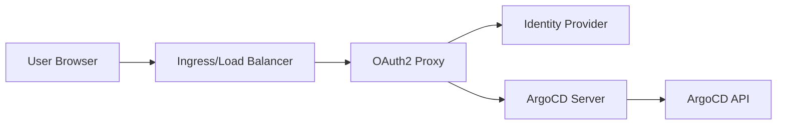

# How to Integrate ArgoCD with OAuth2 Proxy

Author: [nawazdhandala](https://github.com/nawazdhandala)

Tags: ArgoCD, GitOps, Kubernetes, OAuth2 Proxy, Authentication

Description: Learn how to put ArgoCD behind OAuth2 Proxy for centralized authentication, including configuration with various identity providers, header-based auth, and session management.

---

OAuth2 Proxy is a reverse proxy that provides authentication using OAuth2 providers like Google, GitHub, Azure AD, and others. Instead of configuring Dex inside ArgoCD for each identity provider, you can put ArgoCD behind OAuth2 Proxy and handle all authentication at the proxy layer. This is particularly useful when you already have OAuth2 Proxy deployed for other services and want a consistent authentication experience across your entire platform.

This guide covers deploying OAuth2 Proxy in front of ArgoCD and configuring both components to work together.

## Why OAuth2 Proxy Instead of Dex

There are several reasons you might prefer OAuth2 Proxy over ArgoCD's built-in Dex:

- You already use OAuth2 Proxy for other services and want consistency
- You need features Dex does not support (custom headers, IP allowlisting)
- You want to centralize authentication configuration in one place
- You need to integrate with an OAuth2 provider that Dex does not support natively
- You want additional middleware like rate limiting or bot protection before auth

## Architecture



The user hits OAuth2 Proxy first. If not authenticated, they are redirected to the IdP. After authentication, OAuth2 Proxy forwards the request to ArgoCD with authentication headers.

## Deploy OAuth2 Proxy

Deploy OAuth2 Proxy using Helm:

```bash
helm repo add oauth2-proxy https://oauth2-proxy.github.io/manifests
helm repo update
```

```yaml
# oauth2-proxy-values.yaml
config:
  # Client ID and secret from your OAuth2 provider
  clientID: "argocd-oauth2-client"
  clientSecret: "your-client-secret"

  # Cookie secret for session encryption (generate with: openssl rand -base64 32)
  cookieSecret: "generated-base64-secret"

  # Provider configuration (example: Google)
  configFile: |-
    provider = "google"
    email_domains = ["example.com"]
    cookie_secure = true
    cookie_domains = [".example.com"]
    cookie_samesite = "lax"
    upstreams = ["http://argocd-server.argocd.svc.cluster.local:80"]
    set_xauthrequest = true
    pass_access_token = true
    pass_authorization_header = true
    skip_provider_button = true

ingress:
  enabled: true
  className: nginx
  hosts:
  - argocd.example.com
  tls:
  - secretName: argocd-tls
    hosts:
    - argocd.example.com

resources:
  requests:
    cpu: 100m
    memory: 128Mi
  limits:
    cpu: 200m
    memory: 256Mi
```

Install it:

```bash
helm install oauth2-proxy oauth2-proxy/oauth2-proxy \
  --namespace argocd \
  --values oauth2-proxy-values.yaml
```

## Configure ArgoCD for Proxy Authentication

ArgoCD needs to trust the authentication headers that OAuth2 Proxy sends. Configure the ArgoCD server to accept proxy authentication:

```yaml
apiVersion: v1
kind: ConfigMap
metadata:
  name: argocd-cm
  namespace: argocd
data:
  url: https://argocd.example.com

  # Disable built-in Dex since we are using OAuth2 Proxy
  dex.config: ""

  # Users info header from OAuth2 Proxy
  users.anonymous.enabled: "false"
```

For ArgoCD to work behind a proxy, you need to configure the server to run without its own TLS (let the proxy handle TLS) and accept forwarded headers:

```yaml
apiVersion: v1
kind: ConfigMap
metadata:
  name: argocd-cmd-params-cm
  namespace: argocd
data:
  # Run ArgoCD server in insecure mode (proxy handles TLS)
  server.insecure: "true"

  # Trust proxy headers
  server.rootpath: ""
```

## Provider-Specific Configurations

### Google OAuth2

```ini
# OAuth2 Proxy config for Google
provider = "google"
client_id = "your-google-client-id.apps.googleusercontent.com"
client_secret = "your-google-client-secret"
email_domains = ["example.com"]
# Restrict to specific Google Workspace groups
google_group = "argocd-users@example.com"
google_admin_email = "admin@example.com"
google_service_account_json = "/etc/oauth2-proxy/service-account.json"
```

### GitHub OAuth2

```ini
# OAuth2 Proxy config for GitHub
provider = "github"
client_id = "your-github-client-id"
client_secret = "your-github-client-secret"
# Restrict to GitHub org members
github_org = "your-org"
# Further restrict to specific teams
github_team = "platform-team,devops"
scope = "user:email read:org"
```

### Azure AD (Entra ID)

```ini
# OAuth2 Proxy config for Azure AD
provider = "azure"
client_id = "your-azure-client-id"
client_secret = "your-azure-client-secret"
azure_tenant = "your-tenant-id"
oidc_issuer_url = "https://login.microsoftonline.com/your-tenant-id/v2.0"
email_domains = ["example.com"]
scope = "openid email profile"
```

## Ingress Configuration

Set up the Ingress to route through OAuth2 Proxy:

```yaml
# Nginx Ingress with OAuth2 Proxy auth annotations
apiVersion: networking.k8s.io/v1
kind: Ingress
metadata:
  name: argocd-server-ingress
  namespace: argocd
  annotations:
    nginx.ingress.kubernetes.io/auth-url: "https://argocd.example.com/oauth2/auth"
    nginx.ingress.kubernetes.io/auth-signin: "https://argocd.example.com/oauth2/start?rd=$escaped_request_uri"
    nginx.ingress.kubernetes.io/auth-response-headers: "X-Auth-Request-User,X-Auth-Request-Email,X-Auth-Request-Groups"
    nginx.ingress.kubernetes.io/backend-protocol: "HTTP"
    nginx.ingress.kubernetes.io/configuration-snippet: |
      proxy_set_header X-Forwarded-Proto https;
spec:
  ingressClassName: nginx
  tls:
  - hosts:
    - argocd.example.com
    secretName: argocd-tls
  rules:
  - host: argocd.example.com
    http:
      paths:
      - path: /
        pathType: Prefix
        backend:
          service:
            name: argocd-server
            port:
              number: 80
---
# OAuth2 Proxy ingress for auth endpoints
apiVersion: networking.k8s.io/v1
kind: Ingress
metadata:
  name: oauth2-proxy-ingress
  namespace: argocd
spec:
  ingressClassName: nginx
  tls:
  - hosts:
    - argocd.example.com
    secretName: argocd-tls
  rules:
  - host: argocd.example.com
    http:
      paths:
      - path: /oauth2
        pathType: Prefix
        backend:
          service:
            name: oauth2-proxy
            port:
              number: 4180
```

## ArgoCD CLI Access

The ArgoCD CLI does not go through the browser-based OAuth2 flow. For CLI access, you have two options:

### Option 1: API Token

Create an ArgoCD API token for CLI users:

```bash
# Generate token for a specific account
argocd account generate-token --account admin
```

### Option 2: Use ArgoCD SSO with Dex Alongside OAuth2 Proxy

Keep Dex for CLI SSO while using OAuth2 Proxy for the web UI. This requires separate Ingress paths:

```yaml
# CLI uses direct ArgoCD with Dex
# Web UI goes through OAuth2 Proxy
```

## Session Management

Configure session settings in OAuth2 Proxy for security:

```ini
# Session configuration
cookie_expire = "8h"         # Session expiry
cookie_refresh = "1h"        # Refresh session every hour
cookie_secure = true          # HTTPS only
cookie_httponly = true        # No JavaScript access
cookie_samesite = "lax"      # CSRF protection

# Redis session store for HA (optional)
session_store_type = "redis"
redis_connection_url = "redis://redis.argocd:6379"
```

## Health Checks and Monitoring

Monitor OAuth2 Proxy health alongside ArgoCD:

```yaml
# OAuth2 Proxy health check
apiVersion: monitoring.coreos.com/v1
kind: ServiceMonitor
metadata:
  name: oauth2-proxy
  namespace: argocd
spec:
  selector:
    matchLabels:
      app: oauth2-proxy
  endpoints:
  - port: metrics
    interval: 30s
```

Set up alerts for authentication failures and proxy errors through [OneUptime](https://oneuptime.com/blog/post/2026-02-09-argocd-monitoring-prometheus/view) to catch identity provider outages before they block your entire team from accessing ArgoCD.

## Troubleshooting

### 403 Forbidden After Authentication

Check that the OAuth2 Proxy is correctly forwarding headers:

```bash
# Verify headers reach ArgoCD
kubectl logs deployment/argocd-server -n argocd | grep -i "x-auth"
```

### Redirect Loop

This usually means ArgoCD's built-in auth is conflicting with OAuth2 Proxy:

```bash
# Ensure Dex is disabled
kubectl get configmap argocd-cm -n argocd -o yaml | grep dex
```

### WebSocket Connection Fails

ArgoCD uses WebSockets for log streaming. Configure the Ingress to support WebSocket upgrades:

```yaml
annotations:
  nginx.ingress.kubernetes.io/proxy-read-timeout: "3600"
  nginx.ingress.kubernetes.io/proxy-send-timeout: "3600"
  nginx.ingress.kubernetes.io/connection-proxy-header: "keep-alive"
```

## Conclusion

OAuth2 Proxy provides a clean separation between authentication and the ArgoCD application. By handling authentication at the proxy layer, you get a consistent SSO experience across all your platform services, centralized authentication configuration, and the ability to use any OAuth2-compatible identity provider. The main trade-off is that ArgoCD CLI access requires separate handling, typically through API tokens. For organizations already running OAuth2 Proxy for other services, this pattern reduces operational complexity by keeping all authentication configuration in one place.
