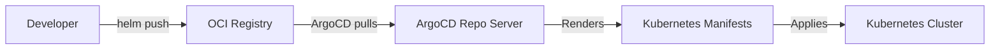

# How to Use OCI Artifacts as Application Sources in ArgoCD

Author: [nawazdhandala](https://github.com/nawazdhandala)

Tags: ArgoCD, GitOps, Kubernetes, OCI, Container Registry

Description: Learn how to use OCI artifacts and container registries as application sources in ArgoCD for distributing Helm charts, Kustomize bases, and Kubernetes manifests.

---

OCI (Open Container Initiative) support in ArgoCD lets you use container registries as a source for your application manifests. Instead of pulling Helm charts from traditional Helm repositories or cloning Git repos, ArgoCD can pull OCI artifacts directly from registries like Docker Hub, GitHub Container Registry, AWS ECR, Google Artifact Registry, and Azure Container Registry. This unifies your artifact distribution by storing both container images and deployment configurations in the same registry infrastructure.

## What Are OCI Artifacts

OCI artifacts extend the OCI image specification to store arbitrary content in container registries. While registries were originally designed for container images, the OCI artifact spec allows them to store anything - Helm charts, policy bundles, Wasm modules, SBOMs, and Kubernetes manifests.

For ArgoCD, the primary use case is storing Helm charts as OCI artifacts. This eliminates the need for a separate Helm chart repository (like ChartMuseum or a static file server).



## Why OCI Over Traditional Helm Repos

Traditional Helm repositories serve an `index.yaml` file that lists all charts and their versions. OCI registries eliminate this:

- **No index.yaml** - Charts are pulled directly by name and tag, no index to manage or update
- **Unified infrastructure** - Use the same registry for container images and Helm charts
- **Native authentication** - Leverage existing registry auth (IAM roles, service accounts, tokens)
- **Content addressing** - OCI artifacts are content-addressed via digests for integrity
- **Multi-architecture support** - OCI manifests can reference platform-specific artifacts
- **Better caching** - Registry layers are cached and deduplicated

## Configuring an OCI Source in ArgoCD

To use an OCI-hosted Helm chart as an ArgoCD application source, use the `chart` field with an OCI URL:

```yaml
# oci-helm-app.yaml - ArgoCD Application using OCI Helm chart
apiVersion: argoproj.io/v1alpha1
kind: Application
metadata:
  name: my-app
  namespace: argocd
spec:
  project: default
  source:
    # OCI registry URL (without the oci:// prefix)
    repoURL: registry.example.com/charts
    chart: my-app
    targetRevision: 1.2.3
    helm:
      releaseName: my-app
      valuesObject:
        replicaCount: 3
        image:
          repository: registry.example.com/images/my-app
          tag: v2.1.0
  destination:
    server: https://kubernetes.default.svc
    namespace: production
  syncPolicy:
    automated:
      prune: true
      selfHeal: true
```

Note the `repoURL` format - it is the registry URL without the `oci://` protocol prefix. ArgoCD determines it is an OCI source when the `chart` field is specified alongside a non-Git URL.

## Registering an OCI Registry with ArgoCD

Before ArgoCD can pull from an OCI registry, you need to register it:

```bash
# Register a public OCI registry (no auth needed)
argocd repo add registry.example.com/charts --type helm --name my-registry --enable-oci

# Register a private OCI registry with username/password
argocd repo add registry.example.com/charts \
  --type helm \
  --name my-registry \
  --enable-oci \
  --username my-user \
  --password my-token

# Register using a Kubernetes Secret
cat <<EOF | kubectl apply -f -
apiVersion: v1
kind: Secret
metadata:
  name: oci-registry-creds
  namespace: argocd
  labels:
    argocd.argoproj.io/secret-type: repository
type: Opaque
stringData:
  type: helm
  name: my-oci-registry
  url: registry.example.com/charts
  enableOCI: "true"
  username: my-user
  password: my-token
EOF
```

## Publishing Helm Charts to OCI Registries

Before ArgoCD can consume charts from OCI, you need to push them. Here is the workflow:

```bash
# Login to the OCI registry
helm registry login registry.example.com -u my-user -p my-token

# Package your Helm chart
helm package ./my-chart
# Creates my-chart-1.2.3.tgz

# Push to OCI registry
helm push my-chart-1.2.3.tgz oci://registry.example.com/charts

# Verify the push
helm show chart oci://registry.example.com/charts/my-chart --version 1.2.3
```

## OCI with Multiple Sources

OCI charts work with ArgoCD's multi-source feature. Combine an OCI Helm chart with values from a Git repository:

```yaml
apiVersion: argoproj.io/v1alpha1
kind: Application
metadata:
  name: my-app
  namespace: argocd
spec:
  sources:
    # OCI Helm chart
    - repoURL: registry.example.com/charts
      chart: my-app
      targetRevision: 1.2.3
      helm:
        releaseName: my-app
        valueFiles:
          - $values/my-app/production-values.yaml

    # Values from Git repo
    - repoURL: https://github.com/your-org/helm-values.git
      targetRevision: main
      ref: values

  destination:
    server: https://kubernetes.default.svc
    namespace: production
```

## Version Management

OCI artifacts use tags for versioning, similar to container images. In ArgoCD, the `targetRevision` field maps to the OCI tag:

```yaml
# Specific version
source:
  repoURL: registry.example.com/charts
  chart: my-app
  targetRevision: 1.2.3  # Pulls the exact version

# Semantic version range (if supported by your registry)
source:
  repoURL: registry.example.com/charts
  chart: my-app
  targetRevision: ">=1.0.0 <2.0.0"  # Semver constraint

# Latest (not recommended for production)
source:
  repoURL: registry.example.com/charts
  chart: my-app
  targetRevision: "*"  # Pulls latest available version
```

Always pin to specific versions in production to ensure reproducible deployments.

## CI/CD Pipeline Integration

Integrate OCI chart publishing into your CI/CD pipeline:

```yaml
# .github/workflows/publish-chart.yaml
name: Publish Helm Chart
on:
  push:
    tags:
      - 'v*'

jobs:
  publish:
    runs-on: ubuntu-latest
    steps:
      - uses: actions/checkout@v4

      - name: Install Helm
        uses: azure/setup-helm@v3

      - name: Login to OCI registry
        run: |
          echo "${{ secrets.REGISTRY_TOKEN }}" | \
          helm registry login registry.example.com -u ${{ secrets.REGISTRY_USER }} --password-stdin

      - name: Package and push chart
        run: |
          # Extract version from Git tag
          VERSION=${GITHUB_REF#refs/tags/v}

          # Update chart version
          sed -i "s/^version:.*/version: ${VERSION}/" charts/my-app/Chart.yaml

          # Package
          helm package charts/my-app

          # Push to OCI registry
          helm push my-app-${VERSION}.tgz oci://registry.example.com/charts
```

## Listing Available Versions

Unlike traditional Helm repos, OCI registries do not have an index. To list available versions:

```bash
# Using crane (a container registry tool)
crane ls registry.example.com/charts/my-app

# Using skopeo
skopeo list-tags docker://registry.example.com/charts/my-app

# Using the registry's API directly (Docker Registry HTTP API V2)
curl -s https://registry.example.com/v2/charts/my-app/tags/list | jq '.tags'
```

## Troubleshooting OCI Sources

Common issues and their fixes:

```bash
# Error: "repository not found"
# Fix: Ensure the repo is registered with --enable-oci
argocd repo add registry.example.com/charts --type helm --enable-oci

# Error: "authentication required"
# Fix: Check credentials
argocd repo get registry.example.com/charts

# Error: "manifest unknown"
# Fix: Verify the chart and version exist
helm pull oci://registry.example.com/charts/my-app --version 1.2.3

# Error: "unsupported media type"
# Fix: Ensure the chart was pushed using helm push (not docker push)
helm push my-chart-1.2.3.tgz oci://registry.example.com/charts

# View repo server logs for detailed OCI errors
kubectl logs -n argocd -l app.kubernetes.io/name=argocd-repo-server --tail=100
```

## Security Considerations

**Use image digests for production** - While tags can be overwritten, digests are immutable:

```yaml
# Tag-based (mutable)
targetRevision: 1.2.3

# Digest-based (immutable, more secure)
targetRevision: sha256:abc123def456...
```

**Rotate registry credentials** - Store credentials in Kubernetes Secrets and rotate them regularly.

**Use registry scanning** - OCI registries support vulnerability scanning. Scan your Helm charts just like you scan container images.

**Restrict push access** - Only CI/CD pipelines should have push access to chart registries. Developers should have read-only access.

## Best Practices

**One registry for everything** - Store container images and Helm charts in the same registry for simplicity.

**Consistent naming** - Use a predictable naming convention like `registry.example.com/charts/{chart-name}` for charts and `registry.example.com/images/{image-name}` for images.

**Automate publishing** - Never push charts manually. Always use CI/CD to ensure consistency and traceability.

**Pin versions** - Always use specific version tags in ArgoCD Applications, never `latest` or `*`.

For specific registry configurations, see our guides on [authenticating with OCI registries](https://oneuptime.com/blog/post/2026-02-26-argocd-authenticate-oci-registries/view) and [using AWS ECR with ArgoCD](https://oneuptime.com/blog/post/2026-02-26-argocd-aws-ecr-oci-registry/view).
