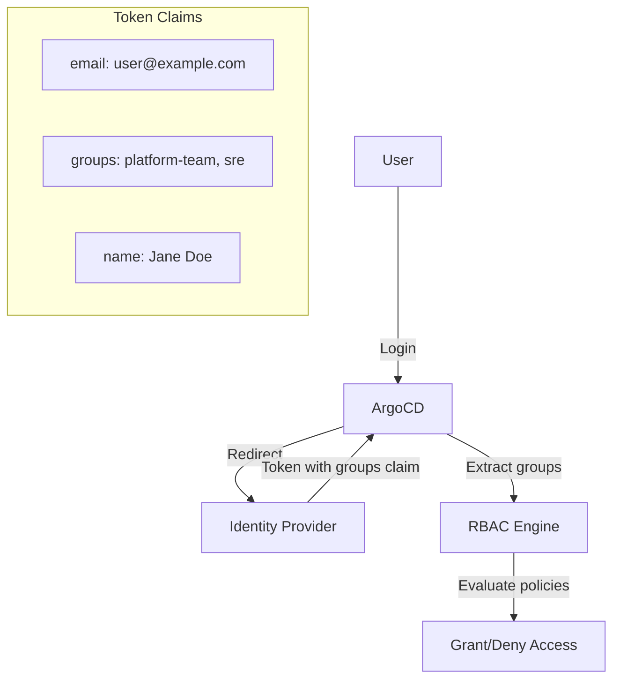

# How to Configure OIDC Groups in ArgoCD for Team-Based Access

Author: [nawazdhandala](https://github.com/nawazdhandala)

Tags: ArgoCD, GitOps, Kubernetes, OIDC, RBAC

Description: Learn how to configure OIDC group claims in ArgoCD to implement team-based access control, mapping identity provider groups to ArgoCD RBAC roles.

---

One of the most powerful features of ArgoCD's SSO integration is the ability to map OIDC group claims to ArgoCD RBAC roles. Instead of managing individual user permissions in ArgoCD, you define access rules based on groups from your identity provider. When a user's group membership changes in the IdP, their ArgoCD permissions update automatically.

This guide covers the concepts and practical configuration for team-based access control using OIDC groups in ArgoCD.

## How OIDC Groups Work in ArgoCD

When a user logs into ArgoCD through SSO, the identity provider returns a token containing claims about the user. One of these claims contains the user's group memberships. ArgoCD reads this claim and uses it to evaluate RBAC policies.



The key configuration points are:

1. **Identity Provider** - Must include group memberships in the OIDC token
2. **ArgoCD ConfigMap** - Must request the correct scopes and claims
3. **ArgoCD RBAC ConfigMap** - Must map group names to ArgoCD roles

## Configuring the Groups Claim

### Step 1: Request the Groups Scope

In the `argocd-cm` ConfigMap, add `groups` to the requested scopes:

```yaml
apiVersion: v1
kind: ConfigMap
metadata:
  name: argocd-cm
  namespace: argocd
data:
  url: https://argocd.example.com
  oidc.config: |
    name: Your IdP
    issuer: https://idp.example.com
    clientID: argocd-client-id
    clientSecret: $oidc.clientSecret
    requestedScopes:
      - openid
      - profile
      - email
      - groups
    requestedIDTokenClaims:
      groups:
        essential: true
```

The `requestedIDTokenClaims` tells the IdP that the groups claim is essential and must be included in the ID token.

### Step 2: Tell ArgoCD Which Claim Contains Groups

In the `argocd-rbac-cm` ConfigMap, specify the claim name:

```yaml
apiVersion: v1
kind: ConfigMap
metadata:
  name: argocd-rbac-cm
  namespace: argocd
data:
  scopes: '[groups]'
```

The `scopes` field tells ArgoCD which token claim to read for group information. Common claim names by provider:

| Identity Provider | Claim Name |
|---|---|
| Okta | `groups` |
| Azure AD | `groups` (contains GUIDs by default) |
| Keycloak | `groups` (requires protocol mapper) |
| Auth0 | `https://your-domain/groups` (namespaced) |
| Google (via Dex) | `groups` |
| Zitadel | `urn:zitadel:iam:org:project:roles` |
| GitHub (via Dex) | `groups` (format: `org:team`) |
| GitLab (via Dex) | `groups` (format: `group/subgroup`) |

For non-standard claim names (like Auth0's namespaced claims), update the scopes accordingly:

```yaml
  scopes: '[https://argocd.example.com/groups]'
```

## Designing Team-Based RBAC

### Common Access Patterns

Most organizations follow a tiered access model:

```yaml
apiVersion: v1
kind: ConfigMap
metadata:
  name: argocd-rbac-cm
  namespace: argocd
data:
  # Default policy for authenticated users with no matching group
  policy.default: role:readonly

  policy.csv: |
    # === ADMIN ACCESS ===
    # Platform team gets full admin access
    g, platform-team, role:admin
    # SRE team gets full admin access
    g, sre-team, role:admin

    # === DEVELOPER ACCESS ===
    # Define what developers can do
    p, role:developer, applications, get, */*, allow
    p, role:developer, applications, sync, dev/*, allow
    p, role:developer, applications, sync, staging/*, allow
    p, role:developer, applications, create, dev/*, allow
    p, role:developer, applications, delete, dev/*, allow
    p, role:developer, logs, get, */*, allow

    # Map groups to developer role
    g, backend-team, role:developer
    g, frontend-team, role:developer
    g, data-team, role:developer

    # === RESTRICTED PRODUCTION ACCESS ===
    # Define a role for production read + sync only
    p, role:prod-deployer, applications, get, production/*, allow
    p, role:prod-deployer, applications, sync, production/*, allow

    # Only specific teams can deploy to production
    g, release-managers, role:prod-deployer
    g, sre-team, role:prod-deployer

    # === READ-ONLY ACCESS ===
    # QA and management get read-only
    g, qa-team, role:readonly
    g, management, role:readonly

  scopes: '[groups]'
```

### Project-Scoped Access

For larger organizations, use ArgoCD Projects to isolate teams further:

```yaml
  policy.csv: |
    # Team Alpha can only see and manage apps in the "team-alpha" project
    p, role:team-alpha-dev, applications, *, team-alpha/*, allow
    p, role:team-alpha-dev, projects, get, team-alpha, allow
    g, team-alpha-developers, role:team-alpha-dev

    # Team Beta has access to their own project
    p, role:team-beta-dev, applications, *, team-beta/*, allow
    p, role:team-beta-dev, projects, get, team-beta, allow
    g, team-beta-developers, role:team-beta-dev

    # Platform team can access all projects
    g, platform-team, role:admin
```

### Environment-Based Access

Restrict access based on deployment environments:

```yaml
  policy.csv: |
    # Anyone in engineering can view everything
    p, role:engineering, applications, get, */*, allow
    p, role:engineering, logs, get, */*, allow
    g, engineering, role:engineering

    # Dev environment - open to all developers
    p, role:dev-deployer, applications, *, dev/*, allow
    g, all-developers, role:dev-deployer

    # Staging - limited to team leads and SRE
    p, role:staging-deployer, applications, sync, staging/*, allow
    p, role:staging-deployer, applications, get, staging/*, allow
    g, team-leads, role:staging-deployer
    g, sre, role:staging-deployer

    # Production - only SRE and change-approved accounts
    p, role:prod-deployer, applications, sync, production/*, allow
    p, role:prod-deployer, applications, get, production/*, allow
    g, sre, role:prod-deployer
```

## Handling Multiple Groups per User

Users often belong to multiple groups. ArgoCD evaluates all matching policies and grants the union of permissions. For example, if a user belongs to both `developers` (sync staging) and `release-managers` (sync production), they can sync both staging and production.

This additive behavior means you should design your groups and roles carefully:

```yaml
  policy.csv: |
    # Base permissions for all developers
    p, role:base-dev, applications, get, */*, allow
    p, role:base-dev, logs, get, */*, allow
    g, developers, role:base-dev

    # Additional permissions for senior developers
    p, role:senior-dev, applications, sync, staging/*, allow
    g, senior-developers, role:senior-dev

    # Additional permissions for tech leads
    p, role:tech-lead, applications, sync, production/*, allow
    p, role:tech-lead, applications, create, */*, allow
    g, tech-leads, role:tech-lead
```

A tech lead who is also a developer (and a senior developer) gets all three roles combined.

## Verifying Group Configuration

### Check Token Claims

After logging in, check what groups ArgoCD sees:

```bash
argocd login argocd.example.com --sso
argocd account get-user-info
```

### Enable Debug Logging

For more detail, enable debug logging on the ArgoCD server:

```yaml
apiVersion: v1
kind: ConfigMap
metadata:
  name: argocd-cmd-params-cm
  namespace: argocd
data:
  server.log.level: debug
```

Then check the logs:

```bash
kubectl -n argocd logs deploy/argocd-server | grep -i "groups\|rbac\|policy"
```

### Test RBAC Policies

Use `argocd admin` commands to test RBAC policies:

```bash
# Test if a user/group has a specific permission
argocd admin settings rbac can role:developer sync applications 'staging/*' \
  --policy-file /path/to/policy.csv
```

## Common Pitfalls

### 1. Groups Claim Not in Token

The most common issue. Every IdP handles groups differently. Check the IdP-specific setup:
- **Okta**: Add a Groups claim to the authorization server
- **Azure AD**: Configure Token configuration with group claims
- **Keycloak**: Add a Group Membership protocol mapper
- **Auth0**: Create an Action that adds roles to the token

### 2. Case Sensitivity

Group names in RBAC policies are case-sensitive. If the IdP sends `Platform-Team` but your policy has `platform-team`, it will not match.

### 3. Group Name Format

Different IdPs format group names differently:
- GitHub: `organization:team-name`
- GitLab: `group/subgroup`
- Azure AD: GUIDs like `a1b2c3d4-...` (unless configured for display names)
- LDAP: `CN=GroupName,OU=Groups,DC=example,DC=com` (with Dex)

### 4. Policy Default Too Permissive

Setting `policy.default: role:admin` gives admin access to any authenticated user without a specific group mapping. Always use `role:readonly` or an empty string as the default.

## Summary

OIDC group-based access control in ArgoCD lets you manage deployment permissions through your identity provider rather than maintaining separate access lists. The configuration involves three pieces: the IdP must include groups in the token, ArgoCD must be told which claim to read, and the RBAC policies must map those groups to ArgoCD roles. Once set up, permission changes happen in your IdP and propagate automatically to ArgoCD.

For provider-specific setup guides, see [How to Configure SSO with Okta in ArgoCD](https://oneuptime.com/blog/post/2026-02-26-argocd-sso-okta/view) and [How to Configure SSO with Azure AD in ArgoCD](https://oneuptime.com/blog/post/2026-02-26-argocd-sso-azure-ad-entra-id/view).
