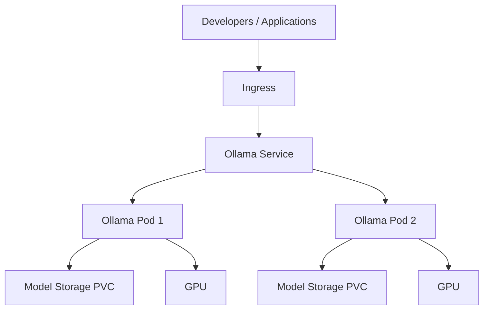

# How to Deploy Ollama with ArgoCD

Author: [nawazdhandala](https://github.com/nawazdhandala)

Tags: ArgoCD, GitOps, Kubernetes, Ollama, LLM

Description: Learn how to deploy Ollama for local LLM serving on Kubernetes using ArgoCD, with model preloading, GPU support, persistent storage, and production-ready configuration.

---

Ollama makes running large language models as simple as running a Docker container. It handles model downloads, quantization, and serving through a clean REST API. While vLLM is optimized for maximum throughput in production, Ollama excels at ease of use - making it ideal for internal tools, development environments, and teams that want LLM capabilities without the complexity of a full ML serving platform. Deploying Ollama through ArgoCD gives you a GitOps-managed LLM service that your team can rely on.

This guide covers deploying Ollama on Kubernetes with ArgoCD, including model management, GPU configuration, and scaling for team use.

## Ollama on Kubernetes Architecture



Ollama runs as a server process that manages model downloads, loading, and inference. Each pod has its own model storage, and models are loaded into GPU or CPU memory on demand.

## Basic Ollama Deployment

Start with a straightforward deployment:

```yaml
# apps/ollama/deployment.yaml
apiVersion: apps/v1
kind: Deployment
metadata:
  name: ollama
  labels:
    app: ollama
spec:
  replicas: 1
  selector:
    matchLabels:
      app: ollama
  template:
    metadata:
      labels:
        app: ollama
    spec:
      containers:
        - name: ollama
          image: ollama/ollama:0.1.27
          ports:
            - containerPort: 11434
              name: http
          env:
            - name: OLLAMA_HOST
              value: "0.0.0.0:11434"
            # Keep models loaded in memory longer
            - name: OLLAMA_KEEP_ALIVE
              value: "24h"
            # Set number of parallel requests
            - name: OLLAMA_NUM_PARALLEL
              value: "4"
          resources:
            requests:
              cpu: "4"
              memory: 8Gi
            limits:
              cpu: "8"
              memory: 16Gi
          readinessProbe:
            httpGet:
              path: /
              port: 11434
            initialDelaySeconds: 10
            periodSeconds: 5
          livenessProbe:
            httpGet:
              path: /
              port: 11434
            initialDelaySeconds: 30
            periodSeconds: 30
          volumeMounts:
            - name: ollama-data
              mountPath: /root/.ollama
      volumes:
        - name: ollama-data
          persistentVolumeClaim:
            claimName: ollama-data
---
apiVersion: v1
kind: PersistentVolumeClaim
metadata:
  name: ollama-data
spec:
  accessModes:
    - ReadWriteOnce
  resources:
    requests:
      storage: 100Gi
  storageClassName: gp3
---
apiVersion: v1
kind: Service
metadata:
  name: ollama
spec:
  selector:
    app: ollama
  ports:
    - name: http
      port: 11434
      targetPort: 11434
```

## GPU-Accelerated Ollama

For production-worthy inference speed, add GPU support:

```yaml
apiVersion: apps/v1
kind: Deployment
metadata:
  name: ollama-gpu
  labels:
    app: ollama
spec:
  replicas: 1
  selector:
    matchLabels:
      app: ollama
  template:
    metadata:
      labels:
        app: ollama
    spec:
      containers:
        - name: ollama
          image: ollama/ollama:0.1.27
          ports:
            - containerPort: 11434
          env:
            - name: OLLAMA_HOST
              value: "0.0.0.0:11434"
            - name: OLLAMA_KEEP_ALIVE
              value: "24h"
            - name: OLLAMA_NUM_PARALLEL
              value: "4"
            # GPU configuration
            - name: NVIDIA_VISIBLE_DEVICES
              value: all
          resources:
            requests:
              cpu: "4"
              memory: 16Gi
              nvidia.com/gpu: 1
            limits:
              cpu: "8"
              memory: 32Gi
              nvidia.com/gpu: 1
          volumeMounts:
            - name: ollama-data
              mountPath: /root/.ollama
      nodeSelector:
        nvidia.com/gpu.product: NVIDIA-A10G
      tolerations:
        - key: nvidia.com/gpu
          operator: Exists
          effect: NoSchedule
      volumes:
        - name: ollama-data
          persistentVolumeClaim:
            claimName: ollama-data
```

## Preloading Models

Ollama downloads models on first request, which causes a long delay. Preload models during deployment with an init container:

```yaml
apiVersion: apps/v1
kind: Deployment
metadata:
  name: ollama
spec:
  template:
    spec:
      initContainers:
        # Start Ollama temporarily to pull models
        - name: model-preloader
          image: ollama/ollama:0.1.27
          command:
            - sh
            - -c
            - |
              # Start Ollama server in the background
              ollama serve &
              SERVER_PID=$!
              sleep 5

              # Pull required models
              echo "Pulling models..."
              ollama pull llama3.1:8b
              ollama pull mistral:7b
              ollama pull codellama:13b
              ollama pull nomic-embed-text

              echo "All models pulled successfully"

              # Stop the server
              kill $SERVER_PID
          env:
            - name: OLLAMA_HOST
              value: "0.0.0.0:11434"
          resources:
            requests:
              cpu: "2"
              memory: 8Gi
              nvidia.com/gpu: 1
            limits:
              nvidia.com/gpu: 1
          volumeMounts:
            - name: ollama-data
              mountPath: /root/.ollama
      containers:
        - name: ollama
          image: ollama/ollama:0.1.27
          # ... rest of container spec
```

## Managing Model Versions with GitOps

Track which models should be available in a ConfigMap:

```yaml
# apps/ollama/model-config.yaml
apiVersion: v1
kind: ConfigMap
metadata:
  name: ollama-models
  labels:
    app: ollama
data:
  models.txt: |
    llama3.1:8b
    mistral:7b
    codellama:13b
    nomic-embed-text:latest
  pull-script.sh: |
    #!/bin/sh
    # Start Ollama server in the background
    ollama serve &
    sleep 5

    # Pull each model from the list
    while IFS= read -r model; do
      # Skip empty lines and comments
      [ -z "$model" ] && continue
      echo "$model" | grep -q '^#' && continue

      echo "Pulling model: $model"
      ollama pull "$model"
      if [ $? -ne 0 ]; then
        echo "WARNING: Failed to pull $model"
      fi
    done < /config/models.txt

    echo "Model preloading complete"
    kill %1
```

Update the init container to use this config:

```yaml
initContainers:
  - name: model-preloader
    image: ollama/ollama:0.1.27
    command:
      - sh
      - /config/pull-script.sh
    volumeMounts:
      - name: ollama-data
        mountPath: /root/.ollama
      - name: config
        mountPath: /config
volumes:
  - name: config
    configMap:
      name: ollama-models
      defaultMode: 0755
```

To add or update a model, just update the ConfigMap in Git:

```bash
# Add a new model
echo "mixtral:8x7b" >> models.txt
git add apps/ollama/model-config.yaml
git commit -m "Add Mixtral 8x7B model to Ollama"
git push
# ArgoCD redeploys with the new model
```

## Creating Custom Modelfiles

Ollama supports custom Modelfiles for fine-tuned behavior. Manage them through GitOps:

```yaml
apiVersion: v1
kind: ConfigMap
metadata:
  name: ollama-custom-models
data:
  code-assistant.modelfile: |
    FROM codellama:13b
    PARAMETER temperature 0.2
    PARAMETER num_predict 2048
    PARAMETER top_p 0.9

    SYSTEM """You are a helpful coding assistant. You write clean,
    well-documented code. Always explain your reasoning. When you
    suggest code changes, show the complete file with changes applied."""

  support-agent.modelfile: |
    FROM llama3.1:8b
    PARAMETER temperature 0.7
    PARAMETER num_predict 1024

    SYSTEM """You are a customer support agent for a software company.
    Be helpful, concise, and professional. If you do not know the answer,
    say so honestly and suggest where the user can find help."""
```

Load custom models in the init container:

```yaml
initContainers:
  - name: model-preloader
    image: ollama/ollama:0.1.27
    command:
      - sh
      - -c
      - |
        ollama serve &
        sleep 5

        # Pull base models
        while IFS= read -r model; do
          [ -z "$model" ] && continue
          ollama pull "$model"
        done < /config/models.txt

        # Create custom models from Modelfiles
        for modelfile in /custom-models/*.modelfile; do
          name=$(basename "$modelfile" .modelfile)
          echo "Creating custom model: $name"
          ollama create "$name" -f "$modelfile"
        done

        kill %1
    volumeMounts:
      - name: ollama-data
        mountPath: /root/.ollama
      - name: config
        mountPath: /config
      - name: custom-models
        mountPath: /custom-models
volumes:
  - name: custom-models
    configMap:
      name: ollama-custom-models
```

## Exposing the Ollama API

Set up ingress with authentication for team access:

```yaml
apiVersion: networking.k8s.io/v1
kind: Ingress
metadata:
  name: ollama-ingress
  annotations:
    nginx.ingress.kubernetes.io/proxy-read-timeout: "300"
    nginx.ingress.kubernetes.io/proxy-send-timeout: "300"
    # Enable streaming for chat responses
    nginx.ingress.kubernetes.io/proxy-buffering: "off"
    # Basic auth for access control
    nginx.ingress.kubernetes.io/auth-type: basic
    nginx.ingress.kubernetes.io/auth-secret: ollama-basic-auth
    nginx.ingress.kubernetes.io/auth-realm: "Ollama LLM API"
spec:
  ingressClassName: nginx
  tls:
    - hosts:
        - ollama.internal.example.com
      secretName: ollama-tls
  rules:
    - host: ollama.internal.example.com
      http:
        paths:
          - path: /
            pathType: Prefix
            backend:
              service:
                name: ollama
                port:
                  number: 11434
```

## Using Ollama from Applications

Your applications can call the Ollama API directly:

```python
import requests

OLLAMA_URL = "http://ollama.default.svc:11434"

# Generate a response
response = requests.post(f"{OLLAMA_URL}/api/generate", json={
    "model": "llama3.1:8b",
    "prompt": "Explain the concept of GitOps in one paragraph",
    "stream": False,
})

print(response.json()["response"])

# Chat completion
response = requests.post(f"{OLLAMA_URL}/api/chat", json={
    "model": "code-assistant",  # Custom model
    "messages": [
        {"role": "user", "content": "Write a Python function to parse JSON safely"}
    ],
    "stream": False,
})

print(response.json()["message"]["content"])
```

Or use the OpenAI-compatible endpoint:

```python
from openai import OpenAI

client = OpenAI(
    base_url="http://ollama.default.svc:11434/v1",
    api_key="not-needed",
)

response = client.chat.completions.create(
    model="llama3.1:8b",
    messages=[{"role": "user", "content": "Hello!"}],
)
```

## Scaling for Teams

For multiple teams sharing Ollama, deploy separate instances per team or scale horizontally:

```yaml
apiVersion: apps/v1
kind: Deployment
metadata:
  name: ollama
spec:
  replicas: 3
  template:
    spec:
      # Use ReadWriteMany storage for shared model cache
      volumes:
        - name: ollama-data
          persistentVolumeClaim:
            claimName: ollama-shared-data
---
apiVersion: v1
kind: PersistentVolumeClaim
metadata:
  name: ollama-shared-data
spec:
  accessModes:
    - ReadWriteMany
  resources:
    requests:
      storage: 200Gi
  storageClassName: efs  # EFS, NFS, or similar RWX storage
```

## Monitoring Ollama

Monitor Ollama health and usage:

```yaml
apiVersion: batch/v1
kind: CronJob
metadata:
  name: ollama-health-check
spec:
  schedule: "*/5 * * * *"
  jobTemplate:
    spec:
      template:
        spec:
          restartPolicy: Never
          containers:
            - name: check
              image: curlimages/curl:8.5.0
              command:
                - sh
                - -c
                - |
                  # Check Ollama health
                  status=$(curl -s -o /dev/null -w "%{http_code}" \
                    http://ollama.default.svc:11434/)
                  if [ "$status" != "200" ]; then
                    echo "Ollama unhealthy: HTTP $status"
                    # Send alert
                    curl -X POST "$SLACK_WEBHOOK" \
                      -H "Content-Type: application/json" \
                      -d '{"text":"Ollama health check failed"}'
                    exit 1
                  fi

                  # List loaded models
                  models=$(curl -s http://ollama.default.svc:11434/api/tags)
                  echo "Available models: $models"
```

Use OneUptime to monitor Ollama API latency, track model loading times, and alert when the service becomes unresponsive or inference times spike.

## ArgoCD Application

```yaml
apiVersion: argoproj.io/v1alpha1
kind: Application
metadata:
  name: ollama
  namespace: argocd
spec:
  project: ml-platform
  source:
    repoURL: https://github.com/myorg/ml-gitops.git
    targetRevision: main
    path: apps/ollama
  destination:
    server: https://kubernetes.default.svc
    namespace: llm-serving
  syncPolicy:
    automated:
      prune: true
      selfHeal: true
    syncOptions:
      - CreateNamespace=true
  ignoreDifferences:
    - group: apps
      kind: Deployment
      jsonPointers:
        - /spec/replicas
```

For high-throughput production LLM serving, see our guide on [deploying vLLM with ArgoCD](https://oneuptime.com/blog/post/2026-02-26-argocd-vllm-deployment/view). For deploying traditional ML models, check out [ML model serving with ArgoCD](https://oneuptime.com/blog/post/2026-02-26-argocd-ml-model-serving/view).

## Best Practices

1. **Preload models** - Use init containers to download models before the main container starts. First-request downloads cause unacceptable latency.
2. **Use persistent storage** - Store models on PVCs so they survive pod restarts without re-downloading.
3. **Set OLLAMA_KEEP_ALIVE** - Keep models loaded in memory between requests to avoid reload latency.
4. **Right-size GPU memory** - A 7B model needs roughly 4GB GPU RAM (quantized). A 13B model needs roughly 8GB.
5. **Use custom Modelfiles** - Customize system prompts and parameters for specific use cases.
6. **Authenticate the API** - Do not expose Ollama without authentication, even internally.
7. **Monitor model loading** - Track which models are loaded and how long loading takes.
8. **Use ReadWriteMany for shared storage** - When running multiple replicas, use RWX storage classes so all pods share the model cache.

Ollama with ArgoCD gives you a simple, reliable LLM serving platform managed through GitOps. Models are tracked in Git, deployments are automated, and your team gets self-service access to LLM capabilities without managing GPU infrastructure themselves.
