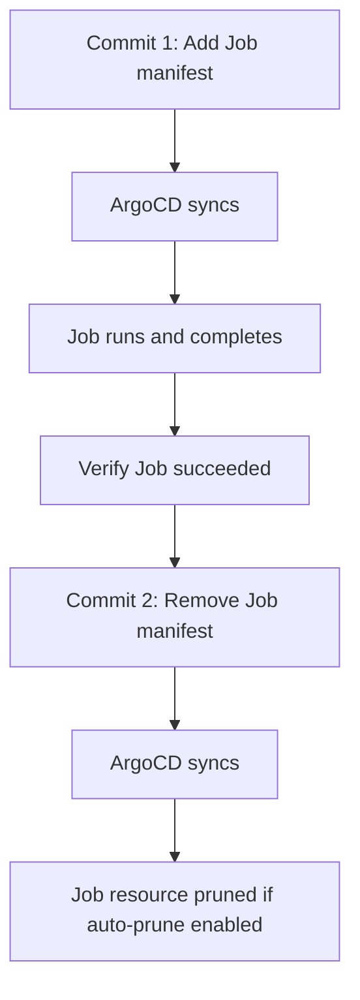

# How to Handle One-Off Jobs with GitOps

Author: [nawazdhandala](https://github.com/nawazdhandala)

Tags: ArgoCD, GitOps, Kubernetes, Jobs, DevOps

Description: Learn how to manage one-off Kubernetes Jobs in GitOps workflows with ArgoCD, including data migrations, cleanup tasks, and ad-hoc operations using sync hooks and job patterns.

---

One-off jobs are tasks that run once and then complete - data migrations, backfill scripts, cleanup operations, report generation. They do not fit neatly into the GitOps model because GitOps is designed for continuously desired state, not one-time actions.

This guide covers practical patterns for handling one-off jobs with ArgoCD without breaking your GitOps workflow.

## The Problem with One-Off Jobs in GitOps

GitOps says your Git repository is the source of truth for the desired state of your cluster. But a one-off job has a lifecycle problem:

1. You add the Job manifest to Git
2. ArgoCD syncs it and the Job runs
3. The Job completes
4. Now what? The Job manifest is still in Git, but you do not want it to run again
5. If someone syncs the application, does the Job run again?

The answer depends on how you define the Job and whether ArgoCD considers a completed Job as "in sync."

## Pattern 1: Sync Hooks for One-Time Operations

The cleanest approach is to use ArgoCD sync hooks. A hook runs during a specific sync phase and can be automatically cleaned up:

```yaml
apiVersion: batch/v1
kind: Job
metadata:
  name: data-backfill-v2
  annotations:
    argocd.argoproj.io/hook: PostSync
    argocd.argoproj.io/hook-delete-policy: HookSucceeded
spec:
  template:
    spec:
      containers:
        - name: backfill
          image: myorg/backend-api:v2.0.0
          command:
            - python
            - -c
            - |
              from app.tasks import backfill_user_profiles
              backfill_user_profiles()
          env:
            - name: DATABASE_URL
              valueFrom:
                secretKeyRef:
                  name: db-credentials
                  key: url
      restartPolicy: Never
  backoffLimit: 3
```

### Hook Delete Policies

The delete policy controls when the Job resource is cleaned up:

- **HookSucceeded**: Delete the Job after it succeeds. If it fails, the Job remains for debugging.
- **HookFailed**: Delete the Job after it fails (rarely useful on its own).
- **BeforeHookCreation**: Delete the previous Job before creating a new one on the next sync.

For most one-off tasks, combine `BeforeHookCreation` with `HookSucceeded`:

```yaml
annotations:
  argocd.argoproj.io/hook: PostSync
  argocd.argoproj.io/hook-delete-policy: HookSucceeded,BeforeHookCreation
```

This means:
- On success, the Job is cleaned up immediately
- On the next sync, any leftover failed Job is cleaned up before a new one is created

## Pattern 2: Named Jobs with Version Suffixes

If you want the Job to run exactly once and never again, use a versioned name:

```yaml
apiVersion: batch/v1
kind: Job
metadata:
  name: migrate-user-emails-v3    # Change the name for each new job
spec:
  template:
    spec:
      containers:
        - name: migrate
          image: myorg/backend-api:v2.1.0
          command: ["python", "scripts/migrate_emails.py"]
          env:
            - name: DATABASE_URL
              valueFrom:
                secretKeyRef:
                  name: db-credentials
                  key: url
      restartPolicy: Never
  backoffLimit: 1
```

When ArgoCD syncs, it creates the Job if it does not exist. Since the Job name includes a version, a completed Job with the same name will not be recreated. When you need a new migration, change the name to `migrate-user-emails-v4`.

### Cleaning Up Old Jobs

Over time, completed Jobs accumulate. Add a TTL to auto-clean them:

```yaml
apiVersion: batch/v1
kind: Job
metadata:
  name: migrate-user-emails-v3
spec:
  ttlSecondsAfterFinished: 86400    # Clean up 24 hours after completion
  template:
    spec:
      containers:
        - name: migrate
          image: myorg/backend-api:v2.1.0
          command: ["python", "scripts/migrate_emails.py"]
      restartPolicy: Never
```

## Pattern 3: CronJob for Recurring One-Off Tasks

If your "one-off" task is actually something that runs periodically (daily reports, weekly cleanup), use a CronJob:

```yaml
apiVersion: batch/v1
kind: CronJob
metadata:
  name: weekly-data-cleanup
spec:
  schedule: "0 3 * * 0"    # Every Sunday at 3 AM
  concurrencyPolicy: Forbid
  successfulJobsHistoryLimit: 3
  failedJobsHistoryLimit: 3
  jobTemplate:
    spec:
      template:
        spec:
          containers:
            - name: cleanup
              image: myorg/backend-api:v2.0.0
              command: ["python", "scripts/cleanup_old_data.py"]
          restartPolicy: OnFailure
```

CronJobs work well with GitOps because they represent a continuous desired state (the schedule) rather than a one-time action.

## Pattern 4: The Add-Then-Remove Workflow

For truly one-off operations that do not fit the hook pattern, use a two-commit workflow:



Commit 1 - Add the Job:

```yaml
# apps/backend-api/jobs/backfill-profiles.yaml
apiVersion: batch/v1
kind: Job
metadata:
  name: backfill-profiles
spec:
  template:
    spec:
      containers:
        - name: backfill
          image: myorg/backend-api:v2.0.0
          command: ["python", "scripts/backfill_profiles.py"]
      restartPolicy: Never
  backoffLimit: 3
```

After the Job completes successfully, Commit 2 - Remove the Job manifest from Git. If pruning is enabled, ArgoCD will delete the completed Job resource from the cluster.

This is manual and somewhat clunky, but it keeps your Git history clean and your GitOps workflow pure.

## Pattern 5: Separate One-Off Application

Create a dedicated ArgoCD Application for ad-hoc jobs:

```yaml
apiVersion: argoproj.io/v1alpha1
kind: Application
metadata:
  name: adhoc-jobs
  namespace: argocd
spec:
  project: default
  source:
    repoURL: https://github.com/myorg/config-repo.git
    targetRevision: main
    path: jobs/adhoc
  destination:
    server: https://kubernetes.default.svc
    namespace: jobs
  syncPolicy:
    syncOptions:
      - PruneLast=true
```

Place one-off jobs in the `jobs/adhoc/` directory. After they run, remove them from Git. The separate Application keeps job noise out of your application sync history.

## Handling Job Failures

When a one-off job fails, you need visibility:

```bash
# Check Job status
kubectl get jobs -n backend-api

# View Job logs
kubectl logs job/migrate-user-emails-v3 -n backend-api

# View events for debugging
kubectl describe job/migrate-user-emails-v3 -n backend-api
```

For critical jobs, add a SyncFail hook that sends an alert:

```yaml
apiVersion: batch/v1
kind: Job
metadata:
  name: notify-job-failure
  annotations:
    argocd.argoproj.io/hook: SyncFail
    argocd.argoproj.io/hook-delete-policy: HookSucceeded
spec:
  template:
    spec:
      containers:
        - name: notify
          image: curlimages/curl:latest
          command:
            - curl
            - -X
            - POST
            - -H
            - "Content-Type: application/json"
            - -d
            - '{"text":"One-off job failed in backend-api sync"}'
            - https://hooks.slack.com/services/YOUR/WEBHOOK/URL
      restartPolicy: Never
```

## Making Jobs Idempotent

Since jobs may run more than once (retries, accidental re-syncs), make them idempotent:

```python
# Good: idempotent backfill
def backfill_user_profiles():
    users = User.objects.filter(profile_migrated=False)
    for user in users:
        migrate_profile(user)
        user.profile_migrated = True
        user.save()

# Bad: not idempotent
def backfill_user_profiles():
    users = User.objects.all()
    for user in users:
        create_new_profile(user)    # Creates duplicates on re-run
```

## Best Practices Summary

1. **Use sync hooks** for jobs tied to a deployment (PreSync for migrations, PostSync for verification)
2. **Use versioned names** for one-off jobs that should only run once
3. **Set TTL** on Jobs to auto-clean completed resources
4. **Make jobs idempotent** because they will run more than once eventually
5. **Use a separate Application** for ad-hoc jobs to keep your main app clean
6. **Remove completed job manifests** from Git to maintain a clean desired state
7. **Add monitoring** for job failures with SyncFail hooks or alerting

One-off jobs and GitOps are not a natural fit, but with these patterns you can handle them cleanly without abandoning your declarative workflow.
