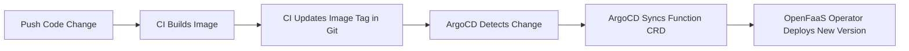

# How to Deploy OpenFaaS Functions with ArgoCD

Author: [nawazdhandala](https://github.com/nawazdhandala)

Tags: ArgoCD, GitOps, Kubernetes, OpenFaaS, Serverless

Description: Learn how to deploy and manage OpenFaaS serverless functions using ArgoCD GitOps workflows including function configuration, scaling, and secret management.

---

OpenFaaS is a popular Functions-as-a-Service framework for Kubernetes. It lets you deploy any container as a function with automatic scaling, metrics, and a simple REST API. When you manage OpenFaaS through ArgoCD, your functions become version-controlled, automatically deployed, and consistently configured across environments.

This guide covers installing OpenFaaS with ArgoCD and deploying functions using GitOps.

## Installing OpenFaaS with ArgoCD

OpenFaaS has two namespaces: `openfaas` for the core platform and `openfaas-fn` for your functions. Deploy the platform using the official Helm chart through ArgoCD:

```yaml
# openfaas-platform-app.yaml
apiVersion: argoproj.io/v1alpha1
kind: Application
metadata:
  name: openfaas
  namespace: argocd
spec:
  project: serverless
  source:
    repoURL: https://openfaas.github.io/faas-netes/
    chart: openfaas
    targetRevision: 14.2.0
    helm:
      values: |
        functionNamespace: openfaas-fn
        generateBasicAuth: true
        operator:
          create: true  # Enable CRD-based function management
        gateway:
          replicas: 2
          resources:
            requests:
              cpu: 50m
              memory: 64Mi
        queueWorker:
          replicas: 2
          resources:
            requests:
              cpu: 50m
              memory: 64Mi
        prometheus:
          create: true
        alertmanager:
          create: true
        autoscaler:
          enabled: true
          rules:
            - type: rps
              target: 100
              serviceName: ".*"
        ingress:
          enabled: true
          hosts:
            - host: faas.internal.example.com
              serviceName: gateway
              servicePort: 8080
              path: /
  destination:
    server: https://kubernetes.default.svc
    namespace: openfaas
  syncPolicy:
    automated:
      selfHeal: true
    syncOptions:
      - CreateNamespace=true
```

## Understanding the OpenFaaS Operator

With `operator.create: true`, OpenFaaS watches for Function CRDs. This is critical because it means ArgoCD can manage functions as standard Kubernetes resources instead of relying on the `faas-cli` tool.

## Deploying Functions as CRDs

With the operator enabled, functions are standard Kubernetes custom resources. ArgoCD manages them like any other manifest:

```yaml
# functions/production/resize-image.yaml
apiVersion: openfaas.com/v1
kind: Function
metadata:
  name: resize-image
  namespace: openfaas-fn
spec:
  name: resize-image
  image: ghcr.io/myorg/resize-image:v1.3.0
  labels:
    com.openfaas.scale.min: "1"
    com.openfaas.scale.max: "10"
    com.openfaas.scale.factor: "20"
    com.openfaas.scale.zero: "true"
    com.openfaas.scale.zero-duration: "15m"
  environment:
    output_format: webp
    max_width: "1920"
    max_height: "1080"
    write_timeout: "30s"
    read_timeout: "30s"
  requests:
    cpu: 200m
    memory: 256Mi
  limits:
    cpu: "1"
    memory: 512Mi
```

```yaml
# functions/production/send-email.yaml
apiVersion: openfaas.com/v1
kind: Function
metadata:
  name: send-email
  namespace: openfaas-fn
spec:
  name: send-email
  image: ghcr.io/myorg/send-email:v2.1.0
  labels:
    com.openfaas.scale.min: "2"
    com.openfaas.scale.max: "20"
    com.openfaas.scale.zero: "false"  # Always keep running
  environment:
    smtp_host: smtp.sendgrid.net
    smtp_port: "587"
    write_timeout: "15s"
    read_timeout: "15s"
  secrets:
    - smtp-credentials
  requests:
    cpu: 50m
    memory: 64Mi
  limits:
    cpu: 200m
    memory: 128Mi
```

## ArgoCD Application for Functions

Create a separate ArgoCD Application for your functions:

```yaml
# openfaas-functions-app.yaml
apiVersion: argoproj.io/v1alpha1
kind: Application
metadata:
  name: openfaas-functions
  namespace: argocd
spec:
  project: serverless
  source:
    repoURL: https://github.com/myorg/k8s-functions.git
    path: functions/production
    targetRevision: main
  destination:
    server: https://kubernetes.default.svc
    namespace: openfaas-fn
  syncPolicy:
    automated:
      selfHeal: true
      prune: true  # Remove functions deleted from Git
```

## Managing Function Secrets

OpenFaaS functions reference secrets by name. Store secrets using Sealed Secrets or External Secrets so they can live in Git:

```yaml
# functions/production/secrets/smtp-credentials.yaml
apiVersion: bitnami.com/v1alpha1
kind: SealedSecret
metadata:
  name: smtp-credentials
  namespace: openfaas-fn
spec:
  encryptedData:
    smtp-username: AgBy3i4OJSWK+PiTySYZZA9rO...
    smtp-password: AgCtr38ED9tGJkl2+OPiQREaR...
  template:
    metadata:
      name: smtp-credentials
      namespace: openfaas-fn
    type: Opaque
```

## Multi-Environment Function Deployment

Use Kustomize overlays to deploy functions across environments with different configurations:

```yaml
# functions/base/resize-image.yaml
apiVersion: openfaas.com/v1
kind: Function
metadata:
  name: resize-image
  namespace: openfaas-fn
spec:
  name: resize-image
  image: ghcr.io/myorg/resize-image:v1.3.0
  labels:
    com.openfaas.scale.min: "1"
    com.openfaas.scale.max: "5"
  environment:
    output_format: webp
  requests:
    cpu: 100m
    memory: 128Mi
```

```yaml
# functions/overlays/production/kustomization.yaml
apiVersion: kustomize.config.k8s.io/v1beta1
kind: Kustomization
resources:
  - ../../base/resize-image.yaml
patches:
  - target:
      kind: Function
      name: resize-image
    patch: |
      - op: replace
        path: /spec/labels/com.openfaas.scale.max
        value: "20"
      - op: replace
        path: /spec/requests/cpu
        value: 200m
      - op: replace
        path: /spec/requests/memory
        value: 256Mi
```

The ArgoCD Application points to the appropriate overlay:

```yaml
apiVersion: argoproj.io/v1alpha1
kind: Application
metadata:
  name: openfaas-functions-prod
spec:
  source:
    repoURL: https://github.com/myorg/k8s-functions.git
    path: functions/overlays/production
    targetRevision: main
```

## Function Build and Deploy Pipeline

The typical workflow for updating a function:



Your CI pipeline updates the image tag in the function YAML:

```bash
# In your CI pipeline (e.g., GitHub Actions)
# After building and pushing the new function image

# Update the function manifest with the new image tag
cd k8s-functions
sed -i "s|image: ghcr.io/myorg/resize-image:.*|image: ghcr.io/myorg/resize-image:${NEW_TAG}|" \
  functions/production/resize-image.yaml

git add functions/production/resize-image.yaml
git commit -m "Update resize-image to ${NEW_TAG}"
git push origin main
```

## Async Function Invocation

OpenFaaS supports async invocation through NATS Streaming. Configure the queue worker:

```yaml
# In the OpenFaaS Helm values
queueWorker:
  replicas: 3
  ackWait: "120s"
  maxInflight: 5
  resources:
    requests:
      cpu: 100m
      memory: 128Mi
```

Functions called asynchronously through `/async-function/` endpoints get queued and processed reliably even under high load.

## Monitoring OpenFaaS Functions

OpenFaaS exposes Prometheus metrics out of the box. Create alerts for function health:

```yaml
# monitoring/openfaas-alerts.yaml
apiVersion: monitoring.coreos.com/v1
kind: PrometheusRule
metadata:
  name: openfaas-alerts
  namespace: monitoring
spec:
  groups:
    - name: openfaas
      rules:
        - alert: FunctionHighErrorRate
          expr: |
            rate(gateway_function_invocation_total{code=~"5.."}[5m])
            /
            rate(gateway_function_invocation_total[5m])
            > 0.1
          for: 5m
          labels:
            severity: warning
          annotations:
            summary: "High error rate for function {{ $labels.function_name }}"

        - alert: FunctionHighLatency
          expr: |
            histogram_quantile(0.99, rate(gateway_functions_seconds_bucket[5m])) > 10
          for: 5m
          labels:
            severity: warning
          annotations:
            summary: "High P99 latency for function {{ $labels.function_name }}"
```

## Custom Health Checks for Function CRDs

Add a health check so ArgoCD understands Function resource status:

```yaml
# In argocd-cm ConfigMap
resource.customizations.health.openfaas.com_Function: |
  hs = {}
  if obj.status ~= nil and obj.status.replicas ~= nil then
    if obj.status.replicas > 0 or obj.spec.labels["com.openfaas.scale.zero"] == "true" then
      hs.status = "Healthy"
      hs.message = "Function is deployed"
    else
      hs.status = "Degraded"
      hs.message = "Function has no running replicas"
    end
  else
    hs.status = "Progressing"
    hs.message = "Waiting for function deployment"
  end
  return hs
```

## Summary

OpenFaaS with ArgoCD gives you a serverless platform managed through GitOps. The OpenFaaS operator lets you define functions as Kubernetes CRDs that ArgoCD manages like any other resource. Functions, their scaling configuration, secrets, and monitoring rules all live in Git. Updates flow through your standard pull request process, and ArgoCD ensures your functions are always in sync with what is declared in your repository.
