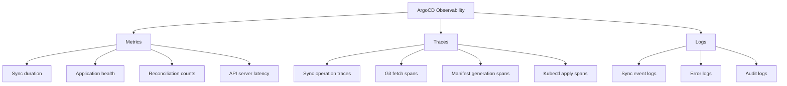

# How to Set Up Full Observability for ArgoCD with OpenTelemetry

Author: [nawazdhandala](https://github.com/nawazdhandala)

Tags: ArgoCD, GitOps, Kubernetes, OpenTelemetry, Observability

Description: Learn how to set up complete observability for ArgoCD using OpenTelemetry, covering metrics, traces, and logs for full visibility into your GitOps pipeline.

---

ArgoCD manages your deployments, but how well do you observe ArgoCD itself? When a sync takes too long, an application stays degraded, or reconciliation loops spike, you need visibility into what ArgoCD is doing. OpenTelemetry provides the unified framework to collect metrics, traces, and logs from ArgoCD and correlate them into a complete observability picture.

This guide walks through setting up full observability for ArgoCD using OpenTelemetry.

## The Three Pillars for ArgoCD

ArgoCD observability breaks down into three areas:



## Prerequisites

You need:

- An ArgoCD installation (v2.6+)
- An OpenTelemetry Collector deployed in your cluster
- A backend for metrics (Prometheus), traces (Jaeger/Tempo), and logs (Loki)

## Step 1: Deploy the OpenTelemetry Collector

Deploy a collector configured for ArgoCD telemetry:

```yaml
apiVersion: v1
kind: ConfigMap
metadata:
  name: otel-collector-config
  namespace: argocd
data:
  config.yaml: |
    receivers:
      # Scrape ArgoCD Prometheus metrics
      prometheus:
        config:
          scrape_configs:
            - job_name: 'argocd-server'
              scrape_interval: 15s
              metrics_path: /metrics
              kubernetes_sd_configs:
                - role: pod
                  namespaces:
                    names: [argocd]
              relabel_configs:
                - source_labels: [__meta_kubernetes_pod_label_app_kubernetes_io_name]
                  regex: argocd-server
                  action: keep
                - source_labels: [__meta_kubernetes_pod_annotation_prometheus_io_port]
                  regex: (.+)
                  target_label: __address__
                  replacement: $1

            - job_name: 'argocd-repo-server'
              scrape_interval: 15s
              metrics_path: /metrics
              kubernetes_sd_configs:
                - role: pod
                  namespaces:
                    names: [argocd]
              relabel_configs:
                - source_labels: [__meta_kubernetes_pod_label_app_kubernetes_io_name]
                  regex: argocd-repo-server
                  action: keep

            - job_name: 'argocd-application-controller'
              scrape_interval: 15s
              metrics_path: /metrics
              kubernetes_sd_configs:
                - role: pod
                  namespaces:
                    names: [argocd]
              relabel_configs:
                - source_labels: [__meta_kubernetes_pod_label_app_kubernetes_io_name]
                  regex: argocd-application-controller
                  action: keep

      # Receive OTLP traces from ArgoCD
      otlp:
        protocols:
          grpc:
            endpoint: 0.0.0.0:4317
          http:
            endpoint: 0.0.0.0:4318

    processors:
      batch:
        timeout: 10s
        send_batch_size: 1024

      # Add resource attributes
      resource:
        attributes:
          - key: service.namespace
            value: argocd
            action: upsert

      # Filter out noisy metrics
      filter:
        metrics:
          exclude:
            match_type: regexp
            metric_names:
              - go_.*
              - process_.*

    exporters:
      # Export metrics to Prometheus
      prometheusremotewrite:
        endpoint: http://prometheus.monitoring:9090/api/v1/write
        resource_to_telemetry_conversion:
          enabled: true

      # Export traces to Tempo/Jaeger
      otlp/traces:
        endpoint: tempo.monitoring:4317
        tls:
          insecure: true

      # Export logs to Loki
      loki:
        endpoint: http://loki.monitoring:3100/loki/api/v1/push
        labels:
          resource:
            service.name: "service_name"
            service.namespace: "service_namespace"

    service:
      pipelines:
        metrics:
          receivers: [prometheus]
          processors: [batch, resource, filter]
          exporters: [prometheusremotewrite]
        traces:
          receivers: [otlp]
          processors: [batch, resource]
          exporters: [otlp/traces]
        logs:
          receivers: [otlp]
          processors: [batch, resource]
          exporters: [loki]
```

Deploy the collector:

```yaml
apiVersion: apps/v1
kind: Deployment
metadata:
  name: otel-collector
  namespace: argocd
spec:
  replicas: 1
  selector:
    matchLabels:
      app: otel-collector
  template:
    metadata:
      labels:
        app: otel-collector
    spec:
      serviceAccountName: otel-collector
      containers:
        - name: collector
          image: otel/opentelemetry-collector-contrib:0.96.0
          args:
            - --config=/etc/otel/config.yaml
          ports:
            - containerPort: 4317  # OTLP gRPC
            - containerPort: 4318  # OTLP HTTP
            - containerPort: 8888  # Collector metrics
          volumeMounts:
            - name: config
              mountPath: /etc/otel
      volumes:
        - name: config
          configMap:
            name: otel-collector-config
---
apiVersion: v1
kind: Service
metadata:
  name: otel-collector
  namespace: argocd
spec:
  selector:
    app: otel-collector
  ports:
    - name: otlp-grpc
      port: 4317
    - name: otlp-http
      port: 4318
```

## Step 2: Configure ArgoCD Metrics

ArgoCD exposes Prometheus metrics natively. Ensure the metrics port is enabled in each component:

```yaml
# argocd-server ConfigMap additions
apiVersion: v1
kind: ConfigMap
metadata:
  name: argocd-cmd-params-cm
  namespace: argocd
data:
  # Enable metrics for all components
  server.enable.proxy.extension: "true"
  controller.status.processors: "20"
  controller.operation.processors: "10"
  controller.repo.server.timeout.seconds: "60"
```

Key ArgoCD metrics to monitor:

```promql
# Application sync status distribution
sum by (sync_status) (argocd_app_info)

# Application health status distribution
sum by (health_status) (argocd_app_info)

# Sync operation duration (p99)
histogram_quantile(0.99,
  sum(rate(argocd_app_sync_total_bucket[5m])) by (le, name))

# Reconciliation count rate
sum(rate(argocd_app_reconcile_count[5m])) by (namespace)

# Git request duration
histogram_quantile(0.95,
  sum(rate(argocd_git_request_duration_seconds_bucket[5m])) by (le, repo))

# Repo server manifest generation duration
histogram_quantile(0.95,
  sum(rate(argocd_repo_pending_request_total[5m])) by (le))

# API server request rate
sum(rate(argocd_cluster_api_resource_actions_total[5m])) by (action)
```

## Step 3: Enable ArgoCD Tracing

ArgoCD supports OpenTelemetry tracing. Configure it through environment variables:

```yaml
# Patch ArgoCD server deployment for tracing
apiVersion: apps/v1
kind: Deployment
metadata:
  name: argocd-server
  namespace: argocd
spec:
  template:
    spec:
      containers:
        - name: argocd-server
          env:
            - name: OTEL_EXPORTER_OTLP_ENDPOINT
              value: "http://otel-collector.argocd:4317"
            - name: OTEL_SERVICE_NAME
              value: "argocd-server"
            - name: OTEL_TRACES_EXPORTER
              value: "otlp"
---
# Patch application controller
apiVersion: apps/v1
kind: Deployment
metadata:
  name: argocd-application-controller
  namespace: argocd
spec:
  template:
    spec:
      containers:
        - name: argocd-application-controller
          env:
            - name: OTEL_EXPORTER_OTLP_ENDPOINT
              value: "http://otel-collector.argocd:4317"
            - name: OTEL_SERVICE_NAME
              value: "argocd-application-controller"
            - name: OTEL_TRACES_EXPORTER
              value: "otlp"
---
# Patch repo server
apiVersion: apps/v1
kind: Deployment
metadata:
  name: argocd-repo-server
  namespace: argocd
spec:
  template:
    spec:
      containers:
        - name: argocd-repo-server
          env:
            - name: OTEL_EXPORTER_OTLP_ENDPOINT
              value: "http://otel-collector.argocd:4317"
            - name: OTEL_SERVICE_NAME
              value: "argocd-repo-server"
            - name: OTEL_TRACES_EXPORTER
              value: "otlp"
```

Traces will show the full lifecycle of operations like sync, manifest generation, and Git fetches.

## Step 4: Configure Log Collection

ArgoCD components output structured logs. Collect them through the OpenTelemetry Collector:

```yaml
# Add filelog receiver to the collector config
receivers:
  filelog:
    include:
      - /var/log/pods/argocd_*/argocd-*/*.log
    operators:
      - type: json_parser
        timestamp:
          parse_from: attributes.time
          layout: '%Y-%m-%dT%H:%M:%S.%fZ'
      - type: severity_parser
        parse_from: attributes.level
      - type: move
        from: attributes.msg
        to: body
```

Alternatively, use the Kubernetes log collection approach:

```yaml
receivers:
  k8s_events:
    namespaces: [argocd]
```

## Step 5: Build Dashboards

### Grafana Dashboard - ArgoCD Overview

Create a comprehensive dashboard with these panels:

```json
{
  "panels": [
    {
      "title": "Application Status",
      "type": "stat",
      "targets": [
        {"expr": "count(argocd_app_info{sync_status='Synced'})", "legendFormat": "Synced"},
        {"expr": "count(argocd_app_info{sync_status='OutOfSync'})", "legendFormat": "OutOfSync"},
        {"expr": "count(argocd_app_info{health_status='Healthy'})", "legendFormat": "Healthy"},
        {"expr": "count(argocd_app_info{health_status='Degraded'})", "legendFormat": "Degraded"}
      ]
    },
    {
      "title": "Sync Duration (p95)",
      "type": "timeseries",
      "targets": [
        {"expr": "histogram_quantile(0.95, sum(rate(argocd_app_sync_total_bucket[5m])) by (le, name))"}
      ]
    },
    {
      "title": "Git Fetch Latency",
      "type": "timeseries",
      "targets": [
        {"expr": "histogram_quantile(0.95, sum(rate(argocd_git_request_duration_seconds_bucket[5m])) by (le))"}
      ]
    },
    {
      "title": "Reconciliation Rate",
      "type": "timeseries",
      "targets": [
        {"expr": "sum(rate(argocd_app_reconcile_count[5m]))"}
      ]
    }
  ]
}
```

## Step 6: Set Up Alerts

Configure alerts for critical ArgoCD conditions:

```yaml
apiVersion: monitoring.coreos.com/v1
kind: PrometheusRule
metadata:
  name: argocd-alerts
  namespace: monitoring
spec:
  groups:
    - name: argocd
      rules:
        - alert: ArgoCD_ApplicationUnhealthy
          expr: argocd_app_info{health_status!="Healthy"} == 1
          for: 10m
          labels:
            severity: warning
          annotations:
            summary: "ArgoCD application {{ $labels.name }} is {{ $labels.health_status }}"

        - alert: ArgoCD_ApplicationOutOfSync
          expr: argocd_app_info{sync_status="OutOfSync"} == 1
          for: 30m
          labels:
            severity: warning
          annotations:
            summary: "ArgoCD application {{ $labels.name }} has been out of sync for 30 minutes"

        - alert: ArgoCD_SyncFailed
          expr: increase(argocd_app_sync_total{phase="Failed"}[10m]) > 0
          labels:
            severity: critical
          annotations:
            summary: "ArgoCD sync failed for {{ $labels.name }}"

        - alert: ArgoCD_HighReconciliationRate
          expr: sum(rate(argocd_app_reconcile_count[5m])) > 100
          for: 5m
          labels:
            severity: warning
          annotations:
            summary: "ArgoCD reconciliation rate is abnormally high"

        - alert: ArgoCD_GitFetchSlow
          expr: histogram_quantile(0.95, sum(rate(argocd_git_request_duration_seconds_bucket[5m])) by (le)) > 30
          for: 5m
          labels:
            severity: warning
          annotations:
            summary: "ArgoCD Git fetch operations are slow (p95 > 30s)"
```

## Correlating Across Signals

The real power of OpenTelemetry comes from correlating metrics, traces, and logs:

1. **Alert fires:** High sync duration metric triggers an alert
2. **Check traces:** Find the sync trace to see which span is slow (Git fetch? Manifest generation? kubectl apply?)
3. **Check logs:** Drill into the logs for the specific component and time window to find error messages

With trace IDs propagated across ArgoCD components, you can follow a single sync operation from the API server through the repo server to the application controller.

## Monitoring ArgoCD with OneUptime

For a unified observability experience, [OneUptime](https://oneuptime.com) can ingest ArgoCD telemetry data and provide dashboards, alerts, and incident management in a single platform. This is particularly useful for teams that want to correlate ArgoCD deployment events with application health metrics.

## Conclusion

Full observability for ArgoCD requires all three pillars: metrics for understanding trends, traces for debugging specific operations, and logs for detailed context. OpenTelemetry provides the unified framework to collect all three. By deploying an OpenTelemetry Collector alongside ArgoCD, enabling tracing, and building dashboards and alerts, you gain the visibility needed to operate ArgoCD confidently at scale.
