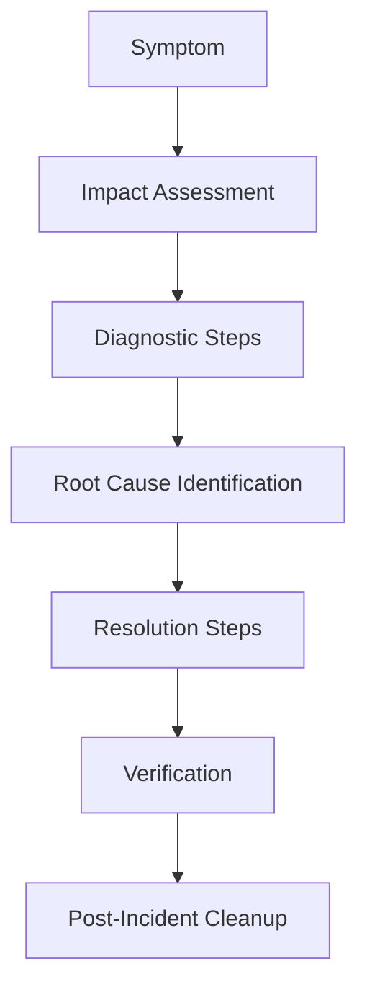

# How to Create an ArgoCD Operations Runbook

Author: [nawazdhandala](https://github.com/nawazdhandala)

Tags: ArgoCD, GitOps, Kubernetes, Operations, Runbook

Description: Learn how to create a comprehensive ArgoCD operations runbook covering incident response procedures, common failure modes, diagnostic commands, and escalation paths for on-call engineers.

---

When ArgoCD breaks at 3 AM, the on-call engineer needs clear, step-by-step instructions to diagnose and fix the problem. An operations runbook provides exactly that. This guide walks through how to create a practical ArgoCD runbook that covers the most common failure scenarios, diagnostic procedures, and recovery steps.

## Why You Need an ArgoCD Runbook

ArgoCD is infrastructure that deploys infrastructure. When it fails, no deployments happen, drift goes undetected, and manual interventions become necessary. Unlike application failures that affect one service, an ArgoCD outage affects every service it manages.

A good runbook transforms a panicked debugging session into a methodical process. It answers three questions: What is broken? Why is it broken? How do I fix it?

## Runbook Structure

Every runbook entry should follow a consistent structure.



Here is a template for each entry.

```markdown
## [Problem Title]

**Symptoms:** What the user or monitoring system reports
**Severity:** P1/P2/P3/P4
**Impact:** What is affected if this is not fixed
**SLA:** Time to acknowledge / Time to resolve

### Diagnostic Steps
1. Step-by-step commands to identify the problem
2. What to look for in logs
3. Metrics to check

### Resolution
1. Step-by-step fix
2. Verification that fix worked

### Escalation
- When to escalate
- Who to contact
```

## Essential Diagnostic Commands

Every runbook should start with a section of common diagnostic commands that apply to any ArgoCD issue.

```bash
# Check ArgoCD component health
kubectl get pods -n argocd

# Check component logs
kubectl logs -n argocd deployment/argocd-application-controller --tail=100
kubectl logs -n argocd deployment/argocd-repo-server --tail=100
kubectl logs -n argocd deployment/argocd-server --tail=100
kubectl logs -n argocd deployment/argocd-redis --tail=100
kubectl logs -n argocd deployment/argocd-dex-server --tail=100

# Check ArgoCD version
argocd version

# List all applications and their status
argocd app list

# Check a specific application
argocd app get <app-name> --show-operation

# Check ArgoCD settings
argocd admin settings validate -n argocd

# Check connectivity to managed clusters
argocd cluster list

# Check repository connectivity
argocd repo list
```

## Common Failure Scenarios

Based on real-world incidents, here are the most common ArgoCD failures.

### 1. All Applications Show "Unknown" Status

**Symptoms:** Every application shows "Unknown" sync and health status in the UI.

**Impact:** No visibility into deployment state. Automated syncs may not be working.

```bash
# Check if the controller is running
kubectl get pods -n argocd -l app.kubernetes.io/name=argocd-application-controller

# Check controller logs for errors
kubectl logs -n argocd deployment/argocd-application-controller --tail=200 | grep -i error

# Common cause: controller lost connection to Redis
kubectl logs -n argocd deployment/argocd-redis --tail=50

# Fix: restart the controller
kubectl rollout restart deployment/argocd-application-controller -n argocd
```

### 2. Sync Operations Timing Out

**Symptoms:** Syncs start but never complete. Operations show as "Running" for extended periods.

```bash
# Check for stuck operations
argocd app list -o wide | grep Running

# Check resource apply status
argocd app get <app-name> --show-operation

# Common cause: webhook admission timeout
kubectl get events -n <app-namespace> --sort-by='.lastTimestamp' | tail -20

# Common cause: resource quota exceeded
kubectl describe resourcequota -n <app-namespace>

# Fix: terminate stuck operation and retry
argocd app terminate-op <app-name>
argocd app sync <app-name>
```

### 3. Repository Connection Failures

**Symptoms:** Applications show "ComparisonError" with Git-related error messages.

```bash
# Test repository connectivity
argocd repo list
argocd repo get <repo-url>

# Check repo server logs
kubectl logs -n argocd deployment/argocd-repo-server --tail=200 | grep -i "error\|fail"

# Common cause: expired credentials
# Check stored credentials
kubectl get secrets -n argocd -l argocd.argoproj.io/secret-type=repository

# Fix: update credentials
argocd repo add <repo-url> --username <user> --password <new-token>
```

### 4. High Memory Usage / OOMKill

**Symptoms:** ArgoCD pods restart frequently. `kubectl describe pod` shows OOMKilled.

```bash
# Check pod restarts
kubectl get pods -n argocd -o wide

# Check OOMKill events
kubectl get events -n argocd --field-selector reason=OOMKilling

# Check current memory usage
kubectl top pods -n argocd

# Immediate fix: increase memory limits
kubectl edit deployment argocd-application-controller -n argocd
# Increase resources.limits.memory

# Long-term fix: enable controller sharding
# See performance tuning guide
```

## Building the Runbook Document

Organize the runbook by component and severity.

```markdown
# ArgoCD Operations Runbook

## Quick Reference
- ArgoCD URL: https://argocd.example.com
- Namespace: argocd
- Cluster: production-us-east
- On-call Slack channel: #argocd-oncall
- Escalation: Platform Engineering team

## P1 - Service Down
- [All syncs stopped](#all-syncs-stopped)
- [Controller not running](#controller-not-running)
- [Redis down](#redis-down)

## P2 - Degraded Service
- [Sync times degraded](#sync-times-degraded)
- [UI not loading](#ui-not-loading)
- [SSO broken](#sso-broken)

## P3 - Individual App Issues
- [Application stuck in sync loop](#app-stuck-sync-loop)
- [Application showing Unknown status](#unknown-status)
- [Webhook not triggering refresh](#webhook-issues)

## P4 - Non-Urgent
- [Certificate expiring soon](#cert-expiring)
- [High resource usage trending](#resource-trending)
```

## Integrating with Monitoring

Connect your runbook to alerting so that on-call engineers get pointed to the right runbook section automatically.

```yaml
# Prometheus alerting rules that link to runbook sections
apiVersion: monitoring.coreos.com/v1
kind: PrometheusRule
metadata:
  name: argocd-alerts
  namespace: argocd
spec:
  groups:
  - name: argocd
    rules:
    - alert: ArgoCDControllerDown
      expr: up{job="argocd-application-controller-metrics"} == 0
      for: 5m
      labels:
        severity: critical
      annotations:
        summary: "ArgoCD controller is down"
        runbook_url: "https://wiki.example.com/runbooks/argocd#controller-not-running"

    - alert: ArgoCDSyncFailing
      expr: argocd_app_sync_total{phase="Failed"} > 0
      for: 15m
      labels:
        severity: warning
      annotations:
        summary: "ArgoCD sync failures detected"
        runbook_url: "https://wiki.example.com/runbooks/argocd#sync-failures"
```

## Recovery Procedures

Include standard recovery procedures for common scenarios.

### Full ArgoCD Restart

```bash
# Ordered restart of all components
# 1. Redis first (cache layer)
kubectl rollout restart deployment/argocd-redis -n argocd
kubectl rollout status deployment/argocd-redis -n argocd

# 2. Repo server next (depends on Redis)
kubectl rollout restart deployment/argocd-repo-server -n argocd
kubectl rollout status deployment/argocd-repo-server -n argocd

# 3. Application controller (depends on Redis and repo server)
kubectl rollout restart deployment/argocd-application-controller -n argocd
kubectl rollout status deployment/argocd-application-controller -n argocd

# 4. API server last (depends on all above)
kubectl rollout restart deployment/argocd-server -n argocd
kubectl rollout status deployment/argocd-server -n argocd

# 5. Verify everything is healthy
kubectl get pods -n argocd
argocd app list | head -5
```

### Emergency Manual Deployment

If ArgoCD is completely down and a critical deployment is needed, provide a manual bypass procedure.

```bash
# Emergency: deploy without ArgoCD
# 1. Clone the manifests repo
git clone https://github.com/org/manifests.git
cd manifests

# 2. Apply directly with kubectl
kubectl apply -f production/critical-service/ -n production

# 3. Document what was deployed manually
# Create a ticket to reconcile with ArgoCD after recovery
```

## Keeping the Runbook Current

A stale runbook is worse than no runbook because it gives false confidence. Build maintenance into your process.

```markdown
## Runbook Maintenance Schedule
- **Monthly:** Review all runbook entries, update commands for current ArgoCD version
- **After every P1/P2 incident:** Add or update relevant runbook section
- **On ArgoCD upgrade:** Verify all diagnostic commands still work
- **Quarterly:** Run a tabletop exercise using the runbook
```

Every post-incident review should ask: "Did the runbook help? What was missing?" Then update the runbook with the answer.

## Summary

A good ArgoCD operations runbook covers component health checks, the top 10 failure scenarios with step-by-step resolution, recovery procedures for full restarts, emergency manual deployment bypass, and escalation paths. Keep it organized by severity, link it to your alerting system, and update it after every incident. The runbook should be the first thing an on-call engineer opens when they get paged.

For specific runbook entries for common problems, check out our detailed guides on [handling sync loops](https://oneuptime.com/blog/post/2026-02-26-argocd-runbook-sync-loop/view), [controller issues](https://oneuptime.com/blog/post/2026-02-26-argocd-runbook-controller-not-processing/view), and [Redis problems](https://oneuptime.com/blog/post/2026-02-26-argocd-runbook-redis-memory-full/view).
