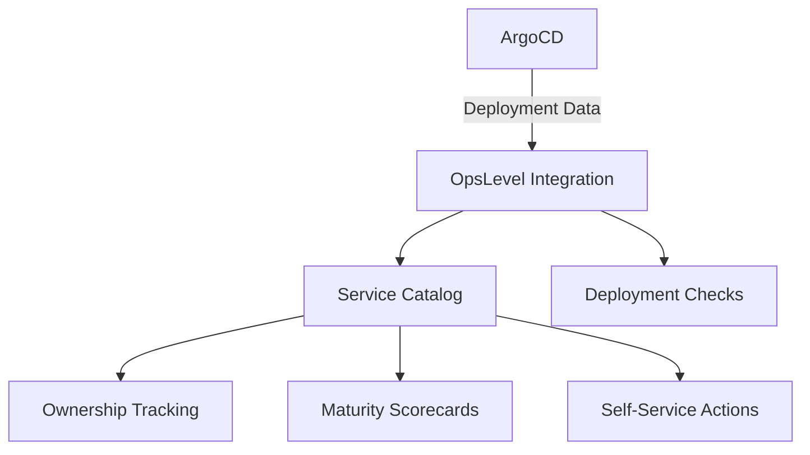

# How to Integrate ArgoCD with OpsLevel

Author: [nawazdhandala](https://github.com/nawazdhandala)

Tags: ArgoCD, GitOps, Kubernetes, OpsLevel, Developer Portal

Description: A step-by-step guide to integrating ArgoCD with OpsLevel for unified service ownership, deployment tracking, and maturity scorecards.

---

OpsLevel is a service ownership platform that helps engineering organizations track who owns what, measure service maturity, and provide self-service developer tools. Integrating ArgoCD with OpsLevel lets you automatically track deployment status, enforce deployment standards through maturity checks, and give teams visibility into their services' operational health. This guide covers the integration from setup to production use.

## Why OpsLevel with ArgoCD

OpsLevel focuses on service ownership and maturity. When combined with ArgoCD:

- Service owners see deployment status alongside ownership information
- Maturity scorecards can include deployment health checks (is the service synced? healthy?)
- Deployment frequency metrics feed into engineering effectiveness tracking
- Teams can discover which ArgoCD application manages their service



## Setting Up the OpsLevel Kubernetes Integration

OpsLevel provides a Kubernetes integration that can discover and sync ArgoCD Application resources.

### Install the OpsLevel Agent

```bash
# Install the OpsLevel Kubernetes agent
helm repo add opslevel https://opslevel.github.io/helm-charts
helm repo update

# Deploy the agent
helm install opslevel-agent opslevel/opslevel-k8s-deploy-agent \
  --namespace opslevel \
  --create-namespace \
  --set opslevel.apiToken="${OPSLEVEL_API_TOKEN}" \
  --set opslevel.integrationUrl="https://app.opslevel.com/integrations/kubernetes/${INTEGRATION_ID}"
```

### Configure the Kubernetes Integration in OpsLevel

In the OpsLevel web UI:

1. Navigate to Integrations and select Kubernetes
2. Create a new Kubernetes integration
3. Configure it to watch the `argocd` namespace
4. Map ArgoCD Application resources to OpsLevel services

Alternatively, use the OpsLevel CLI:

```bash
# Install the OpsLevel CLI
brew install opslevel/tap/cli

# Create a Kubernetes integration
opslevel create integration kubernetes \
  --name "ArgoCD Production" \
  --namespace argocd
```

## Mapping ArgoCD Applications to OpsLevel Services

The integration maps ArgoCD Application custom resources to OpsLevel services. Configure the mapping rules:

```yaml
# OpsLevel integration configuration
# This maps ArgoCD Application resources to OpsLevel services
apiVersion: v1
kind: ConfigMap
metadata:
  name: opslevel-config
  namespace: opslevel
data:
  config.yaml: |
    service_discovery:
      # Watch ArgoCD Application resources
      - resource:
          apiVersion: argoproj.io/v1alpha1
          kind: Application
          namespace: argocd
        # Map to OpsLevel service using the application name
        service_mapping:
          name: "{{ .metadata.name }}"
          # Use labels for ownership
          owner: "{{ .metadata.labels.team }}"
          # Map deployment properties
          properties:
            - name: argocd_sync_status
              value: "{{ .status.sync.status }}"
            - name: argocd_health_status
              value: "{{ .status.health.status }}"
            - name: argocd_repo_url
              value: "{{ .spec.source.repoURL }}"
            - name: argocd_revision
              value: "{{ .status.sync.revision }}"
            - name: argocd_destination_namespace
              value: "{{ .spec.destination.namespace }}"
            - name: argocd_last_sync
              value: "{{ .status.operationState.finishedAt }}"
```

## Using OpsLevel Tags for ArgoCD Metadata

OpsLevel uses tags to store metadata on services. Configure ArgoCD-related tags:

```bash
# Create tags for ArgoCD metadata using the OpsLevel CLI
opslevel create tag \
  --service payment-service \
  --key argocd-app \
  --value payment-service-prod

opslevel create tag \
  --service payment-service \
  --key deployment-method \
  --value argocd

opslevel create tag \
  --service payment-service \
  --key argocd-project \
  --value production
```

Automate tag creation with a script that reads from ArgoCD:

```bash
#!/bin/bash
# sync-argocd-tags.sh
# Syncs ArgoCD application metadata to OpsLevel service tags

# Get all ArgoCD applications
argocd app list -o json | jq -c '.[]' | while read app; do
  app_name=$(echo $app | jq -r '.metadata.name')
  repo_url=$(echo $app | jq -r '.spec.source.repoURL')
  sync_status=$(echo $app | jq -r '.status.sync.status')
  health_status=$(echo $app | jq -r '.status.health.status')
  revision=$(echo $app | jq -r '.status.sync.revision')

  # Update OpsLevel tags
  opslevel create tag \
    --service "$app_name" \
    --key argocd-sync-status \
    --value "$sync_status" 2>/dev/null

  opslevel create tag \
    --service "$app_name" \
    --key argocd-health-status \
    --value "$health_status" 2>/dev/null

  opslevel create tag \
    --service "$app_name" \
    --key argocd-revision \
    --value "${revision:0:8}" 2>/dev/null

  echo "Updated tags for $app_name"
done
```

## Creating Maturity Checks for ArgoCD

OpsLevel's maturity rubric lets you define checks that services must pass. Create checks related to ArgoCD deployment practices:

```bash
# Check: Service must be managed by ArgoCD
opslevel create check tag-defined \
  --name "Managed by ArgoCD" \
  --category "Deployment" \
  --level "Bronze" \
  --tag-key "deployment-method" \
  --tag-predicate "equals" \
  --tag-value "argocd"

# Check: ArgoCD application must be synced
opslevel create check tag-defined \
  --name "ArgoCD Sync Status" \
  --category "Deployment" \
  --level "Silver" \
  --tag-key "argocd-sync-status" \
  --tag-predicate "equals" \
  --tag-value "Synced"

# Check: ArgoCD application must be healthy
opslevel create check tag-defined \
  --name "ArgoCD Health Status" \
  --category "Deployment" \
  --level "Gold" \
  --tag-key "argocd-health-status" \
  --tag-predicate "equals" \
  --tag-value "Healthy"
```

These checks create a maturity ladder:
- **Bronze**: Service is managed by ArgoCD
- **Silver**: Service is synced (no drift from Git)
- **Gold**: Service is both synced and healthy

## Setting Up Deployment Tracking

OpsLevel can track deployments from ArgoCD to provide deployment frequency metrics:

```yaml
# ArgoCD Notification template for OpsLevel deployment events
apiVersion: v1
kind: ConfigMap
metadata:
  name: argocd-notifications-cm
  namespace: argocd
data:
  template.opslevel-deploy: |
    webhook:
      opslevel:
        method: POST
        body: |
          {
            "service": "{{.app.metadata.name}}",
            "deployer": {
              "email": "argocd@example.com"
            },
            "deploy_url": "https://argocd.example.com/applications/{{.app.metadata.name}}",
            "environment": "Production",
            "description": "ArgoCD sync: {{.app.status.sync.revision | truncate 8 \"\"}}",
            "dedup_id": "{{.app.status.operationState.startedAt}}-{{.app.metadata.name}}"
          }

  trigger.on-deployed: |
    - when: app.status.operationState.phase in ['Succeeded']
      send: [opslevel-deploy]

  service.webhook.opslevel: |
    url: https://app.opslevel.com/integrations/deploy/${OPSLEVEL_DEPLOY_WEBHOOK_ID}
    headers:
      - name: Content-Type
        value: application/json
```

## Using the OpsLevel API for Custom Integration

For more advanced integration, use the OpsLevel GraphQL API:

```bash
# Query service deployment data from OpsLevel
curl -X POST "https://app.opslevel.com/api/graphql" \
  -H "Authorization: Bearer ${OPSLEVEL_API_TOKEN}" \
  -H "Content-Type: application/json" \
  -d '{
  "query": "query { services(filter: {tag: {key: \"deployment-method\", value: \"argocd\"}}) { nodes { name owner { name } tags { nodes { key value } } maturityReport { overallLevel { name } } } } }"
}'
```

Create a custom check that verifies ArgoCD configuration:

```python
# custom-check.py - Verify ArgoCD best practices
import requests
import os

OPSLEVEL_TOKEN = os.environ["OPSLEVEL_API_TOKEN"]
ARGOCD_URL = os.environ["ARGOCD_URL"]
ARGOCD_TOKEN = os.environ["ARGOCD_TOKEN"]

def check_argocd_best_practices(app_name):
    """Check if an ArgoCD app follows best practices."""
    resp = requests.get(
        f"{ARGOCD_URL}/api/v1/applications/{app_name}",
        headers={"Authorization": f"Bearer {ARGOCD_TOKEN}"}
    )
    app = resp.json()

    checks = {
        "has_automated_sync": app["spec"].get("syncPolicy", {}).get("automated") is not None,
        "has_self_heal": app["spec"].get("syncPolicy", {}).get("automated", {}).get("selfHeal", False),
        "has_prune": app["spec"].get("syncPolicy", {}).get("automated", {}).get("prune", False),
        "uses_project": app["spec"].get("project", "default") != "default",
        "has_health_check": app["status"]["health"]["status"] != "Unknown",
    }

    return checks
```

## Automating the Integration with CronJob

Run a periodic sync to keep OpsLevel up to date:

```yaml
# CronJob to sync ArgoCD state to OpsLevel
apiVersion: batch/v1
kind: CronJob
metadata:
  name: argocd-opslevel-sync
  namespace: opslevel
spec:
  schedule: "*/5 * * * *"
  jobTemplate:
    spec:
      template:
        spec:
          containers:
            - name: sync
              image: curlimages/curl:latest
              command:
                - /bin/sh
                - -c
                - |
                  # Fetch ArgoCD apps and update OpsLevel
                  APPS=$(curl -s -H "Authorization: Bearer $ARGOCD_TOKEN" \
                    "$ARGOCD_URL/api/v1/applications")
                  # Process and send to OpsLevel
                  echo "$APPS" | jq -c '.items[]' | while read app; do
                    NAME=$(echo $app | jq -r '.metadata.name')
                    SYNC=$(echo $app | jq -r '.status.sync.status')
                    HEALTH=$(echo $app | jq -r '.status.health.status')
                    curl -s -X POST "https://app.opslevel.com/api/graphql" \
                      -H "Authorization: Bearer $OPSLEVEL_TOKEN" \
                      -H "Content-Type: application/json" \
                      -d "{\"query\":\"mutation { tagAssign(input:{alias:\\\"$NAME\\\", tags:[{key:\\\"argocd-sync-status\\\",value:\\\"$SYNC\\\"},{key:\\\"argocd-health-status\\\",value:\\\"$HEALTH\\\"}]}) { tags { key value } } }\"}"
                  done
              envFrom:
                - secretRef:
                    name: argocd-opslevel-credentials
          restartPolicy: OnFailure
```

## Summary

Integrating ArgoCD with OpsLevel connects deployment operations to service ownership and maturity tracking. Use the Kubernetes integration for automatic discovery, tags for metadata, maturity checks for deployment standards, and deployment tracking for frequency metrics. This gives engineering leaders visibility into both who owns what and how well those services are deployed. For more developer portal integrations, see our guides on [integrating ArgoCD with Backstage](https://oneuptime.com/blog/post/2026-02-26-argocd-backstage-service-catalog/view) and [integrating ArgoCD with Cortex](https://oneuptime.com/blog/post/2026-02-26-argocd-cortex-developer-portal/view).
