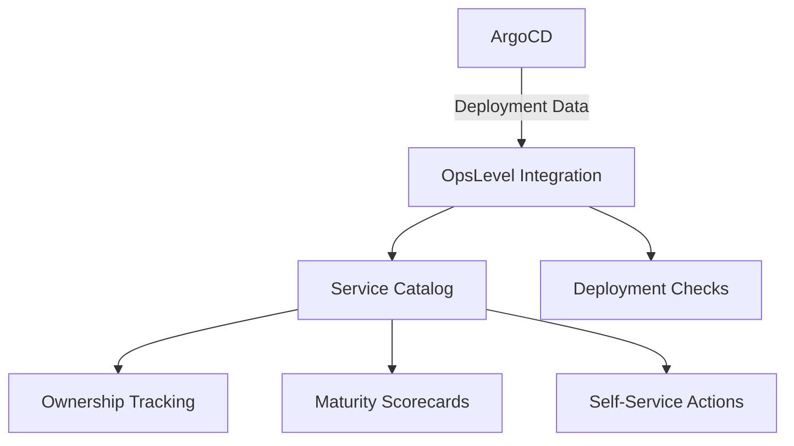

# How to Integrate ArgoCD with OpsLevel

Author: [nawazdhandala](https://github.com/nawazdhandala)

Tags: ArgoCD, GitOps, Kubernetes, OpsLevel, Developer Portal

Description: A step-by-step guide to integrating ArgoCD with OpsLevel for unified service ownership, deployment tracking, and maturity scorecards.

---

OpsLevel is a service ownership platform that helps engineering organizations track who owns what, measure service maturity, and provide self-service developer tools. Integrating ArgoCD with OpsLevel lets you automatically track deployment status, enforce deployment standards through maturity checks, and give teams visibility into their services' operational health. This guide covers the integration from setup to production use.

## Why OpsLevel with ArgoCD

OpsLevel focuses on service ownership and maturity. When combined with ArgoCD:

- Service owners see deployment status alongside ownership information
- Maturity scorecards can include deployment health checks (is the service synced? healthy?)
- Deployment frequency metrics feed into engineering effectiveness tracking
- Teams can discover which ArgoCD application manages their service


```mermaid
graph TD
    A[ArgoCD] -->|Deployment Data| B[OpsLevel Integration]
    B --> C[Service Catalog]
    C --> D[Ownership Tracking]
    C --> E[Maturity Scorecards]
    C --> F[Self-Service Actions]
    B --> G[Deployment Checks]
```

## Setting Up the OpsLevel Kubernetes Integration

OpsLevel provides a Kubernetes integration that can discover and sync ArgoCD Application resources.

### Install the OpsLevel Agent

```bash
# Install the OpsLevel Kubernetes agent

helm repo add opslevel https://opslevel.github.io/helm-charts
helm repo update

# Deploy the agent
helm install opslevel-agent opslevel/opslevel-agent \
  --namespace opslevel \
  --create-namespace \
  --set secret.data.OPSLEVEL_API_TOKEN="${OPSLEVEL_API_TOKEN}" \
  --set agent.integration="${OPSLEVEL_KUBERNETES_INTEGRATION_ALIAS}"
```

### Configure the Kubernetes Integration in OpsLevel

In the OpsLevel web UI:

1. Navigate to Integrations and select Kubernetes
2. Create a new Kubernetes integration
3. Note the integration alias for the agent configuration
4. Configure the agent selectors or `kubectl-opslevel` mapping to include ArgoCD Application resources in the `argocd` namespace

Alternatively, use the `kubectl-opslevel` plugin for direct imports:

```bash
# Install the OpsLevel kubectl plugin
brew install opslevel/tap/kubectl

# Generate a mapping configuration and preview the import
kubectl opslevel config sample > ./opslevel-k8s.yaml
OPSLEVEL_API_TOKEN="${OPSLEVEL_API_TOKEN}" kubectl opslevel service preview 0 -c ./opslevel-k8s.yaml

# Import and reconcile services from Kubernetes
OPSLEVEL_API_TOKEN="${OPSLEVEL_API_TOKEN}" kubectl opslevel service import -c ./opslevel-k8s.yaml
```

## Mapping ArgoCD Applications to OpsLevel Services

The integration maps ArgoCD Application custom resources to OpsLevel services. Configure the mapping rules:

```yaml
# opslevel-k8s.yaml
# This maps ArgoCD Application resources to OpsLevel services
version: "1.3.0"
service:
  import:
    - selector:
        apiVersion: argoproj.io/v1alpha1
        kind: Application
        namespaces:
          - argocd
      opslevel:
        name: .metadata.name
        owner: .metadata.labels.team
        aliases:
          - '"argocd:\(.metadata.name)"'
        repositories:
          - .spec.source.repoURL
        tags:
          assign:
            - '{"argocd-sync-status": .status.sync.status}'
            - '{"argocd-health-status": .status.health.status}'
            - '{"argocd-revision": .status.sync.revision}'
            - '{"argocd-destination-namespace": .spec.destination.namespace}'
            - '{"argocd-last-sync": .status.operationState.finishedAt}'
```

## Using OpsLevel Tags for ArgoCD Metadata

OpsLevel uses tags to store metadata on services. Configure ArgoCD-related tags:

```bash
# Create or update tags for ArgoCD metadata using the OpsLevel GraphQL API
curl -X POST "https://app.opslevel.com/api/graphql" \
  -H "Authorization: Bearer ${OPSLEVEL_API_TOKEN}" \
  -H "Content-Type: application/json" \
  -d '{
    "query": "mutation { tagAssign(input: { alias: \"payment-service\", tags: [{ key: \"argocd-app\", value: \"payment-service-prod\" }, { key: \"deployment-method\", value: \"argocd\" }, { key: \"argocd-project\", value: \"production\" }] }) { tags { key value } errors { message } } }"
  }'
```

Automate tag creation with a script that reads from ArgoCD:

```bash
#!/bin/bash
# sync-argocd-tags.sh
# Syncs ArgoCD application metadata to OpsLevel service tags

# Get all ArgoCD applications
argocd app list -o json | jq -c '.[]' | while read -r app; do
  app_name=$(echo "$app" | jq -r '.metadata.name')
  sync_status=$(echo "$app" | jq -r '.status.sync.status')
  health_status=$(echo "$app" | jq -r '.status.health.status')
  revision=$(echo "$app" | jq -r '.status.sync.revision')

  # Update OpsLevel tags
  jq -n \
    --arg service "$app_name" \
    --arg sync "$sync_status" \
    --arg health "$health_status" \
    --arg revision "${revision:0:8}" \
    '{
      query: "mutation($alias: String!, $tags: [TagInput!]!) { tagAssign(input: { alias: $alias, tags: $tags }) { tags { key value } errors { message } } }",
      variables: {
        alias: $service,
        tags: [
          {key: "argocd-sync-status", value: $sync},
          {key: "argocd-health-status", value: $health},
          {key: "argocd-revision", value: $revision}
        ]
      }
    }' | curl -s -X POST "https://app.opslevel.com/api/graphql" \
      -H "Authorization: Bearer $OPSLEVEL_API_TOKEN" \
      -H "Content-Type: application/json" \
      -d @- >/dev/null

  echo "Updated tags for $app_name"
done
```

## Creating Maturity Checks for ArgoCD

OpsLevel's maturity rubric lets you define checks that services must pass. In the OpsLevel UI, navigate to Service Maturity, select Rubrics, and create Tag Defined checks related to ArgoCD deployment practices:

- **Managed by ArgoCD**: Require a `deployment-method` tag with the value `argocd`
- **ArgoCD Sync Status**: Require an `argocd-sync-status` tag with the value `Synced`
- **ArgoCD Health Status**: Require an `argocd-health-status` tag with the value `Healthy`

These checks create a maturity ladder:
- **Bronze**: Service is managed by ArgoCD
- **Silver**: Service is synced (no drift from Git)
- **Gold**: Service is both synced and healthy

## Setting Up Deployment Tracking

OpsLevel can track deployments from ArgoCD to provide deployment frequency metrics:

```yaml
# ArgoCD Notification template for OpsLevel deployment events
apiVersion: v1
kind: ConfigMap
metadata:
  name: argocd-notifications-cm
  namespace: argocd
data:
  template.opslevel-deploy: |
    webhook:
      opslevel:
        method: POST
        body: |
          {
            "service": "{{.app.metadata.name}}",
            "deployer": {
              "email": "argocd@example.com"
            },
            "deploy_url": "https://argocd.example.com/applications/{{.app.metadata.name}}",
            "environment": "Production",
            "description": "ArgoCD sync: {{.app.status.sync.revision}}",
            "deployed_at": "{{.app.status.operationState.finishedAt}}",
            "status": "succeeded",
            "dedup_id": "{{.app.status.operationState.startedAt}}-{{.app.metadata.name}}"
          }

  trigger.on-deployed: |
    - when: app.status.operationState.phase in ['Succeeded']
      send: [opslevel-deploy]

  service.webhook.opslevel: |
    url: https://app.opslevel.com/integrations/deploy/xxxxxxxx-xxxx-xxxx-xxxxxxxxxxxx
    headers:
      - name: Content-Type
        value: application/json
```

## Using the OpsLevel API for Custom Integration

For more advanced integration, use the OpsLevel GraphQL API:

```bash
# Query service deployment data from OpsLevel
curl -X POST "https://app.opslevel.com/api/graphql" \
  -H "Authorization: Bearer ${OPSLEVEL_API_TOKEN}" \
  -H "Content-Type: application/json" \
  -d '{
  "query": "query { account { services(tag: {key: \"deployment-method\", value: \"argocd\"}) { nodes { name owner { name } tags { nodes { key value } } } } } }"
}'
```

Create a custom check that verifies ArgoCD configuration:

```python
# custom-check.py - Verify ArgoCD best practices
import requests
import os

OPSLEVEL_TOKEN = os.environ["OPSLEVEL_API_TOKEN"]
ARGOCD_URL = os.environ["ARGOCD_URL"]
ARGOCD_TOKEN = os.environ["ARGOCD_TOKEN"]

def check_argocd_best_practices(app_name):
    """Check if an ArgoCD app follows best practices."""
    resp = requests.get(
        f"{ARGOCD_URL}/api/v1/applications/{app_name}",
        headers={"Authorization": f"Bearer {ARGOCD_TOKEN}"}
    )
    app = resp.json()

    checks = {
        "has_automated_sync": app["spec"].get("syncPolicy", {}).get("automated") is not None,
        "has_self_heal": app["spec"].get("syncPolicy", {}).get("automated", {}).get("selfHeal", False),
        "has_prune": app["spec"].get("syncPolicy", {}).get("automated", {}).get("prune", False),
        "uses_project": app["spec"].get("project", "default") != "default",
        "has_health_check": app["status"]["health"]["status"] != "Unknown",
    }

    return checks
```

## Automating the Integration with CronJob

Run a periodic sync to keep OpsLevel up to date:

```yaml
# CronJob to sync ArgoCD state to OpsLevel
apiVersion: batch/v1
kind: CronJob
metadata:
  name: argocd-opslevel-sync
  namespace: opslevel
spec:
  schedule: "*/5 * * * *"
  jobTemplate:
    spec:
      template:
        spec:
          containers:
            - name: sync
              image: alpine:3.20
              command:
                - /bin/sh
                - -c
                - |
                  apk add --no-cache curl jq
                  # Fetch ArgoCD apps and update OpsLevel
                  APPS=$(curl -s -H "Authorization: Bearer $ARGOCD_TOKEN" \
                    "$ARGOCD_URL/api/v1/applications")
                  # Process and send to OpsLevel
                  echo "$APPS" | jq -c '.items[]' | while read -r app; do
                    NAME=$(echo "$app" | jq -r '.metadata.name')
                    SYNC=$(echo "$app" | jq -r '.status.sync.status')
                    HEALTH=$(echo "$app" | jq -r '.status.health.status')
                    jq -n \
                      --arg name "$NAME" \
                      --arg sync "$SYNC" \
                      --arg health "$HEALTH" \
                      '{
                        query: "mutation($alias: String!, $tags: [TagInput!]!) { tagAssign(input:{alias:$alias, tags:$tags}) { tags { key value } errors { message } } }",
                        variables: {
                          alias: $name,
                          tags: [
                            {key:"argocd-sync-status", value:$sync},
                            {key:"argocd-health-status", value:$health}
                          ]
                        }
                      }' | curl -s -X POST "https://app.opslevel.com/api/graphql" \
                      -H "Authorization: Bearer $OPSLEVEL_TOKEN" \
                      -H "Content-Type: application/json" \
                      -d @-
                  done
              envFrom:
                - secretRef:
                    name: argocd-opslevel-credentials
          restartPolicy: OnFailure
```

## Summary

Integrating ArgoCD with OpsLevel connects deployment operations to service ownership and maturity tracking. Use the Kubernetes integration for automatic discovery, tags for metadata, maturity checks for deployment standards, and deployment tracking for frequency metrics. This gives engineering leaders visibility into both who owns what and how well those services are deployed. For more developer portal integrations, see our guides on [integrating ArgoCD with Backstage](https://oneuptime.com/blog/post/2026-02-26-argocd-backstage-service-catalog/view) and [integrating ArgoCD with Cortex](https://oneuptime.com/blog/post/2026-02-26-argocd-cortex-developer-portal/view).
