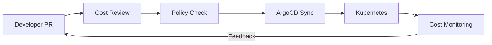

# How to Optimize Cloud Spending with ArgoCD Policies

Author: [nawazdhandala](https://github.com/nawazdhandala)

Tags: ArgoCD, GitOps, Kubernetes, FinOps, Cloud Optimization

Description: Learn how to use ArgoCD sync policies, resource restrictions, and GitOps workflows to optimize cloud spending and prevent cost overruns.

---

Cloud spending in Kubernetes can spiral quickly when teams deploy without guardrails. A single misconfigured HPA, an oversized resource request, or a forgotten development environment can add thousands of dollars to your monthly bill. ArgoCD's policy framework gives platform teams the tools to enforce cost-conscious deployment practices through GitOps. This guide covers practical strategies for using ArgoCD to keep cloud costs under control.

## Cost Optimization Through GitOps

The GitOps model gives you a natural control point for cost management. Every resource change goes through Git, which means:

- Resource requests and limits are reviewed in pull requests
- Cost implications are visible before deployment
- Policies can be enforced at the Git level and the cluster level
- Historical cost changes are traceable through Git history



## Strategy 1: Resource Quota Enforcement

Use ArgoCD Projects to restrict what resources teams can deploy:

```yaml
# ArgoCD Project with resource restrictions
apiVersion: argoproj.io/v1alpha1
kind: AppProject
metadata:
  name: development-team
  namespace: argocd
spec:
  description: Development team with cost guardrails
  sourceRepos:
    - https://github.com/myorg/*
  destinations:
    - namespace: dev-*
      server: https://kubernetes.default.svc
  # Restrict to namespace-scoped resources only
  clusterResourceWhitelist: []
  # Allow common resources but deny expensive ones
  namespaceResourceWhitelist:
    - group: ""
      kind: ConfigMap
    - group: ""
      kind: Secret
    - group: ""
      kind: Service
    - group: apps
      kind: Deployment
    - group: apps
      kind: StatefulSet
  # Block direct PVC creation - force teams to use approved storage classes
  namespaceResourceBlacklist:
    - group: ""
      kind: PersistentVolumeClaim
```

Deploy ResourceQuotas through ArgoCD to enforce limits per namespace:

```yaml
# ResourceQuota deployed by ArgoCD
apiVersion: v1
kind: ResourceQuota
metadata:
  name: team-quota
  namespace: payments-production
spec:
  hard:
    # CPU limits
    requests.cpu: "10"
    limits.cpu: "20"
    # Memory limits
    requests.memory: 20Gi
    limits.memory: 40Gi
    # Storage limits
    requests.storage: 100Gi
    persistentvolumeclaims: "10"
    # Pod count limits
    pods: "50"
    # Service limits
    services.loadbalancers: "2"
    services.nodeports: "0"
```

## Strategy 2: Default Resource Limits with LimitRanges

Prevent pods from running without resource limits:

```yaml
# LimitRange deployed via ArgoCD
apiVersion: v1
kind: LimitRange
metadata:
  name: default-limits
  namespace: payments-production
spec:
  limits:
    - type: Container
      default:
        cpu: 200m
        memory: 256Mi
      defaultRequest:
        cpu: 100m
        memory: 128Mi
      max:
        cpu: "2"
        memory: 4Gi
      min:
        cpu: 50m
        memory: 64Mi
    - type: PersistentVolumeClaim
      max:
        storage: 50Gi
      min:
        storage: 1Gi
```

## Strategy 3: Automated Environment Cleanup

Development and staging environments often run 24/7 when they are only needed during business hours. Use ArgoCD to implement scheduled scaling:

```yaml
# CronJob that scales down non-production ArgoCD apps outside business hours
apiVersion: batch/v1
kind: CronJob
metadata:
  name: scale-down-non-prod
  namespace: argocd
spec:
  # Scale down at 7 PM EST (midnight UTC)
  schedule: "0 0 * * 1-5"
  jobTemplate:
    spec:
      template:
        spec:
          serviceAccountName: argocd-scaler
          containers:
            - name: scale-down
              image: argoproj/argocd:v2.10.0
              command:
                - /bin/sh
                - -c
                - |
                  # Login to ArgoCD
                  argocd login argocd-server --core

                  # Get all non-production apps
                  argocd app list -l environment=development -o name | while read app; do
                    echo "Disabling auto-sync for $app"
                    argocd app set "$app" --sync-policy none

                    # Scale deployments to 0
                    NAMESPACE=$(argocd app get "$app" -o json | jq -r '.spec.destination.namespace')
                    kubectl get deployments -n "$NAMESPACE" \
                      -l "app.kubernetes.io/instance=$(basename $app)" \
                      --no-headers -o name | while read deploy; do
                        kubectl scale "$deploy" -n "$NAMESPACE" --replicas=0
                    done
                  done
          restartPolicy: OnFailure
---
# Scale back up at 7 AM EST (noon UTC)
apiVersion: batch/v1
kind: CronJob
metadata:
  name: scale-up-non-prod
  namespace: argocd
spec:
  schedule: "0 12 * * 1-5"
  jobTemplate:
    spec:
      template:
        spec:
          serviceAccountName: argocd-scaler
          containers:
            - name: scale-up
              image: argoproj/argocd:v2.10.0
              command:
                - /bin/sh
                - -c
                - |
                  argocd login argocd-server --core

                  # Re-enable auto-sync - ArgoCD will restore desired state
                  argocd app list -l environment=development -o name | while read app; do
                    echo "Re-enabling auto-sync for $app"
                    argocd app set "$app" --sync-policy automated --self-heal --auto-prune
                  done
          restartPolicy: OnFailure
```

## Strategy 4: Prevent Over-Provisioning with OPA

Use OPA Gatekeeper to enforce maximum resource requests:

```yaml
# Gatekeeper constraint to prevent over-provisioning
apiVersion: templates.gatekeeper.sh/v1
kind: ConstraintTemplate
metadata:
  name: k8smaxresources
spec:
  crd:
    spec:
      names:
        kind: K8sMaxResources
      validation:
        openAPIV3Schema:
          type: object
          properties:
            maxCpu:
              type: string
            maxMemory:
              type: string
            maxReplicas:
              type: integer
  targets:
    - target: admission.k8s.gatekeeper.sh
      rego: |
        package k8smaxresources

        violation[{"msg": msg}] {
          container := input.review.object.spec.template.spec.containers[_]
          cpu := container.resources.requests.cpu
          max_cpu := input.parameters.maxCpu
          # Simple string comparison - in production, parse units properly
          msg := sprintf("Container %v requests %v CPU, maximum allowed is %v", [container.name, cpu, max_cpu])
        }

        violation[{"msg": msg}] {
          replicas := input.review.object.spec.replicas
          max_replicas := input.parameters.maxReplicas
          replicas > max_replicas
          msg := sprintf("Deployment requests %v replicas, maximum allowed is %v", [replicas, max_replicas])
        }
---
# Apply constraints to non-production namespaces
apiVersion: constraints.gatekeeper.sh/v1beta1
kind: K8sMaxResources
metadata:
  name: limit-dev-resources
spec:
  match:
    kinds:
      - apiGroups: ["apps"]
        kinds: ["Deployment"]
    namespaces:
      - dev-*
      - staging-*
  parameters:
    maxCpu: "1"
    maxMemory: "2Gi"
    maxReplicas: 3
```

## Strategy 5: Approved Storage Classes

Control storage costs by restricting which storage classes teams can use:

```yaml
# ArgoCD Project restricting storage classes via OPA
apiVersion: templates.gatekeeper.sh/v1
kind: ConstraintTemplate
metadata:
  name: k8sallowedstorageclass
spec:
  crd:
    spec:
      names:
        kind: K8sAllowedStorageClass
      validation:
        openAPIV3Schema:
          type: object
          properties:
            allowedClasses:
              type: array
              items:
                type: string
  targets:
    - target: admission.k8s.gatekeeper.sh
      rego: |
        package k8sallowedstorageclass

        violation[{"msg": msg}] {
          pvc := input.review.object
          storageClass := pvc.spec.storageClassName
          not storageClass_allowed(storageClass)
          msg := sprintf("StorageClass %v is not allowed. Allowed classes: %v", [storageClass, input.parameters.allowedClasses])
        }

        storageClass_allowed(class) {
          input.parameters.allowedClasses[_] == class
        }
---
apiVersion: constraints.gatekeeper.sh/v1beta1
kind: K8sAllowedStorageClass
metadata:
  name: restrict-storage-classes
spec:
  match:
    kinds:
      - apiGroups: [""]
        kinds: ["PersistentVolumeClaim"]
  parameters:
    allowedClasses:
      - gp3-standard    # Cost-optimized
      - gp3-performance # For databases only
```

## Strategy 6: Spot/Preemptible Node Affinity

Enforce that non-critical workloads run on cheaper spot instances:

```yaml
# Kustomize patch to add spot node affinity for development
# overlays/development/spot-affinity-patch.yaml
apiVersion: apps/v1
kind: Deployment
metadata:
  name: ANY_DEPLOYMENT
spec:
  template:
    spec:
      affinity:
        nodeAffinity:
          requiredDuringSchedulingIgnoredDuringExecution:
            nodeSelectorTerms:
              - matchExpressions:
                  - key: node.kubernetes.io/lifecycle
                    operator: In
                    values:
                      - spot
      tolerations:
        - key: node.kubernetes.io/lifecycle
          operator: Equal
          value: spot
          effect: NoSchedule
```

Apply this in your ArgoCD Application:

```yaml
# ArgoCD Application forcing spot instances for dev
apiVersion: argoproj.io/v1alpha1
kind: Application
metadata:
  name: payment-service-dev
spec:
  source:
    repoURL: https://github.com/myorg/payment-service
    path: k8s/development
    kustomize:
      patches:
        - target:
            kind: Deployment
          patch: |
            - op: add
              path: /spec/template/spec/tolerations
              value:
                - key: node.kubernetes.io/lifecycle
                  operator: Equal
                  value: spot
                  effect: NoSchedule
```

## Strategy 7: Cost Alerts Through ArgoCD

Set up alerts when applications exceed cost thresholds:

```yaml
# Prometheus alert for cost thresholds
apiVersion: monitoring.coreos.com/v1
kind: PrometheusRule
metadata:
  name: argocd-cost-alerts
spec:
  groups:
    - name: cost-alerts
      rules:
        - alert: ApplicationCostExceedsThreshold
          expr: |
            argocd_app_total_cost_monthly > 500
          for: 1h
          labels:
            severity: warning
          annotations:
            summary: "Application {{ $labels.label_app_kubernetes_io_instance }} exceeds $500/month"

        - alert: TeamCostExceedsThreshold
          expr: |
            argocd_team_total_cost_monthly > 5000
          for: 1h
          labels:
            severity: warning
          annotations:
            summary: "Team {{ $labels.label_team }} exceeds $5000/month"
```

## Summary

Optimizing cloud spending with ArgoCD policies is about building guardrails that prevent waste without slowing down developers. Use ResourceQuotas and LimitRanges for hard limits, OPA Gatekeeper for policy enforcement, scheduled scaling for non-production environments, and storage class restrictions for cost-appropriate infrastructure. The GitOps model means every cost-impacting change is reviewable in a pull request, giving teams visibility before costs are incurred. For related topics, see our guides on [cost allocation labels](https://oneuptime.com/blog/post/2026-02-26-argocd-cost-allocation-labels/view) and [resource right-sizing policies](https://oneuptime.com/blog/post/2026-02-26-argocd-resource-right-sizing-policies/view).
