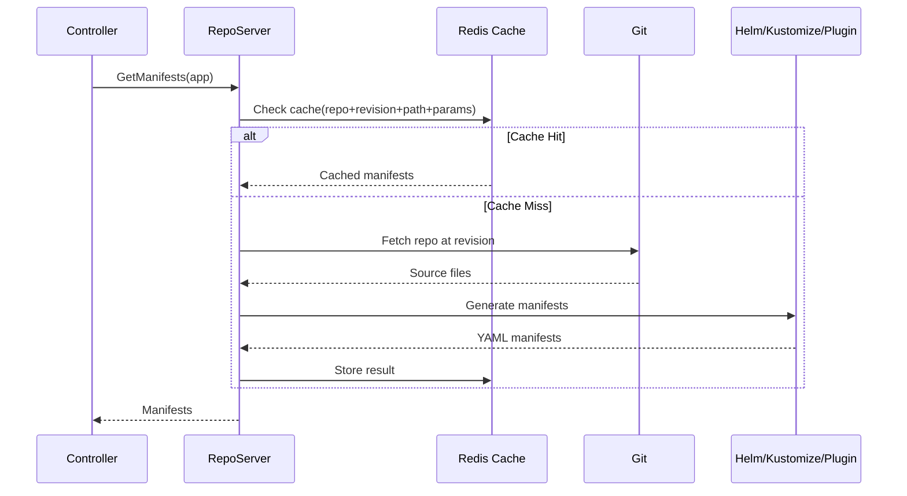

# How to Optimize Manifest Generation Performance in ArgoCD

Author: [nawazdhandala](https://github.com/nawazdhandala)

Tags: ArgoCD, GitOps, Kubernetes, Performance Tuning, Helm

Description: Learn how to speed up manifest generation in ArgoCD for Helm, Kustomize, and custom plugins by optimizing caching, pre-rendering, and parallelism settings.

---

Manifest generation is one of the most time-consuming steps in the ArgoCD sync pipeline. Every time ArgoCD checks whether an application is in sync, it generates the desired Kubernetes manifests from source - whether that is Helm charts, Kustomize overlays, Jsonnet, or custom plugins. For complex applications, this generation step can take 30 seconds or more per application. Multiply that by hundreds of applications and you have a serious performance problem. This guide covers practical techniques to make manifest generation faster.

## Understanding the Manifest Generation Pipeline

When ArgoCD needs manifests for an application, the following happens.



The cache key includes the repository URL, revision, path, and any parameters (like Helm values). If any of these change, the cache is invalidated and manifests are regenerated.

## Optimizing Helm Chart Generation

Helm charts are typically the slowest to generate because Helm needs to resolve dependencies, merge values, and render templates.

### Pre-Building Dependencies

The biggest Helm performance win is pre-building chart dependencies. When a Helm chart has dependencies, ArgoCD runs `helm dependency build` on every cache miss. This downloads charts from remote registries, which adds network latency.

```bash
# In your CI pipeline, pre-build dependencies
cd charts/my-app
helm dependency build

# Commit the Chart.lock and charts/ directory
git add Chart.lock charts/
git commit -m "Pre-build Helm dependencies"
git push
```

With dependencies pre-built and committed, ArgoCD skips the download step entirely.

### Reducing Values Complexity

Complex Helm values with many nested structures take longer to merge. Simplify where possible.

```yaml
# Instead of deeply nested values
# that produce large intermediate structures
# Use targeted value files

apiVersion: argoproj.io/v1alpha1
kind: Application
metadata:
  name: my-app
spec:
  source:
    repoURL: https://github.com/org/repo.git
    path: charts/my-app
    helm:
      # Use a single values file instead of multiple overrides
      valueFiles:
      - values-production.yaml
      # Avoid many individual parameter overrides
      # parameters:
      # - name: image.tag
      #   value: v1.2.3
      # Instead, put everything in the values file
```

### Using Helm Template Caching

ArgoCD caches the output of Helm template operations. Ensure the cache is working efficiently by checking cache hit rates.

```promql
# Monitor Helm cache efficiency
rate(argocd_repo_server_cache_hit_total{method="helm"}[5m]) /
(rate(argocd_repo_server_cache_hit_total{method="helm"}[5m]) +
 rate(argocd_repo_server_cache_miss_total{method="helm"}[5m]))
```

If the hit rate is below 80%, check whether your Helm values or chart dependencies are changing more frequently than expected.

## Optimizing Kustomize Overlays

Kustomize is generally faster than Helm, but complex overlay chains can still be slow.

### Flattening Overlay Chains

Deep overlay hierarchies (base, overlay, environment overlay, cluster overlay) require Kustomize to process multiple layers of patches.

```
# Slow: Deep overlay chain
base/
  overlays/
    staging/
      overlays/
        us-east/
          overlays/
            cluster-1/
```

```
# Faster: Flatter structure with targeted patches
base/
  overlays/
    staging-us-east-cluster1/
```

Each level of overlay adds processing time. Flatten where the intermediate layers do not provide meaningful reuse.

### Reducing Strategic Merge Patches

Strategic merge patches are more expensive than JSON patches because Kustomize needs to understand the schema of the resource being patched.

```yaml
# Strategic merge patch - slower
apiVersion: kustomize.config.k8s.io/v1beta1
kind: Kustomization
patchesStrategicMerge:
- deployment-patch.yaml

# JSON patch - faster for simple changes
patches:
- target:
    kind: Deployment
    name: my-app
  patch: |
    - op: replace
      path: /spec/replicas
      value: 3
```

For simple field changes, JSON patches are faster. Use strategic merge patches only when you need to modify arrays or deeply nested structures.

## Pre-rendering Manifests

The fastest manifest generation is no generation at all. Pre-render manifests in your CI pipeline.

```bash
#!/bin/bash
# CI script to pre-render manifests

# For Helm charts
helm template my-app charts/my-app \
  --namespace production \
  --values values-production.yaml \
  > manifests/production/my-app.yaml

# For Kustomize
kustomize build overlays/production \
  > manifests/production/rendered.yaml

# Commit the rendered manifests
git add manifests/
git commit -m "Pre-render production manifests"
git push
```

Then point your ArgoCD Application at the pre-rendered directory.

```yaml
apiVersion: argoproj.io/v1alpha1
kind: Application
metadata:
  name: my-app
spec:
  source:
    repoURL: https://github.com/org/repo.git
    path: manifests/production
    # No Helm or Kustomize - just plain YAML
    directory:
      recurse: false
```

Plain YAML manifests are processed in milliseconds. ArgoCD simply reads the files and returns them. This is an order of magnitude faster than Helm template rendering.

## Tuning the Repo Server for Generation

The repo server's configuration directly affects generation speed.

```yaml
apiVersion: apps/v1
kind: Deployment
metadata:
  name: argocd-repo-server
  namespace: argocd
spec:
  replicas: 3
  template:
    spec:
      containers:
      - name: argocd-repo-server
        env:
        # Increase generation timeout (default: 90s)
        - name: ARGOCD_EXEC_TIMEOUT
          value: "300"
        # Helm specific settings
        - name: HELM_CACHE_HOME
          value: /helm-cache
        - name: HELM_CONFIG_HOME
          value: /helm-config
        volumeMounts:
        # Persistent Helm cache across restarts
        - name: helm-cache
          mountPath: /helm-cache
      volumes:
      - name: helm-cache
        emptyDir:
          sizeLimit: 5Gi
```

A persistent Helm cache means chart dependencies are not downloaded again after a pod restart.

## Optimizing Custom Plugin Performance

If you use Config Management Plugins (CMPs) for manifest generation, their performance depends on the plugin implementation.

```yaml
# sidecar plugin configuration
apiVersion: v1
kind: ConfigMap
metadata:
  name: cmp-plugin
  namespace: argocd
data:
  plugin.yaml: |
    apiVersion: argoproj.io/v1alpha1
    kind: ConfigManagementPlugin
    metadata:
      name: my-plugin
    spec:
      version: v1.0
      generate:
        command: ["/bin/sh", "-c"]
        args:
        - |
          # Cache intermediate results
          CACHE_KEY=$(md5sum input.yaml | cut -d' ' -f1)
          CACHE_FILE="/tmp/cache/$CACHE_KEY"
          if [ -f "$CACHE_FILE" ]; then
            cat "$CACHE_FILE"
          else
            my-generator generate input.yaml | tee "$CACHE_FILE"
          fi
```

Custom plugins should implement their own caching where possible, because ArgoCD's manifest cache only caches the final output, not intermediate results.

## Increasing Cache Duration

Extend the manifest cache duration to reduce regeneration frequency.

```yaml
# argocd-cm ConfigMap
apiVersion: v1
kind: ConfigMap
metadata:
  name: argocd-cm
  namespace: argocd
data:
  # Increase repo cache expiration (default: 24h)
  reposerver.repo.cache.expiration: "48h"

  # Increase manifest cache per app (controlled via reconciliation timeout)
  timeout.reconciliation: "300"
```

With webhooks enabled, extending cache duration is safe because caches are invalidated on actual changes. The longer cache lifetime only affects periodic reconciliation checks.

## Measuring Generation Performance

Use these metrics to identify which applications have the slowest manifest generation.

```promql
# Manifest generation time by app
histogram_quantile(0.95,
  rate(argocd_repo_server_request_duration_seconds_bucket{
    request_type="generate-manifests"
  }[5m])
)

# Total generation requests
rate(argocd_repo_server_request_total{
  request_type="generate-manifests"
}[5m])

# Identify the slowest repos
topk(10,
  argocd_repo_server_request_duration_seconds_sum /
  argocd_repo_server_request_duration_seconds_count
)
```

Focus optimization efforts on the applications with the highest generation times. Often, a small number of complex Helm charts account for most of the total generation time.

## Summary

The most effective manifest generation optimizations ranked by impact are: pre-rendering manifests in CI (eliminates generation entirely), pre-building Helm dependencies (eliminates network calls), increasing repo server replicas (parallelizes generation), and extending cache duration (reduces generation frequency). For most teams, a combination of pre-built Helm dependencies and 3+ repo server replicas provides the best balance of speed and maintainability.
