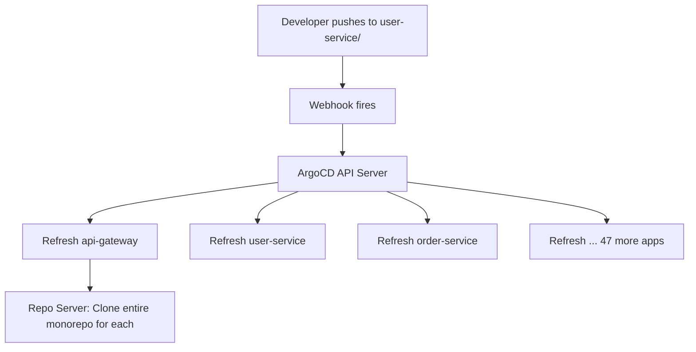

# How to Optimize ArgoCD for Monorepos

Author: [nawazdhandala](https://github.com/nawazdhandala)

Tags: ArgoCD, GitOps, Kubernetes, Monorepo, Performance

Description: Learn how to optimize ArgoCD for monorepo deployments including manifest generation performance, webhook filtering, caching strategies, and ApplicationSet patterns.

---

Monorepos - single repositories containing multiple applications, services, or infrastructure configurations - are popular in organizations that value code sharing and atomic cross-service changes. However, monorepos create unique challenges for ArgoCD. Every push to the repo triggers reconciliation for every application, even if the change only affects one service. The repo server must clone the entire monorepo for each operation. Webhook notifications lack granularity. This guide covers the specific optimizations needed to make ArgoCD work efficiently with monorepos.

## The Monorepo Challenge

Consider a monorepo with 50 microservices:

```text
monorepo/
  services/
    api-gateway/
      manifests/
    user-service/
      manifests/
    order-service/
      manifests/
    ... (47 more services)
  infrastructure/
    networking/
    monitoring/
    rbac/
  shared/
    configmaps/
    secrets/
```

Each service has its own ArgoCD Application. When a developer pushes a change to `user-service`, all 50+ applications get refreshed because they all point to the same repository. This is wasteful and slow.



## Optimization 1: Use ApplicationSet with Git Generator

Instead of creating applications manually, use ApplicationSet's Git generator to automatically discover services:

```yaml
apiVersion: argoproj.io/v1alpha1
kind: ApplicationSet
metadata:
  name: monorepo-services
  namespace: argocd
spec:
  generators:
    - git:
        repoURL: https://github.com/org/monorepo
        revision: main
        directories:
          - path: services/*
  template:
    metadata:
      name: "{{path.basename}}"
    spec:
      project: default
      source:
        repoURL: https://github.com/org/monorepo
        targetRevision: main
        path: "{{path}}/manifests"
      destination:
        server: https://kubernetes.default.svc
        namespace: "{{path.basename}}"
      syncPolicy:
        automated:
          prune: true
          selfHeal: true
        syncOptions:
          - CreateNamespace=true
```

The ApplicationSet performs a single Git clone to discover all directories, which is more efficient than each application cloning independently.

## Optimization 2: Enable Shallow Clone

For monorepos especially, shallow clones make a huge difference:

```yaml
# argocd-cmd-params-cm ConfigMap
apiVersion: v1
kind: ConfigMap
metadata:
  name: argocd-cmd-params-cm
  namespace: argocd
data:
  reposerver.git.shallow.clone: "true"
```

A 2GB monorepo with years of history might shallow-clone at under 100MB.

## Optimization 3: Increase Cache Duration

Since all applications share the same repo, the cache is extremely effective:

```yaml
# argocd-cmd-params-cm ConfigMap
apiVersion: v1
kind: ConfigMap
metadata:
  name: argocd-cmd-params-cm
  namespace: argocd
data:
  reposerver.repo.cache.expiration: "72h"
```

With good caching, only the first application in a reconciliation cycle pays the cost of `git fetch`. All subsequent applications reuse the cached repo.

## Optimization 4: Persistent Git Cache

Critical for monorepos since re-cloning a large monorepo is extremely expensive:

```yaml
apiVersion: v1
kind: PersistentVolumeClaim
metadata:
  name: argocd-repo-cache
  namespace: argocd
spec:
  accessModes:
    - ReadWriteOnce
  resources:
    requests:
      storage: 50Gi  # Size based on your monorepo size * 2
  storageClassName: gp3-ssd
---
apiVersion: apps/v1
kind: Deployment
metadata:
  name: argocd-repo-server
  namespace: argocd
spec:
  template:
    spec:
      volumes:
        - name: tmp
          persistentVolumeClaim:
            claimName: argocd-repo-cache
      containers:
        - name: argocd-repo-server
          volumeMounts:
            - name: tmp
              mountPath: /tmp
```

## Optimization 5: Webhook with Path Filtering

Standard Git webhooks trigger ArgoCD for every push, regardless of what changed. While ArgoCD itself does not support path-based webhook filtering, you can use a webhook proxy to add this intelligence:

### Using a Simple Webhook Proxy

Deploy a lightweight proxy that inspects push payloads and only forwards relevant notifications:

```yaml
apiVersion: apps/v1
kind: Deployment
metadata:
  name: argocd-webhook-proxy
  namespace: argocd
spec:
  replicas: 1
  template:
    spec:
      containers:
        - name: proxy
          image: python:3.11-slim
          command:
            - python
            - /app/proxy.py
          ports:
            - containerPort: 8080
          volumeMounts:
            - name: proxy-script
              mountPath: /app
      volumes:
        - name: proxy-script
          configMap:
            name: webhook-proxy-script
```

The proxy script examines which files changed and only notifies ArgoCD about applications whose paths were affected. While implementing a full proxy is beyond the scope of this post, the concept is to compare changed file paths against application source paths.

### Alternative: Increase Reconciliation Interval

If a webhook proxy is too complex, simply accept that all applications will be refreshed but make it less frequent:

```yaml
# argocd-cm ConfigMap
apiVersion: v1
kind: ConfigMap
metadata:
  name: argocd-cm
  namespace: argocd
data:
  timeout.reconciliation: "600"
```

## Optimization 6: Directory Include/Exclude

Limit what ArgoCD processes within each application's directory:

```yaml
apiVersion: argoproj.io/v1alpha1
kind: Application
metadata:
  name: user-service
spec:
  source:
    repoURL: https://github.com/org/monorepo
    path: services/user-service/manifests
    directory:
      recurse: true
      include: "*.yaml"
      exclude: "{tests/**,docs/**,scripts/**,*.md,Makefile}"
```

This prevents the repo server from processing non-manifest files.

## Optimization 7: Scale Repo Server for Monorepo Load

Monorepos put extra load on the repo server. Scale accordingly:

```yaml
apiVersion: apps/v1
kind: Deployment
metadata:
  name: argocd-repo-server
  namespace: argocd
spec:
  replicas: 3
  template:
    spec:
      containers:
        - name: argocd-repo-server
          resources:
            requests:
              cpu: "2"
              memory: "4Gi"
            limits:
              cpu: "4"
              memory: "8Gi"
```

## Optimization 8: Limit Manifest Generation Parallelism

Prevent the repo server from trying to generate manifests for all monorepo applications simultaneously:

```yaml
# argocd-cmd-params-cm ConfigMap
apiVersion: v1
kind: ConfigMap
metadata:
  name: argocd-cmd-params-cm
  namespace: argocd
data:
  reposerver.parallelism.limit: "5"
```

This is especially important for monorepos because a webhook triggers refresh on all applications at once. Without a limit, the repo server tries to serve 50+ requests simultaneously.

## Optimization 9: Add Reconciliation Jitter

Prevent the thundering herd when all monorepo applications reconcile together:

```yaml
# argocd-cmd-params-cm ConfigMap
data:
  controller.reconciliation.jitter: "120"
```

## Optimization 10: Use Multiple Sources for Shared Config

If services share configuration from a `shared/` directory, use multiple sources:

```yaml
apiVersion: argoproj.io/v1alpha1
kind: Application
metadata:
  name: user-service
spec:
  sources:
    # Service-specific manifests
    - repoURL: https://github.com/org/monorepo
      targetRevision: main
      path: services/user-service/manifests
    # Shared configuration
    - repoURL: https://github.com/org/monorepo
      targetRevision: main
      path: shared/configmaps
```

This makes the dependency on shared resources explicit and visible in ArgoCD.

## Monorepo Structure Best Practices

Organize your monorepo to work well with ArgoCD:

```text
monorepo/
  services/
    user-service/
      manifests/          # K8s manifests (ArgoCD reads this)
        deployment.yaml
        service.yaml
        values.yaml       # Helm values
      src/                # Application code (ignored by ArgoCD)
      tests/              # Tests (ignored by ArgoCD)
    order-service/
      manifests/
      src/
  infrastructure/
    base/                 # Shared Kustomize base
    overlays/
      production/
      staging/
  charts/                 # Shared Helm charts
```

Key principles:
- Keep manifests in a predictable path (`manifests/` or `k8s/`)
- Separate application code from deployment manifests
- Use a consistent directory structure so ApplicationSet generators work

## Monitoring Monorepo Performance

Track monorepo-specific performance indicators:

```bash
# Check how long the monorepo takes to clone
kubectl logs -n argocd deployment/argocd-repo-server | \
  grep "github.com/org/monorepo" | grep -E "duration|time"

# Check cache effectiveness for the monorepo
curl -s http://localhost:8084/metrics | grep argocd_git_request_duration_seconds
```

For comprehensive monitoring of your monorepo ArgoCD performance including clone times, manifest generation duration, and reconciliation patterns, [OneUptime](https://oneuptime.com) provides observability dashboards tailored for GitOps workflows.

## Key Takeaways

- Enable shallow clones and persistent cache as baseline optimizations for monorepos
- Use ApplicationSet with Git generators for automatic service discovery
- Limit repo server parallelism to prevent resource exhaustion from simultaneous refreshes
- Add reconciliation jitter to spread load after webhook-triggered refreshes
- Use directory include/exclude to skip non-manifest files
- Scale the repo server horizontally and increase memory for large monorepos
- Consider a webhook proxy for path-based filtering to avoid unnecessary refreshes
- Structure your monorepo with predictable manifest directories for clean ArgoCD integration
