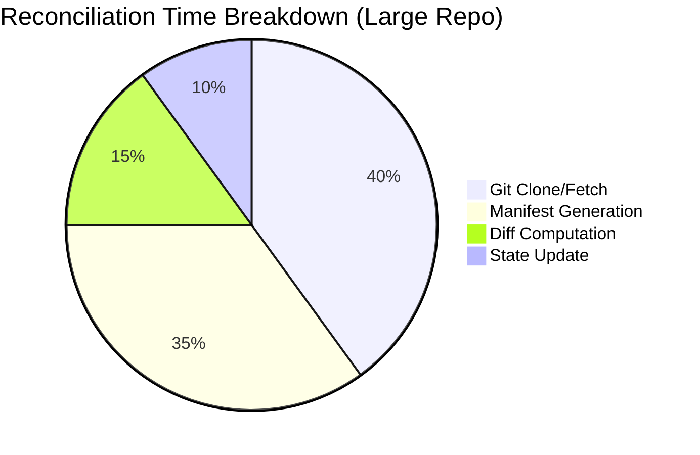

# How to Optimize ArgoCD Reconciliation for Large Repos

Author: [nawazdhandala](https://github.com/nawazdhandala)

Tags: ArgoCD, GitOps, Kubernetes, Performance, Optimization

Description: Learn how to optimize ArgoCD reconciliation performance when working with large Git repositories to reduce sync times, memory usage, and API server load.

---

Large Git repositories are a common performance bottleneck in ArgoCD. When your repo grows to hundreds of megabytes or contains thousands of manifest files, reconciliation slows to a crawl. The repo server spends excessive time cloning, the controller burns through CPU generating manifests, and your applications take forever to detect changes. This guide covers practical optimizations to keep ArgoCD fast even with large repositories.

## Why Large Repos Slow Down ArgoCD

During each reconciliation, ArgoCD performs several expensive operations:

1. **Git clone/fetch** - Downloads the repository (or fetches updates)
2. **Manifest generation** - Runs Helm template, Kustomize build, or scans directories
3. **Diff computation** - Compares generated manifests against live cluster state
4. **State update** - Updates application status in Redis and the Kubernetes API

For a large repo, steps 1 and 2 dominate the reconciliation time. A 500MB repo with thousands of YAML files can take 30+ seconds just to clone.



## Optimization 1: Enable Git Shallow Clone

By default, ArgoCD clones the full Git history. For large repos with long histories, this is wasteful since ArgoCD only needs the latest commit.

```yaml
# argocd-cmd-params-cm ConfigMap
apiVersion: v1
kind: ConfigMap
metadata:
  name: argocd-cmd-params-cm
  namespace: argocd
data:
  # Enable shallow clone with depth 1
  reposerver.git.shallow.clone: "true"
```

This dramatically reduces clone time and bandwidth for repositories with long histories. A repo with 10,000 commits might go from a 500MB clone to a 50MB shallow clone.

## Optimization 2: Increase Repo Server Cache

The repo server caches generated manifests and Git repository data. Increasing the cache reduces how often ArgoCD needs to re-clone and re-generate.

```yaml
# argocd-cmd-params-cm ConfigMap
apiVersion: v1
kind: ConfigMap
metadata:
  name: argocd-cmd-params-cm
  namespace: argocd
data:
  # Cache expiration in seconds (default: 24h)
  reposerver.repo.cache.expiration: "48h"

  # Parallelism limit for manifest generation (default: 0 = unlimited)
  reposerver.parallelism.limit: "5"
```

You can also configure the repo cache size through Redis:

```yaml
# If using external Redis, tune max memory
apiVersion: v1
kind: ConfigMap
metadata:
  name: argocd-redis-ha-configmap
  namespace: argocd
data:
  redis.conf: |
    maxmemory 1gb
    maxmemory-policy allkeys-lru
```

## Optimization 3: Use Directory Include/Exclude Patterns

If your large repo contains many directories but each application only needs a subset, use include/exclude patterns to limit what ArgoCD processes.

```yaml
apiVersion: argoproj.io/v1alpha1
kind: Application
metadata:
  name: my-service
spec:
  source:
    repoURL: https://github.com/org/monorepo
    targetRevision: main
    path: services/my-service/manifests
    directory:
      recurse: true
      include: "*.yaml"
      exclude: "{test/**,docs/**,*.md}"
```

For Helm charts within a large repo:

```yaml
apiVersion: argoproj.io/v1alpha1
kind: Application
metadata:
  name: my-service
spec:
  source:
    repoURL: https://github.com/org/monorepo
    targetRevision: main
    path: charts/my-service
    helm:
      valueFiles:
        - values-production.yaml
```

## Optimization 4: Split Large Repos into Smaller Ones

If optimizations within the repo are not enough, consider restructuring:

```
# Before: One large monorepo
org/monorepo/
  services/
    api/
    web/
    worker/
    ... (50 more services)
  infrastructure/
  docs/

# After: Separate repos per domain
org/api-service/
org/web-service/
org/worker-service/
org/infrastructure/
```

If splitting is not feasible, use Git sparse checkout (ArgoCD v2.8+):

```yaml
# argocd-cm ConfigMap
apiVersion: v1
kind: ConfigMap
metadata:
  name: argocd-cm
  namespace: argocd
data:
  # Enable sparse checkout support
  reposerver.enable.sparse.checkout: "true"
```

## Optimization 5: Scale the Repo Server

For large repos, a single repo server instance may not be enough. Scale horizontally and tune resource limits.

```yaml
apiVersion: apps/v1
kind: Deployment
metadata:
  name: argocd-repo-server
  namespace: argocd
spec:
  replicas: 3  # Multiple replicas
  template:
    spec:
      containers:
        - name: argocd-repo-server
          resources:
            requests:
              cpu: "2"
              memory: "4Gi"
            limits:
              cpu: "4"
              memory: "8Gi"
          env:
            # Increase Git buffer size for large repos
            - name: GIT_HTTP_LOW_SPEED_LIMIT
              value: "0"
            - name: GIT_HTTP_LOW_SPEED_TIME
              value: "0"
```

Also increase the persistent volume for repo server caching:

```yaml
# If using persistent storage for repo server cache
apiVersion: v1
kind: PersistentVolumeClaim
metadata:
  name: argocd-repo-server-cache
  namespace: argocd
spec:
  accessModes:
    - ReadWriteOnce
  resources:
    requests:
      storage: 50Gi  # Increase for large repos
```

## Optimization 6: Use Git Webhooks Instead of Polling

With large repos, each polling cycle is expensive. Switch to webhook-based reconciliation to eliminate unnecessary polls.

```yaml
# argocd-cm ConfigMap
apiVersion: v1
kind: ConfigMap
metadata:
  name: argocd-cm
  namespace: argocd
data:
  # Increase polling interval (rely on webhooks for immediate detection)
  timeout.reconciliation: "600"  # 10 minutes
```

Set up webhooks in your Git provider to notify ArgoCD of changes. See our detailed guide on [configuring Git webhooks for ArgoCD](https://oneuptime.com/blog/post/2026-02-26-argocd-git-webhook-github/view).

## Optimization 7: Tune Manifest Generation Concurrency

The repo server processes manifest generation requests concurrently. For large repos, limit concurrency to avoid OOM issues while maintaining throughput.

```yaml
# argocd-cmd-params-cm ConfigMap
apiVersion: v1
kind: ConfigMap
metadata:
  name: argocd-cmd-params-cm
  namespace: argocd
data:
  # Limit concurrent manifest generation (default: unlimited)
  reposerver.parallelism.limit: "3"
```

For the application controller, tune how many applications it reconciles concurrently:

```yaml
# argocd-cmd-params-cm ConfigMap
data:
  # Number of application reconciliation workers (default: 20)
  controller.status.processors: "30"

  # Number of application operation workers (default: 10)
  controller.operation.processors: "15"
```

## Optimization 8: Enable Server-Side Diff

Server-side diff offloads diff computation from the ArgoCD controller to the Kubernetes API server. This reduces controller CPU and memory usage.

```yaml
apiVersion: argoproj.io/v1alpha1
kind: Application
metadata:
  name: my-app
spec:
  syncPolicy:
    syncOptions:
      - ServerSideApply=true
  # Use server-side diff
  ignoreDifferences:
    - group: "*"
      kind: "*"
      managedFieldsManagers:
        - argocd-application-controller
```

## Optimization 9: Monitor and Profile Reconciliation

You cannot optimize what you do not measure. Set up monitoring to identify bottlenecks:

```bash
# Check repo server metrics
kubectl port-forward svc/argocd-repo-server -n argocd 8084:8084
curl -s http://localhost:8084/metrics | grep argocd_git

# Key metrics to watch:
# argocd_git_request_duration_seconds - How long Git operations take
# argocd_repo_pending_request_total - Queued requests
# argocd_git_request_total - Total Git requests
```

Create a Grafana dashboard for these metrics:

```yaml
# Prometheus recording rules for ArgoCD repo performance
groups:
  - name: argocd-repo-performance
    rules:
      - record: argocd:git_request_duration:p99
        expr: |
          histogram_quantile(0.99,
            rate(argocd_git_request_duration_seconds_bucket[5m])
          )
      - record: argocd:manifest_generation_duration:p99
        expr: |
          histogram_quantile(0.99,
            rate(argocd_app_reconcile_duration_seconds_bucket[5m])
          )
```

## Optimization Summary Table

| Optimization | Impact | Effort | When to Use |
|-------------|--------|--------|-------------|
| Shallow clone | High | Low | Always for large repos |
| Increase cache | Medium | Low | Always |
| Include/exclude patterns | High | Low | Monorepos |
| Split repos | Very High | High | When other optimizations are insufficient |
| Scale repo server | High | Medium | 100+ applications |
| Git webhooks | High | Medium | Always recommended |
| Tune concurrency | Medium | Low | When seeing queue buildup |
| Server-side diff | Medium | Low | Large manifest counts |

## Key Takeaways

Optimizing ArgoCD for large repos requires a combination of strategies:

- Enable shallow clones to reduce Git fetch time
- Increase repo server cache to avoid redundant manifest generation
- Use directory include/exclude patterns to limit processing scope
- Scale the repo server horizontally for parallel processing
- Switch to webhook-based reconciliation to eliminate expensive polling cycles
- Monitor Git request duration and manifest generation time to find bottlenecks
- Consider splitting very large monorepos if other optimizations are not sufficient

For end-to-end monitoring of your ArgoCD performance across all these dimensions, [OneUptime](https://oneuptime.com) provides dashboards and alerting that help you identify reconciliation bottlenecks before they impact your deployments.
